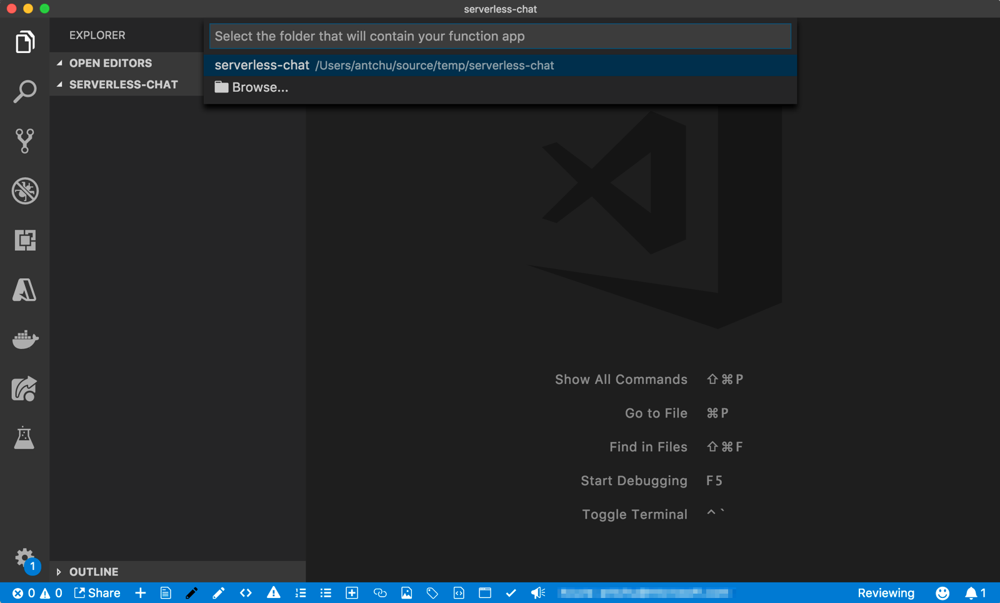
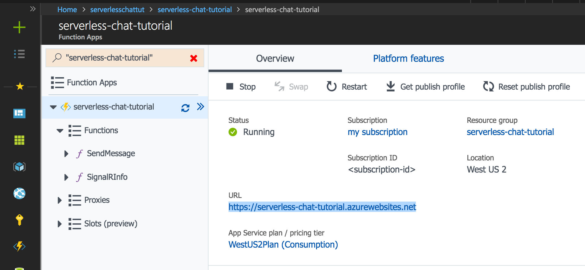
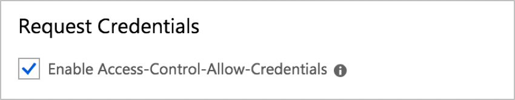
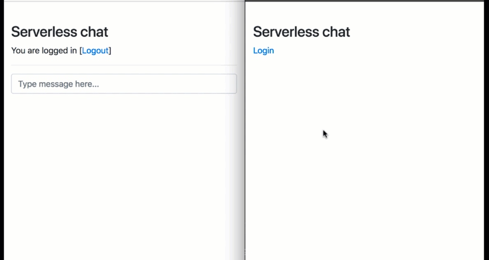

# Tutorial: Azure SignalR Service authentication with Azure Functions

A step by step tutorial to build a chat room with authentication and private messaging using Azure Functions, App Service Authentication, and SignalR Service.

## Introduction

### Technologies used

* [Azure Functions](https://azure.microsoft.com/services/functions/?WT.mc_id=serverlesschatlab-tutorial-antchu) - Backend API for authenticating users and sending chat messages
* [Azure SignalR Service](https://azure.microsoft.com/services/signalr-service/?WT.mc_id=serverlesschatlab-tutorial-antchu) - Broadcast new messages to connected chat clients
* [Azure Storage](https://azure.microsoft.com/services/storage/?WT.mc_id=serverlesschatlab-tutorial-antchu) - Host the static website for the chat client UI

### Prerequisites

The following software is required to build this tutorial.

* [Git](https://git-scm.com/downloads)
* [Node.js](https://nodejs.org/en/download/) (Version 10.x)
* [.NET SDK](https://www.microsoft.com/net/download) (Version 2.x, required for Functions extensions)
* [Azure Functions Core Tools](https://github.com/Azure/azure-functions-core-tools) (Version 2)
* [Visual Studio Code](https://code.visualstudio.com/) (VS Code) with the following extensions
  * [Azure Functions](https://marketplace.visualstudio.com/items?itemName=ms-azuretools.vscode-azurefunctions) - work with Azure Functions in VS Code
  * [Live Server](https://marketplace.visualstudio.com/items?itemName=ritwickdey.LiveServer) - serve web pages locally for testing

## Sign into the Azure portal

Go to the [Azure portal](https://portal.azure.com/) and sign in with your credentials.

## Create an Azure SignalR Service instance

You will build and test the Azure Functions app locally. The app will access a SignalR Service instance in Azure that needs to be created ahead of time.

1. Click on the **Create a resource** (**+**) button for creating a new Azure resource.

1. Search for **SignalR Service** and select it. Click **Create**.

    

1. Enter the following information.

    | Name | Value |
    |---|---|
    | Resource name | A unique name for the SignalR Service instance |
    | Resource group | Create a new resource group with a unique name |
    | Location | Select a location close to you |
    | Pricing Tier | Free |

1. Click **Create**.

1. After the instance is deployed, open it in the portal and locate its Settings page. Change the Service Mode setting to *Serverless*.

    


## Initialize the function app

### Create a new Azure Functions project

1. In a new VS Code window, use `File > Open Folder` in the menu to create and open an empty folder in an appropriate location. This will be the main project folder for the application that you will build.

1. Using the Azure Functions extension in VS Code, initialize a Function app in the main project folder.
   1. Open the Command Palette in VS Code by selecting **View > Command Palette** from the menu (shortcut `Ctrl-Shift-P`, macOS: `Cmd-Shift-P`).
   1. Search for the **Azure Functions: Create New Project** command and select it.
   1. The main project folder should appear. Select it (or use "Browse" to locate it).
   1. In the prompt to choose a language, select **JavaScript**.

      

### Install function app extensions

This tutorial uses Azure Functions bindings to interact with Azure SignalR Service. Like most other bindings, the SignalR Service bindings are available as an extension that needs to be installed using the Azure Functions Core Tools CLI before they can be used.

1. Open a terminal in VS Code by selecting **View > Terminal** from the menu (Ctrl-\`).

1. Ensure the main project folder is the current directory.

1. Install the SignalR Service function app extension.

    ```bash
    func extensions install -p Microsoft.Azure.WebJobs.Extensions.SignalRService -v 1.0.0
    ```

### Configure application settings

When running and debugging the Azure Functions runtime locally, application settings are read from **local.settings.json**. Update this file with the connection string of the SignalR Service instance that you created earlier.

1. In VS Code, select **local.settings.json** in the Explorer pane to open it.

1. Replace the file's contents with the following.

    ```json
    {
        "IsEncrypted": false,
        "Values": {
            "AzureSignalRConnectionString": "<signalr-connection-string>",
            "WEBSITE_NODE_DEFAULT_VERSION": "10.14.1",
            "FUNCTIONS_WORKER_RUNTIME": "node"
        },
        "Host": {
            "LocalHttpPort": 7071,
            "CORS": "http://127.0.0.1:5500",
            "CORSCredentials": true
        }
    }
    ```

   * Enter the Azure SignalR Service connection string into a setting named `AzureSignalRConnectionString`. Obtain the value from the **Keys** page in the Azure SignalR Service resource in the Azure portal; either the primary or secondary connection string can be used.
   * The `WEBSITE_NODE_DEFAULT_VERSION` setting is not used locally, but is required when deployed to Azure.
   * The `Host` section configures the port and CORS settings for the local Functions host (this setting has no effect when running in Azure).

       > [!NOTE]
       > Live Server is typically configured to serve content from `http://127.0.0.1:5500`. If you find that it is using a different URL or you are using a different HTTP server, change the `CORS` setting to reflect the correct origin.

     

1. Save the file.

    

## Create a function to authenticate users to SignalR Service

When the chat app first opens in the browser, it requires valid connection credentials to connect to Azure SignalR Service. You'll create an HTTP triggered function named *negotiate* in your function app to return this connection information.

> [!NOTE]
> This function must be named *negotiate* as the SignalR client requires an endpoint that ends in `/negotiate`.

1. Open the VS Code command palette (`Ctrl-Shift-P`, macOS: `Cmd-Shift-P`).

1. Search for and select the **Azure Functions: Create Function** command.

1. When prompted, provide the following information.

    | Name | Value |
    |---|---|
    | Function app folder | Select the main project folder |
    | Template | HTTP Trigger |
    | Name | negotiate |
    | Authorization level | Anonymous |

    A folder named **negotiate** is created that contains the new function.

1. Open **negotiate/function.json** to configure bindings for the function. Modify the content of the file to the following. This adds an input binding that generates valid credentials for a client to connect to an Azure SignalR Service hub named `chat`.

    ```json
    {
        "disabled": false,
        "bindings": [
            {
                "authLevel": "anonymous",
                "type": "httpTrigger",
                "direction": "in",
                "name": "req"
            },
            {
                "type": "http",
                "direction": "out",
                "name": "res"
            },
            {
                "type": "signalRConnectionInfo",
                "name": "connectionInfo",
                "userId": "",
                "hubName": "chat",
                "direction": "in"
            }
        ]
    }
    ```

    The `userId` property in the `signalRConnectionInfo` binding is used to create an authenticated SignalR Service connection. Leave the property blank for local development. You will use it when the function app is deployed to Azure.

1. Open **negotiate/index.js** to view the body of the function. Modify the content of the file to the following.

    ```javascript
    module.exports = async function (context, req, connectionInfo) {
        context.res.body = connectionInfo;
    };
    ```

    This function takes the SignalR connection information from the input binding and returns it to the client in the HTTP response body. The SignalR client will use this information to connect to the SignalR Service instance.

## Create a function to send chat messages

The web app also requires an HTTP API to send chat messages. You will create an HTTP triggered function named *SendMessage* that sends messages to all connected clients using SignalR Service.

1. Open the VS Code command palette (`Ctrl-Shift-P`, macOS: `Cmd-Shift-P`).

1. Search for and select the **Azure Functions: Create Function** command.

1. When prompted, provide the following information.

    | Name | Value |
    |---|---|
    | Function app folder | select the main project folder |
    | Template | HTTP Trigger |
    | Name | SendMessage |
    | Authorization level | Anonymous |

    A folder named **SendMessage** is created that contains the new function.

1. Open **SendMessage/function.json** to configure bindings for the function. Modify the content of the file to the following.
    ```json
    {
        "disabled": false,
        "bindings": [
            {
                "authLevel": "anonymous",
                "type": "httpTrigger",
                "direction": "in",
                "name": "req",
                "route": "messages",
                "methods": [
                    "post"
                ]
            },
            {
                "type": "http",
                "direction": "out",
                "name": "res"
            },
            {
                "type": "signalR",
                "name": "$return",
                "hubName": "chat",
                "direction": "out"
            }
        ]
    }
    ```
    This makes two changes to the original function:
    * Changes the route to `messages` and restricts the HTTP trigger to the **POST** HTTP method.
    * Adds a SignalR Service output binding that sends a message returned by the function to all clients connected to a SignalR Service hub named `chat`.

1. Save the file.

1. Open **SendMessage/index.js** to view the body of the function. Modify the content of the file to the following.

    ```javascript
    module.exports = async function (context, req) {
        const message = req.body;
        message.sender = req.headers && req.headers['x-ms-client-principal-name'] || '';

        let recipientUserId = '';
        if (message.recipient) {
            recipientUserId = message.recipient;
            message.isPrivate = true;
        }

        return {
            'userId': recipientUserId,
            'target': 'newMessage',
            'arguments': [ message ]
        };
    };
    ```

    This function takes the body from the HTTP request and sends it to clients connected to SignalR Service, invoking a function named `newMessage` on each client.

    The function can read the sender's identity and can accept a *recipient* value in the message body to allow for a message to be sent privately to a single user. These functionalities will be used later in the tutorial.

1. Save the file.

## Create and run the chat client web user interface

The chat application's UI is a simple single page application (SPA) created with the Vue JavaScript framework. It will be hosted separately from the function app. Locally, you will run the web interface using the Live Server VS Code extension.

1. In VS Code, create a new folder named **content** at the root of the main project folder.

1. In the **content** folder, create a new file named **index.html**.

1. Copy and paste the content of **[index.html](https://github.com/Azure-Samples/signalr-service-quickstart-serverless-chat/blob/2720a9a565e925db09ef972505e1c5a7a3765be4/docs/demo/chat-with-auth/index.html)**.

1. Save the file.

1. Press **F5** to run the function app locally and attach a debugger.

1. With **index.html** open, start Live Server by opening the VS Code command palette (`Ctrl-Shift-P`, macOS: `Cmd-Shift-P`) and selecting **Live Server: Open with Live Server**. Live Server will open the application in a browser.

1. The application opens. Enter a message in the chat box and press enter. Refresh the application to see new messages. Because no authentication was configured, all messages will be sent as "anonymous".

## Deploy to Azure and enable authentication

You have been running the function app and chat application locally. You will now deploy them to Azure and enable authentication and private messaging in the application.

### Log into Azure with VS Code

1. Open the VS Code command palette (`Ctrl-Shift-P`, macOS: `Cmd-Shift-P`).

1. Search for and select the **Azure: Sign in** command.

1. Follow the instructions to complete the sign in process in your browser.

### Create a Storage account

An Azure Storage account is required by a function app running in Azure. You will also host the web page for the chat UI using the static websites feature of Azure Storage.

1. In the Azure portal, click on the **Create a resource** (**+**) button for creating a new Azure resource.

1. Select the **Storage** category, then select **Storage account**.

1. Enter the following information.

    | Name | Value |
    |---|---|
    | Subscription | Select the subscription containing the SignalR Service instance |
    | Resource group | Select the same resource group |
    | Resource name | A unique name for the Storage account |
    | Location | Select the same location as your other resources |
    | Performance | Standard |
    | Account kind | StorageV2 (general purpose V2) |
    | Replication | Locally-redundant storage (LRS) |
    | Access Tier | Hot |

1. Click **Review + create**, then **Create**.

### Configure static websites

1. After the Storage account is created, open it in the Azure portal.

1. Select **Static website**.

1. Select **Enabled** to enable the static website feature.

1. In **Index document name**, enter *index.html*.

1. Click **Save**.

1. A **Primary endpoint** appears. Note this value. It will be required to configure the function app.

### Configure function app for authentication

So far, the chat app works anonymously. In Azure, you will use [App Service Authentication](https://docs.microsoft.com/azure/app-service/overview-authentication-authorization) to authenticate the user. The user ID or username of the authenticated user can be passed to the *SignalRConnectionInfo* binding to generate connection information that is authenticated as the user.

When a sending message, the app can decide whether to send it to all connected clients, or only to the clients that have been authenticated to a given user.

1. In VS Code, open **negotiate/function.json**.

1. Insert a [binding expression](https://docs.microsoft.com/azure/azure-functions/functions-triggers-bindings) into the *userId* property of the *SignalRConnectionInfo* binding: `{headers.x-ms-client-principal-name}`. This sets the value to the username of the authenticated user. The attribute should now look like this.

    ```json
    {
        "type": "signalRConnectionInfo",
        "name": "connectionInfo",
        "userId": "{headers.x-ms-client-principal-name}",
        "hubName": "chat",
        "direction": "in"
    }
    ```

1. Save the file.


### Deploy function app to Azure

1. Open the VS Code command palette (`Ctrl-Shift-P`, macOS: `Cmd-Shift-P`) and select **Azure Functions: Deploy to Function App**.

1. When prompted, provide the following information.

    | Name | Value |
    |---|---|
    | Folder to deploy | Select the main project folder |
    | Subscription | Select your subscription |
    | Function app | Select **Create New Function App** |
    | Function app name | Enter a unique name |
    | Resource group | Select the same resource group as the SignalR Service instance |
    | Storage account | Select the storage account you created earlier |

    A new function app is created in Azure and the deployment begins. Wait for the deployment to complete.

### Upload function app local settings

1. Open the VS Code command palette (`Ctrl-Shift-P`, macOS: `Cmd-Shift-P`).

1. Search for and select the **Azure Functions: Upload local settings** command.

1. When prompted, provide the following information.

    | Name | Value |
    |---|---|
    | Local settings file | local.settings.json |
    | Subscription | Select your subscription |
    | Function app | Select the previously deployed function app |

Local settings are uploaded to the function app in Azure. If prompted to overwrite existing settings, select **Yes to all**.


### Enable App Service Authentication

App Service Authentication supports authentication with Azure Active Directory, Facebook, Twitter, Microsoft account, and Google.

1. Open the VS Code command palette (`Ctrl-Shift-P`, macOS: `Cmd-Shift-P`).

1. Search for and select the **Azure Functions: Open in portal** command.

1. Select the subscription and function app name to open the function app in the Azure portal.

1. In the function app that was opened in the portal, locate the **Platform features** tab, select **Authentication/Authorization**.

1. Turn **On** App Service Authentication.

1. In **Action to take when request is not authenticated**, select "Log in with {authentication provider you selected earlier}".

1. In **Allowed External Redirect URLs**, enter the URL of your storage account primary web endpoint that you previously noted.

1. Follow the documentation for the login provider of your choice to complete the configuration.

    - [Azure Active Directory](https://docs.microsoft.com/azure/app-service/configure-authentication-provider-aad)
    - [Facebook](https://docs.microsoft.com/azure/app-service/configure-authentication-provider-facebook)
    - [Twitter](https://docs.microsoft.com/azure/app-service/configure-authentication-provider-twitter)
    - [Microsoft account](https://docs.microsoft.com/azure/app-service/configure-authentication-provider-microsoft)
    - [Google](https://docs.microsoft.com/azure/app-service/configure-authentication-provider-google)

### Update the web app

1. In the Azure portal, navigate to the function app's overview page.

1. Copy the function app's URL.

    

1. In VS Code, open **index.html** and replace the value of `apiBaseUrl` with the function app's URL.

1. The application can be configured with authentication using Azure Active Directory, Facebook, Twitter, Microsoft account, or Google. Select the authentication provider that you will use by setting the value of `authProvider`.

1. Save the file.

### Deploy the web application to blob storage

The web application will be hosted using Azure Blob Storage's static websites feature.

1. Open the VS Code command palette (`Ctrl-Shift-P`, macOS: `Cmd-Shift-P`).

1. Search for and select the **Azure Storage: Deploy to Static Website** command.

1. Enter the following values:

    | Name | Value |
    |---|---|
    | Subscription | Select your subscription |
    | Storage account | Select the storage account you created earlier |
    | Folder to deploy | Select **Browse** and select the *content* folder |

The files in the *content* folder should now be deployed to the static website.

### Enable function app cross origin resource sharing (CORS)

Although there is a CORS setting in **local.settings.json**, it is not propagated to the function app in Azure. You need to set it separately.

1. Open the function app in the Azure portal.

1. Under the **Platform features** tab, select **CORS**.

    

1. In the *Allowed origins* section, add an entry with the static website *primary endpoint* as the value (remove the trailing */*).

1. In order for the SignalR JavaScript SDK call your function app from a browser, support for credentials in CORS must be enabled. Select the "Enable Access-Control-Allow-Credentials" checkbox.

    

1. Click **Save** to persist the CORS settings.

### Try the application

1. In a browser, navigate to the storage account's primary web endpoint.

1. Select **Login** to authenticate with your chosen authentication provider.

1. Send public messages by entering them into the main chat box.

1. Send private messages by clicking on a username in the chat history. Only the selected recipient will receive these messages.

Congratulations! You have deployed a real-time, serverless chat app!



## Clean up resources

To clean up the resources created in this tutorial, delete the resource group using the Azure portal.

## Next steps

In this tutorial, you learned how to use Azure Functions with Azure SignalR Service. Read more about building real-time serverless applications with SignalR Service bindings for Azure Functions.

> [!div class="nextstepaction"]
> [Build Real-time Apps with Azure Functions](signalr-concept-azure-functions.md)
