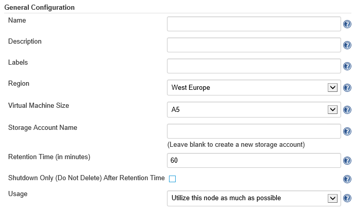

<properties
    pageTitle="How to use the Azure slave plugin with Jenkins Continuous Integration"
    description="Describes how to use Azure slave plugin with Jenkins Continuous Integration."
	services="storage" 
	documentationCenter="java" 
	authors="rmcmurray" 
	manager="wpickett" 
	editor="jimbe" />

<tags
	ms.service="storage" 
	ms.workload="storage" 
	ms.tgt_pltfrm="na" 
	ms.devlang="Java" 
	ms.topic="article" 
	ms.date="06/03/2015" 
	ms.author="v-dedomi"/>

#How to use the Azure slave plugin with Jenkins Continuous Integration

The Azure slave plugin for Jenkins enables you to provision slave nodes on Azure when running distributed builds.

## Install the Azure Slave plugin
1. In the Jenkins dashboard, click **Manage Jenkins**.
2. In the **Manage Jenkins** page, click on **Manage Plugins**.
3. Click the **Available** tab.
4. In the filter field above the list of available plugins, type **Azure** to limit the list to relevant plugins.

	If you opt to scroll through the list of available plugins, you will find the Azure slave plugin under the **Cluster Management and Distributed Build** section.
	 
5. Select the checkbox for **Azure Slave Plugin**.
6. Click **Install without restart** or **Download now and install after restart**.

Now that the plugin is installed, the next steps would be to configure the plugin with your Azure subscription profile and to create a template that will be used in creating the VM for the slave node.

## Configure the Azure Slave plugin with your subscription profile

A subscription profile, also referred to as publish settings, is an XML file that contains secure credentials and some additional information you'll need to work with Azure in your development environment. To configure the Azure slave plugin, you need: 

* your subscription id
* a Management certificate for your subscription

These can be found in your subscription profile. If you don't have a copy of your subscription profile, you can download it from [here](https://manage.windowsazure.com/publishsettings/Index?SchemaVersion=2.0). Below is an example of a subscription profile.

	<?xml version="1.0" encoding="utf-8"?>
		<PublishData>
  		<PublishProfile SchemaVersion="2.0" PublishMethod="AzureServiceManagementAPI">
    	<Subscription
      		ServiceManagementUrl="https://management.core.windows.net"
      		Id="<Subscription ID value>"
      		Name="Pay-As-You-Go"
			ManagementCertificate="<Management certificate value>" />
  		</PublishProfile>
	</PublishData>

Once you have your subscription profile, follow these steps to configure the Azure slave plugin.

1. In the Jenkins dashboard, click **Manage Jenkins**.
2. Click **Configure System**.
3. Scroll down the page to find the **Cloud** section.
4. Click **Add new cloud > Microsoft Azure**.

	

	This will show the fields where you need to enter your subscription details.

	

5. Copy the subscription id and management certificate values from your subscription profile and paste them in the appropriate fields.

	When copying the subscription id and management certificate, **do not** include the quotes that enclose the values.
	
6. Click on **Verify configuration**.
7. When the configuration is verified to be correct, click **Save**.

## Set up a virtual machine template for the Azure Slave plugin

A virtual machine template defines the parameters the plugin will use to create a slave node on Azure. In the following steps we'll be creating template for an Ubuntu VM. 

1. In the Jenkins dashboard, click **Manage Jenkins**.
2. Click on **Configure System**.
3. Scroll down the page to find the **Cloud** section.
4. In the Cloud section, find Add Azure Virtual Machine Template and click the Add button.

	

	This will show the fields where you enter details about the template you are creating.

	

5. Enter an Azure cloud service name in the **Name** field. If the name you entered refers to an existing cloud service, the VM will be provisioned in that service. Otherwise, Azure will create a new one.
6. In the **Description** field, enter text that describes the template you are creating. This is only for your documentary purposes and is not used in provisioning a VM.
7. The **Labels** field is used to identify the template you are creating and is subsequently used to reference the template when creating a Jenkins job. For our purpose, enter **linux** in this field. 
8. Select a region where the VM will be created.
9. Select the appropriate VM size.
10. Specify a storage account where the VM will be created. Make sure that it is in the same region as the cloud service you'll be using. If you want new storage to be created, you can leave this field blank.
11. Retention time specifies the number of minutes before Jenkins deletes an idle slave. Leave this at the default value of 60. You can also choose to shutdown the slave instead of deleting it when it's idle. To do that, check the **Shutdown Only (Do Not Delete) After Retention Time** checkbox.
12. In **Usage**, select the appropriate condition when this slave node will be used. For now, select **Utilize this node as much as possible**.

	At this point, your form would look somewhat similar to this:

	

	The next step would be to provide details on the operating system image you want your slave to be created in.
 
13. In **Image Family or Id** you have to specify what system image will be installed on your VM. You can either select from a list of image families or specify a custom image.

	If you want to select from a list of image families, enter the first character (case-sensitive) of the image family name. For instance, typing **U** will bring up a list of Ubuntu Server families. Once you select from the list, Jenkins will use the latest version of that system image from that family when provisioning your VM.

	
	
	If you have a custom image that you want to use instead, enter the name of that custom image. Custom image names are not shown in a list so you have to ensure that the name is entered correctly.    

	For this tutorial, type **U** to bring up a list of Ubuntu images and select **Ubuntu Server 14.04 LTS**.
 
14. For **Launch method**, select **SSH**.
15. Copy the script below and paste in the **Init script** field.

		# Install Java
		sudo apt-get -y update
		sudo apt-get install -y openjdk-7-jdk
		sudo apt-get -y update --fix-missing
		sudo apt-get install -y openjdk-7-jdk

		# Install git
		sudo apt-get install -y git

		#Install ant
		sudo apt-get install -y ant
		sudo apt-get -y update --fix-missing
		sudo apt-get install -y ant

	The **Init script** will be executed after the VM is created. In this example, the script installs Java, git, and ant.
	
16. In the **Username** and **Password** fields, enter your preferred values for the administrator account that will be created on your VM. 
17. Click on **Verify Template** to check if the parameters you specified are valid.
18. Click on **Save**.

## Create a Jenkins job that runs on a slave node on Azure

In this section, you'll be creating a Jenkins task that will run on a slave node on Azure. You'll need to have your own project up on github to follow along.

1. In the Jenkins dashboard, click **New Item**. 
2. Enter a name for the task you are creating.
3. For the project type, select **Freestyle project**.
4. Click **Ok**.
5. In the task configuration page, select **Restrict where this project can be run**.
6. In the **Label Expression** field, enter **linux**. In the previous section, we created a slave template which we named **linux** which is what we're specifying here.
7. In the **Build** section, click **Add build step** and select **Execute shell**.
8. Edit the following script, replacing **(your github account name)**, **(your project name)**, and **(your project directory)** with appropriate values, and paste the edited script in the text area that appears.

		# Clone from git repo
		currentDir="$PWD"
		if [ -e (your project directory) ]; then
  			cd (your project directory)
  			git pull origin master
		else
  			git clone https://github.com/(your github account name)/(your project name).git
		fi
		
		# change directory to project
		cd $currentDir/(your project directory)

		#Execute build task
		ant
		
9. Click on **Save**.
10. In the Jenkins dashboard, hover over the task you just created and click on the down arrowhead to display task options.
11. Click on **Build now**.

Jenkins will then create a slave node using the template created in the previous section and execute the script you specified in the build step for this task.

  

 