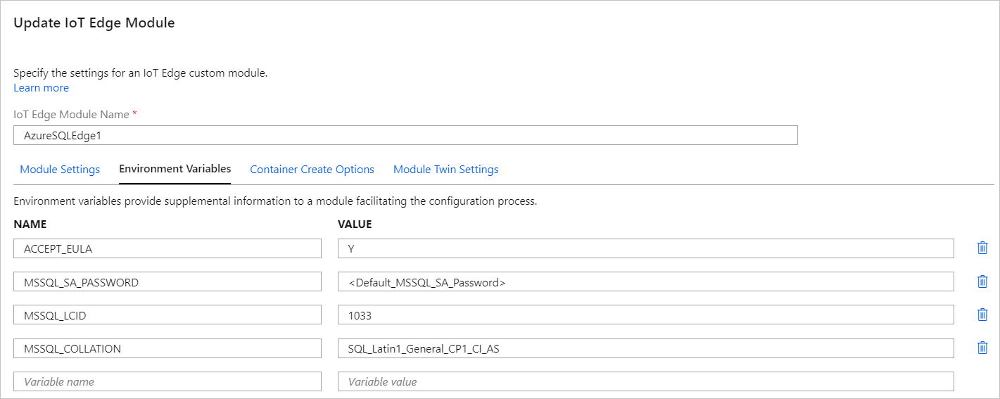
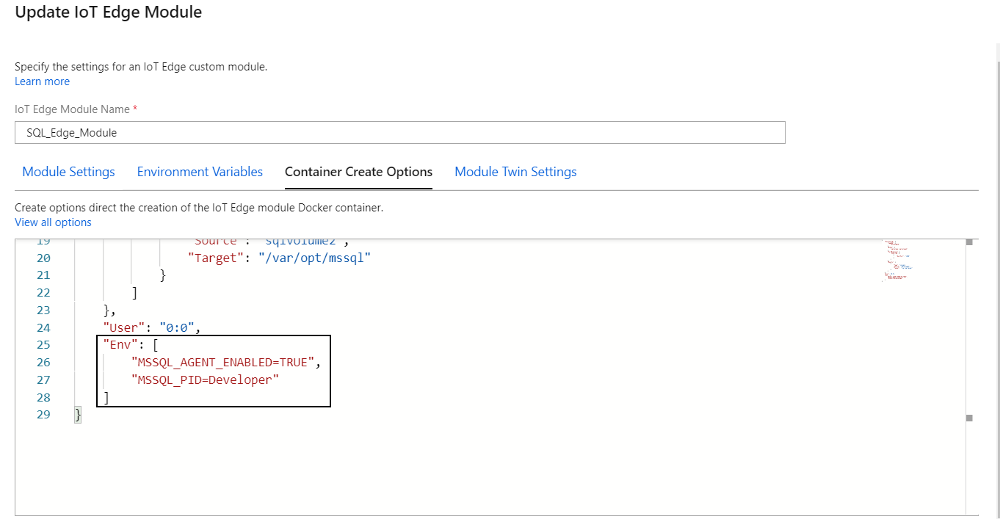

# Configure Azure SQL Edge (Preview)

Azure SQL Edge supports configuration through one of the following two options:

- Environment variables
- An mssql.conf file placed in the /var/opt/mssql folder

> [!NOTE]
> Setting environment variables overrides the settings specified in the mssql.conf file.

## Configure by using environment variables

Azure SQL Edge exposes several different environment variables that can be used to configure the SQL Edge container. These environment variables are a subset of the ones available for SQL Server on Linux. For more information on SQL Server on Linux environment variables, see [Environment variables](/sql/linux/sql-server-linux-configure-environment-variables/).

The following SQL Server on Linux environment variable isn't supported for Azure SQL Edge. If defined, this environment variable will be ignored during container initialization.

| Environment variable | Description |
|-----|-----|
| **MSSQL_ENABLE_HADR** | Enable availability group. For example, **1** is enabled, and **0** is disabled. |

> [!IMPORTANT]
> The **MSSQL_PID** environment variable for SQL Edge only accepts **Premium** and **Developer** as the valid values. Azure SQL Edge doesn't support initialization using a product key.

> [!NOTE]
> Download the [Microsoft Software License Terms](https://go.microsoft.com/fwlink/?linkid=2128283) for Azure SQL Edge.

### Specify the environment variables

Specify environment variables for SQL Edge when you deploy the service through the [Azure portal](deploy-portal.md). You can add them either in the **Environment Variables** section of the module deployment or as part of the **Container Create Options**.

Add values in **Environment Variables**.



Add values in **Container Create Options**.



## Configure by using an mssql.conf file

Azure SQL Edge doesn't include the [mssql-conf configuration utility](/sql/linux/sql-server-linux-configure-mssql-conf/) like SQL Server on Linux does. You need to manually configure the mssql.conf file and place it in the persistent storage drive that is mapped to the /var/opt/mssql/ folder in the SQL Edge module. When you're deploying SQL Edge from Azure Marketplace, this mapping is specified as the **Mounts** option in the **Container Create Options**.

```json
    {
        "Mounts": [
          {
            "Type": "volume",
            "Source": "sqlvolume",
            "Target": "/var/opt/mssql"
          }
        ]
      }
    }
```

The following mssql.conf options aren't applicable to SQL Edge:

|Option|Description|
|:---|:---|
|**Customer feedback** | Choose if SQL Server sends feedback to Microsoft. |
|**Database mail profile** | Set the default database mail profile for SQL Server on Linux. |
|**High availability** | Enable Availability Groups. |
|**Microsoft Distributed Transaction Coordinator** | Configure and troubleshoot MSDTC on Linux. Additional distributed transaction-related configuration options aren't supported for SQL Edge. For more information on these additional configuration options, see [Configure MSDTC](https://docs.microsoft.com/sql/linux/sql-server-linux-configure-mssql-conf#msdtc). |
|**MLServices EULAs** | Accept R and Python EULAs for Azure Machine Learning packages. Applies to SQL Server 2019 only.|
|**outboundnetworkaccess** |Enable outbound network access for [Machine Learning Services](/sql/linux/sql-server-linux-setup-machine-learning/) R, Python, and Java extensions.|

The following sample mssql.conf file works for SQL Edge. For more information on the format for an mssql.conf file, see [mssql.conf format](https://docs.microsoft.com/sql/linux/sql-server-linux-configure-mssql-conf#mssql-conf-format).

```ini
[EULA]
accepteula = Y

[coredump]
captureminiandfull = true
coredumptype = full

[filelocation]
defaultbackupdir = /var/opt/mssql/backup/
defaultdatadir = /var/opt/mssql/data/
defaultdumpdir = /var/opt/mssql/data/
defaultlogdir = /var/opt/mssql/log/

[language]
lcid = 1033

[memory]
memorylimitmb = 6144

[sqlagent]
errorlogfile = /var/opt/mssql/log/sqlagentlog.log
errorlogginglevel = 7

[traceflag]
traceflag0 = 3604
traceflag1 = 3605
traceflag2 = 1204
```

## Next steps

- [Connect to Azure SQL Edge](connect.md)
- [Build an end-to-end IoT solution with SQL Edge](tutorial-deploy-azure-resources.md)
