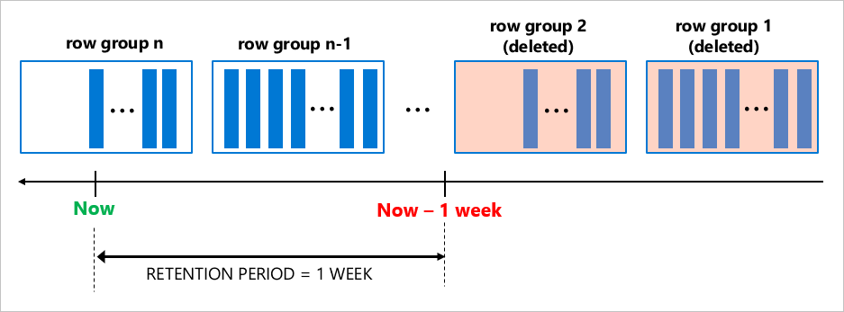

# Manage historical data with retention policy

Data Retention can enabled on the database and any of the underlying tables individually, allowing users to create flexible aging policies for their tables and databases. Applying data retention is simple: it requires only one parameter to be set during table creation or as part of an alter table operation. 

After data retention policy is defiend for a database and the underlying table, a background time timer task runs to remove any obsolete records from the table enabled for data retention. Identification of matching rows and their removal from the table occur transparently, in the background task that is scheduled and run by the system. Age condition for the table rows is checked based on the column used as the `filter_column` in the table definition. If retention period, for example, is set to one week, table rows eligible for cleanup satisfy either of the following condition: 

- If the filter column uses DATETIMEOFFSET data type then the condition is `filter_column < DATEADD(WEEK, -1, SYSUTCDATETIME())`
- Else then the condition is `filter_column < DATEADD(WEEK, -1, SYSDATETIME())`

## Data retention cleanup phases

Data retention cleanup operation comprises of two phases. 
- Discovery Phase - In this phase the cleanup operation identifies all the tables within the user databases to build a list for cleanup. Discovery runs once a day.
- Cleanup Phase - In this phase, cleanup is run against all tables with finite data retention, identified in the discovery phase. If the cleanup operation cannot be performed on a table, then that table is skipped in the current run and will be retried in the next iteration. The following principles are used during cleanup
    - If an obsolete row is locked by another transaction, that row is skipped. 
    - Clean up runs with a default 5 seconds lock timeout setting. If the locks cannot be acquired on the tables within the timeout window, the table is skipped in the current run and will be retried in the next iteration.
    - If there is an error during cleanup of a table, that table is skipped and will be picked up in the next iteration.

## Manual cleanup

Depending on the data retention settings on a table and the nature of the workload on the database, it's possible that the automatic cleanup thread may not completely remove all obsolete rows during its run. To assist with this and allow users to manually remove obsolete rows, the `sys.sp_cleanup_data_retention` stored procedure has been introduced in Azure SQL Edge. 

This stored procedure takes three parameters. 
    - Schema Name - Name of the owning schema for the table. This is a required parameter. 
    - Table Name - Name of the table for which manual cleanup is being run. This is a required parameter. 
    - rowcount (Output) - output variable. Returns the number of rows cleaned up by the manual cleanup sp. This is an optional parameter. 

The following example shows the execution of the manual cleanup sp for table `dbo.data_retention_table`.

```sql
declare @rowcnt bigint 
EXEC sys.sp_cleanup_data_retention 'dbo', 'data_retention_table', @rowcnt output 
select @rowcnt 
```

## How obsolete rows are deleted

The cleanup process depends on the index layout of the table. A background task is created to perform obsolete data cleanup for all tables with finite retention period. Clean up logic for the rowstore (B-tree or Heap) index deletes aged row in smaller chunks (up to 10K) minimizing pressure on database log and IO subsystem. Although cleanup logic utilizes required B-tree index, order of deletions for the rows older than retention period cannot be firmly guaranteed. Hence, do not take any dependency on the cleanup order in your applications.

The cleanup task for the clustered columnstore removes entire row groups at once (typically contain 1 million of rows each), which is very efficient, especially when data is generated and ages out at a high pace.



Excellent data compression and efficient retention cleanup makes clustered columnstore index a perfect choice for scenarios when your workload rapidly generates high amount of data.

> [!Note]
> In the case of B-Tree Indexes and heaps, data retention runs a delete query on the underlying tables, which can conflict with delete triggers on the tables. It is recommended to either remove delete triggers from the tables or to not enable data retention on tables that have delete DML trigger.

## Monitoring data retention cleanup

Data retention policy cleanup operations can be monitored using extended events (XEvents) in Azure SQL Edge. For more information on extended events, refer [XEvents Overview](/sql/relational-databases/extended-events/extended-events). 

The following six extended events help track the state of the cleanup operations. 

| Name | Description |
|------| ------------|
| data_retention_task_started  | Occurs when background task for cleanup of tables with retention policy starts. |
| data_retention_task_completed	 | Occurs when background task for cleanup of tables with retention policy ends. |
| data_retention_task_exception	 | Occurs when background task for cleanup of tables with retention policy fails outside of retention cleanup process specific to table. |
| data_retention_cleanup_started  | Occurs when clean up process of table with data retention policy starts. |
| data_retention_cleanup_exception	| Occurs cleanup process of table with retention policy fails. |
| data_retention_cleanup_completed	| Occurs when clean up process of table with data retention policy ends. |  

Additionally, a new ring buffer type named `RING_BUFFER_DATA_RETENTION_CLEANUP` has been added to sys.dm_os_ring_buffers dynamic management view. This view can be used to monitor the data retention cleanup operations. 


## Next Steps
- [Data Retention Policy](data-retention-overview.md)
- [Enable and Disable Data Retention Policies](data-retention-enable-disable.md)