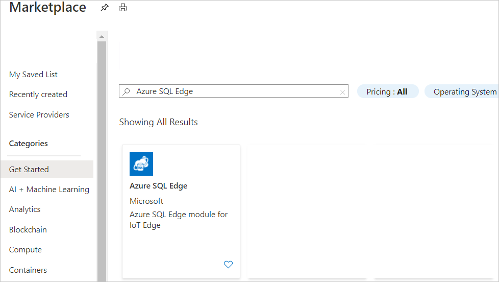
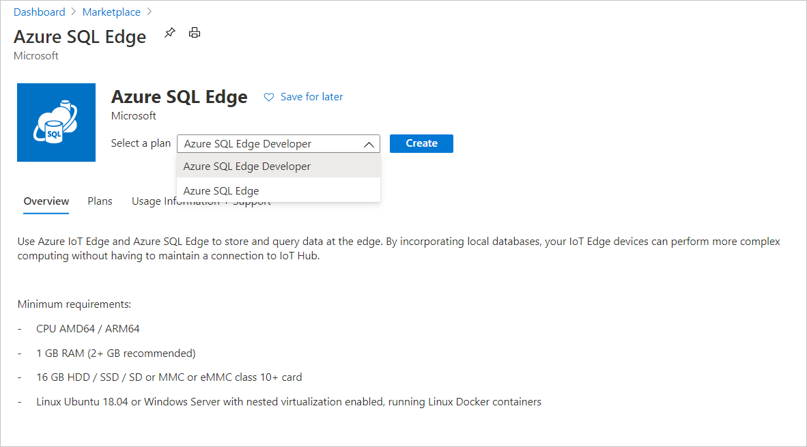

# Deploy Azure SQL Edge (Preview) 

Azure SQL Edge (Preview) is a relational database engine optimized for IoT and Azure IoT Edge deployments. It provides capabilities to create a high-performance data storage and processing layer for IoT applications and solutions. This quickstart shows you how to get started with creating an Azure SQL Edge module through Azure IoT Edge using the Azure portal.

## Before you begin

* If you don't have an Azure subscription, create a [free account](https://azure.microsoft.com/free/).
* Sign in to the [Azure portal](https://portal.azure.com/).
* Create an [Azure IoT Hub](../iot-hub/iot-hub-create-through-portal.md).
* Register an [IoT Edge Device from the Azure portal](../iot-edge/how-to-register-device-portal.md).
* Prepare the IoT Edge device to [deploy IoT Edge module from the Azure portal](../iot-edge/how-to-deploy-modules-portal.md).

> [!NOTE]
> To deploy an Azure Linux VM as an IoT Edge device, see this [quickstart guide](../iot-edge/quickstart-linux.md).

## Deploy SQL Edge Module from Azure Marketplace

Azure Marketplace is an online applications and services marketplace where you can browse through a wide range of enterprise applications and solutions that are certified and optimized to run on Azure, including [IoT Edge modules](https://azuremarketplace.microsoft.com/marketplace/apps/category/internet-of-things?page=1&subcategories=iot-edge-modules). Azure SQL Edge can be deployed to an edge device through the marketplace.

1. Find the Azure SQL Edge module on the Azure Marketplace.<br><br>

   

2. Pick the software plan that best matches your requirements and click **Create**. <br><br>

   

3. On the Target Devices for IoT Edge Module page, specify the following details and then click **Create**

   |**Field**  |**Description**  |
   |---------|---------|
   |Subscription  |  The Azure subscription under which the IoT Hub was created |
   |IoT Hub   |  Name of the IoT Hub where the IoT Edge device is registered and then select "Deploy to a device" option|
   |IoT Edge Device Name  |  Name of the IoT Edge device where SQL Edge would be deployed |

4. On the **Set Modules** page, navigate to the section on deployment modules and click **Configure** against the SQL Edge module. 

5. On the **IoT Edge Custom Modules** pane, specify the desired values for the environment variables and/or customize the create options and desired properties for the module. For a complete list of supported environment variables refer [SQL Server Container Environment Variables](/sql/linux/sql-server-linux-configure-environment-variables/).

   |**Parameter**  |**Description**|
   |---------|---------|
   | Name | Name for the module. |
   |SA_PASSWORD  | Specify a strong password for the SQL Edge admin account. |
   |MSSQL_LCID   | Sets the language ID to use for SQL Server. For example, 1036 is French. |
   |MSSQL_COLLATION | Sets the default collation for SQL Server. This setting overrides the default mapping of language ID (LCID) to collation. |

   > [!NOTE]
   > Please do not change or update the **Image URI** or the **ACCEPT_EULA** settings on the module.

6. On the **IoT Edge Custom Modules** pane, update the container create options desired value for the **Host Port**. If you need to deploy more than one SQL DB Edge module, please make sure to update the mounts option to create a new source & target pair for the persistent volume. For more information on mounts and volume, refer [Use volumes](https://docs.docker.com/storage/volumes/) on docker documentation. 

   ```json
       {
         "HostConfig": {
           "Binds": [
             "sqlvolume:/sqlvolume"
           ],
           "PortBindings": {
             "1433/tcp": [
               {
                 "HostPort": "1433"
               }
             ]
           },
           "Mounts": [
             {
               "Type": "volume",
               "Source": "sqlvolume",
               "Target": "/var/opt/mssql"
             }
           ]
         },
         "Env": [
           "MSSQL_AGENT_ENABLED=TRUE",
           "MSSQL_PID=Developer"
         ]
       }
   ```

7. On the **IoT Edge Custom Modules** pane, update the *Set module twin's desired properties* to include the location of the SQL package and the stream analytics job info. These two fields are optional and should be used if you want to deploy the SQL Edge module with a database and a streaming job.

   ```json
       {
         "properties.desired":
         {
           "SqlPackage": "<Optional_DACPAC_ZIP_SAS_URL>",
           "ASAJobInfo": "<Optional_ASA_Job_ZIP_SAS_URL>"
         }
       }
   ```

8. On the **IoT Edge Custom Modules** pane, set *Restart Policy* to always and *Desired Status* to running.
9. On the **IoT Edge Custom Modules** pane, click **Save**.
10. On the **Set modules** page click **Next**.
11. On the **Specify Route (optional)** of the **Set Modules** page, specify the routes for module to module or module to IoT Edge Hub communication see [Deploy modules and establish routes in IoT Edge](../iot-edge/module-composition.md).
12. Click **Next**.
13. Click **Submit**.

In this quickstart, you deployed a SQL Edge Module on an IoT Edge device.

## Next Steps

- [Machine Learning and Artificial Intelligence with ONNX in SQL Edge](onnx-overview.md).
- [Building an end to end IoT Solution with SQL Edge using IoT Edge](tutorial-deploy-azure-resources.md).