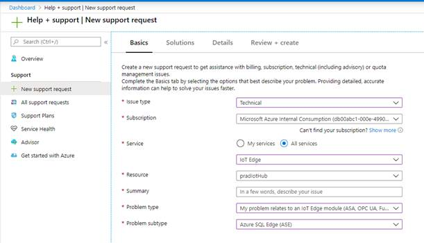

# Azure SQL Edge release notes 

This article describes what is new and what has changed with every new build of Azure SQL Edge.

## CTP 2.1 
### SQL Engine build number - 15.0.2000.1545
### Fixes
1. Fix the PREDICT with ONNX models to handle CPUID issue in ARM 
2. Fix to improve the handling of failure path in startup of TSQL streaming 
3. Fix the incorrect value of watermark delay in job metrics when there is no data. 
4. Fix the issue with output adapter when adapter has variable schema between batches.  

## CTP 2.0 
### SQL Engine build number - 15.0.2000.1401
### What's new?
1. 	Product name updated to 'Azure SQL Edge'
1.  Date_bucket function

    i. 	Support for Date, Time, DateTime type
3.	PREDICT with ONNX
    
    i. 	RUNTIME parameter required for ONNX 
    
4. 	TSQL Streaming support (limited preview) 
 
### Known Issues

1. <b>Issue:</b> Potential failures with applying dacpac on startup due to timing issue.

    <b>Workaround:</b> Restarting SQL Server or container will retry applying the dacpac and should fix the issue
### Request Support
1. You can request support in the [support page](https://ms.portal.azure.com/#blade/Microsoft_Azure_Support/HelpAndSupportBlade/newsupportrequest).

4. Ensure that the following fields are selected: 
    * Issue type - Technical 
    * Service - IoT Edge
    * Problem Type - My problem relates to an IoT Edge module
    * Problem subtype - Azure SQL Edge

   

## CTP 1.5
### SQL Engine build number - 15.0.2000.1331
### What's new?
1. Date_bucket function
    
    i. Support for DateTimeOffset type
2. PREDICT with ONNX models

    i. nvarchar support
 
## CTP 1.4
### SQL Engine build number - 15.0.2000.1247
### What's new?
1.	PREDICT with ONNX models
 
    i.  Varchar support
    
    ii. Migration to ONNX runtime version 1.0 
2.	Feature support - The following features are enabled:

    i.   CDC support

    ii.  History table with compression

    iii. Higher scale factor for log read ahead

    iv.  Batch mode ES filter pushdown

    v.   Read ahead optimizations
 
## CTP 1.3
### SQL Engine build number - 15.0.2000.1147
### What's new?
1. Azure IOT Portal Deployment 

    i.   Support for deploying AMD64 and ARM images

    ii.  Support for streaming job creation

    iii. Dacpac deployment
2. PREDICT with ONNX models

    i. Numeric type support
3. Feature support - The following features are enabled:

    i.  Pushdown aggregate to column store scan

    ii. Merry-go-round scans
4. Footprint and memory consumption reduction work
