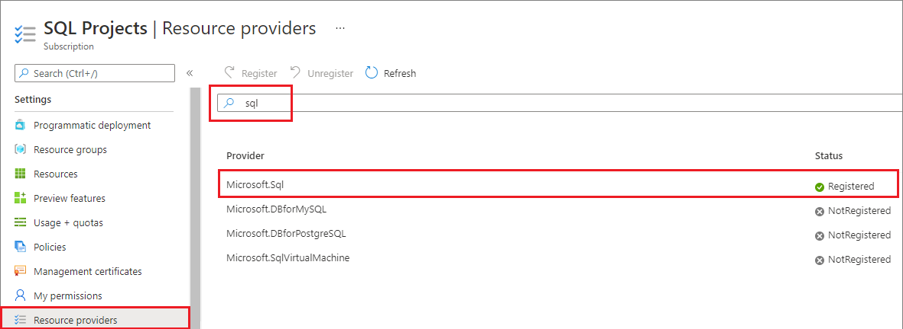

# Resolve capacity errors with Azure SQL Database or Azure SQL Managed Instance
[!INCLUDE[appliesto-sqldb-sqlmi](includes/appliesto-sqldb-sqlmi.md)]

In this article, learn how to resolve capacity errors when deploying Azure SQL Database or Azure SQL Managed Instance resources. 

## Exceeded quota 

If you encounter any of the following errors when attempting to deploy your Azure SQL resource, please [request to increase your quota](database/quota-increase-request.md). 

```
Server quota limit has been reached for this location. Please select a different location with lower server count.
```

```
Could not perform the operation because server would exceed the allowed Database Throughput Unit quota of 10.
```

During a scale operation, you may see the following error: 

```
Could not perform the operation because server would exceed the allowed Database Throughput Unit quota of 0. 
```

## Subscription access

Your subscription may not have access to create a server in the selected region if your subscription has not been registered with the SQL resource provider (RP).  If you see the follow errors, please [register your subscription with the SQL RP](#register-with-sql-rp). 

```
Your subscription does not have access to create a server in the selected region.
```

## Enable region 

Your subscription may not have access to create a server in the selected region if that region has not been enabled. To resolve this, file a [support request to enable a specific region](database/quota-increase-request.md#region) for your subscription. 

If you see the below error, file a support ticket to enable a specific region: 

```
Your subscription does not have access to create a server in the selected region.
```


## Register with SQL RP

To deploy Azure SQL resources, register your subscription with the SQL resource provider (RP). 

You can register your subscription using the Azure portal, [the Azure CLI](/cli/azure/install-azure-cli), or [Azure PowerShell](/powershell/azure/install-az-ps). 

# [Azure portal](#tab/portal)

To register your subscription in the Azure portal, follow these steps: 

1. Open the Azure portal and go to **All Services**.
1. Go to **Subscriptions** and select the subscription of interest.
1. On the **Subscriptions** page, select **Resource providers** under **Settings**.
1. Enter **sql** in the filter to bring up the SQL-related extensions.
1. Select **Register**, **Re-register**, or **Unregister** for the  **Microsoft.Sql** provider, depending on your desired action.

   

# [Azure CLI](#tab/bash)

To register your subscription using [the Azure CLI](/cli/azure/install-azure-cli), run this cmdlet:

```azurecli-interactive
# Register the SQL resource provider to your subscription 
az provider register --namespace Microsoft.SqlVirtualMac 
```

# [Azure PowerShell](#tab/powershell)

To register your subscription using [Azure PowerShell](/powershell/azure/install-az-ps), run this cmdlet: 

```powershell-interactive
# Register the SQL resource provider to your subscription
Register-AzResourceProvider -ProviderNamespace Microsoft.Sql
```


## Next steps

After you submit your request, it will be reviewed. You will be contacted with an answer based on the information you provided in the form.

For more information about other Azure limits, see [Azure subscription and service limits, quotas, and constraints](../azure-resource-manager/management/azure-subscription-service-limits.md).
