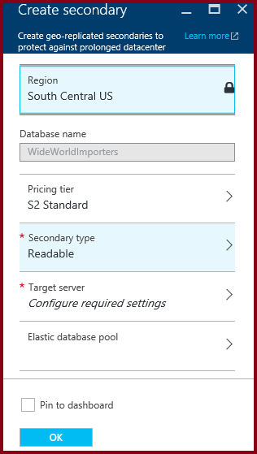
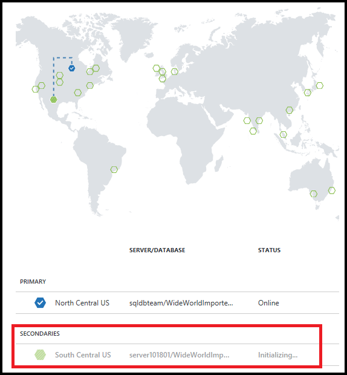
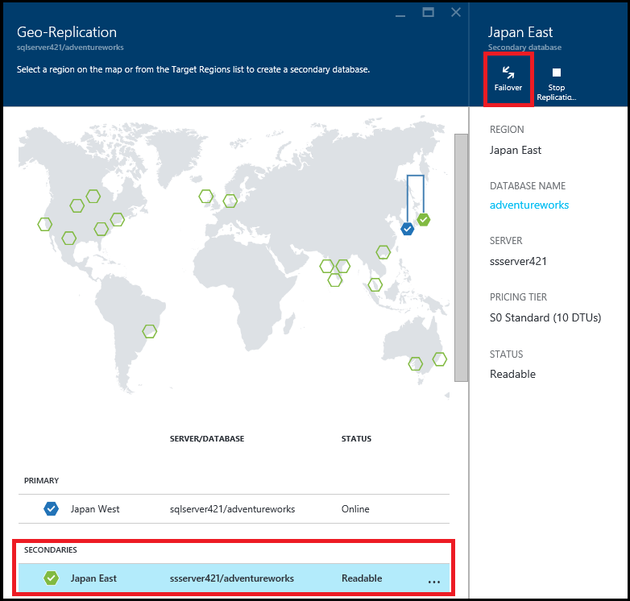
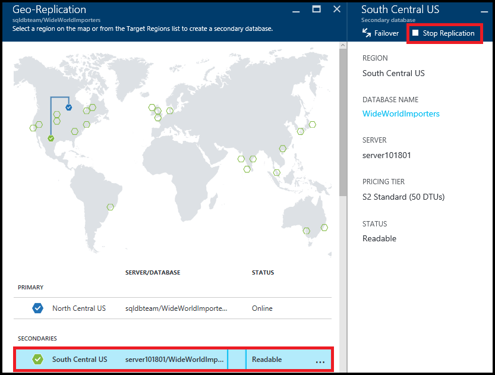

# Tutorial: Configure active geo-replication and failover in the Azure portal (Azure SQL Database)

[!INCLUDE[appliesto-sqldb](../includes/appliesto-sqldb.md)]

This article shows you how to configure [active geo-replication for Azure SQL Database](active-geo-replication-overview.md#active-geo-replication-terminology-and-capabilities) using the [Azure portal](https://portal.azure.com) and to initiate failover.

For best practices using auto-failover groups, see [Best practices for Azure SQL Database](auto-failover-group-overview.md#best-practices-for-sql-database) and [Best practices for Azure SQL Managed Instance](auto-failover-group-overview.md#best-practices-for-sql-managed-instance). 

## Prerequisites

To configure active geo-replication by using the Azure portal, you need the following resource:

* A database in Azure SQL Database: The primary database that you want to replicate to a different geographical region.

> [!Note]
> When using Azure portal, you can only create a secondary database within the same subscription as the primary. If a secondary database is required to be in a different subscription, use [Create Database REST API](https://docs.microsoft.com/rest/api/sql/databases/createorupdate) or [ALTER DATABASE Transact-SQL API](https://docs.microsoft.com/sql/t-sql/statements/alter-database-transact-sql).

## Add a secondary database

The following steps create a new secondary database in a geo-replication partnership.  

To add a secondary database, you must be the subscription owner or co-owner.

The secondary database has the same name as the primary database and has, by default, the same service tier and compute size. The secondary database can be a single database or a pooled database. For more information, see [DTU-based purchasing model](service-tiers-dtu.md) and [vCore-based purchasing model](service-tiers-vcore.md).
After the secondary is created and seeded, data begins replicating from the primary database to the new secondary database.

> [!NOTE]
> If the partner database already exists (for example, as a result of terminating a previous geo-replication relationship) the command fails.

1. In the [Azure portal](https://portal.azure.com), browse to the database that you want to set up for geo-replication.
2. On the SQL Database page, select **geo-replication**, and then select the region to create the secondary database. You can select any region other than the region hosting the primary database, but we recommend the [paired region](../../best-practices-availability-paired-regions.md).

    
3. Select or configure the server and pricing tier for the secondary database.

    
4. Optionally, you can add a secondary database to an elastic pool. To create the secondary database in a pool, click **elastic pool** and select a pool on the target server. A pool must already exist on the target server. This workflow does not create a pool.
5. Click **Create** to add the secondary.
6. The secondary database is created and the seeding process begins.

    
7. When the seeding process is complete, the secondary database displays its status.

    

## Initiate a failover

The secondary database can be switched to become the primary.  

1. In the [Azure portal](https://portal.azure.com), browse to the primary database in the geo-replication partnership.
2. On the SQL Database blade, select **All settings** > **geo-replication**.
3. In the **SECONDARIES** list, select the database you want to become the new primary and click **Forced Failover**.

    
4. Click **Yes** to begin the failover.

The command immediately switches the secondary database into the primary role. This process normally should complete within 30 sec or less.

There is a short period during which both databases are unavailable (on the order of 0 to 25 seconds) while the roles are switched. If the primary database has multiple secondary databases, the command automatically reconfigures the other secondaries to connect to the new primary. The entire operation should take less than a minute to complete under normal circumstances.

> [!NOTE]
> This command is designed for quick recovery of the database in case of an outage. It triggers failover without data synchronization (forced failover).  If the primary is online and committing transactions when the command is issued some data loss may occur.

## Remove secondary database

This operation permanently terminates the replication to the secondary database, and changes the role of the secondary to a regular read-write database. If the connectivity to the secondary database is broken, the command succeeds but the secondary does not become read-write until after connectivity is restored.  

1. In the [Azure portal](https://portal.azure.com), browse to the primary database in the geo-replication partnership.
2. On the SQL database page, select **geo-replication**.
3. In the **SECONDARIES** list, select the database you want to remove from the geo-replication partnership.
4. Click **Stop Replication**.

    
5. A confirmation window opens. Click **Yes** to remove the database from the geo-replication partnership. (Set it to a read-write database not part of any replication.)

## Next steps

* To learn more about active geo-replication, see [active geo-replication](active-geo-replication-overview.md).
* To learn about auto-failover groups, see [Auto-failover groups](auto-failover-group-overview.md)
* For a business continuity overview and scenarios, see [Business continuity overview](business-continuity-high-availability-disaster-recover-hadr-overview.md).
