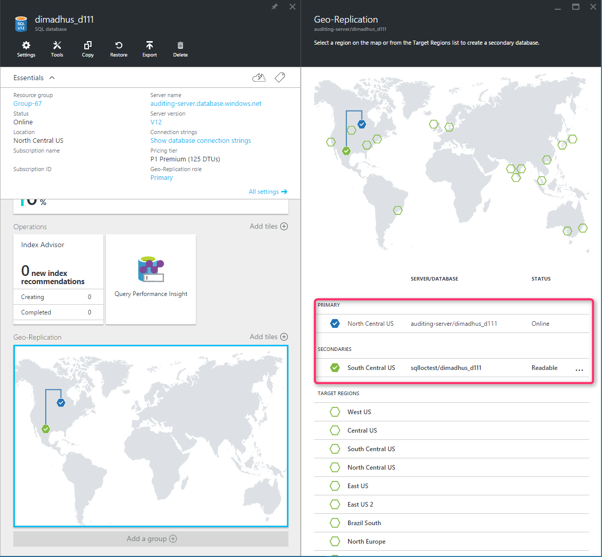

# Creating and using active geo-replication - Azure SQL Database
[!INCLUDE[appliesto-sqldb](../includes/appliesto-sqldb.md)]

Active geo-replication is an Azure SQL Database feature that allows you to create readable secondary databases of individual databases on a server in the same or different data center (region).

> [!NOTE]
> Active geo-replication is not supported by Azure SQL Managed Instance. For geographic failover of instances of SQL Managed Instance, use [Auto-failover groups](auto-failover-group-overview.md).

Active geo-replication is designed as a business continuity solution that allows the application to perform quick disaster recovery of individual databases in case of a regional disaster or large scale outage. If geo-replication is enabled, the application can initiate failover to a secondary database in a different Azure region. Up to four secondaries are supported in the same or different regions, and the secondaries can also be used for read-only access queries. The failover must be initiated manually by the application or the user. After failover, the new primary has a different connection end point.

> [!NOTE]
> Active geo-replication replicates changes by streaming database transaction log. It is unrelated to [transactional replication](https://docs.microsoft.com/sql/relational-databases/replication/transactional/transactional-replication), which replicates changes by executing DML (INSERT, UPDATE, DELETE) commands.

The following diagram illustrates a typical configuration of a geo-redundant cloud application using Active geo-replication.


> [!IMPORTANT]
> SQL Database also supports auto-failover groups. For more information, see using [auto-failover groups](auto-failover-group-overview.md).

If for any reason your primary database fails, or simply needs to be taken offline, you can initiate failover to any of your secondary databases. When failover is activated to one of the secondary databases, all other secondaries are automatically linked to the new primary.

You can manage replication and failover of an individual database or a set of databases on a server or in an elastic pool using active geo-replication. You can do that using:

- The [Azure portal](active-geo-replication-configure-portal.md)
- [PowerShell: Single database](scripts/setup-geodr-and-failover-database-powershell.md)
- [PowerShell: Elastic pool](scripts/setup-geodr-and-failover-elastic-pool-powershell.md)
- [Transact-SQL: Single database or elastic pool](/sql/t-sql/statements/alter-database-azure-sql-database)
- [REST API: Single database](https://docs.microsoft.com/rest/api/sql/replicationlinks)

Active geo-replication leverages the [Always On availability group](https://docs.microsoft.com/sql/database-engine/availability-groups/windows/overview-of-always-on-availability-groups-sql-server) technology of the database engine to asynchronously replicate committed transactions on the primary database to a secondary database using snapshot isolation. Auto-failover groups provide the group semantics on top of active geo-replication but the same asynchronous replication mechanism is used. While at any given point, the secondary database might be slightly behind the primary database, the secondary data is guaranteed to never have partial transactions. Cross-region redundancy enables applications to quickly recover from a permanent loss of an entire datacenter or parts of a datacenter caused by natural disasters, catastrophic human errors, or malicious acts. The specific RPO data can be found at [Overview of Business Continuity](business-continuity-high-availability-disaster-recover-hadr-overview.md).

> [!NOTE]
> If there is a network failure between two regions, we retry every 10 seconds to re-establish connections.

> [!IMPORTANT]
> To guarantee that a critical change on the primary database is replicated to a secondary before you failover, you can force synchronization to ensure the replication of critical changes (for example, password updates). Forced synchronization impacts performance because it blocks the calling thread until all committed transactions are replicated. For details, see [sp_wait_for_database_copy_sync](https://docs.microsoft.com/sql/relational-databases/system-stored-procedures/active-geo-replication-sp-wait-for-database-copy-sync). To monitor the replication lag between the primary database and geo-secondary, see [sys.dm_geo_replication_link_status](https://docs.microsoft.com/sql/relational-databases/system-dynamic-management-views/sys-dm-geo-replication-link-status-azure-sql-database).

The following figure shows an example of active geo-replication configured with a primary in the North Central US region and secondary in the South Central US region.



Because the secondary databases are readable, they can be used to offload read-only workloads such as reporting jobs. If you are using active geo-replication, it is possible to create the secondary database in the same region with the primary, but it does not increase the application's resilience to catastrophic failures. If you are using auto-failover groups, your secondary database is always created in a different region.

In addition to disaster recovery active geo-replication can be used in the following scenarios:

- **Database migration**: You can use active geo-replication to migrate a database from one server to another online with minimum downtime.
- **Application upgrades**: You can create an extra secondary as a fail back copy during application upgrades.

To achieve real business continuity, adding database redundancy between datacenters is only part of the solution. Recovering an application (service) end-to-end after a catastrophic failure requires recovery of all components that constitute the service and any dependent services. Examples of these components include the client software (for example, a browser with a custom JavaScript), web front ends, storage, and DNS. It is critical that all components are resilient to the same failures and become available within the recovery time objective (RTO) of your application. Therefore, you need to identify all dependent services and understand the guarantees and capabilities they provide. Then, you must take adequate steps to ensure that your service functions during the failover of the services on which it depends. For more information about designing solutions for disaster recovery, see [Designing Cloud Solutions for Disaster Recovery Using active geo-replication](designing-cloud-solutions-for-disaster-recovery.md).

## Active geo-replication terminology and capabilities

- **Automatic Asynchronous Replication**

  You can only create a secondary database by adding to an existing database. The secondary can be created in any server. Once created, the secondary database is populated with the data copied from the primary database. This process is known as seeding. After secondary database has been created and seeded, updates to the primary database are asynchronously replicated to the secondary database automatically. Asynchronous replication means that transactions are committed on the primary database before they are replicated to the secondary database.

- **Readable secondary databases**

  An application can access a secondary database for read-only operations using the same or different security principals used for accessing the primary database. The secondary databases operate in snapshot isolation mode to ensure replication of the updates of the primary (log replay) is not delayed by queries executed on the secondary.

> [!NOTE]
> The log replay is delayed on the secondary database if there are schema updates on the Primary. The latter requires a schema lock on the secondary database.

> [!IMPORTANT]
> You can use geo-replication to create a secondary database in the same region as the primary. You can use this secondary to load-balance a read-only workloads in the same region. However, a secondary database in the same region does not provide additional fault resilience and therefore is not a suitable failover target for disaster recovery. It will also not guarantee availability zone isolation. Use Business critical or Premium service tier with [zone redundant configuration](high-availability-sla.md#zone-redundant-configuration) to achieve availability zone isolation.
>

- **Planned failover**

  Planned failover switches the roles of primary and secondary databases after the full synchronization is completed. It is an online operation that does not result in data loss. The time of the operation depends on the size of the transaction log on the primary that needs to be synchronized. Planned failover is designed for following scenarios: (a) to perform DR drills in production when the data loss is not acceptable; (b) to relocate the database to a different region; and (c) to return the database to the primary region after the outage has been mitigated (failback).

- **Unplanned failover**

  Unplanned or forced failover immediately switches the secondary to the primary role without any synchronization with the primary. Any transactions committed to the primary but not replicated to the secondary will be lost. This operation is designed as a recovery method during outages when the primary is not accessible, but the database availability must be quickly restored. When the original primary is back online it will automatically re-connect and become a new secondary. All unsynchronized transactions before the failover will be preserved in the backup file but will not be synchronized with the new primary to avoid conflicts. These transactions will have to be manually merged with the most recent version of the primary database.

- **Multiple readable secondaries**

  Up to 4 secondary databases can be created for each primary. If there is only one secondary database, and it fails, the application is exposed to higher risk until a new secondary database is created. If multiple secondary databases exist, the application remains protected even if one of the secondary databases fails. The additional secondaries can also be used to scale out the read-only workloads

  > [!NOTE]
  > If you are using active geo-replication to build a globally distributed application and need to provide read-only access to data in more than four regions, you can create secondary of a secondary (a process known as chaining). This way you can achieve virtually unlimited scale of database replication. In addition, chaining reduces the overhead of replication from the primary database. The trade-off is the increased replication lag on the leaf-most secondary databases.

- **Geo-replication of databases in an elastic pool**

  Each secondary database can separately participate in an elastic pool or not be in any elastic pool at all. The pool choice for each secondary database is separate and does not depend upon the configuration of any other secondary database (whether primary or secondary). Each elastic pool is contained within a single region, therefore multiple secondary databases in the same topology can never share an elastic pool.

- **User-controlled failover and failback**

  A secondary database can explicitly be switched to the primary role at any time by the application or the user. During a real outage the "unplanned" option should be used, which immediately promotes a secondary to be the primary. When the failed primary recovers and is available again, the system automatically marks the recovered primary as a secondary and bring it up-to-date with the new primary. Due to the asynchronous nature of replication, a small amount of data can be lost during unplanned failovers if a primary fails before it replicates the most recent changes to the secondary. When a primary with multiple secondaries fails over, the system automatically reconfigures the replication relationships and links the remaining secondaries to the newly promoted primary without requiring any user intervention. After the outage that caused the failover is mitigated, it may be desirable to return the application to the primary region. To do that, the failover command should be invoked with the "planned" option.

## Preparing secondary database for failover

To ensure that your application can immediately access the new primary after failover,  ensure the authentication requirements for your secondary server and database are properly configured. For details, see [SQL Database security after disaster recovery](active-geo-replication-security-configure.md). To guarantee compliance after failover, make sure that the backup retention policy on the secondary database matches that of the primary. These settings are not part of the database and are not replicated. By default, the secondary will be configured with a default PITR retention period of seven days. For details, see [SQL Database automated backups](automated-backups-overview.md).

> [!IMPORTANT]
> If your database is a member of a failover group, you cannot initiate its failover using the geo-replication failover command. Use the failover command for the group. If you need to failover an individual database, you must remove it from the failover group first. See  [failover groups](auto-failover-group-overview.md) for details.

## Configuring secondary database

Both primary and secondary databases are required to have the same service tier. It is also strongly recommended that the secondary database is created with the same compute size (DTUs or vCores) as the primary. If the primary database is experiencing a heavy write workload, a secondary with lower compute size may not be able to keep up with it. That will cause redo lag on the secondary, and potential unavailability of the secondary. To mitigate these risks, active geo-replication will throttle the primary's transaction log rate if necessary to allow its secondaries to catch up.

Another consequence of an imbalanced secondary configuration is that after failover, application performance may suffer due to insufficient compute capacity of the new primary. In that case, it will be necessary to scale up database service objective to the necessary level, which may take significant time and compute resources, and will require a [high availability](high-availability-sla.md) failover at the end of the scale up process.

If you decide to create the secondary with lower compute size, the log IO percentage chart in Azure portal provides a good way to estimate the minimal compute size of the secondary that is required to sustain the replication load. For example, if your primary database is P6 (1000 DTU) and its log write percent is 50%, the secondary needs to be at least P4 (500 DTU). To retrieve historical log IO data, use the [sys.resource_stats](/sql/relational-databases/system-catalog-views/sys-resource-stats-azure-sql-database) view. To retrieve recent log write data with higher granularity that better reflects short-term spikes in log rate, use [sys.dm_db_resource_stats](/sql/relational-databases/system-dynamic-management-views/sys-dm-db-resource-stats-azure-sql-database) view.

Transaction log rate throttling on the primary due to lower compute size on a secondary is reported using the HADR_THROTTLE_LOG_RATE_MISMATCHED_SLO wait type, visible in the [sys.dm_exec_requests](/sql/relational-databases/system-dynamic-management-views/sys-dm-exec-requests-transact-sql) and [sys.dm_os_wait_stats](/sql/relational-databases/system-dynamic-management-views/sys-dm-os-wait-stats-transact-sql) database views.

> [!NOTE]
> Transaction log rate on the primary may be throttled for reasons unrelated to lower compute size on a secondary. This kind of throttling may occur even if the secondary has the same or higher compute size than the primary. For details, including wait types for different kinds of log rate throttling, see [Transaction log rate governance](resource-limits-logical-server.md#transaction-log-rate-governance).

For more information on the SQL Database compute sizes, see [What are SQL Database Service Tiers](purchasing-models.md).

## Cross-subscription geo-replication

To setup active geo-replication between two databases belonging to different subscriptions (whether under the same tenant or not), you must follow the special procedure described in this section.  The procedure is based on SQL commands and requires:

- Creating a privileged login on both servers
- Adding the IP address to the allow list of the client performing the change on both servers (such as the IP address of the host running SQL Server Management Studio).

The client performing the changes needs network access to the primary server. Although the same IP address of the client must be added to the allow list on the secondary server, network connectivity to the secondary server is not strictly required.

### On the master of the primary server

1. Add the IP address to the allow list of the client performing the changes (for more information see, [Configure firewall](firewall-configure.md)).
1. Create a login dedicated to setup active geo-replication (and adjust the credentials as needed):

   ```sql
   create login geodrsetup with password = 'ComplexPassword01'
   ```

1. Create a corresponding user and assign it to the dbmanager role:

   ```sql
   create user geodrsetup for login geodrsetup
   alter role dbmanager add member geodrsetup
   ```

1. Take note of the SID of the new login using this query:

   ```sql
   select sid from sys.sql_logins where name = 'geodrsetup'
   ```

### On the source database on the primary server

1. Create a user for the same login:

   ```sql
   create user geodrsetup for login geodrsetup
   ```

1. Add the user to the db_owner role:

   ```sql
   alter role db_owner add member geodrsetup
   ```

### On the master of the secondary server

1. Add the IP address to the allow list of the client performing the changes. It must the same exact IP address of the primary server.
1. Create the same login as on the primary server, using the same username password, and SID:

   ```sql
   create login geodrsetup with password = 'ComplexPassword01', sid=0x010600000000006400000000000000001C98F52B95D9C84BBBA8578FACE37C3E
   ```

1. Create a corresponding user and assign it to the dbmanager role:

   ```sql
   create user geodrsetup for login geodrsetup;
   alter role dbmanager add member geodrsetup
   ```

### On the master of the primary server

1. Login to the master of the primary server using the new login.
1. Create a secondary replica of the source database on the secondary server (adjust database name and servername as needed):

   ```sql
   alter database dbrep add secondary on server <servername>
   ```

After the initial setup, the users, logins, and firewall rules created can be removed.

## Keeping credentials and firewall rules in sync

We recommend using [database-level IP firewall rules](firewall-configure.md) for geo-replicated databases so these rules can be replicated with the database to ensure all secondary databases have the same IP firewall rules as the primary. This approach eliminates the need for customers to manually configure and maintain firewall rules on servers hosting both the primary and secondary databases. Similarly, using [contained database users](logins-create-manage.md) for data access ensures both primary and secondary databases always have the same user credentials so during a failover, there is no disruptions due to mismatches with logins and passwords. With the addition of [Azure Active Directory](../../active-directory/fundamentals/active-directory-whatis.md), customers can manage user access to both primary and secondary databases and eliminating the need for managing credentials in databases altogether.

## Upgrading or downgrading primary database

You can upgrade or downgrade a primary database to a different compute size (within the same service tier, not between General Purpose and Business Critical) without disconnecting any secondary databases. When upgrading, we recommend that you upgrade the secondary database first, and then upgrade the primary. When downgrading, reverse the order: downgrade the primary first, and then downgrade the secondary. When you upgrade or downgrade the database to a different service tier, this recommendation is enforced.

> [!NOTE]
> If you created secondary database as part of the failover group configuration it is not recommended to downgrade the secondary database. This is to ensure your data tier has sufficient capacity to process your regular workload after failover is activated.

> [!IMPORTANT]
> The primary database in a failover group can't scale to a higher tier unless the secondary database is first scaled to the higher tier. If you try to scale the primary database before the secondary database is scaled, you might receive the following error:
>
> `Error message: The source database 'Primaryserver.DBName' cannot have higher edition than the target database 'Secondaryserver.DBName'. Upgrade the edition on the target before upgrading the source.`
>

## Preventing the loss of critical data

Due to the high latency of wide area networks, continuous copy uses an asynchronous replication mechanism. Asynchronous replication makes some data loss unavoidable if a failure occurs. However, some applications may require no data loss. To protect these critical updates, an application developer can call the [sp_wait_for_database_copy_sync](/sql/relational-databases/system-stored-procedures/active-geo-replication-sp-wait-for-database-copy-sync) system procedure immediately after committing the transaction. Calling **sp_wait_for_database_copy_sync** blocks the calling thread until the last committed transaction has been transmitted to the secondary database. However, it does not wait for the transmitted transactions to be replayed and committed on the secondary. **sp_wait_for_database_copy_sync** is scoped to a specific continuous copy link. Any user with the connection rights to the primary database can call this procedure.

> [!NOTE]
> **sp_wait_for_database_copy_sync** prevents data loss after failover, but does not guarantee full synchronization for read access. The delay caused by a **sp_wait_for_database_copy_sync** procedure call can be significant and depends on the size of the transaction log at the time of the call.

## Monitoring geo-replication lag

To monitor lag with respect to RPO, use *replication_lag_sec* column of [sys.dm_geo_replication_link_status](/sql/relational-databases/system-dynamic-management-views/sys-dm-geo-replication-link-status-azure-sql-database) on the primary database. It shows lag in seconds between the transactions committed on the primary and persisted on the secondary. E.g. if the value of the lag is 1 second, it means if the primary is impacted by an outage at this moment and failover is initiated, 1 second of the most recent transitions will not be saved.

To measure lag with respect to changes on the primary database that have been applied on the secondary, i.e. available to read from the secondary,  compare *last_commit* time on the secondary database with the same value on the primary database.

> [!NOTE]
> Sometimes *replication_lag_sec* on the primary database has a NULL value, which means that the primary does not currently know how far the secondary is.   This typically happens after process restarts and should be a transient condition. Consider alerting the application if the *replication_lag_sec* returns NULL for an extended period of time. It would indicate that the secondary database cannot communicate with the primary due to a permanent connectivity failure. There are also conditions that could cause the difference between *last_commit* time on the secondary and on the primary database to become large. E.g. if a commit is made on the primary after a long period of no changes, the difference will jump up to a large value before quickly returning to 0. Consider it an error condition when the difference between these two values remains large for a long time.

## Programmatically managing active geo-replication

As discussed previously, active geo-replication can also be managed programmatically using Azure PowerShell and the REST API. The following tables describe the set of commands available. Active geo-replication includes a set of Azure Resource Manager APIs for management, including the [Azure SQL Database REST API](https://docs.microsoft.com/rest/api/sql/) and [Azure PowerShell cmdlets](https://docs.microsoft.com/powershell/azure/overview). These APIs require the use of resource groups and support role-based security (RBAC). For more information on how to implement access roles, see [Azure Role-Based Access Control](../../role-based-access-control/overview.md).

### T-SQL: Manage failover of single and pooled databases

> [!IMPORTANT]
> These Transact-SQL commands only apply to active geo-replication and do not apply to failover groups. As such, they also do not apply to instances of SQL Managed Instance, as they only support failover groups.

| Command | Description |
| --- | --- |
| [ALTER DATABASE](https://docs.microsoft.com/sql/t-sql/statements/alter-database-transact-sql?view=azuresqldb-current) |Use ADD SECONDARY ON SERVER argument to create a secondary database for an existing database and starts data replication |
| [ALTER DATABASE](https://docs.microsoft.com/sql/t-sql/statements/alter-database-transact-sql?view=azuresqldb-current) |Use FAILOVER or FORCE_FAILOVER_ALLOW_DATA_LOSS to switch a secondary database to be primary to initiate failover |
| [ALTER DATABASE](https://docs.microsoft.com/sql/t-sql/statements/alter-database-transact-sql?view=azuresqldb-current) |Use REMOVE SECONDARY ON SERVER to terminate a data replication between a SQL Database and the specified secondary database. |
| [sys.geo_replication_links](/sql/relational-databases/system-dynamic-management-views/sys-geo-replication-links-azure-sql-database) |Returns information about all existing replication links for each database on a server. |
| [sys.dm_geo_replication_link_status](/sql/relational-databases/system-dynamic-management-views/sys-dm-geo-replication-link-status-azure-sql-database) |Gets the last replication time, last replication lag, and other information about the replication link for a given SQL database. |
| [sys.dm_operation_status](/sql/relational-databases/system-dynamic-management-views/sys-dm-operation-status-azure-sql-database) |Shows the status for all database operations including the status of the replication links. |
| [sp_wait_for_database_copy_sync](/sql/relational-databases/system-stored-procedures/active-geo-replication-sp-wait-for-database-copy-sync) |causes the application to wait until all committed transactions are replicated and acknowledged by the active secondary database. |
|  | |

### PowerShell: Manage failover of single and pooled databases

[!INCLUDE [updated-for-az](../../../includes/updated-for-az.md)]
> [!IMPORTANT]
> The PowerShell Azure Resource Manager module is still supported by Azure SQL Database, but all future development is for the Az.Sql module. For these cmdlets, see [AzureRM.Sql](https://docs.microsoft.com/powershell/module/AzureRM.Sql/). The arguments for the commands in the Az module and in the AzureRm modules are substantially identical.

| Cmdlet | Description |
| --- | --- |
| [Get-AzSqlDatabase](https://docs.microsoft.com/powershell/module/az.sql/get-azsqldatabase) |Gets one or more databases. |
| [New-AzSqlDatabaseSecondary](https://docs.microsoft.com/powershell/module/az.sql/new-azsqldatabasesecondary) |Creates a secondary database for an existing database and starts data replication. |
| [Set-AzSqlDatabaseSecondary](https://docs.microsoft.com/powershell/module/az.sql/set-azsqldatabasesecondary) |Switches a secondary database to be primary to initiate failover. |
| [Remove-AzSqlDatabaseSecondary](https://docs.microsoft.com/powershell/module/az.sql/remove-azsqldatabasesecondary) |Terminates data replication between a SQL Database and the specified secondary database. |
| [Get-AzSqlDatabaseReplicationLink](https://docs.microsoft.com/powershell/module/az.sql/get-azsqldatabasereplicationlink) |Gets the geo-replication links between an Azure SQL Database and a resource group or logical SQL server. |
|  | |

> [!IMPORTANT]
> For sample scripts, see [Configure and failover a single database using active geo-replication](scripts/setup-geodr-and-failover-database-powershell.md) and [Configure and failover a pooled database using active geo-replication](scripts/setup-geodr-and-failover-elastic-pool-powershell.md).

### REST API: Manage failover of single and pooled databases

| API | Description |
| --- | --- |
| [Create or Update Database (createMode=Restore)](https://docs.microsoft.com/rest/api/sql/databases/createorupdate) |Creates, updates, or restores a primary or a secondary database. |
| [Get Create or Update Database Status](https://docs.microsoft.com/rest/api/sql/databases/createorupdate) |Returns the status during a create operation. |
| [Set Secondary Database as Primary (Planned Failover)](https://docs.microsoft.com/rest/api/sql/replicationlinks/failover) |Sets which secondary database is primary by failing over from the current primary database. **This option is not supported for SQL Managed Instance.**|
| [Set Secondary Database as Primary (Unplanned Failover)](https://docs.microsoft.com/rest/api/sql/replicationlinks/failoverallowdataloss) |Sets which secondary database is primary by failing over from the current primary database. This operation might result in data loss. **This option is not supported for SQL Managed Instance.**|
| [Get Replication Link](https://docs.microsoft.com/rest/api/sql/replicationlinks/get) |Gets a specific replication link for a given SQL database in a geo-replication partnership. It retrieves the information visible in the sys.geo_replication_links catalog view. **This option is not supported for SQL Managed Instance.**|
| [Replication Links - List By Database](https://docs.microsoft.com/rest/api/sql/replicationlinks/listbydatabase) | Gets all replication links for a given SQL database in a geo-replication partnership. It retrieves the information visible in the sys.geo_replication_links catalog view. |
| [Delete Replication Link](https://docs.microsoft.com/rest/api/sql/replicationlinks/delete) | Deletes a database replication link. Cannot be done during failover. |
|  | |

## Next steps

- For sample scripts, see:
  - [Configure and failover a single database using active geo-replication](scripts/setup-geodr-and-failover-database-powershell.md)
  - [Configure and failover a pooled database using active geo-replication](scripts/setup-geodr-and-failover-elastic-pool-powershell.md)
- SQL Database also supports auto-failover groups. For more information, see using [auto-failover groups](auto-failover-group-overview.md).
- For a business continuity overview and scenarios, see [Business continuity overview](business-continuity-high-availability-disaster-recover-hadr-overview.md)
- To learn about Azure SQL Database automated backups, see [SQL Database automated backups](automated-backups-overview.md).
- To learn about using automated backups for recovery, see [Restore a database from the service-initiated backups](recovery-using-backups.md).
- To learn about authentication requirements for a new primary server and database, see [SQL Database security after disaster recovery](active-geo-replication-security-configure.md).
