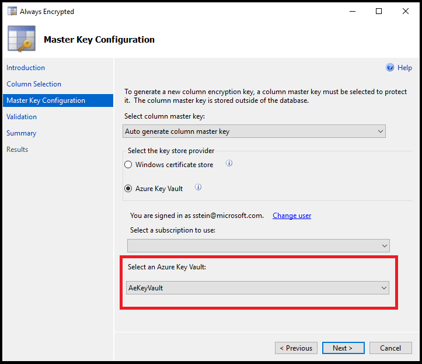
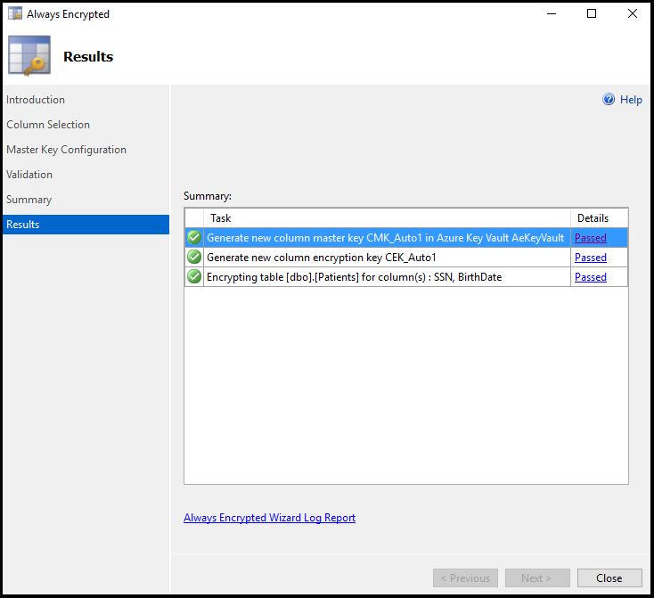
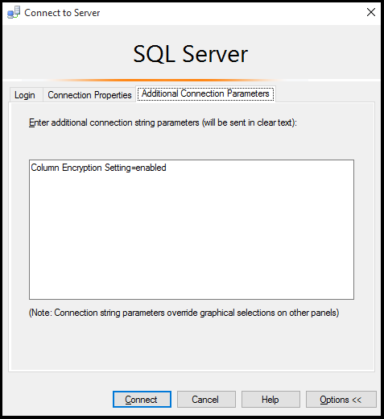
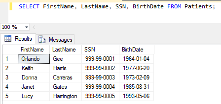

# Configure Always Encrypted by using Azure Key Vault 

[!INCLUDE[appliesto-sqldb](../includes/appliesto-sqldb-sqlmi.md)]

This article shows you how to secure sensitive data in a database in Azure SQL Database with data encryption by using the [Always Encrypted wizard](/sql/relational-databases/security/encryption/always-encrypted-wizard) in [SQL Server Management Studio (SSMS)](/sql/ssms/sql-server-management-studio-ssms). It also includes instructions that will show you how to store each encryption key in Azure Key Vault.

Always Encrypted is a data encryption technology that helps protect sensitive data at rest on the server, during movement between client and server, and while the data is in use. Always Encrypted ensures that sensitive data never appears as plaintext inside the database system. After you configure data encryption, only client applications or app servers that have access to the keys can access plaintext data. For detailed information, see [Always Encrypted (Database Engine)](https://msdn.microsoft.com/library/mt163865.aspx).

After you configure the database to use Always Encrypted, you will create a client application in C# with Visual Studio to work with the encrypted data.

Follow the steps in this article and learn how to set up Always Encrypted for your database in Azure SQL Database or SQL Managed Instance. In this article you will learn how to perform the following tasks:

- Use the Always Encrypted wizard in SSMS to create [Always Encrypted keys](https://msdn.microsoft.com/library/mt163865.aspx#Anchor_3).
  - Create a [column master key (CMK)](https://msdn.microsoft.com/library/mt146393.aspx).
  - Create a [column encryption key (CEK)](https://msdn.microsoft.com/library/mt146372.aspx).
- Create a database table and encrypt columns.
- Create an application that inserts, selects, and displays data from the encrypted columns.

## Prerequisites


- An Azure account and subscription. If you don't have one, sign up for a [free trial](https://azure.microsoft.com/pricing/free-trial/).
- A database in [Azure SQL Database](single-database-create-quickstart.md) or [Azure SQL Managed Instance](../managed-instance/instance-create-quickstart.md).
- [SQL Server Management Studio](https://msdn.microsoft.com/library/mt238290.aspx) version 13.0.700.242 or later.
- [.NET Framework 4.6](https://msdn.microsoft.com/library/w0x726c2.aspx) or later (on the client computer).
- [Visual Studio](https://www.visualstudio.com/downloads/download-visual-studio-vs.aspx).
- [Azure PowerShell](/powershell/azure/overview) or [Azure CLI](/cli/azure/install-azure-cli)

## Enable client application access

You must enable your client application to access your database in SQL Database by setting up an Azure Active Directory (Azure AD) application and copying the *Application ID* and *key* that you will need to authenticate your application.

To get the *Application ID* and *key*, follow the steps in [create an Azure Active Directory application and service principal that can access resources](../../active-directory/develop/howto-create-service-principal-portal.md).

## Create a key vault to store your keys

Now that your client app is configured and you have your application ID, it's time to create a key vault and configure its access policy so you and your application can access the vault's secrets (the Always Encrypted keys). The *create*, *get*, *list*, *sign*, *verify*, *wrapKey*, and *unwrapKey* permissions are required for creating a new column master key and for setting up encryption with SQL Server Management Studio.

You can quickly create a key vault by running the following script. For a detailed explanation of these commands and more information about creating and configuring a key vault, see [What is Azure Key Vault?](../../key-vault/general/overview.md).

# [PowerShell](#tab/azure-powershell)

> [!IMPORTANT]
> The PowerShell Azure Resource Manager (RM) module is still supported by Azure SQL Database, but all future development is for the Az.Sql module. The AzureRM module will continue to receive bug fixes until at least December 2020.  The arguments for the commands in the Az module and in the AzureRm modules are substantially identical. For more about their compatibility, see [Introducing the new Azure PowerShell Az module](/powershell/azure/new-azureps-module-az).

```powershell
$subscriptionName = '<subscriptionName>'
$userPrincipalName = '<username@domain.com>'
$applicationId = '<applicationId from AAD application>'
$resourceGroupName = '<resourceGroupName>' # use the same resource group name when creating your SQL Database below
$location = '<datacenterLocation>'
$vaultName = '<vaultName>'

Connect-AzAccount
$subscriptionId = (Get-AzSubscription -SubscriptionName $subscriptionName).Id
Set-AzContext -SubscriptionId $subscriptionId

New-AzResourceGroup -Name $resourceGroupName -Location $location
New-AzKeyVault -VaultName $vaultName -ResourceGroupName $resourceGroupName -Location $location

Set-AzKeyVaultAccessPolicy -VaultName $vaultName -ResourceGroupName $resourceGroupName -PermissionsToKeys create,get,wrapKey,unwrapKey,sign,verify,list -UserPrincipalName $userPrincipalName
Set-AzKeyVaultAccessPolicy  -VaultName $vaultName  -ResourceGroupName $resourceGroupName -ServicePrincipalName $applicationId -PermissionsToKeys get,wrapKey,unwrapKey,sign,verify,list
```

# [Azure CLI](#tab/azure-cli)

```azurecli
$subscriptionName = '<subscriptionName>'
$userPrincipalName = '<username@domain.com>'
$applicationId = '<applicationId from AAD application>'
$resourceGroupName = '<resourceGroupName>' # use the same resource group name when creating your database in Azure SQL Database below
$location = '<datacenterLocation>'
$vaultName = '<vaultName>'

az login
az account set --subscription $subscriptionName

az group create --location $location --name $resourceGroupName

az keyvault create --name $vaultName --resource-group $resourceGroupName --location $location

az keyvault set-policy --name $vaultName --key-permissions create, get, list, sign, unwrapKey, verify, wrapKey --resource-group $resourceGroupName --upn $userPrincipalName
az keyvault set-policy --name $vaultName --key-permissions get, list, sign, unwrapKey, verify, wrapKey --resource-group $resourceGroupName --spn $applicationId
```

## Connect with SSMS

Open SQL Server Management Studio (SSMS) and connect to the server or managed with your database.

1. Open SSMS. (Go to **Connect** > **Database Engine** to open the **Connect to Server** window if it isn't open.)

2. Enter your server name  or instance name and credentials. 

    

If the **New Firewall Rule** window opens, sign in to Azure and let SSMS create a new firewall rule for you.

## Create a table

In this section, you will create a table to hold patient data. It's not initially encrypted--you will configure encryption in the next section.

1. Expand **Databases**.
2. Right-click the database and click **New Query**.
3. Paste the following Transact-SQL (T-SQL) into the new query window and **Execute** it.

```sql
CREATE TABLE [dbo].[Patients](
         [PatientId] [int] IDENTITY(1,1),
         [SSN] [char](11) NOT NULL,
         [FirstName] [nvarchar](50) NULL,
         [LastName] [nvarchar](50) NULL,
         [MiddleName] [nvarchar](50) NULL,
         [StreetAddress] [nvarchar](50) NULL,
         [City] [nvarchar](50) NULL,
         [ZipCode] [char](5) NULL,
         [State] [char](2) NULL,
         [BirthDate] [date] NOT NULL
         PRIMARY KEY CLUSTERED ([PatientId] ASC) ON [PRIMARY] );
GO
```

## Encrypt columns (configure Always Encrypted)

SSMS provides a wizard that helps you easily configure Always Encrypted by setting up the column master key, column encryption key, and encrypted columns for you.

1. Expand **Databases** > **Clinic** > **Tables**.
2. Right-click the **Patients** table and select **Encrypt Columns** to open the Always Encrypted wizard:

    

The Always Encrypted wizard includes the following sections: **Column Selection**, **Master Key Configuration**, **Validation**, and **Summary**.

### Column Selection

Click **Next** on the **Introduction** page to open the **Column Selection** page. On this page, you will select which columns you want to encrypt, [the type of encryption, and what column encryption key (CEK)](https://msdn.microsoft.com/library/mt459280.aspx#Anchor_2) to use.

Encrypt **SSN** and **BirthDate** information for each patient. The SSN column will use deterministic encryption, which supports equality lookups, joins, and group by. The BirthDate column will use randomized encryption, which does not support operations.

Set the **Encryption Type** for the SSN column to **Deterministic** and the BirthDate column to **Randomized**. Click **Next**.


### Master Key Configuration

The **Master Key Configuration** page is where you set up your CMK and select the key store provider where the CMK will be stored. Currently, you can store a CMK in the Windows certificate store, Azure Key Vault, or a hardware security module (HSM).

This tutorial shows how to store your keys in Azure Key Vault.

1. Select **Azure Key Vault**.
2. Select the desired key vault from the drop-down list.
3. Click **Next**.



### Validation

You can encrypt the columns now or save a PowerShell script to run later. For this tutorial, select **Proceed to finish now** and click **Next**.

### Summary

Verify that the settings are all correct and click **Finish** to complete the setup for Always Encrypted.



### Verify the wizard's actions

After the wizard is finished, your database is set up for Always Encrypted. The wizard performed the following actions:

- Created a column master key and stored it in Azure Key Vault.
- Created a column encryption key and stored it in Azure Key Vault.
- Configured the selected columns for encryption. The Patients table currently has no data, but any existing data in the selected columns is now encrypted.

You can verify the creation of the keys in SSMS by expanding **Clinic** > **Security** > **Always Encrypted Keys**.

## Create a client application that works with the encrypted data

Now that Always Encrypted is set up, you can build an application that performs *inserts* and *selects* on the encrypted columns.  

> [!IMPORTANT]
> Your application must use [SqlParameter](https://msdn.microsoft.com/library/system.data.sqlclient.sqlparameter.aspx) objects when passing plaintext data to the server with Always Encrypted columns. Passing literal values without using SqlParameter objects will result in an exception.

1. Open Visual Studio and create a new C# **Console Application** (Visual Studio 2015 and earlier) or **Console App (.NET Framework)** (Visual Studio 2017 and later). Make sure your project is set to **.NET Framework 4.6** or later.
2. Name the project **AlwaysEncryptedConsoleAKVApp** and click **OK**.
3. Install the following NuGet packages by going to **Tools** > **NuGet Package Manager** > **Package Manager Console**.

Run these two lines of code in the Package Manager Console:

   ```powershell
   Install-Package Microsoft.SqlServer.Management.AlwaysEncrypted.AzureKeyVaultProvider
   Install-Package Microsoft.IdentityModel.Clients.ActiveDirectory
   ```

## Modify your connection string to enable Always Encrypted

This section explains how to enable Always Encrypted in your database connection string.

To enable Always Encrypted, you need to add the **Column Encryption Setting** keyword to your connection string and set it to **Enabled**.

You can set this directly in the connection string, or you can set it by using [SqlConnectionStringBuilder](https://msdn.microsoft.com/library/system.data.sqlclient.sqlconnectionstringbuilder.aspx). The sample application in the next section shows how to use **SqlConnectionStringBuilder**.

### Enable Always Encrypted in the connection string

Add the following keyword to your connection string.

   `Column Encryption Setting=Enabled`

### Enable Always Encrypted with SqlConnectionStringBuilder

The following code shows how to enable Always Encrypted by setting [SqlConnectionStringBuilder.ColumnEncryptionSetting](https://msdn.microsoft.com/library/system.data.sqlclient.sqlconnectionstringbuilder.columnencryptionsetting.aspx) to [Enabled](https://msdn.microsoft.com/library/system.data.sqlclient.sqlconnectioncolumnencryptionsetting.aspx).

```csharp
// Instantiate a SqlConnectionStringBuilder.
SqlConnectionStringBuilder connStringBuilder = new SqlConnectionStringBuilder("replace with your connection string");

// Enable Always Encrypted.
connStringBuilder.ColumnEncryptionSetting = SqlConnectionColumnEncryptionSetting.Enabled;
```

## Register the Azure Key Vault provider
The following code shows how to register the Azure Key Vault provider with the ADO.NET driver.

```csharp
private static ClientCredential _clientCredential;

static void InitializeAzureKeyVaultProvider() {
    _clientCredential = new ClientCredential(applicationId, clientKey);

    SqlColumnEncryptionAzureKeyVaultProvider azureKeyVaultProvider = new SqlColumnEncryptionAzureKeyVaultProvider(GetToken);

    Dictionary<string, SqlColumnEncryptionKeyStoreProvider> providers = new Dictionary<string, SqlColumnEncryptionKeyStoreProvider>();

    providers.Add(SqlColumnEncryptionAzureKeyVaultProvider.ProviderName, azureKeyVaultProvider);
    SqlConnection.RegisterColumnEncryptionKeyStoreProviders(providers);
}
```

## Always Encrypted sample console application

This sample demonstrates how to:

- Modify your connection string to enable Always Encrypted.
- Register Azure Key Vault as the application's key store provider.  
- Insert data into the encrypted columns.
- Select a record by filtering for a specific value in an encrypted column.

Replace the contents of *Program.cs* with the following code. Replace the connection string for the global connectionString variable in the line that directly precedes the Main method with your valid connection string from the Azure portal. This is the only change you need to make to this code.

Run the app to see Always Encrypted in action.

```csharp
using System;
using System.Collections.Generic;
using System.Linq;
using System.Text;
using System.Threading.Tasks;
using System.Data;
using System.Data.SqlClient;
using Microsoft.IdentityModel.Clients.ActiveDirectory;
using Microsoft.SqlServer.Management.AlwaysEncrypted.AzureKeyVaultProvider;

namespace AlwaysEncryptedConsoleAKVApp {
    class Program {
        // Update this line with your Clinic database connection string from the Azure portal.
        static string connectionString = @"<connection string from the portal>";
        static string applicationId = @"<application ID from your AAD application>";
        static string clientKey = "<key from your AAD application>";

        static void Main(string[] args) {
            InitializeAzureKeyVaultProvider();

            Console.WriteLine("Signed in as: " + _clientCredential.ClientId);

            Console.WriteLine("Original connection string copied from the Azure portal:");
            Console.WriteLine(connectionString);

            // Create a SqlConnectionStringBuilder.
            SqlConnectionStringBuilder connStringBuilder =
                new SqlConnectionStringBuilder(connectionString);

            // Enable Always Encrypted for the connection.
            // This is the only change specific to Always Encrypted
            connStringBuilder.ColumnEncryptionSetting =
                SqlConnectionColumnEncryptionSetting.Enabled;

            Console.WriteLine(Environment.NewLine + "Updated connection string with Always Encrypted enabled:");
            Console.WriteLine(connStringBuilder.ConnectionString);

            // Update the connection string with a password supplied at runtime.
            Console.WriteLine(Environment.NewLine + "Enter server password:");
            connStringBuilder.Password = Console.ReadLine();

            // Assign the updated connection string to our global variable.
            connectionString = connStringBuilder.ConnectionString;

            // Delete all records to restart this demo app.
            ResetPatientsTable();

            // Add sample data to the Patients table.
            Console.Write(Environment.NewLine + "Adding sample patient data to the database...");

            InsertPatient(new Patient() {
                SSN = "999-99-0001",
                FirstName = "Orlando",
                LastName = "Gee",
                BirthDate = DateTime.Parse("01/04/1964")
            });
            InsertPatient(new Patient() {
                SSN = "999-99-0002",
                FirstName = "Keith",
                LastName = "Harris",
                BirthDate = DateTime.Parse("06/20/1977")
            });
            InsertPatient(new Patient() {
                SSN = "999-99-0003",
                FirstName = "Donna",
                LastName = "Carreras",
                BirthDate = DateTime.Parse("02/09/1973")
            });
            InsertPatient(new Patient() {
                SSN = "999-99-0004",
                FirstName = "Janet",
                LastName = "Gates",
                BirthDate = DateTime.Parse("08/31/1985")
            });
            InsertPatient(new Patient() {
                SSN = "999-99-0005",
                FirstName = "Lucy",
                LastName = "Harrington",
                BirthDate = DateTime.Parse("05/06/1993")
            });

            // Fetch and display all patients.
            Console.WriteLine(Environment.NewLine + "All the records currently in the Patients table:");

            foreach (Patient patient in SelectAllPatients()) {
                Console.WriteLine(patient.FirstName + " " + patient.LastName + "\tSSN: " + patient.SSN + "\tBirthdate: " + patient.BirthDate);
            }

            // Get patients by SSN.
            Console.WriteLine(Environment.NewLine + "Now lets locate records by searching the encrypted SSN column.");

            string ssn;

            // This very simple validation only checks that the user entered 11 characters.
            // In production be sure to check all user input and use the best validation for your specific application.
            do {
                Console.WriteLine("Please enter a valid SSN (ex. 999-99-0003):");
                ssn = Console.ReadLine();
            } while (ssn.Length != 11);

            // The example allows duplicate SSN entries so we will return all records
            // that match the provided value and store the results in selectedPatients.
            Patient selectedPatient = SelectPatientBySSN(ssn);

            // Check if any records were returned and display our query results.
            if (selectedPatient != null) {
                Console.WriteLine("Patient found with SSN = " + ssn);
                Console.WriteLine(selectedPatient.FirstName + " " + selectedPatient.LastName + "\tSSN: "
                    + selectedPatient.SSN + "\tBirthdate: " + selectedPatient.BirthDate);
            }
            else {
                Console.WriteLine("No patients found with SSN = " + ssn);
            }

            Console.WriteLine("Press Enter to exit...");
            Console.ReadLine();
        }

        private static ClientCredential _clientCredential;

        static void InitializeAzureKeyVaultProvider() {
            _clientCredential = new ClientCredential(applicationId, clientKey);

            SqlColumnEncryptionAzureKeyVaultProvider azureKeyVaultProvider =
              new SqlColumnEncryptionAzureKeyVaultProvider(GetToken);

            Dictionary<string, SqlColumnEncryptionKeyStoreProvider> providers =
              new Dictionary<string, SqlColumnEncryptionKeyStoreProvider>();

            providers.Add(SqlColumnEncryptionAzureKeyVaultProvider.ProviderName, azureKeyVaultProvider);
            SqlConnection.RegisterColumnEncryptionKeyStoreProviders(providers);
        }

        public async static Task<string> GetToken(string authority, string resource, string scope) {
            var authContext = new AuthenticationContext(authority);
            AuthenticationResult result = await authContext.AcquireTokenAsync(resource, _clientCredential);

            if (result == null)
                throw new InvalidOperationException("Failed to obtain the access token");
            return result.AccessToken;
        }

        static int InsertPatient(Patient newPatient) {
            int returnValue = 0;

            string sqlCmdText = @"INSERT INTO [dbo].[Patients] ([SSN], [FirstName], [LastName], [BirthDate])
     VALUES (@SSN, @FirstName, @LastName, @BirthDate);";

            SqlCommand sqlCmd = new SqlCommand(sqlCmdText);

            SqlParameter paramSSN = new SqlParameter(@"@SSN", newPatient.SSN);
            paramSSN.DbType = DbType.AnsiStringFixedLength;
            paramSSN.Direction = ParameterDirection.Input;
            paramSSN.Size = 11;

            SqlParameter paramFirstName = new SqlParameter(@"@FirstName", newPatient.FirstName);
            paramFirstName.DbType = DbType.String;
            paramFirstName.Direction = ParameterDirection.Input;

            SqlParameter paramLastName = new SqlParameter(@"@LastName", newPatient.LastName);
            paramLastName.DbType = DbType.String;
            paramLastName.Direction = ParameterDirection.Input;

            SqlParameter paramBirthDate = new SqlParameter(@"@BirthDate", newPatient.BirthDate);
            paramBirthDate.SqlDbType = SqlDbType.Date;
            paramBirthDate.Direction = ParameterDirection.Input;

            sqlCmd.Parameters.Add(paramSSN);
            sqlCmd.Parameters.Add(paramFirstName);
            sqlCmd.Parameters.Add(paramLastName);
            sqlCmd.Parameters.Add(paramBirthDate);

            using (sqlCmd.Connection = new SqlConnection(connectionString)) {
                try {
                    sqlCmd.Connection.Open();
                    sqlCmd.ExecuteNonQuery();
                }
                catch (Exception ex) {
                    returnValue = 1;
                    Console.WriteLine("The following error was encountered: ");
                    Console.WriteLine(ex.Message);
                    Console.WriteLine(Environment.NewLine + "Press Enter key to exit");
                    Console.ReadLine();
                    Environment.Exit(0);
                }
            }
            return returnValue;
        }


        static List<Patient> SelectAllPatients() {
            List<Patient> patients = new List<Patient>();

            SqlCommand sqlCmd = new SqlCommand(
              "SELECT [SSN], [FirstName], [LastName], [BirthDate] FROM [dbo].[Patients]",
                new SqlConnection(connectionString));

            using (sqlCmd.Connection = new SqlConnection(connectionString))

            using (sqlCmd.Connection = new SqlConnection(connectionString)) {
                try {
                    sqlCmd.Connection.Open();
                    SqlDataReader reader = sqlCmd.ExecuteReader();

                    if (reader.HasRows) {
                        while (reader.Read()) {
                            patients.Add(new Patient() {
                                SSN = reader[0].ToString(),
                                FirstName = reader[1].ToString(),
                                LastName = reader["LastName"].ToString(),
                                BirthDate = (DateTime)reader["BirthDate"]
                            });
                        }
                    }
                }
                catch (Exception ex) {
                    throw;
                }
            }

            return patients;
        }

        static Patient SelectPatientBySSN(string ssn) {
            Patient patient = new Patient();

            SqlCommand sqlCmd = new SqlCommand(
                "SELECT [SSN], [FirstName], [LastName], [BirthDate] FROM [dbo].[Patients] WHERE [SSN]=@SSN",
                new SqlConnection(connectionString));

            SqlParameter paramSSN = new SqlParameter(@"@SSN", ssn);
            paramSSN.DbType = DbType.AnsiStringFixedLength;
            paramSSN.Direction = ParameterDirection.Input;
            paramSSN.Size = 11;

            sqlCmd.Parameters.Add(paramSSN);

            using (sqlCmd.Connection = new SqlConnection(connectionString)) {
                try {
                    sqlCmd.Connection.Open();
                    SqlDataReader reader = sqlCmd.ExecuteReader();

                    if (reader.HasRows) {
                        while (reader.Read()) {
                            patient = new Patient() {
                                SSN = reader[0].ToString(),
                                FirstName = reader[1].ToString(),
                                LastName = reader["LastName"].ToString(),
                                BirthDate = (DateTime)reader["BirthDate"]
                            };
                        }
                    }
                    else {
                        patient = null;
                    }
                }
                catch (Exception ex) {
                    throw;
                }
            }
            return patient;
        }

        // This method simply deletes all records in the Patients table to reset our demo.
        static int ResetPatientsTable() {
            int returnValue = 0;

            SqlCommand sqlCmd = new SqlCommand("DELETE FROM Patients");
            using (sqlCmd.Connection = new SqlConnection(connectionString)) {
                try {
                    sqlCmd.Connection.Open();
                    sqlCmd.ExecuteNonQuery();

                }
                catch (Exception ex) {
                    returnValue = 1;
                }
            }
            return returnValue;
        }
    }

    class Patient {
        public string SSN { get; set; }
        public string FirstName { get; set; }
        public string LastName { get; set; }
        public DateTime BirthDate { get; set; }
    }
}
```

## Verify that the data is encrypted

You can quickly check that the actual data on the server is encrypted by querying the Patients data with SSMS (using your current connection where **Column Encryption Setting** is not yet enabled).

Run the following query on the Clinic database.

```sql
SELECT FirstName, LastName, SSN, BirthDate FROM Patients;
```

You can see that the encrypted columns do not contain any plaintext data.

   

To use SSMS to access the plaintext data, you first need to ensure that the user has proper permissions to the Azure Key Vault: *get*, *unwrapKey*, and *verify*. For detailed information, see [Create and Store Column Master Keys (Always Encrypted)](https://docs.microsoft.com/sql/relational-databases/security/encryption/create-and-store-column-master-keys-always-encrypted).

Then add the *Column Encryption Setting=enabled* parameter during your connection.

1. In SSMS, right-click your server in **Object Explorer** and choose **Disconnect**.
2. Click **Connect** > **Database Engine** to open the **Connect to Server** window and click **Options**.
3. Click **Additional Connection Parameters** and type **Column Encryption Setting=enabled**.

    

4. Run the following query on the Clinic database.

   ```sql
   SELECT FirstName, LastName, SSN, BirthDate FROM Patients;
   ```

     You can now see the plaintext data in the encrypted columns.
     

## Next steps

After your database is configured to use Always Encrypted, you may want to do the following:

- [Rotate and clean up your keys](https://msdn.microsoft.com/library/mt607048.aspx).
- [Migrate data that is already encrypted with Always Encrypted](https://msdn.microsoft.com/library/mt621539.aspx).

## Related information

- [Always Encrypted (client development)](https://msdn.microsoft.com/library/mt147923.aspx)
- [Transparent data encryption](https://msdn.microsoft.com/library/bb934049.aspx)
- [SQL Server encryption](https://msdn.microsoft.com/library/bb510663.aspx)
- [Always Encrypted wizard](https://msdn.microsoft.com/library/mt459280.aspx)
- [Always Encrypted blog](https://docs.microsoft.com/archive/blogs/sqlsecurity/always-encrypted-key-metadata)
