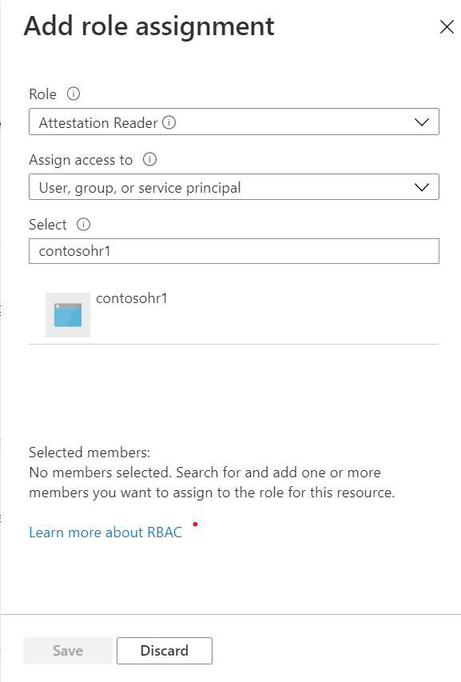

# Configure Azure Attestation for your Azure SQL logical server

[!INCLUDE[appliesto-sqldb](../includes/appliesto-sqldb.md)]

> [!NOTE]
> Always Encrypted with secure enclaves for Azure SQL Database is currently in **public preview**.

[Microsoft Azure Attestation](../../attestation/overview.md) is a solution for attesting Trusted Execution Environments (TEEs), including Intel Software Guard Extensions (Intel SGX) enclaves. 

To use Azure Attestation for attesting Intel SGX enclaves used for [Always Encrypted with secure enclaves](/sql/relational-databases/security/encryption/always-encrypted-enclaves) in Azure SQL Database, you need to:

1. Create an [attestation provider](../../attestation/basic-concepts.md#attestation-provider) and configure it with the recommended attestation policy.

2. Grant your Azure SQL logical server access to your attestation provider.

> [!NOTE]
> Configuring attestation is the responsibility of the attestation administrator. See [Roles and responsibilities when configuring SGX enclaves and attestation](always-encrypted-enclaves-plan.md#roles-and-responsibilities-when-configuring-sgx-enclaves-and-attestation).

## Requirements

The Azure SQL logical server and the attestation provider must belong to the same Azure Active Directory tenant. Cross-tenant interactions aren't supported. 

The Azure SQL logical server must have an Azure AD identity assigned to it. As the attestation administrator you need to obtain the Azure AD identity of the server from the Azure SQL Database administrator for that server. You will use the identity to grant the server access to the attestation provider. 

For instructions on how to create a server with an identity or assign an identity to an existing server using PowerShell and Azure CLI, see [Assign an Azure AD identity to your server](transparent-data-encryption-byok-configure.md#assign-an-azure-active-directory-azure-ad-identity-to-your-server).

## Create and configure an attestation provider

An [attestation provider](../../attestation/basic-concepts.md#attestation-provider) is a resource in Azure Attestation that evaluates [attestation requests](../../attestation/basic-concepts.md#attestation-request) against [attestation policies](../../attestation/basic-concepts.md#attestation-request) and issues [attestation tokens](../../attestation/basic-concepts.md#attestation-token). 

Attestation policies are specified using the [claim rule grammar](../../attestation/claim-rule-grammar.md).

Microsoft recommends the following policy for attesting Intel SGX enclaves used for Always Encrypted in Azure SQL Database:

```output
version= 1.0;
authorizationrules 
{
       [ type=="x-ms-sgx-is-debuggable", value==false ]
        && [ type=="x-ms-sgx-product-id", value==4639 ]
        && [ type=="x-ms-sgx-svn", value>= 0 ]
        && [ type=="x-ms-sgx-mrsigner", value=="e31c9e505f37a58de09335075fc8591254313eb20bb1a27e5443cc450b6e33e5"] 
    => permit();
};
```

The above policy verifies:

- The enclave inside Azure SQL Database doesn't support debugging. 
  > Enclaves can be loaded with debugging disabled or enabled. Debugging support is designed to allow developers to troubleshoot the code running in an enclave. In a production system, debugging could enable an administrator to examine the content of the enclave, which would reduce the level of protection the enclave provides. The recommended policy disables debugging to ensure that if a malicious admin tries to turn on debugging support by taking over the enclave machine, attestation will fail. 
- The product ID of the enclave matches the product ID assigned to Always Encrypted with secure enclaves.
  > Each enclave has a unique product ID that differentiates the enclave from other enclaves. The product ID assigned to the Always Encrypted enclave is 4639. 
- The security version number (SVN) of the library is greater than 0.
  > The SVN allows Microsoft to respond to potential security bugs identified in the enclave code. In case a security issue is dicovered and fixed, Microsoft will deploy a new version of the enclave with a new (incremented) SVN. The above recommended policy will be updated to reflect the new SVN. By updating your policy to match the recommended policy you can ensure that if a malicious administrator tries to load an older and insecure enclave, attestation will fail.
- The library in the enclave has been signed using the Microsoft signing key (the value of the x-ms-sgx-mrsigner claim is the hash of the signing key).
  > One of the main goals of attestation is to convince clients that the binary running in the enclave is the binary that is supposed to run. Attestation policies provide two mechanisms for this purpose. One is the **mrenclave** claim which is the hash of the binary that is supposed to run in an enclave. The problem with the **mrenclave** is that the binary hash changes even with trivial changes to the code, which makes it hard to rev the code running in the enclave. Hence, we recommend the use of the **mrsigner**, which is a hash of a key that is used to sign the enclave binary. When Microsoft revs the enclave, the **mrsigner** stays the same as long as the signing key does not change. In this way, it becomes feasible to deploy updated binaries without breaking customers’ applications. 

> [!IMPORTANT]
> An attestation provider gets created with the default policy for Intel SGX enclaves, which does not validate the code running inside the enclave. Microsoft strongly advises you set the above recommended policy, and not use the default policy, for Always Encrypted with secure enclaves.

For instructions for how to create an attestation provider and configure with an attestation policy using:

- [Quickstart: Set up Azure Attestation with Azure portal](../../attestation/quickstart-portal.md)
    > [!IMPORTANT]
    > When you configure your attestation policy with Azure portal, set Attestation Type to `SGX-IntelSDK`.
- [Quickstart: Set up Azure Attestation with Azure PowerShell](../../attestation/quickstart-powershell.md)
    > [!IMPORTANT]
    > When you configure your attestation policy with Azure PowerShell, set the `Tee` parameter to `SgxEnclave`.
- [Quickstart: Set up Azure Attestation with Azure CLI](../../attestation/quickstart-azure-cli.md)
    > [!IMPORTANT]
    > When you configure your attestation policy with Azure CLI, set the `attestation-type` parameter to `SGX-IntelSDK`.

## Determine the attestation URL for your attestation policy

After you've configured an attestation policy, you need to share the attestation URL, referencing the policy, administrators of applications that use Always Encrypted with secure enclaves in Azure SQL Database. Application administrators or/and application users will need to configure their apps with the attestation URL, so that they can run statements that use secure enclaves.

### Use PowerShell to determine the attestation URL

Use the following script to determine your attestation URL:

```powershell
$attestationProvider = Get-AzAttestation -Name $attestationProviderName -ResourceGroupName $attestationResourceGroupName 
$attestationUrl = $attestationProvider.AttestUri + “/attest/SgxEnclave”
Write-Host "Your attestation URL is: " $attestationUrl 
```

### Use Azure portal to determine the attestation URL

1. In the Overview pane for your attestation provider, copy the value of the Attest URI property to clipboard. An Attest URI should look like this: `https://MyAttestationProvider.us.attest.azure.net`.

2. Append the following to the Attest URI: `/attest/SgxEnclave`. 

The resulting attestation URL should look like this: `https://MyAttestationProvider.us.attest.azure.net/attest/SgxEnclave`

## Grant your Azure SQL logical server access to your attestation provider

During the attestation workflow, the Azure SQL logical server containing your database calls the attestation provider to submit an attestation request. For the Azure SQL logical server to be able to submit attestation requests, the server must have a permission for the `Microsoft.Attestation/attestationProviders/attestation/read` action on the attestation provider. The recommended way to grant the permission is for the administrator of the attestation provider to assign the Azure AD identity of the server to the Attestation Reader role for the attestation provider, or its containing resource group.

### Use Azure portal to assign permission

To assign the identity of an Azure SQL server to the Attestation Reader role for an attestation provider, follow the general instructions in [Assign Azure roles using the Azure portal](../../role-based-access-control/role-assignments-portal.md). When you are in the **Add role assignment** pane:

1. In the **Role** drop-down, select the **Attestation Reader** role.
1. In the **Select** field, enter the name of your Azure SQL server to search for it.

See the below screenshot for an example.



> [!NOTE]
> For a server to show up in the **Add role assignment** pane, the server must have an Azure AD identity assigned - see [Requirements](#requirements).

### Use PowerShell to assign permission

1. Find your Azure SQL logical server.

```powershell
$serverResourceGroupName = "<server resource group name>"
$serverName = "<server name>" 
$server = Get-AzSqlServer -ServerName $serverName -ResourceGroupName
```
 
2. Assign the server to the Attestation Reader role for the resource group containing your attestation provider.

```powershell
$attestationResourceGroupName = "<attestation provider resource group name>"
New-AzRoleAssignment -ObjectId $server.Identity.PrincipalId -RoleDefinitionName "Attestation Reader" -ResourceGroupName $attestationResourceGroupName
```

For more information, see [Assign Azure roles using Azure PowerShell](../../role-based-access-control/role-assignments-powershell.md#assign-role-examples).

## Next Steps

- [Manage keys for Always Encrypted with secure enclaves](/sql/relational-databases/security/encryption/always-encrypted-enclaves-manage-keys)

## See also

- [Tutorial: Getting started with Always Encrypted with secure enclaves in Azure SQL Database](always-encrypted-enclaves-getting-started.md)
