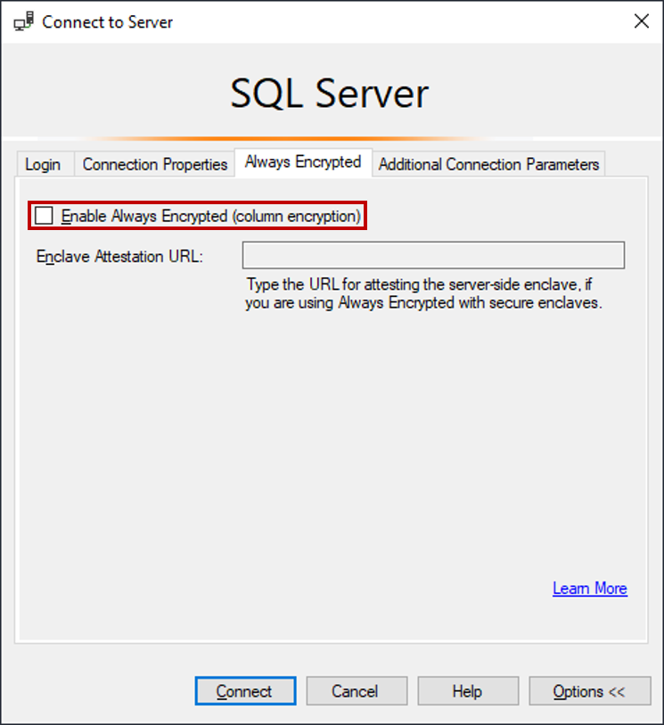
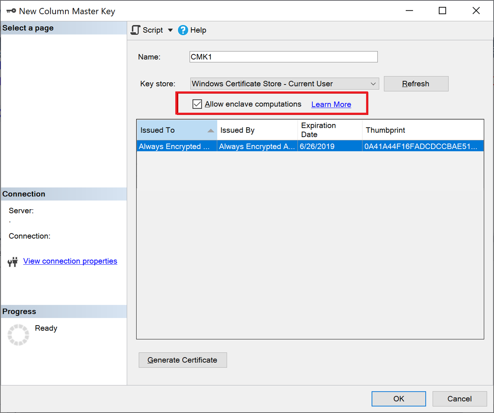
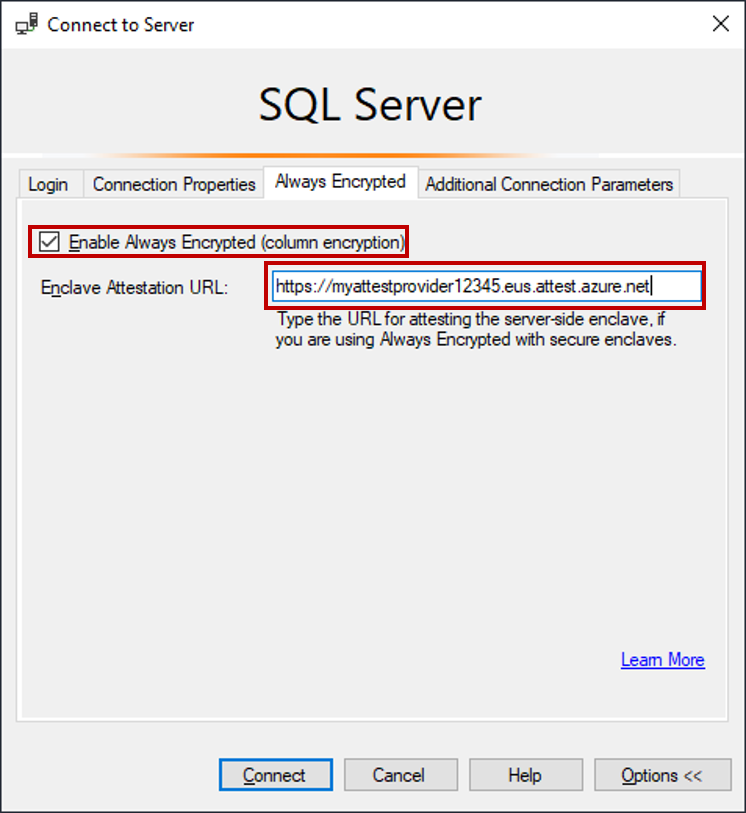

# Tutorial: Getting started with Always Encrypted with secure enclaves in Azure SQL Database

[!INCLUDE[appliesto-sqldb](../includes/appliesto-sqldb.md)]

> [!NOTE]
> Always Encrypted with secure enclaves for Azure SQL Database is currently in **public preview**.

This tutorial teaches you how to get started with [Always Encrypted with secure enclaves](/sql/relational-databases/security/encryption/always-encrypted-enclaves) in Azure SQL Database. It will show you:

> [!div class="checklist"]
> - How to create an environment for testing and evaluating Always Encrypted with secure enclaves.
> - How to encrypt data in-place and issue rich confidential queries against encrypted columns using SQL Server Management Studio (SSMS).

## Prerequisites

This tutorial requires Azure PowerShell and [SSMS](/sql/ssms/download-sql-server-management-studio-ssms).

### PowerShell requirements

See [Overview of Azure PowerShell](/powershell/azure) for information on how to install and run Azure PowerShell. 

Minimum version of Az modules required to support attestation operations:

- Az 4.5.0
- Az.Accounts 1.9.2
- Az.Attestation 0.1.8

Run the below command to verify the installed version of all Az modules:

```powershell
Get-InstalledModule
```

If the versions aren't matching with the minimum requirement, run the `Update-Module` command.

The PowerShell Gallery has deprecated Transport Layer Security (TLS) versions 1.0 and 1.1. TLS 1.2 or a later version is recommended. You may receive the following errors if you are using a TLS version lower than 1.2:

- `WARNING: Unable to resolve package source 'https://www.powershellgallery.com/api/v2'`
- `PackageManagement\Install-Package: No match was found for the specified search criteria and module name.`

To continue to interact with the PowerShell Gallery, run the following command before the Install-Module commands

```powershell
[Net.ServicePointManager]::SecurityProtocol = [Net.SecurityProtocolType]::Tls12
```

### SSMS requirements

See [Download SQL Server Management Studio (SSMS)](/sql/ssms/download-sql-server-management-studio-ssms) for information on how to download SSMS.

The required minimum version of SSMS is 18.8.


## Step 1: Create and configure a server and a DC-series database

In this step, you will create a new Azure SQL Database logical server and a new database using the DC-series hardware generation, required for Always Encrypted with secure enclaves. For more information see [DC-series](service-tiers-vcore.md#dc-series).

1. Open a PowerShell console and import the required version of Az.

  ```PowerShell
  Import-Module "Az" -MinimumVersion "4.5.0"
  ```
  
2. Sign into Azure. If needed, [switch to the subscription](/powershell/azure/manage-subscriptions-azureps) you are using for this tutorial.

  ```PowerShell
  Connect-AzAccount
  $subscriptionId = "<your subscription ID>"
  Set-AzContext -Subscription $subscriptionId
  ```

3. Create a new resource group. 

  > [!IMPORTANT]
  > You need to create your resource group in a region (location) that supports both the DC-series hardware generation and Microsoft Azure Attestation. For the list of regions supporting DC-series, see [DC-series availability](service-tiers-vcore.md#dc-series-1). [Here](https://azure.microsoft.com/global-infrastructure/services/?products=azure-attestation) is the regional availability of Microsoft Azure Attestation.

  ```powershell
  $resourceGroupName = "<your new resource group name>"
  $location = "<Azure region supporting DC-series and Microsoft Azure Attestation>"
  New-AzResourceGroup -Name $resourceGroupName -Location $location
  ```

4. Create an Azure SQL logical server. When prompted, enter the server administrator name and a password. Make sure you remember the admin name and the password - you will need them later to connect to the server.

  ```powershell
  $serverName = "<your server name>" 
  New-AzSqlServer -ServerName $serverName -ResourceGroupName $resourceGroupName -Location $location 
  ```

5. Create a server firewall rule that allows access from the specified IP range.
  
  ```powershell
  $startIp = "<start of IP range>"
  $endIp = "<end of IP range>"
  $serverFirewallRule = New-AzSqlServerFirewallRule -ResourceGroupName $resourceGroupName `
    -ServerName $serverName `
    -FirewallRuleName "AllowedIPs" -StartIpAddress $startIp -EndIpAddress $endIp
  ```

6. Assign a managed system identity to your server. 

  ```PowerShell
  $server = Set-AzSqlServer -ServerName $serverName -ResourceGroupName $resourceGroupName -AssignIdentity
  $serverObjectId = $server.Identity.PrincipalId
  ```

7. Create a DC-series database.

  ```powershell
  $databaseName = "ContosoHR"
  $edition = "GeneralPurpose"
  $vCore = 2
  $generation = "DC"
  New-AzSqlDatabase -ResourceGroupName $resourceGroupName `
    -ServerName $serverName `
    -DatabaseName $databaseName `
    -Edition $edition `
    -Vcore $vCore `
    -ComputeGeneration $generation
  ```

8. Retrieve and save the information about your server and the database. You will need this information, as well as the admin name and the password from step 4 in this section, in later sections.

  ```powershell
  Write-Host 
  Write-Host "Fully qualified server name: $($server.FullyQualifiedDomainName)" 
  Write-Host "Server Object Id: $serverObjectId"
  Write-Host "Database name: $databaseName"
  ```
  
## Step 2: Configure an attestation provider 

In this step, You'll create and configure an attestation provider in Microsoft Azure Attestation. This is needed to attest the secure enclave your database uses.

1. Copy the below attestation policy and save the policy in a text file (txt). For information about the below policy, see [Create and configure an attestation provider](always-encrypted-enclaves-configure-attestation.md#create-and-configure-an-attestation-provider).

  ```output
  version= 1.0;
  authorizationrules 
  {
       [ type=="x-ms-sgx-is-debuggable", value==false ]
        && [ type=="x-ms-sgx-product-id", value==4639 ]
        && [ type=="x-ms-sgx-svn", value>= 0 ]
        && [ type=="x-ms-sgx-mrsigner", value=="e31c9e505f37a58de09335075fc8591254313eb20bb1a27e5443cc450b6e33e5"] 
    => permit();
  };
  ```

2. Import the required version of `Az.Attestation`.  

  ```powershell
  Import-Module "Az.Attestation" -MinimumVersion "0.1.8"
  ```
  
3. Create an attestation provider. 

  ```powershell
  $attestationProviderName = "<your attestation provider name>" 
  New-AzAttestation -Name $attestationProviderName -ResourceGroupName $resourceGroupName -Location $location
  ```

4. Configure your attestation policy.
  
  ```powershell
  $policyFile = "<the pathname of the file from step 1 in this section>"
  $teeType = "SgxEnclave"
  $policyFormat = "Text"
  $policy=Get-Content -path $policyFile -Raw
  Set-AzAttestationPolicy -Name $attestationProviderName `
    -ResourceGroupName $resourceGroupName `
    -Tee $teeType `
    -Policy $policy `
    -PolicyFormat  $policyFormat
  ```

5. Grant your Azure SQL logical server access to your attestation provider. In this step, you're using the object ID of the managed service identity that you assigned to your server earlier.

  ```powershell
  New-AzRoleAssignment -ObjectId $serverObjectId `
    -RoleDefinitionName "Attestation Reader" `
    -ResourceName $attestationProviderName `
    -ResourceType "Microsoft.Attestation/attestationProviders" `
    -ResourceGroupName $resourceGroupName  
  ```

6. Retrieve the attestation URL that points to an attestation policy you configured for the SGX enclave. Save the URL, as you will need it later.

  ```powershell
  $attestationProvider = Get-AzAttestation -Name $attestationProviderName -ResourceGroupName $resourceGroupName 
  $attestationUrl = $attestationProvider.AttestUri + “/attest/SgxEnclave”
  Write-Host
  Write-Host "Your attestation URL is: $attestationUrl"
  ```
  
  The attestation URL should look like this: `https://contososqlattestation.uks.attest.azure.net/attest/SgxEnclave`

## Step 3: Populate your database

In this step, you'll create a table and populate it with some data that you'll later encrypt and query.

1. Open SSMS and connect to the **ContosoHR** database in the Azure SQL logical server you created **without** Always Encrypted enabled in the database connection.
    1. In the **Connect to Server** dialog, specify the fully qualified name of your server (for example, *myserver123.database.windows.net*), and enter the administrator user name and the password you specified when you created the server.
    2. Click **Options >>** and select the **Connection Properties** tab. Make sure to select the **ContosoHR** database (not the default, master database). 
    3. Select the **Always Encrypted** tab.
    4. Make sure the **Enable Always Encrypted (column encryption)** checkbox is **not** selected.

        

    5. Click **Connect**.

2. Create a new table, named **Employees**.

    ```sql
    CREATE SCHEMA [HR];
    GO

    CREATE TABLE [HR].[Employees]
    (
        [EmployeeID] [int] IDENTITY(1,1) NOT NULL,
        [SSN] [char](11) NOT NULL,
        [FirstName] [nvarchar](50) NOT NULL,
        [LastName] [nvarchar](50) NOT NULL,
        [Salary] [money] NOT NULL
    ) ON [PRIMARY];
    GO
    ```

3. Add a few employee records to the **Employees** table.

    ```sql
    INSERT INTO [HR].[Employees]
            ([SSN]
            ,[FirstName]
            ,[LastName]
            ,[Salary])
        VALUES
            ('795-73-9838'
            , N'Catherine'
            , N'Abel'
            , $31692);

    INSERT INTO [HR].[Employees]
            ([SSN]
            ,[FirstName]
            ,[LastName]
            ,[Salary])
        VALUES
            ('990-00-6818'
            , N'Kim'
            , N'Abercrombie'
            , $55415);
    ```


## Step 4: Provision enclave-enabled keys

In this step, you'll create a column master key and a column encryption key that allow enclave computations.

1. Using the SSMS instance from the previous step, in **Object Explorer**, expand your database and navigate to **Security** > **Always Encrypted Keys**.
1. Provision a new enclave-enabled column master key:
    1. Right-click **Always Encrypted Keys** and select **New Column Master Key...**.
    2. Select your column master key name: **CMK1**.
    3. Make sure you select either **Windows Certificate Store (Current User or Local Machine)** or **Azure Key Vault**.
    4. Select **Allow enclave computations**.
    5. If you selected Azure Key Vault, sign into Azure and select your key vault. For more information on how to create a key vault for Always Encrypted, see [Manage your key vaults from Azure portal](/archive/blogs/kv/manage-your-key-vaults-from-new-azure-portal).
    6. Select your certificate or Azure Key Value key if it already exists, or click the **Generate Certificate** button to create a new one.
    7. Select **OK**.

        

1. Create a new enclave-enabled column encryption key:

    1. Right-click **Always Encrypted Keys** and select **New Column Encryption Key**.
    2. Enter a name for the new column encryption key: **CEK1**.
    3. In the **Column master key** dropdown, select the column master key you created in the previous steps.
    4. Select **OK**.

## Step 5: Encrypt some columns in place

In this step, you'll encrypt the data stored in the **SSN** and **Salary** columns inside the server-side enclave, and then test a SELECT query on the data.

1. Open a new SSMS instance and connect to your database **with** Always Encrypted enabled for the database connection.
    1. Start a new instance of SSMS.
    2. In the **Connect to Server** dialog, specify the fully qualified name of your server (for example, *myserver123.database.windows.net*), and enter the administrator user name and the password you specified when you created the server.
    3. Click **Options >>** and select the **Connection Properties** tab. Make sure to select the **ContosoHR** database (not the default, master database). 
    4. Select the **Always Encrypted** tab.
    5. Make sure the **Enable Always Encrypted (column encryption)** checkbox is selected.
    6. Specify your enclave attestation URL that you've obtained by following the steps in [Step 2: Configure an attestation provider](#step-2-configure-an-attestation-provider). See the below screenshot.

        

    7. Select **Connect**.
    8. If you're prompted to enable Parameterization for Always Encrypted queries, select **Enable**.


1. Using the same SSMS instance (with Always Encrypted enabled), open a new query window and encrypt the **SSN** and **Salary** columns by running the below statements.

    ```sql
    ALTER TABLE [HR].[Employees]
    ALTER COLUMN [SSN] [char] (11) COLLATE Latin1_General_BIN2
    ENCRYPTED WITH (COLUMN_ENCRYPTION_KEY = [CEK1], ENCRYPTION_TYPE = Randomized, ALGORITHM = 'AEAD_AES_256_CBC_HMAC_SHA_256') NOT NULL
    WITH
    (ONLINE = ON);

    ALTER TABLE [HR].[Employees]
    ALTER COLUMN [Salary] [money]
    ENCRYPTED WITH (COLUMN_ENCRYPTION_KEY = [CEK1], ENCRYPTION_TYPE = Randomized, ALGORITHM = 'AEAD_AES_256_CBC_HMAC_SHA_256') NOT NULL
    WITH
    (ONLINE = ON);

    ALTER DATABASE SCOPED CONFIGURATION CLEAR PROCEDURE_CACHE;
    ```

    > [!NOTE]
    > Notice the ALTER DATABASE SCOPED CONFIGURATION CLEAR PROCEDURE_CACHE statement to clear the query plan cache for the database in the above script. After you have altered the table, you need to clear the plans for all batches and stored procedures that access the table to refresh parameters encryption information. 

1. To verify the **SSN** and **Salary** columns are now encrypted, open a new query window in the SSMS instance **without** Always Encrypted enabled for the database connection and execute the below statement. The query window should return encrypted values in the **SSN** and **Salary** columns. If you execute the same query using the SSMS instance with Always Encrypted enabled, you should see the data decrypted.

    ```sql
    SELECT * FROM [HR].[Employees];
    ```

## Step 6: Run rich queries against encrypted columns

You can run rich queries against the encrypted columns. Some query processing will be performed inside your server-side enclave. 

1. In the SSMS instance **with** Always Encrypted enabled, make sure Parameterization for Always Encrypted is also enabled.
    1. Select **Tools** from the main menu of SSMS.
    2. Select **Options...**.
    3. Navigate to **Query Execution** > **SQL Server** > **Advanced**.
    4. Ensure that **Enable Parameterization for Always Encrypted** is checked.
    5. Select **OK**.
2. Open a new query window, paste in the below query, and execute. The query should return plaintext values and rows meeting the specified search criteria.

    ```sql
    DECLARE @SSNPattern [char](11) = '%6818';
    DECLARE @MinSalary [money] = $1000;
    SELECT * FROM [HR].[Employees]
    WHERE SSN LIKE @SSNPattern AND [Salary] >= @MinSalary;
    ```

3. Try the same query again in the SSMS instance that doesn't have Always Encrypted enabled. A failure should occur.
 
## Next steps

After completing this tutorial, you can go to one of the following tutorials:
- [Tutorial: Develop a .NET application using Always Encrypted with secure enclaves](/sql/connect/ado-net/sql/tutorial-always-encrypted-enclaves-develop-net-apps)
- [Tutorial: Develop a .NET Framework application using Always Encrypted with secure enclaves](/sql/relational-databases/security/tutorial-always-encrypted-enclaves-develop-net-framework-apps)
- [Tutorial: Creating and using indexes on enclave-enabled columns using randomized encryption](/sql/relational-databases/security/tutorial-creating-using-indexes-on-enclave-enabled-columns-using-randomized-encryption)

## See Also

- [Configure and use Always Encrypted with secure enclaves](/sql/relational-databases/security/encryption/configure-always-encrypted-enclaves)
