# Auditing for Azure SQL Database and Azure Synapse Analytics
[!INCLUDE[appliesto-sqldb-asa](../includes/appliesto-sqldb-asa.md)]

Auditing for [Azure SQL Database](sql-database-paas-overview.md) and [Azure Synapse Analytics](../../synapse-analytics/sql-data-warehouse/sql-data-warehouse-overview-what-is.md) tracks database events and writes them to an audit log in your Azure storage account, Log Analytics workspace, or Event Hubs.

Auditing also:

- Helps you maintain regulatory compliance, understand database activity, and gain insight into discrepancies and anomalies that could indicate business concerns or suspected security violations.

- Enables and facilitates adherence to compliance standards, although it doesn't guarantee compliance. For more information about Azure programs that support standards compliance, see the [Azure Trust Center](https://gallery.technet.microsoft.com/Overview-of-Azure-c1be3942) where you can find the most current list of Azure SQL compliance certifications.

> [!NOTE]
> For information on Azure SQL Managed Instance auditing, see the following article, [Get started with SQL Managed Instance auditing](../managed-instance/auditing-configure.md).

## Overview

You can use SQL Database auditing to:

- **Retain** an audit trail of selected events. You can define categories of database actions to be audited.
- **Report** on database activity. You can use pre-configured reports and a dashboard to get started quickly with activity and event reporting.
- **Analyze** reports. You can find suspicious events, unusual activity, and trends.

> [!IMPORTANT]
> Azure SQL Database auditing is optimized for availability and performance. During very high activity Azure SQL Database or Azure Synapse allows operations to proceed and may not record some audited events.

### Auditing limitations

- **Premium storage** is currently **not supported**.
- **Hierarchical namespace** for **Azure Data Lake Storage Gen2 storage account** is currently **not supported**.
- Enabling auditing on a paused **Azure Synapse** is not supported. To enable auditing, resume Azure Synapse.

#### Define server-level vs. database-level auditing policy

An auditing policy can be defined for a specific database or as a default [server](logical-servers.md) policy in Azure (which hosts SQL Database or Azure Synapse):

- A server policy applies to all existing and newly created databases on the server.

- If *server auditing is enabled*, it *always applies to the database*. The database will be audited, regardless of the database auditing settings.

- Enabling auditing on the database, in addition to enabling it on the server, does *not* override or change any of the settings of the server auditing. Both audits will exist side by side. In other words, the database is audited twice in parallel; once by the server policy and once by the database policy.

   > [!NOTE]
   > You should avoid enabling both server auditing and database blob auditing together, unless:
    >
    > - You want to use a different *storage account*, *retention period* or *Log Analytics Workspace* for a specific database.
    > - You want to audit event types or categories for a specific database that differ from the rest of the databases on the server. For example, you might have table inserts that need to be audited only for a specific database.
   >
   > Otherwise, we recommended that you enable only server-level auditing and leave the database-level auditing disabled for all databases.

## Set up auditing for your server

The default auditing policy includes all actions and the following set of action groups, which will audit all the queries and stored procedures executed against the database, as well as successful and failed logins:
  
- BATCH_COMPLETED_GROUP
- SUCCESSFUL_DATABASE_AUTHENTICATION_GROUP
- FAILED_DATABASE_AUTHENTICATION_GROUP
  
You can configure auditing for different types of actions and action groups using PowerShell, as described in the [Manage SQL Database auditing using Azure PowerShell](#manage-auditing) section.

Azure SQL Database and Azure Synapse Audit stores 4000 characters of data for character fields in an audit record. When the **statement** or the **data_sensitivity_information** values returned from an auditable action contain more than 4000 characters, any data beyond the first 4000 characters will be **truncated and not audited**.
The following section describes the configuration of auditing using the Azure portal.

1. Go to the [Azure portal](https://portal.azure.com).
2. Navigate to **Auditing** under the Security heading in your **SQL database** or **SQL server** pane.
3. If you prefer to set up a server auditing policy, you can select the **View server settings** link on the database auditing page. You can then view or modify the server auditing settings. Server auditing policies apply to all existing and newly created databases on this server.

    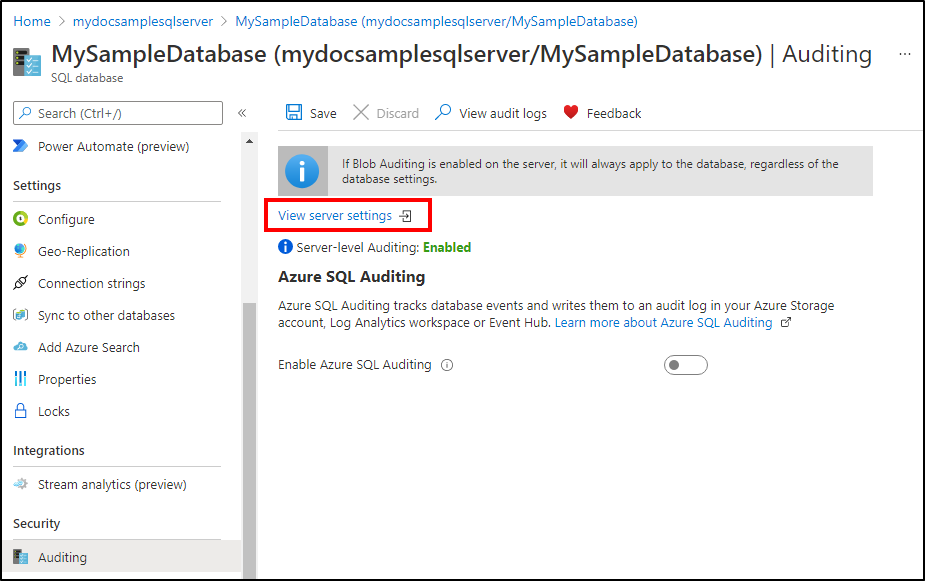

4. If you prefer to enable auditing on the database level, switch **Auditing** to **ON**. If server auditing is enabled, the database-configured audit will exist side-by-side with the server audit.

5. You have multiple options for configuring where audit logs will be written. You can write logs to an Azure storage account, to a Log Analytics workspace for consumption by Azure Monitor logs (preview), or to event hub for consumption using event hub (preview). You can configure any combination of these options, and audit logs will be written to each.
  
   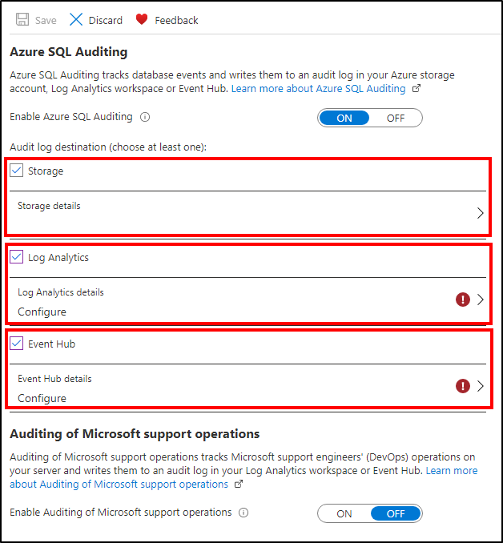

### Audit to storage destination

To configure writing audit logs to a storage account, select **Storage** and open **Storage details**. Select the Azure storage account where logs will be saved, and then select the retention period. Then click **OK**. Logs older than the retention period are deleted.

- The default value for retention period is 0 (unlimited retention). You can change this value by moving the **Retention (Days)** slider in **Storage settings** when configuring the storage account for auditing.
  - If you change retention period from 0 (unlimited retention) to any other value, please note that retention will only apply to logs written after retention value was changed (logs written during the period when retention was set to unlimited are preserved, even after retention is enabled).

  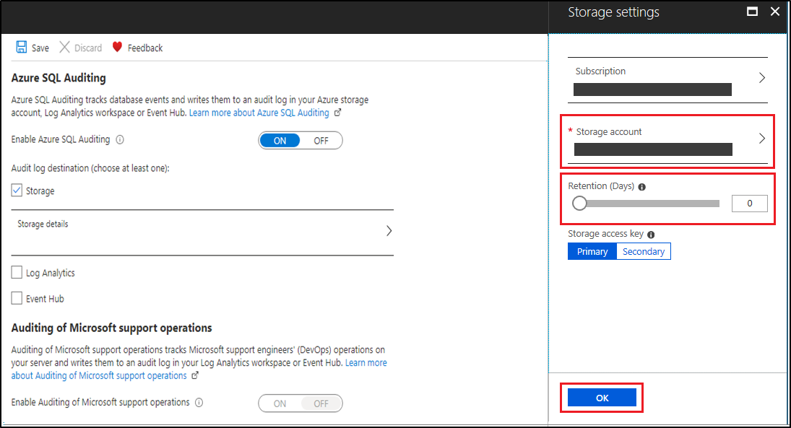

#### Remarks

- Audit logs are written to **Append Blobs** in an Azure Blob storage on your Azure subscription
- To configure an immutable log store for the server or database-level audit events, follow the [instructions provided by Azure Storage](https://docs.microsoft.com/azure/storage/blobs/storage-blob-immutability-policies-manage#enabling-allow-protected-append-blobs-writes). Make sure you have selected **Allow additional appends** when you configure the immutable blob storage.
- You can write audit logs to a an Azure Storage account behind a VNet or firewall. For specific instructions see, [Write audit to a storage account behind VNet and firewall](audit-write-storage-account-behind-vnet-firewall.md).
- After you've configured your auditing settings, you can turn on the new threat detection feature and configure emails to receive security alerts. When you use threat detection, you receive proactive alerts on anomalous database activities that can indicate potential security threats. For more information, see [Getting started with threat detection](threat-detection-overview.md).
- For details about the log format, hierarchy of the storage folder and naming conventions, see the [Blob Audit Log Format Reference](https://go.microsoft.com/fwlink/?linkid=829599).
- When using AAD Authentication, failed logins records will *not* appear in the SQL audit log. To view failed login audit records, you need to visit the [Azure Active Directory portal](../../active-directory/reports-monitoring/reference-sign-ins-error-codes.md), which logs details of these events.
- Auditing on [Read-Only Replicas](read-scale-out.md) is automatically enabled. For further details about the hierarchy of the storage folders, naming conventions, and log format, see the [SQL Database Audit Log Format](audit-log-format.md).

### Audit to Log Analytics destination
  
To configure writing audit logs to a Log Analytics workspace, select **Log Analytics (Preview)** and open **Log Analytics details**. Select or create the Log Analytics workspace where logs will be written and then click **OK**.

   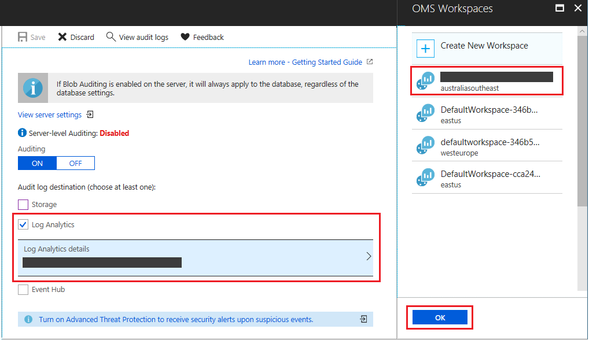

### Audit to Event Hub destination

> [!WARNING]
> Enabling auditing on a server that has a SQL Database pool on it **results in the SQL Database pool being resumed and re-paused again** which may incur billing charges.
> Enabling auditing on a paused SQL Database pool is not possible. To enable it, un-pause the SQL Database pool.

To configure writing audit logs to an event hub, select **Event Hub (Preview)** and open **Event Hub details**. Select the event hub where logs will be written and then click **OK**. Be sure that the event hub is in the same region as your database and server.

   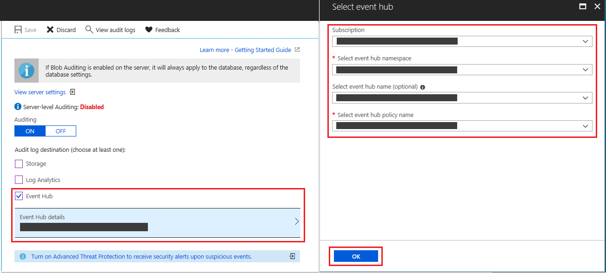

## Analyze audit logs and reports

If you chose to write audit logs to Azure Monitor logs:

- Use the [Azure portal](https://portal.azure.com). Open the relevant database. At the top of the database's **Auditing** page, select **View audit logs**.

    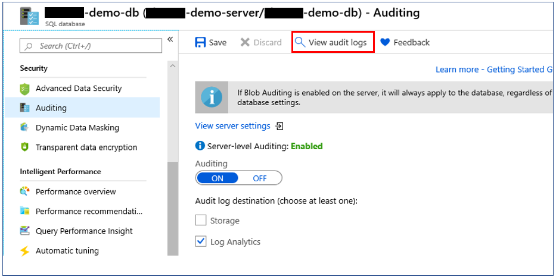

- Then, you have two ways to view the logs:

    Clicking on **Log Analytics** at the top of the **Audit records** page will open the Logs view in Log Analytics workspace, where you can customize the time range and the search query.

    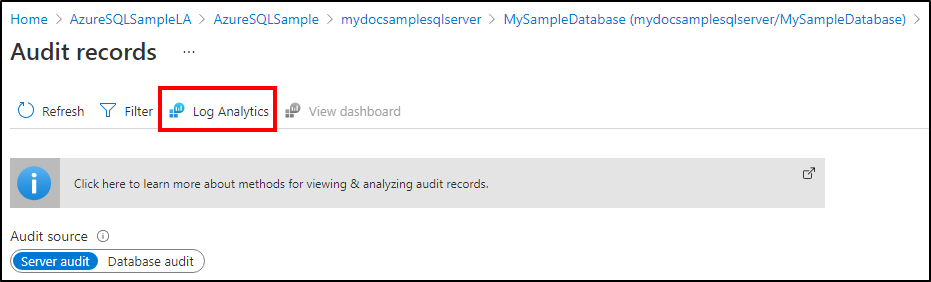

    Clicking **View dashboard** at the top of the **Audit records** page will open a dashboard displaying audit logs info, where you can drill down into Security Insights, Access to Sensitive Data and more. This dashboard is designed to help you gain security insights for your data.
    You can also customize the time range and search query.
    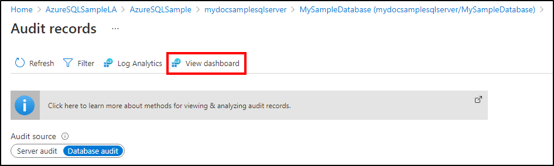

    

    

- Alternatively, you can also access the audit logs from Log Analytics blade. Open your Log Analytics workspace and under **General** section, click **Logs**. You can start with a simple query, such as: *search "SQLSecurityAuditEvents"* to view the audit logs.
    From here, you can also use [Azure Monitor logs](../../azure-monitor/log-query/log-query-overview.md)  to run advanced searches on your audit log data. Azure Monitor logs gives you real-time operational insights using integrated search and custom dashboards to readily analyze millions of records across all your workloads and servers. For additional useful information about Azure Monitor logs search language and commands, see [Azure Monitor logs search reference](../../azure-monitor/log-query/log-query-overview.md).

If you chose to write audit logs to Event Hub:

- To consume audit logs data from Event Hub, you will need to set up a stream to consume events and write them to a target. For more information, see [Azure Event Hubs Documentation](../index.yml).
- Audit logs in Event Hub are captured in the body of [Apache Avro](https://avro.apache.org/) events and stored using JSON formatting with UTF-8 encoding. To read the audit logs, you can use [Avro Tools](../../event-hubs/event-hubs-capture-overview.md#use-avro-tools) or similar tools that process this format.

If you chose to write audit logs to an Azure storage account, there are several methods you can use to view the logs:

- Audit logs are aggregated in the account you chose during setup. You can explore audit logs by using a tool such as [Azure Storage Explorer](https://storageexplorer.com/). In Azure storage, auditing logs are saved as a collection of blob files within a container named **sqldbauditlogs**. For further details about the hierarchy of the storage folders, naming conventions, and log format, see the [SQL Database Audit Log Format](https://go.microsoft.com/fwlink/?linkid=829599).

- Use the [Azure portal](https://portal.azure.com).  Open the relevant database. At the top of the database's **Auditing** page, click **View audit logs**.

    

    **Audit records** opens, from which you'll be able to view the logs.

  - You can view specific dates by clicking **Filter** at the top of the **Audit records** page.
  - You can switch between audit records that were created by the *server audit policy* and the *database audit policy* by toggling **Audit Source**.
  - You can view only SQL injection related audit records by checking  **Show only audit records for SQL injections** checkbox.

       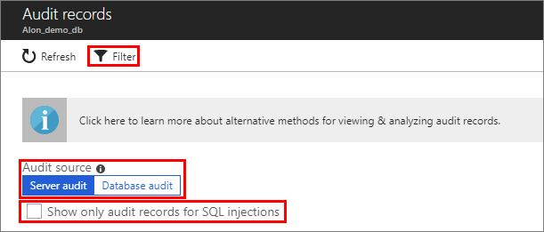

- Use the system function **sys.fn_get_audit_file** (T-SQL) to return the audit log data in tabular format. For more information on using this function, see [sys.fn_get_audit_file](/sql/relational-databases/system-functions/sys-fn-get-audit-file-transact-sql).

- Use **Merge Audit Files** in SQL Server Management Studio (starting with SSMS 17):
    1. From the SSMS menu, select **File** > **Open** > **Merge Audit Files**.

        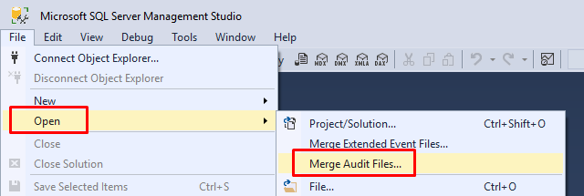
    2. The **Add Audit Files** dialog box opens. Select one of the **Add** options to choose whether to merge audit files from a local disk or import them from Azure Storage. You are required to provide your Azure Storage details and account key.

    3. After all files to merge have been added, click **OK** to complete the merge operation.

    4. The merged file opens in SSMS, where you can view and analyze it, as well as export it to an XEL or CSV file, or to a table.

- Use Power BI. You can view and analyze audit log data in Power BI. For more information and to access a downloadable template, see [Analyze audit log data in Power BI](https://techcommunity.microsoft.com/t5/azure-database-support-blog/sql-azure-blob-auditing-basic-power-bi-dashboard/ba-p/368895).
- Download log files from your Azure Storage blob container via the portal or by using a tool such as [Azure Storage Explorer](https://storageexplorer.com/).
  - After you have downloaded a log file locally, double-click the file to open, view, and analyze the logs in SSMS.
  - You can also download multiple files simultaneously via Azure Storage Explorer. To do so, right-click a specific subfolder and select **Save as** to save in a local folder.

- Additional methods:

  - After downloading several files or a subfolder that contains log files, you can merge them locally as described in the SSMS Merge Audit Files instructions described previously.
  - View blob auditing logs programmatically:

    - [Query Extended Events Files](https://sqlscope.wordpress.com/2014/11/15/reading-extended-event-files-using-client-side-tools-only/) by using PowerShell.

## Production practices

### Auditing geo-replicated databases

With geo-replicated databases, when you enable auditing on the primary database the secondary database will have an identical auditing policy. It is also possible to set up auditing on the secondary database by enabling auditing on the **secondary server**, independently from the primary database.

- Server-level (**recommended**): Turn on auditing on both the **primary server** as well as the **secondary server** - the primary and secondary databases will each be audited independently based on their respective server-level policy.
- Database-level: Database-level auditing for secondary databases can only be configured from Primary database auditing settings.
  - Auditing must be enabled on the *primary database itself*, not the server.
  - After auditing is enabled on the primary database, it will also become enabled on the secondary database.

    > [!IMPORTANT]
    > With database-level auditing, the storage settings for the secondary database will be identical to those of the primary database, causing cross-regional traffic. We recommend that you enable only server-level auditing, and leave the database-level auditing disabled for all databases.

### Storage key regeneration

In production, you are likely to refresh your storage keys periodically. When writing audit logs to Azure storage, you need to resave your auditing policy when refreshing your keys. The process is as follows:

1. Open **Storage Details**. In the **Storage Access Key** box, select **Secondary**, and click **OK**. Then click **Save** at the top of the auditing configuration page.

    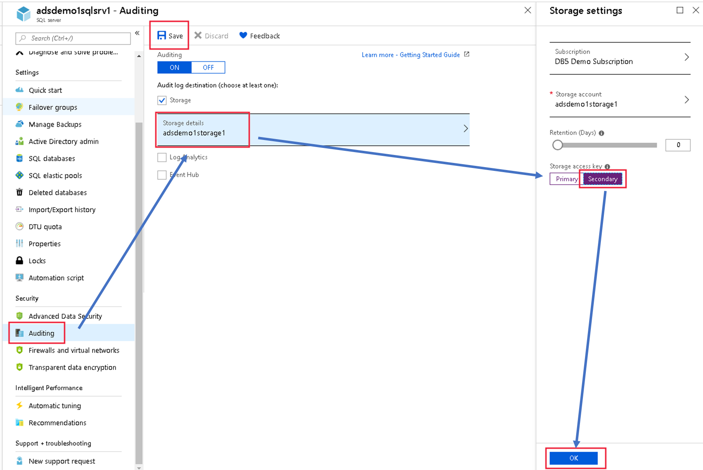
2. Go to the storage configuration page and regenerate the primary access key.

    
3. Go back to the auditing configuration page, switch the storage access key from secondary to primary, and then click **OK**. Then click **Save** at the top of the auditing configuration page.
4. Go back to the storage configuration page and regenerate the secondary access key (in preparation for the next key's refresh cycle).

## Manage Azure SQL Database auditing

### Using Azure PowerShell

**PowerShell cmdlets (including WHERE clause support for additional filtering)**:

- [Create or Update Database Auditing Policy (Set-AzSqlDatabaseAudit)](/powershell/module/az.sql/set-azsqldatabaseaudit)
- [Create or Update Server Auditing Policy (Set-AzSqlServerAudit)](/powershell/module/az.sql/set-azsqlserveraudit)
- [Get Database Auditing Policy (Get-AzSqlDatabaseAudit)](/powershell/module/az.sql/get-azsqldatabaseaudit)
- [Get Server Auditing Policy (Get-AzSqlServerAudit)](/powershell/module/az.sql/get-azsqlserveraudit)
- [Remove Database Auditing Policy (Remove-AzSqlDatabaseAudit)](/powershell/module/az.sql/remove-azsqldatabaseaudit)
- [Remove Server Auditing Policy (Remove-AzSqlServerAudit)](/powershell/module/az.sql/remove-azsqlserveraudit)

For a script example, see [Configure auditing and threat detection using PowerShell](scripts/auditing-threat-detection-powershell-configure.md).

### Using REST API

**REST API**:

- [Create or Update Database Auditing Policy](/rest/api/sql/database%20auditing%20settings/createorupdate)
- [Create or Update Server Auditing Policy](/rest/api/sql/server%20auditing%20settings/createorupdate)
- [Get Database Auditing Policy](/rest/api/sql/database%20auditing%20settings/get)
- [Get Server Auditing Policy](/rest/api/sql/server%20auditing%20settings/get)

Extended policy with WHERE clause support for additional filtering:

- [Create or Update Database *Extended* Auditing Policy](/rest/api/sql/database%20extended%20auditing%20settings/createorupdate)
- [Create or Update Server *Extended* Auditing Policy](/rest/api/sql/server%20auditing%20settings/createorupdate)
- [Get Database *Extended* Auditing Policy](/rest/api/sql/database%20extended%20auditing%20settings/get)
- [Get Server *Extended* Auditing Policy](/rest/api/sql/server%20auditing%20settings/get)

### Using Azure Resource Manager templates

You can manage Azure SQL Database auditing using [Azure Resource Manager](../../azure-resource-manager/management/overview.md) templates, as shown in these examples:

- [Deploy an Azure SQL Database with Auditing enabled to write audit logs to Azure Blob storage account](https://github.com/Azure/azure-quickstart-templates/tree/master/201-sql-auditing-server-policy-to-blob-storage)
- [Deploy an Azure SQL Database with Auditing enabled to write audit logs to Log Analytics](https://github.com/Azure/azure-quickstart-templates/tree/master/201-sql-auditing-server-policy-to-oms)
- [Deploy an Azure SQL Database with Auditing enabled to write audit logs to Event Hubs](https://github.com/Azure/azure-quickstart-templates/tree/master/201-sql-auditing-server-policy-to-eventhub)

> [!NOTE]
> The linked samples are on an external public repository and are provided 'as is', without warranty, and are not supported under any Microsoft support program/service.
