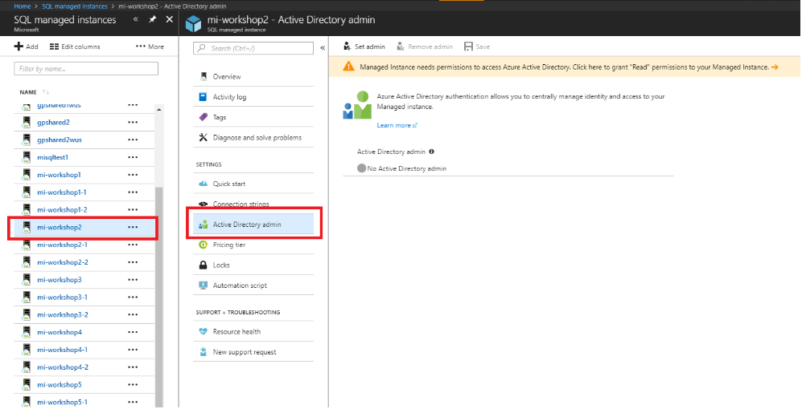
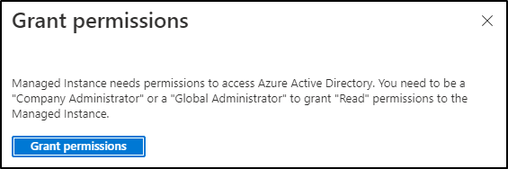
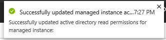
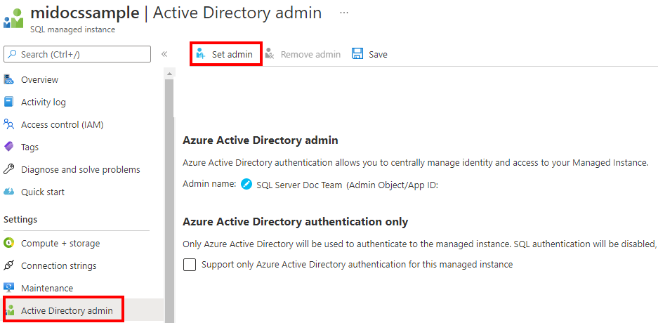
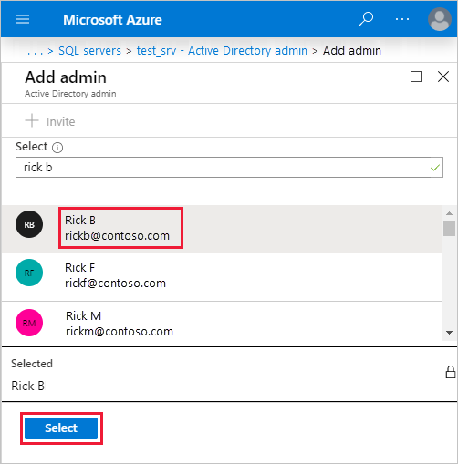
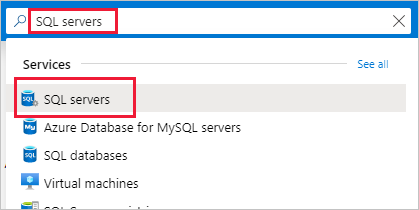
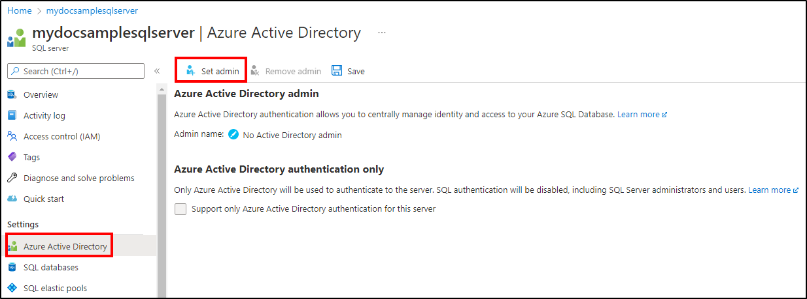
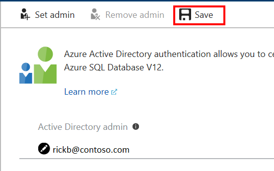

# Configure and manage Azure AD authentication with Azure SQL

[!INCLUDE[appliesto-sqldb-sqlmi-asa](../includes/appliesto-sqldb-sqlmi-asa.md)]

This article shows you how to create and populate an Azure Active Directory (Azure AD) instance, and then use Azure AD with [Azure SQL Database](sql-database-paas-overview.md), [Azure SQL Managed Instance](../managed-instance/sql-managed-instance-paas-overview.md), and [Azure Synapse Analytics](../../synapse-analytics/sql-data-warehouse/sql-data-warehouse-overview-what-is.md). For an overview, see [Azure Active Directory authentication](authentication-aad-overview.md).

## Azure AD authentication methods

Azure AD authentication supports the following authentication methods:

- Azure AD cloud-only identities
- Azure AD hybrid identities that support:
  - Cloud authentication with two options coupled with seamless single sign-on (SSO)
    - Azure AD password hash authentication
    - Azure AD pass-through authentication
  - Federated authentication

For more information on Azure AD authentication methods, and which one to choose, see [Choose the right authentication method for your Azure Active Directory hybrid identity solution](../../active-directory/hybrid/choose-ad-authn.md).

For more information on Azure AD hybrid identities, setup, and synchronization, see:

- Password hash authentication - [Implement password hash synchronization with Azure AD Connect sync](../../active-directory/hybrid/how-to-connect-password-hash-synchronization.md)
- Pass-through authentication - [Azure Active Directory Pass-through Authentication](../../active-directory/hybrid/how-to-connect-pta-quick-start.md)
- Federated authentication - [Deploying Active Directory Federation Services in Azure](/windows-server/identity/ad-fs/deployment/how-to-connect-fed-azure-adfs) and [Azure AD Connect and federation](../../active-directory/hybrid/how-to-connect-fed-whatis.md)

## Create and populate an Azure AD instance

Create an Azure AD instance and populate it with users and groups. Azure AD can be the initial Azure AD managed domain. Azure AD can also be an on-premises Active Directory Domain Services that is federated with the Azure AD.

For more information, see [Integrating your on-premises identities with Azure Active Directory](../../active-directory/hybrid/whatis-hybrid-identity.md), [Add your own domain name to Azure AD](../../active-directory/fundamentals/add-custom-domain.md), [Microsoft Azure now supports federation with Windows Server Active Directory](https://azure.microsoft.com/blog/20../../windows-azure-now-supports-federation-with-windows-server-active-directory/), [Administering your Azure AD directory](../../active-directory/fundamentals/active-directory-whatis.md), [Manage Azure AD using Windows PowerShell](/powershell/azure/), and [Hybrid Identity Required Ports and Protocols](../../active-directory/hybrid/reference-connect-ports.md).

## Associate or add an Azure subscription to Azure Active Directory

1. Associate your Azure subscription to Azure Active Directory by making the directory a trusted directory for the Azure subscription hosting the database. For details, see [Associate or add an Azure subscription to your Azure Active Directory tenant](../../active-directory/fundamentals/active-directory-how-subscriptions-associated-directory.md).

2. Use the directory switcher in the Azure portal to switch to the subscription associated with domain.

   > [!IMPORTANT]
   > Every Azure subscription has a trust relationship with an Azure AD instance. This means that it trusts that directory to authenticate users, services, and devices. Multiple subscriptions can trust the same directory, but a subscription trusts only one directory. This trust relationship that a subscription has with a directory is unlike the relationship that a subscription has with all other resources in Azure (websites, databases, and so on), which are more like child resources of a subscription. If a subscription expires, then access to those other resources associated with the subscription also stops. But the directory remains in Azure, and you can associate another subscription with that directory and continue to manage the directory users. For more information about resources, see [Understanding resource access in Azure](../../active-directory/external-identities/add-users-administrator.md). To learn more about this trusted relationship see [How to associate or add an Azure subscription to Azure Active Directory](../../active-directory/fundamentals/active-directory-how-subscriptions-associated-directory.md).

## Azure AD admin with a server in SQL Database

Each [server](logical-servers.md) in Azure (which hosts SQL Database or Azure Synapse) starts with a single server administrator account that is the administrator of the entire server. Create a second administrator account as an Azure AD account. This principal is created as a contained database user in the master database of the server. Administrator accounts are members of the **db_owner** role in every user database, and enter each user database as the **dbo** user. For more information about administrator accounts, see [Managing Databases and Logins](logins-create-manage.md).

When using Azure Active Directory with geo-replication, the Azure Active Directory administrator must be configured for both the primary and the secondary servers. If a server does not have an Azure Active Directory administrator, then Azure Active Directory logins and users receive a `Cannot connect` to server error.

> [!NOTE]
> Users that are not based on an Azure AD account (including the server administrator account) cannot create Azure AD-based users, because they do not have permission to validate proposed database users with the Azure AD.

## Provision Azure AD admin (SQL Managed Instance)

> [!IMPORTANT]
> Only follow these steps if you are provisioning an Azure SQL Managed Instance. This operation can only be executed by Global Administrator or a Privileged Role Administrator in Azure AD.
>
> In **public preview**, you can assign the **Directory Readers** role to a group in Azure AD. The group owners can then add the managed instance identity as a member of this group, which would allow you to provision an Azure AD admin for the SQL Managed Instance. For more information on this feature, see [Directory Readers role in Azure Active Directory for Azure SQL](authentication-aad-directory-readers-role.md).

Your SQL Managed Instance needs permissions to read Azure AD to successfully accomplish tasks such as authentication of users through security group membership or creation of new users. For this to work, you need to grant the SQL Managed Instance permission to read Azure AD. You can do this using the Azure portal or PowerShell.

### Azure portal

To grant your SQL Managed Instance Azure AD read permission using the Azure portal, log in as Global Administrator in Azure AD and follow these steps:

1. In the [Azure portal](https://portal.azure.com), in the upper-right corner, select your connection from a drop-down list of possible Active Directories.

2. Choose the correct Active Directory as the default Azure AD.

   This step links the subscription associated with Active Directory to the SQL Managed Instance, making sure that the same subscription is used for both the Azure AD instance and the SQL Managed Instance.

3. Navigate to the SQL Managed Instance you want to use for Azure AD integration.

   

4. Select the banner on top of the Active Directory admin page and grant permission to the current user.

    

5. After the operation succeeds, the following notification will show up in the top-right corner:

    

6. Now you can choose your Azure AD admin for your SQL Managed Instance. For that, on the Active Directory admin page, select **Set admin** command.

    

7. On the Azure AD admin page, search for a user, select the user or group to be an administrator, and then select **Select**.

   The Active Directory admin page shows all members and groups of your Active Directory. Users or groups that are grayed out can't be selected because they aren't supported as Azure AD administrators. See the list of supported admins in [Azure AD Features and Limitations](authentication-aad-overview.md#azure-ad-features-and-limitations). Azure role-based access control (Azure RBAC) applies only to the Azure portal and isn't propagated to SQL Database, SQL Managed Instance, or Azure Synapse.

    

8. At the top of the Active Directory admin page, select **Save**.

    

    The process of changing the administrator may take several minutes. Then the new administrator appears in the Active Directory admin box.

After provisioning an Azure AD admin for your SQL Managed Instance, you can begin to create Azure AD server principals (logins) with the [CREATE LOGIN](/sql/t-sql/statements/create-login-transact-sql?view=azuresqldb-mi-current&preserve-view=true) syntax. For more information, see [SQL Managed Instance overview](../managed-instance/sql-managed-instance-paas-overview.md#azure-active-directory-integration).

> [!TIP]
> To later remove an Admin, at the top of the Active Directory admin page, select **Remove admin**, and then select **Save**.

### PowerShell

To grant your SQL Managed Instance Azure AD read permission by using the PowerShell, run this script:

```powershell
# Gives Azure Active Directory read permission to a Service Principal representing the SQL Managed Instance.
# Can be executed only by a "Global Administrator" or "Privileged Role Administrator" type of user.

$aadTenant = "<YourTenantId>" # Enter your tenant ID
$managedInstanceName = "MyManagedInstance"

# Get Azure AD role "Directory Users" and create if it doesn't exist
$roleName = "Directory Readers"
$role = Get-AzureADDirectoryRole | Where-Object {$_.displayName -eq $roleName}
if ($role -eq $null) {
    # Instantiate an instance of the role template
    $roleTemplate = Get-AzureADDirectoryRoleTemplate | Where-Object {$_.displayName -eq $roleName}
    Enable-AzureADDirectoryRole -RoleTemplateId $roleTemplate.ObjectId
    $role = Get-AzureADDirectoryRole | Where-Object {$_.displayName -eq $roleName}
}

# Get service principal for your SQL Managed Instance
$roleMember = Get-AzureADServicePrincipal -SearchString $managedInstanceName
$roleMember.Count
if ($roleMember -eq $null) {
    Write-Output "Error: No Service Principals with name '$    ($managedInstanceName)', make sure that managedInstanceName parameter was     entered correctly."
    exit
}
if (-not ($roleMember.Count -eq 1)) {
    Write-Output "Error: More than one service principal with name pattern '$    ($managedInstanceName)'"
    Write-Output "Dumping selected service principals...."
    $roleMember
    exit
}

# Check if service principal is already member of readers role
$allDirReaders = Get-AzureADDirectoryRoleMember -ObjectId $role.ObjectId
$selDirReader = $allDirReaders | where{$_.ObjectId -match     $roleMember.ObjectId}

if ($selDirReader -eq $null) {
    # Add principal to readers role
    Write-Output "Adding service principal '$($managedInstanceName)' to     'Directory Readers' role'..."
    Add-AzureADDirectoryRoleMember -ObjectId $role.ObjectId -RefObjectId     $roleMember.ObjectId
    Write-Output "'$($managedInstanceName)' service principal added to     'Directory Readers' role'..."

    #Write-Output "Dumping service principal '$($managedInstanceName)':"
    #$allDirReaders = Get-AzureADDirectoryRoleMember -ObjectId $role.ObjectId
    #$allDirReaders | where{$_.ObjectId -match $roleMember.ObjectId}
}
else {
    Write-Output "Service principal '$($managedInstanceName)' is already     member of 'Directory Readers' role'."
}
```

### PowerShell for SQL Managed Instance

# [PowerShell](#tab/azure-powershell)

To run PowerShell cmdlets, you need to have Azure PowerShell installed and running. For detailed information, see [How to install and configure Azure PowerShell](/powershell/azure/).

> [!IMPORTANT]
> The PowerShell Azure Resource Manager (RM) module is still supported by Azure SQL Managed Instance, but all future development is for the Az.Sql module. The AzureRM module will continue to receive bug fixes until at least December 2020.  The arguments for the commands in the Az module and in the AzureRm modules are substantially identical. For more about their compatibility, see [Introducing the new Azure PowerShell Az module](/powershell/azure/new-azureps-module-az).

To provision an Azure AD admin, execute the following Azure PowerShell commands:

- Connect-AzAccount
- Select-AzSubscription

The cmdlets used to provision and manage Azure AD admin for your SQL Managed Instance are listed in the following table:

| Cmdlet name | Description |
| --- | --- |
| [Set-AzSqlInstanceActiveDirectoryAdministrator](/powershell/module/az.sql/set-azsqlinstanceactivedirectoryadministrator) |Provisions an Azure AD administrator for the SQL Managed Instance in the current subscription. (Must be from the current subscription)|
| [Remove-AzSqlInstanceActiveDirectoryAdministrator](/powershell/module/az.sql/remove-azsqlinstanceactivedirectoryadministrator) |Removes an Azure AD administrator for the SQL Managed Instance in the current subscription. |
| [Get-AzSqlInstanceActiveDirectoryAdministrator](/powershell/module/az.sql/get-azsqlinstanceactivedirectoryadministrator) |Returns information about an Azure AD administrator for the SQL Managed Instance in the current subscription.|

The following command gets information about an Azure AD administrator for a SQL Managed Instance named ManagedInstance01 that is associated with a resource group named ResourceGroup01.

```powershell
Get-AzSqlInstanceActiveDirectoryAdministrator -ResourceGroupName "ResourceGroup01" -InstanceName "ManagedInstance01"
```

The following command provisions an Azure AD administrator group named DBAs for the SQL Managed Instance named ManagedInstance01. This server is associated with resource group ResourceGroup01.

```powershell
Set-AzSqlInstanceActiveDirectoryAdministrator -ResourceGroupName "ResourceGroup01" -InstanceName "ManagedInstance01" -DisplayName "DBAs" -ObjectId "40b79501-b343-44ed-9ce7-da4c8cc7353b"
```

The following command removes the Azure AD administrator for the SQL Managed Instance named ManagedInstanceName01 associated with the resource group ResourceGroup01.

```powershell
Remove-AzSqlInstanceActiveDirectoryAdministrator -ResourceGroupName "ResourceGroup01" -InstanceName "ManagedInstanceName01" -Confirm -PassThru
```

# [Azure CLI](#tab/azure-cli)

You can also provision an Azure AD admin for the SQL Managed Instance by calling the following CLI commands:

| Command | Description |
| --- | --- |
|[az sql mi ad-admin create](/cli/azure/sql/mi/ad-admin#az_sql_mi_ad_admin_create) | Provisions an Azure Active Directory administrator for the SQL Managed Instance (must be from the current subscription). |
|[az sql mi ad-admin delete](/cli/azure/sql/mi/ad-admin#az_sql_mi_ad_admin_delete) | Removes an Azure Active Directory administrator for the SQL Managed Instance. |
|[az sql mi ad-admin list](/cli/azure/sql/mi/ad-admin#az_sql_mi_ad_admin_list) | Returns information about an Azure Active Directory administrator currently configured for the SQL Managed Instance. |
|[az sql mi ad-admin update](/cli/azure/sql/mi/ad-admin#az_sql_mi_ad_admin_update) | Updates the Active Directory administrator for the SQL Managed Instance. |

For more information about CLI commands, see [az sql mi](/cli/azure/sql/mi).

* * *

## Provision Azure AD admin (SQL Database)

> [!IMPORTANT]
> Only follow these steps if you are provisioning a [server](logical-servers.md) for SQL Database or Azure Synapse.

The following two procedures show you how to provision an Azure Active Directory administrator for your server in the Azure portal and by using PowerShell.

### Azure portal

1. In the [Azure portal](https://portal.azure.com/), in the upper-right corner, select your connection to drop down a list of possible Active Directories. Choose the correct Active Directory as the default Azure AD. This step links the subscription-associated Active Directory with server making sure that the same subscription is used for both Azure AD and the server.

2. Search for and select **SQL server**.

    

    >[!NOTE]
    > On this page, before you select **SQL servers**, you can select the **star** next to the name to *favorite* the category and add **SQL servers** to the left navigation bar.

3. On the **SQL Server** page, select **Active Directory admin**.

4. In the **Active Directory admin** page, select **Set admin**.

      

5. In the **Add admin** page, search for a user, select the user or group to be an administrator, and then select **Select**. (The Active Directory admin page shows all members and groups of your Active Directory. Users or groups that are grayed out cannot be selected because they are not supported as Azure AD administrators. (See the list of supported admins in the **Azure AD Features and Limitations** section of [Use Azure Active Directory Authentication for authentication with SQL Database or Azure Synapse](authentication-aad-overview.md).) Azure role-based access control (Azure RBAC) applies only to the portal and is not propagated to SQL Server.

      

6. At the top of the **Active Directory admin** page, select **Save**.

    

The process of changing the administrator may take several minutes. Then the new administrator appears in the **Active Directory admin** box.

   > [!NOTE]
   > When setting up the Azure AD admin, the new admin name (user or group) cannot already be present in the virtual master database as a server authentication user. If present, the Azure AD admin setup will fail; rolling back its creation and indicating that such an admin (name) already exists. Since such a server authentication user is not part of the Azure AD, any effort to connect to the server using Azure AD authentication fails.

To later remove an Admin, at the top of the **Active Directory admin** page, select **Remove admin**, and then select **Save**.

### PowerShell for SQL Database and Azure Synapse

# [PowerShell](#tab/azure-powershell)

To run PowerShell cmdlets, you need to have Azure PowerShell installed and running. For detailed information, see [How to install and configure Azure PowerShell](/powershell/azure/). To provision an Azure AD admin, execute the following Azure PowerShell commands:

- Connect-AzAccount
- Select-AzSubscription

Cmdlets used to provision and manage Azure AD admin for SQL Database and Azure Synapse:

| Cmdlet name | Description |
| --- | --- |
| [Set-AzSqlServerActiveDirectoryAdministrator](/powershell/module/az.sql/set-azsqlserveractivedirectoryadministrator) |Provisions an Azure Active Directory administrator for the server hosting SQL Database or Azure Synapse. (Must be from the current subscription) |
| [Remove-AzSqlServerActiveDirectoryAdministrator](/powershell/module/az.sql/remove-azsqlserveractivedirectoryadministrator) |Removes an Azure Active Directory administrator for the server hosting SQL Database or Azure Synapse.|
| [Get-AzSqlServerActiveDirectoryAdministrator](/powershell/module/az.sql/get-azsqlserveractivedirectoryadministrator) |Returns information about an Azure Active Directory administrator currently configured for the server hosting SQL Database or Azure Synapse. |

Use PowerShell command get-help to see more information for each of these commands. For example, `get-help Set-AzSqlServerActiveDirectoryAdministrator`.

The following script provisions an Azure AD administrator group named **DBA_Group** (object ID `40b79501-b343-44ed-9ce7-da4c8cc7353f`) for the **demo_server** server in a resource group named **Group-23**:

```powershell
Set-AzSqlServerActiveDirectoryAdministrator -ResourceGroupName "Group-23" -ServerName "demo_server" -DisplayName "DBA_Group"
```

The **DisplayName** input parameter accepts either the Azure AD display name or the User Principal Name. For example, ``DisplayName="John Smith"`` and ``DisplayName="johns@contoso.com"``. For Azure AD groups only the Azure AD display name is supported.

> [!NOTE]
> The Azure PowerShell  command ```Set-AzSqlServerActiveDirectoryAdministrator``` does not prevent you from provisioning Azure AD admins for unsupported users. An unsupported user can be provisioned, but can not connect to a database.

The following example uses the optional **ObjectID**:

```powershell
Set-AzSqlServerActiveDirectoryAdministrator -ResourceGroupName "Group-23" -ServerName "demo_server" `
    -DisplayName "DBA_Group" -ObjectId "40b79501-b343-44ed-9ce7-da4c8cc7353f"
```

> [!NOTE]
> The Azure AD **ObjectID** is required when the **DisplayName** is not unique. To retrieve the **ObjectID** and **DisplayName** values, use the Active Directory section of Azure Classic Portal, and view the properties of a user or group.

The following example returns information about the current Azure AD admin for the server:

```powershell
Get-AzSqlServerActiveDirectoryAdministrator -ResourceGroupName "Group-23" -ServerName "demo_server" | Format-List
```

The following example removes an Azure AD administrator:

```powershell
Remove-AzSqlServerActiveDirectoryAdministrator -ResourceGroupName "Group-23" -ServerName "demo_server"
```

# [Azure CLI](#tab/azure-cli)

You can provision an Azure AD admin by calling the following CLI commands:

| Command | Description |
| --- | --- |
|[az sql server ad-admin create](/cli/azure/sql/server/ad-admin#az_sql_server_ad_admin_create) | Provisions an Azure Active Directory administrator for the server hosting SQL Database or Azure Synapse. (Must be from the current subscription) |
|[az sql server ad-admin delete](/cli/azure/sql/server/ad-admin#az_sql_server_ad_admin_delete) | Removes an Azure Active Directory administrator for the server hosting SQL Database or Azure Synapse. |
|[az sql server ad-admin list](/cli/azure/sql/server/ad-admin#az_sql_server_ad_admin_list) | Returns information about an Azure Active Directory administrator currently configured for the server hosting SQL Database or Azure Synapse. |
|[az sql server ad-admin update](/cli/azure/sql/server/ad-admin#az_sql_server_ad_admin_update) | Updates the Active Directory administrator for the server hosting SQL Database or Azure Synapse. |

For more information about CLI commands, see [az sql server](/cli/azure/sql/server).

* * *

> [!NOTE]
> You can also provision an Azure Active Directory Administrator by using the REST APIs. For more information, see [Service Management REST API Reference and Operations for Azure SQL Database Operations for Azure SQL Database](/rest/api/sql/)

## Configure your client computers

On all client machines, from which your applications or users connect to SQL Database or Azure Synapse using Azure AD identities, you must install the following software:

- .NET Framework 4.6 or later from [https://msdn.microsoft.com/library/5a4x27ek.aspx](/dotnet/framework/install/guide-for-developers).
- Azure Active Directory Authentication Library for SQL Server (*ADAL.DLL*). Below are the download links to install the latest SSMS, ODBC, and OLE DB driver that contains the *ADAL.DLL* library.
  - [SQL Server Management Studio](/sql/ssms/download-sql-server-management-studio-ssms)
  - [ODBC Driver 17 for SQL Server](/sql/connect/odbc/download-odbc-driver-for-sql-server?view=sql-server-ver15&preserve-view=true)
  - [OLE DB Driver 18 for SQL Server](/sql/connect/oledb/download-oledb-driver-for-sql-server?view=sql-server-ver15&preserve-view=true)

You can meet these requirements by:

- Installing the latest version of [SQL Server Management Studio](/sql/ssms/download-sql-server-management-studio-ssms) or [SQL Server Data Tools](/sql/ssdt/download-sql-server-data-tools-ssdt) meets the .NET Framework 4.6 requirement.
  - SSMS installs the x86 version of *ADAL.DLL*.
  - SSDT installs the amd64 version of *ADAL.DLL*.
  - The latest Visual Studio from [Visual Studio Downloads](https://www.visualstudio.com/downloads/download-visual-studio-vs) meets the .NET Framework 4.6 requirement, but does not install the required amd64 version of *ADAL.DLL*.

## Create contained users mapped to Azure AD identities

Because SQL Managed Instance supports Azure AD server principals (logins), using contained database users is not required. Azure AD server principals (logins) enable you to create logins from Azure AD users, groups, or applications. This means that you can authenticate with your SQL Managed Instance by using the Azure AD server login rather than a contained database user. For more information, see [SQL Managed Instance overview](../managed-instance/sql-managed-instance-paas-overview.md#azure-active-directory-integration). For syntax on creating Azure AD server principals (logins), see [CREATE LOGIN](/sql/t-sql/statements/create-login-transact-sql?view=azuresqldb-mi-current&preserve-view=true).

However, using Azure Active Directory authentication with SQL Database and Azure Synapse requires using contained database users based on an Azure AD identity. A contained database user does not have a login in the master database, and maps to an identity in Azure AD that is associated with the database. The Azure AD identity can be either an individual user account or a group. For more information about contained database users, see [Contained Database Users- Making Your Database Portable](/sql/relational-databases/security/contained-database-users-making-your-database-portable).

> [!NOTE]
> Database users (with the exception of administrators) cannot be created using the Azure portal. Azure roles are not propagated to the database in SQL Database, the SQL Managed Instance, or Azure Synapse. Azure roles are used for managing Azure Resources, and do not apply to database permissions. For example, the **SQL Server Contributor** role does not grant access to connect to the database in SQL Database, the SQL Managed Instance, or Azure Synapse. The access permission must be granted directly in the database using Transact-SQL statements.

> [!WARNING]
> Special characters like  colon `:` or ampersand `&` when included as user names in the T-SQL `CREATE LOGIN` and `CREATE USER` statements are not supported.

To create an Azure AD-based contained database user (other than the server administrator that owns the database), connect to the database with an Azure AD identity, as a user with at least the **ALTER ANY USER** permission. Then use the following Transact-SQL syntax:

```sql
CREATE USER <Azure_AD_principal_name> FROM EXTERNAL PROVIDER;
```

*Azure_AD_principal_name* can be the user principal name of an Azure AD user or the display name for an Azure AD group.

**Examples:**
To create a contained database user representing an Azure AD federated or managed domain user:

```sql
CREATE USER [bob@contoso.com] FROM EXTERNAL PROVIDER;
CREATE USER [alice@fabrikam.onmicrosoft.com] FROM EXTERNAL PROVIDER;
```

To create a contained database user representing an Azure AD or federated domain group, provide the display name of a security group:

```sql
CREATE USER [ICU Nurses] FROM EXTERNAL PROVIDER;
```

To create a contained database user representing an application that connects using an Azure AD token:

```sql
CREATE USER [appName] FROM EXTERNAL PROVIDER;
```

> [!NOTE]
> This command requires that SQL access Azure AD (the "external provider") on behalf of the logged-in user. Sometimes, circumstances will arise that cause Azure AD to return an exception back to SQL. In these cases, the user will see SQL error 33134, which should contain the Azure AD-specific error message. Most of the time, the error will say that access is denied, or that the user must enroll in MFA to access the resource, or that access between first-party applications must be handled via preauthorization. In the first two cases, the issue is usually caused by Conditional Access policies that are set in the user's Azure AD tenant: they prevent the user from accessing the external provider. Updating the Conditional Access policies to allow access to the application '00000002-0000-0000-c000-000000000000' (the application ID of the Azure AD Graph API) should resolve the issue. In the case that the error says access between first-party applications must be handled via preauthorization, the issue is because the user is signed in as a service principal. The command should succeed if it is executed by a user instead.

> [!TIP]
> You cannot directly create a user from an Azure Active Directory other than the Azure Active Directory that is associated with your Azure subscription. However, members of other Active Directories that are imported users in the associated Active Directory (known as external users) can be added to an Active Directory group in the tenant Active Directory. By creating a contained database user for that AD group, the users from the external Active Directory can gain access to SQL Database.

For more information about creating contained database users based on Azure Active Directory identities, see [CREATE USER (Transact-SQL)](/sql/t-sql/statements/create-user-transact-sql).

> [!NOTE]
> Removing the Azure Active Directory administrator for the server prevents any Azure AD authentication user from connecting to the server. If necessary, unusable Azure AD users can be dropped manually by a SQL Database administrator.

> [!NOTE]
> If you receive a **Connection Timeout Expired**, you may need to set the `TransparentNetworkIPResolution`
parameter of the connection string to false. For more information, see [Connection timeout issue with .NET Framework 4.6.1 - TransparentNetworkIPResolution](/archive/blogs/dataaccesstechnologies/connection-timeout-issue-with-net-framework-4-6-1-transparentnetworkipresolution).

When you create a database user, that user receives the **CONNECT** permission and can connect to that database as a member of the **PUBLIC** role. Initially the only permissions available to the user are any permissions granted to the **PUBLIC** role, or any permissions granted to any Azure AD groups that they are a member of. Once you provision an Azure AD-based contained database user, you can grant the user additional permissions, the same way as you grant permission to any other type of user. Typically grant permissions to database roles, and add users to roles. For more information, see [Database Engine Permission Basics](https://social.technet.microsoft.com/wiki/contents/articles/4433.database-engine-permission-basics.aspx). For more information about special SQL Database roles, see [Managing Databases and Logins in Azure SQL Database](logins-create-manage.md).
A federated domain user account that is imported into a managed domain as an external user, must use the managed domain identity.

> [!NOTE]
> Azure AD users are marked in the database metadata with type E (EXTERNAL_USER) and for groups with type X (EXTERNAL_GROUPS). For more information, see [sys.database_principals](/sql/relational-databases/system-catalog-views/sys-database-principals-transact-sql).

## Connect to the database using SSMS or SSDT  

To confirm the Azure AD administrator is properly set up, connect to the **master** database using the Azure AD administrator account.
To provision an Azure AD-based contained database user (other than the server administrator that owns the database), connect to the database with an Azure AD identity that has access to the database.

> [!IMPORTANT]
> Support for Azure Active Directory authentication is available with [SQL Server 2016 Management Studio](/sql/ssms/download-sql-server-management-studio-ssms) and [SQL Server Data Tools](/sql/ssdt/download-sql-server-data-tools-ssdt) in Visual Studio 2015. The August 2016 release of SSMS also includes support for Active Directory Universal Authentication, which allows administrators to require Multi-Factor Authentication using a phone call, text message, smart cards with pin, or mobile app notification.

## Using an Azure AD identity to connect using SSMS or SSDT

The following procedures show you how to connect to SQL Database with an Azure AD identity using SQL Server Management Studio or SQL Server Database Tools.

### Active Directory integrated authentication

Use this method if you are logged into Windows using your Azure Active Directory credentials from a federated domain, or a managed domain that is configured for seamless single sign-on for pass-through and password hash authentication. For more information, see [Azure Active Directory Seamless Single Sign-On](../../active-directory/hybrid/how-to-connect-sso.md).

1. Start Management Studio or Data Tools and in the **Connect to Server** (or **Connect to Database Engine**) dialog box, in the **Authentication** box, select **Azure Active Directory - Integrated**. No password is needed or can be entered because your existing credentials will be presented for the connection.

   ![Select AD Integrated Authentication][11]

2. Select the **Options** button, and on the **Connection Properties** page, in the **Connect to database** box, type the name of the user database you want to connect to. For more information, see the article [Multi-factor Azure AD auth](authentication-mfa-ssms-overview.md#azure-ad-domain-name-or-tenant-id-parameter) on the differences between the Connection Properties for SSMS 17.x and 18.x.

   ![Select the database name][13]

### Active Directory password authentication

Use this method when connecting with an Azure AD principal name using the Azure AD managed domain. You can also use it for federated accounts without access to the domain, for example, when working remotely.

Use this method to authenticate to the database in SQL Database or the SQL Managed Instance with Azure AD cloud-only identity users, or those who use Azure AD hybrid identities. This method supports users who want to use their Windows credential, but their local machine is not joined with the domain (for example, using remote access). In this case, a Windows user can indicate their domain account and password, and can authenticate to the database in SQL Database, the SQL Managed Instance, or Azure Synapse.

1. Start Management Studio or Data Tools and in the **Connect to Server** (or **Connect to Database Engine**) dialog box, in the **Authentication** box, select **Azure Active Directory - Password**.

2. In the **User name** box, type your Azure Active Directory user name in the format **username\@domain.com**. User names must be an account from Azure Active Directory or an account from a managed or federated domain with Azure Active Directory.

3. In the **Password** box, type your user password for the Azure Active Directory account or managed/federated domain account.

    ![Select AD Password Authentication][12]

4. Select the **Options** button, and on the **Connection Properties** page, in the **Connect to database** box, type the name of the user database you want to connect to. (See the graphic in the previous option.)

### Active Directory interactive authentication

Use this method for interactive authentication with or without Multi-Factor Authentication (MFA), with password being requested interactively. This method can be used to authenticate to the database in SQL Database, the SQL Managed Instance, and Azure Synapse for Azure AD cloud-only identity users, or those who use Azure AD hybrid identities.

For more information, see [Using multi-factor Azure AD authentication with SQL Database and Azure Synapse (SSMS support for MFA)](authentication-mfa-ssms-overview.md).

## Using an Azure AD identity to connect from a client application

The following procedures show you how to connect to a SQL Database with an Azure AD identity from a client application.

### Active Directory integrated authentication

To use integrated Windows authentication, your domain's Active Directory must be federated with Azure Active Directory, or should be a managed domain that is configured for seamless single sign-on for pass-through or password hash authentication. For more information, see [Azure Active Directory Seamless Single Sign-On](../../active-directory/hybrid/how-to-connect-sso.md).

> [!NOTE]
> [MSAL.NET (Microsoft.Identity.Client)](https://github.com/AzureAD/microsoft-authentication-library-for-dotnet/wiki#roadmap) for integrated Windows authentication is not supported for seamless single sign-on for pass-through and password hash authentication.

Your client application (or a service) connecting to the database must be running on a domain-joined machine under a user's domain credentials.

To connect to a database using integrated authentication and an Azure AD identity, the Authentication keyword in the database connection string must be set to `Active Directory Integrated`. The following C# code sample uses ADO .NET.

```csharp
string ConnectionString = @"Data Source=n9lxnyuzhv.database.windows.net; Authentication=Active Directory Integrated; Initial Catalog=testdb;";
SqlConnection conn = new SqlConnection(ConnectionString);
conn.Open();
```

The connection string keyword `Integrated Security=True` is not supported for connecting to Azure SQL Database. When making an ODBC connection, you will need to remove spaces and set Authentication to 'ActiveDirectoryIntegrated'.

### Active Directory password authentication

To connect to a database using Azure AD cloud-only identity user accounts, or those who use Azure AD hybrid identities, the Authentication keyword must be set to `Active Directory Password`. The connection string must contain User ID/UID and Password/PWD keywords and values. The following C# code sample uses ADO .NET.

```csharp
string ConnectionString =
@"Data Source=n9lxnyuzhv.database.windows.net; Authentication=Active Directory Password; Initial Catalog=testdb;  UID=bob@contoso.onmicrosoft.com; PWD=MyPassWord!";
SqlConnection conn = new SqlConnection(ConnectionString);
conn.Open();
```

Learn more about Azure AD authentication methods using the demo code samples available at [Azure AD Authentication GitHub Demo](https://github.com/Microsoft/sql-server-samples/tree/master/samples/features/security/azure-active-directory-auth).

## Azure AD token

This authentication method allows middle-tier services to obtain [JSON Web Tokens (JWT)](../../active-directory/develop/id-tokens.md) to connect to the database in SQL Database, the SQL Managed Instance, or Azure Synapse by obtaining a token from Azure AD. This method enables various application scenarios including service identities, service principals, and applications using certificate-based authentication. You must complete four basic steps to use Azure AD token authentication:

1. Register your application with Azure Active Directory and get the client ID for your code.
2. Create a database user representing the application. (Completed earlier in step 6.)
3. Create a certificate on the client computer runs the application.
4. Add the certificate as a key for your application.

Sample connection string:

```csharp
string ConnectionString =@"Data Source=n9lxnyuzhv.database.windows.net; Initial Catalog=testdb;"
SqlConnection conn = new SqlConnection(ConnectionString);
conn.AccessToken = "Your JWT token"
conn.Open();
```

For more information, see [SQL Server Security Blog](/archive/blogs/sqlsecurity/token-based-authentication-support-for-azure-sql-db-using-azure-ad-auth). For information about adding a certificate, see [Get started with certificate-based authentication in Azure Active Directory](../../active-directory/authentication/active-directory-certificate-based-authentication-get-started.md).

### sqlcmd

The following statements, connect using version 13.1 of sqlcmd, which is available from the [Download Center](https://www.microsoft.com/download/details.aspx?id=53591).

> [!NOTE]
> `sqlcmd` with the `-G` command does not work with system identities, and requires a user principal login.

```cmd
sqlcmd -S Target_DB_or_DW.testsrv.database.windows.net -G  
sqlcmd -S Target_DB_or_DW.testsrv.database.windows.net -U bob@contoso.com -P MyAADPassword -G -l 30
```

## Troubleshoot Azure AD authentication

Guidance on troubleshooting issues with Azure AD authentication can be found in the following blog: <https://techcommunity.microsoft.com/t5/azure-sql-database/troubleshooting-problems-related-to-azure-ad-authentication-with/ba-p/1062991>

## Next steps

- For an overview of logins, users, database roles, and permissions in SQL Database, see [Logins, users, database roles, and user accounts](logins-create-manage.md).
- For more information about database principals, see [Principals](/sql/relational-databases/security/authentication-access/principals-database-engine).
- For more information about database roles, see [Database roles](/sql/relational-databases/security/authentication-access/database-level-roles).
- For more information about firewall rules in SQL Database, see [SQL Database firewall rules](firewall-configure.md).
- For information about how to set an Azure AD guest user as the Azure AD admin, see [Create Azure AD guest users and set as an Azure AD admin](authentication-aad-guest-users.md).
- For information on how to service principals with Azure SQL, see [Create Azure AD users using Azure AD applications](authentication-aad-service-principal-tutorial.md)

<!--Image references-->

[11]: ./media/authentication-aad-configure/active-directory-integrated.png
[12]: ./media/authentication-aad-configure/12connect-using-pw-auth2.png
[13]: ./media/authentication-aad-configure/13connect-to-db2.png
