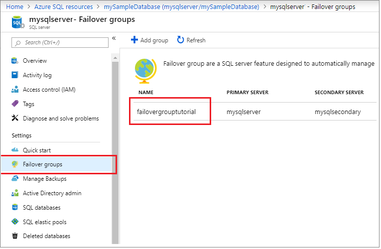

# Configure an auto-failover group for Azure SQL Database
[!INCLUDE[appliesto-sqldb](../includes/appliesto-sqldb.md)]

> [!div class="op_single_selector"]
> * [Azure SQL Database](auto-failover-group-configure-sql-db.md)
> * [Azure SQL Managed Instance](../managed-instance/auto-failover-group-configure-sql-mi.md)

This topic teaches you how to configure an [auto-failover group](auto-failover-group-sql-db.md) for single and pooled databases in Azure SQL Database by using the Azure portal and Azure PowerShell.  For an end-to-end experience, review the [Auto-failover group tutorial](failover-group-add-single-database-tutorial.md). 

> [!NOTE]
> This article covers auto-failover groups for Azure SQL Database. For Azure SQL Managed Instance, see [Configure auto-failover groups in Azure SQL Managed Instance](../managed-instance/auto-failover-group-configure-sql-mi.md). 


::: zone pivot="azure-sql-single-db"


## Prerequisites

Consider the following prerequisites for creating your failover group for a single database: 

- The server login and firewall settings for the secondary server must match that of your primary server.

## Create failover group

# [Portal](#tab/azure-portal)

Create your failover group and add your single database to it using the Azure portal.

1. Select **Azure SQL** in the left-hand menu of the [Azure portal](https://portal.azure.com). If **Azure SQL** is not in the list, select **All services**, then type Azure SQL in the search box. (Optional) Select the star next to **Azure SQL** to favorite it and add it as an item in the left-hand navigation.
1. Select the database you want to add to the failover group.
1. Select the name of the server under **Server name** to open the settings for the server.

   

1. Select **Failover groups** under the **Settings** pane, and then select **Add group** to create a new failover group.

   

1. On the **Failover Group** page, enter or select the required values, and then select **Create**.

   - **Databases within the group**: Choose the database you want to add to your failover group. Adding the database to the failover group will automatically start the geo-replication process.

   

# [PowerShell](#tab/azure-powershell)

Create your failover group and add your database to it using PowerShell.

   ```powershell-interactive
   $subscriptionId = "<SubscriptionID>"
   $resourceGroupName = "<Resource-Group-Name>"
   $location = "<Region>"
   $adminLogin = "<Admin-Login>"
   $password = "<Complex-Password>"
   $serverName = "<Primary-Server-Name>"
   $databaseName = "<Database-Name>"
   $drLocation = "<DR-Region>"
   $drServerName = "<Secondary-Server-Name>"
   $failoverGroupName = "<Failover-Group-Name>"

   # Create a secondary server in the failover region
   Write-host "Creating a secondary server in the failover region..."
   $drServer = New-AzSqlServer -ResourceGroupName $resourceGroupName `
      -ServerName $drServerName `
      -Location $drLocation `
      -SqlAdministratorCredentials $(New-Object -TypeName System.Management.Automation.PSCredential `
         -ArgumentList $adminlogin, $(ConvertTo-SecureString -String $password -AsPlainText -Force))
   $drServer

   # Create a failover group between the servers
   $failovergroup = Write-host "Creating a failover group between the primary and secondary server..."
   New-AzSqlDatabaseFailoverGroup `
      ResourceGroupName $resourceGroupName `
      -ServerName $serverName `
      -PartnerServerName $drServerName  `
      FailoverGroupName $failoverGroupName `
      FailoverPolicy Automatic `
      -GracePeriodWithDataLossHours 2
   $failovergroup

   # Add the database to the failover group
   Write-host "Adding the database to the failover group..."
   Get-AzSqlDatabase `
      -ResourceGroupName $resourceGroupName `
      -ServerName $serverName `
      -DatabaseName $databaseName | `
   Add-AzSqlDatabaseToFailoverGroup `
      -ResourceGroupName $resourceGroupName `
      -ServerName $serverName `
      -FailoverGroupName $failoverGroupName
   Write-host "Successfully added the database to the failover group..."
   ```

---

## Test failover

Test failover of your failover group using the Azure portal or PowerShell.

# [Portal](#tab/azure-portal)

Test failover of your failover group using the Azure portal.

1. Select **Azure SQL** in the left-hand menu of the [Azure portal](https://portal.azure.com). If **Azure SQL** is not in the list, select **All services**, then type "Azure SQL" in the search box. (Optional) Select the star next to **Azure SQL** to favorite it and add it as an item in the left-hand navigation.
1. Select the database you want to add to the failover group.

   

1. Select **Failover groups** under the **Settings** pane and then choose the failover group you just created.
  
   

1. Review which server is primary and which server is secondary.
1. Select **Failover** from the task pane to fail over your failover group containing your database.
1. Select **Yes** on the warning that notifies you that TDS sessions will be disconnected.

   

1. Review which server is now primary and which server is secondary. If failover succeeded, the two servers should have swapped roles.
1. Select **Failover** again to fail the servers back to their original roles.

# [PowerShell](#tab/azure-powershell)

Test failover of your failover group using PowerShell.  

Check the role of the secondary replica:

   ```powershell-interactive
   # Set variables
   $resourceGroupName = "<Resource-Group-Name>"
   $serverName = "<Primary-Server-Name>"
   $failoverGroupName = "<Failover-Group-Name>"

   # Check role of secondary replica
   Write-host "Confirming the secondary replica is secondary...."
   (Get-AzSqlDatabaseFailoverGroup `
      -FailoverGroupName $failoverGroupName `
      -ResourceGroupName $resourceGroupName `
      -ServerName $drServerName).ReplicationRole
   ```

Fail over to the secondary server:

   ```powershell-interactive
   # Set variables
   $resourceGroupName = "<Resource-Group-Name>"
   $serverName = "<Primary-Server-Name>"
   $failoverGroupName = "<Failover-Group-Name>"

   # Failover to secondary server
   Write-host "Failing over failover group to the secondary..."
   Switch-AzSqlDatabaseFailoverGroup `
      -ResourceGroupName $resourceGroupName `
      -ServerName $drServerName `
      -FailoverGroupName $failoverGroupName
   Write-host "Failed failover group to successfully to" $drServerName
   ```

Revert failover group back to the primary server:

   ```powershell-interactive
   # Set variables
   $resourceGroupName = "<Resource-Group-Name>"
   $serverName = "<Primary-Server-Name>"
   $failoverGroupName = "<Failover-Group-Name>"

   # Revert failover to primary server
   Write-host "Failing over failover group to the primary...."
   Switch-AzSqlDatabaseFailoverGroup `
      -ResourceGroupName $resourceGroupName `
      -ServerName $serverName `
      -FailoverGroupName $failoverGroupName
   Write-host "Failed failover group successfully to back to" $serverName
   ```

---

> [!IMPORTANT]
> If you need to delete the secondary database, remove it from the failover group before deleting it. Deleting a secondary database before it is removed from the failover group can cause unpredictable behavior.

::: zone-end

::: zone pivot="azure-sql-elastic-pool"


## Prerequisites

Consider the following prerequisites for creating your failover group for a pooled database: 

- The server login and firewall settings for the secondary server must match that of your primary server.

## Create failover group

Create the failover group for your elastic pool using the Azure portal or PowerShell.

# [Portal](#tab/azure-portal)

Create your failover group and add your elastic pool to it using the Azure portal.

1. Select **Azure SQL** in the left-hand menu of the [Azure portal](https://portal.azure.com). If **Azure SQL** is not in the list, select **All services**, then type "Azure SQL" in the search box. (Optional) Select the star next to **Azure SQL** to favorite it and add it as an item in the left-hand navigation.
1. Select the elastic pool you want to add to the failover group.
1. On the **Overview** pane, select the name of the server under **Server name** to open the settings for the server.
  
   

1. Select **Failover groups** under the **Settings** pane, and then select **Add group** to create a new failover group.

   

1. On the **Failover Group** page, enter or select the required values, and then select **Create**. Either create a new secondary server, or select an existing secondary server.

1. Select **Databases within the group** then choose the elastic pool you want to add to the failover group. If an elastic pool does not already exist on the secondary server, a warning appears prompting you to create an elastic pool on the secondary server. Select the warning, and then select **OK** to create the elastic pool on the secondary server.

   

1. Select **Select** to apply your elastic pool settings to the failover group, and then select **Create** to create your failover group. Adding the elastic pool to the failover group will automatically start the geo-replication process.

# [PowerShell](#tab/azure-powershell)

Create your failover group and add your elastic pool to it using PowerShell.

   ```powershell-interactive
   $subscriptionId = "<SubscriptionID>"
   $resourceGroupName = "<Resource-Group-Name>"
   $location = "<Region>"
   $adminLogin = "<Admin-Login>"
   $password = "<Complex-Password>"
   $serverName = "<Primary-Server-Name>"
   $databaseName = "<Database-Name>"
   $poolName = "myElasticPool"
   $drLocation = "<DR-Region>"
   $drServerName = "<Secondary-Server-Name>"
   $failoverGroupName = "<Failover-Group-Name>"

   # Create a failover group between the servers
   Write-host "Creating failover group..."
   New-AzSqlDatabaseFailoverGroup `
       ResourceGroupName $resourceGroupName `
       -ServerName $serverName `
       -PartnerServerName $drServerName  `
       FailoverGroupName $failoverGroupName `
       FailoverPolicy Automatic `
       -GracePeriodWithDataLossHours 2
   Write-host "Failover group created successfully."

   # Add elastic pool to the failover group
   Write-host "Enumerating databases in elastic pool...."
   $FailoverGroup = Get-AzSqlDatabaseFailoverGroup `
                    -ResourceGroupName $resourceGroupName `
                    -ServerName $serverName `
                    -FailoverGroupName $failoverGroupName
   $databases = Get-AzSqlElasticPoolDatabase `
               -ResourceGroupName $resourceGroupName `
               -ServerName $serverName `
               -ElasticPoolName $poolName
   Write-host "Adding databases to failover group..."
   $failoverGroup = $failoverGroup | Add-AzSqlDatabaseToFailoverGroup `
                                     -Database $databases
   Write-host "Databases added to failover group successfully."
  ```

---

## Test failover

Test failover of your elastic pool using the Azure portal or PowerShell.

# [Portal](#tab/azure-portal)

Fail your failover group over to the secondary server, and then fail back using the Azure portal.

1. Select **Azure SQL** in the left-hand menu of the [Azure portal](https://portal.azure.com). If **Azure SQL** is not in the list, select **All services**, then type "Azure SQL" in the search box. (Optional) Select the star next to **Azure SQL** to favorite it and add it as an item in the left-hand navigation.
1. Select the elastic pool you want to add to the failover group.
1. On the **Overview** pane, select the name of the server under **Server name** to open the settings for the server.

   
1. Select **Failover groups** under the **Settings** pane and then choose the failover group you created in section 2.
  
   

1. Review which server is primary, and which server is secondary.
1. Select **Failover** from the task pane to fail over your failover group containing your elastic pool.
1. Select **Yes** on the warning that notifies you that TDS sessions will be disconnected.

   

1. Review which server is primary, which server is secondary. If failover succeeded, the two servers should have swapped roles.
1. Select **Failover** again to fail the failover group back to the original settings.

# [PowerShell](#tab/azure-powershell)

Test failover of your failover group using PowerShell.

Check the role of the secondary replica:

   ```powershell-interactive
   # Set variables
   $resourceGroupName = "<Resource-Group-Name>"
   $serverName = "<Primary-Server-Name>"
   $failoverGroupName = "<Failover-Group-Name>"

   # Check role of secondary replica
   Write-host "Confirming the secondary replica is secondary...."
   (Get-AzSqlDatabaseFailoverGroup `
      -FailoverGroupName $failoverGroupName `
      -ResourceGroupName $resourceGroupName `
      -ServerName $drServerName).ReplicationRole
   ```

Fail over to the secondary server:

   ```powershell-interactive
   # Set variables
   $resourceGroupName = "<Resource-Group-Name>"
   $serverName = "<Primary-Server-Name>"
   $failoverGroupName = "<Failover-Group-Name>"

   # Failover to secondary server
   Write-host "Failing over failover group to the secondary..."
   Switch-AzSqlDatabaseFailoverGroup `
      -ResourceGroupName $resourceGroupName `
      -ServerName $drServerName `
      -FailoverGroupName $failoverGroupName
   Write-host "Failed failover group to successfully to" $drServerName
   ```

---

> [!IMPORTANT]
> If you need to delete the secondary database, remove it from the failover group before deleting it. Deleting a secondary database before it is removed from the failover group can cause unpredictable behavior.

::: zone-end

## Use Private Link

Using a private link allows you to associate a logical server to a specific private IP address within the virtual network and subnet. 

To use a private link with your failover group, do the following:

1. Ensure your primary and secondary servers are in a [paired region](../../availability-zones/cross-region-replication-azure.md). 
1. Create the virtual network and subnet in each region to host private endpoints for primary and secondary servers such that they have non-overlapping IP address spaces. For example, the primary virtual network address range of 10.0.0.0/16 and the secondary virtual network address range of 10.0.0.1/16 overlaps. For more information about virtual network address ranges, see the blog [designing Azure virtual networks](https://devblogs.microsoft.com/premier-developer/understanding-cidr-notation-when-designing-azure-virtual-networks-and-subnets/).
1. Create a [private endpoint and Azure Private DNS zone for the primary server](../../private-link/create-private-endpoint-portal.md#create-a-private-endpoint). 
1. Create a private endpoint for the secondary server as well, but this time choose to reuse the same Private DNS zone that was created for the primary server. 
1. Once the private link is established, you can create the failover group following the steps outlined previously in this article. 


## Locate listener endpoint

Once your failover group is configured, update the connection string for your application to the listener endpoint. This will keep your application connected to the failover group listener, rather than the primary database, elastic pool, or instance database. That way, you don't have to manually update the connection string every time your database entity fails over, and traffic is routed to whichever entity is currently primary.

The listener endpoint is in the form of `fog-name.database.windows.net`, and is visible in the Azure portal, when viewing the failover group:


## <a name="changing-secondary-region-of-the-failover-group"></a> Change the secondary region 

To illustrate the change sequence, we will assume that server A is the primary server, server B is the existing secondary server, and server C is the new secondary in the third region. To make the transition, follow these steps:

1. Create additional secondaries of each database on server A to server C using [active geo-replication](active-geo-replication-overview.md). Each database on server A will have two secondaries, one on server B and one on server C. This will guarantee that the primary databases remain protected during the transition.
1. Delete the failover group. At this point login attempts using failover group endpoints will be failing.
1. Re-create the failover group with the same name between servers A and C.
1. Add all primary databases on server A to the new failover group. At this point the login attempts will stop failing.
1. Delete server B. All databases on B will be deleted automatically.

## <a name="changing-primary-region-of-the-failover-group"></a> Change the primary region 

To illustrate the change sequence, we will assume server A is the primary server, server B is the existing secondary server, and server C is the new primary in the third region. To make the transition, follow these steps:

1. Perform a planned geo-failover to switch the primary server to B. Server A will become the new secondary server. The failover may result in several minutes of downtime. The actual time will depend on the size of failover group.
1. Create additional secondaries of each database on server B to server C using [active geo-replication](active-geo-replication-overview.md). Each database on server B will have two secondaries, one on server A and one on server C. This will guarantee that the primary databases remain protected during the transition.
1. Delete the failover group. At this point login attempts using failover group endpoints will be failing.
1. Re-create the failover group with the same name between servers B and C.
1. Add all primary databases on B to the new failover group. At this point the login attempts will stop failing.
1. Perform a planned geo-failover of the failover group to switch B and C. Now server C will become the primary and B the secondary. All secondary databases on server A will be automatically linked to the primaries on C. As in step 1, the failover may result in several minutes of downtime.
1. Delete server A. All databases on A will be deleted automatically.

> [!IMPORTANT]
> When the failover group is deleted, the DNS records for the listener endpoints are also deleted. At that point, there is a non-zero probability of somebody else creating a failover group or a server DNS alias with the same name. Because failover group names and DNS aliases must be globally unique, this will prevent you from using the same name again. To minimize this risk, don't use generic failover group names.

## Permissions

<!--
There is some overlap of content in the following articles, be sure to make changes to all if necessary:
/azure-sql/auto-failover-group-overview.md
/azure-sql/database/auto-failover-group-sql-db.md
/azure-sql/database/auto-failover-group-configure-sql-db.md
/azure-sql/managed-instance/auto-failover-group-sql-mi.md
/azure-sql/managed-instance/auto-failover-group-configure-sql-mi.md
-->

Permissions for a failover group are managed via [Azure role-based access control (Azure RBAC)](../../role-based-access-control/overview.md). 

Azure RBAC write access is necessary to create and manage failover groups. The [SQL Server Contributor role](../../role-based-access-control/built-in-roles.md#sql-server-contributor) has all the necessary permissions to manage failover groups.

The following table lists specific permission scopes for Azure SQL Database: 

| **Action** | **Permission** | **Scope**|
| :---- | :---- | :---- | 
| **Create failover group**| Azure RBAC write access | Primary server </br> Secondary server </br> All databases in failover group |
| **Update failover group** | Azure RBAC write access | Failover group </br> All databases on the current primary server|
| **Fail over failover group** | Azure RBAC write access | Failover group on new server |


## Remarks

- Removing a failover group for a single or pooled database does not stop replication, and it does not delete the replicated database. You will need to manually stop geo-replication and delete the database from the secondary server if you want to add a single or pooled database back to a failover group after it's been removed. Failing to do either may result in an error similar to `The operation cannot be performed due to multiple errors` when attempting to add the database to the failover group.

## Next steps

For detailed steps configuring a failover group, see the following tutorials:

- [Add a single database to a failover group](failover-group-add-single-database-tutorial.md)
- [Add an elastic pool to a failover group](failover-group-add-elastic-pool-tutorial.md)
- [Add a managed instance to a failover group](../managed-instance/failover-group-add-instance-tutorial.md)

For an overview of Azure SQL Database high availability options, see [geo-replication](active-geo-replication-overview.md) and [auto-failover groups](auto-failover-group-overview.md).
