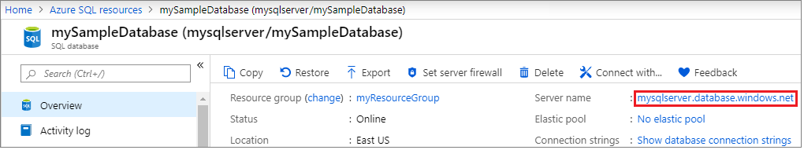
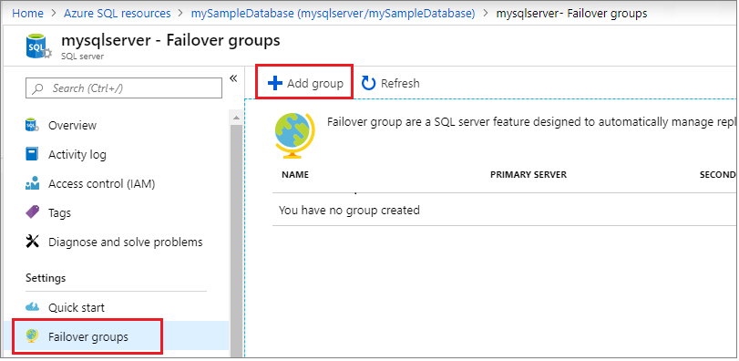
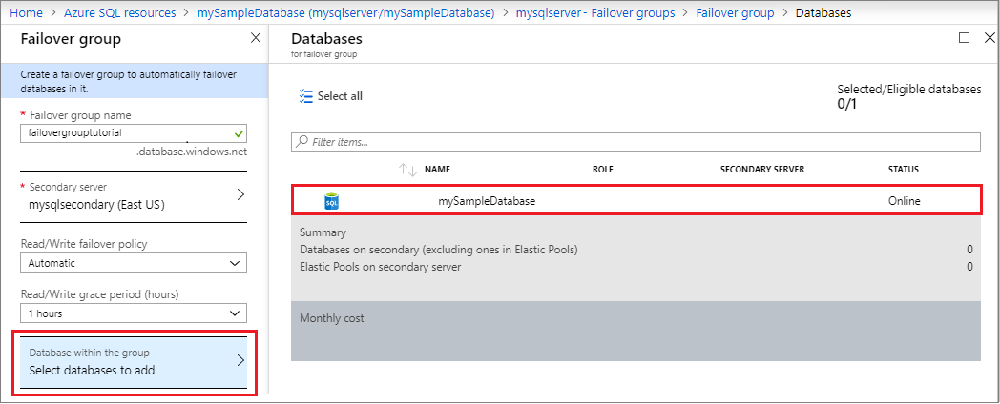
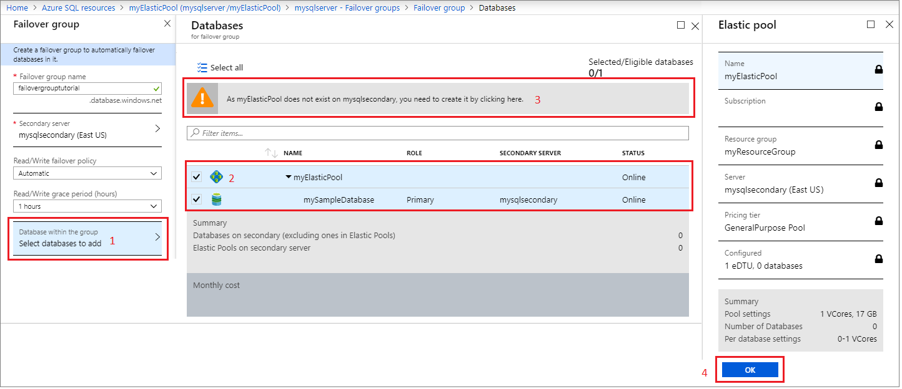
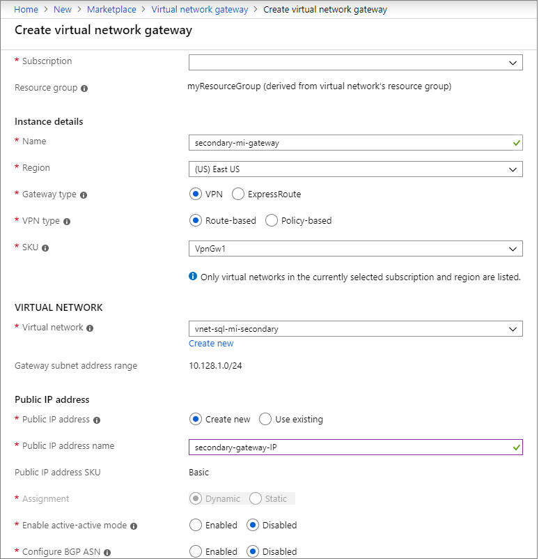
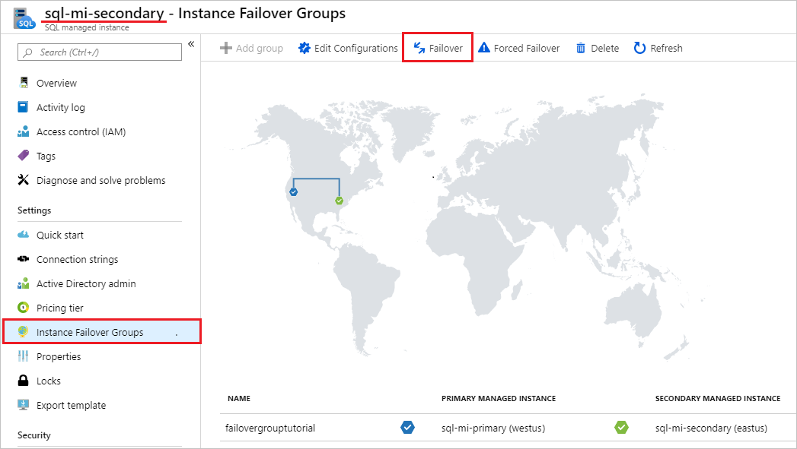
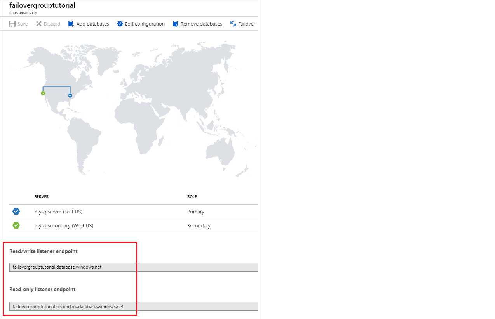

# Configure a failover group for Azure SQL Database
[!INCLUDE[appliesto-sqldb-sqlmi](../includes/appliesto-sqldb-sqlmi.md)]

This topic teaches you how to configure an [auto-failover group](auto-failover-group-overview.md) for Azure SQL Database and Azure SQL Managed Instance.

## Single database in Azure SQL Database

Create the failover group and add a single database to it using the Azure portal or PowerShell.

### Prerequisites

Consider the following prerequisites:

- The server login and firewall settings for the secondary server must match that of your primary server.

### Create failover group

# [Portal](#tab/azure-portal)

Create your failover group and add your single database to it using the Azure portal.

1. Select **Azure SQL** in the left-hand menu of the [Azure portal](https://portal.azure.com). If **Azure SQL** is not in the list, select **All services**, then type Azure SQL in the search box. (Optional) Select the star next to **Azure SQL** to favorite it and add it as an item in the left-hand navigation.
1. Select the database you want to add to the failover group.
1. Select the name of the server under **Server name** to open the settings for the server.

   

1. Select **Failover groups** under the **Settings** pane, and then select **Add group** to create a new failover group.

   

1. On the **Failover Group** page, enter or select the required values, and then select **Create**.

   - **Databases within the group**: Choose the database you want to add to your failover group. Adding the database to the failover group will automatically start the geo-replication process.

   

# [PowerShell](#tab/azure-powershell)

Create your failover group and add your database to it using PowerShell.

   ```powershell-interactive
   $subscriptionId = "<SubscriptionID>"
   $resourceGroupName = "<Resource-Group-Name>"
   $location = "<Region>"
   $adminLogin = "<Admin-Login>"
   $password = "<Complex-Password>"
   $serverName = "<Primary-Server-Name>"
   $databaseName = "<Database-Name>"
   $drLocation = "<DR-Region>"
   $drServerName = "<Secondary-Server-Name>"
   $failoverGroupName = "<Failover-Group-Name>"

   # Create a secondary server in the failover region
   Write-host "Creating a secondary server in the failover region..."
   $drServer = New-AzSqlServer -ResourceGroupName $resourceGroupName `
      -ServerName $drServerName `
      -Location $drLocation `
      -SqlAdministratorCredentials $(New-Object -TypeName System.Management.Automation.PSCredential `
         -ArgumentList $adminlogin, $(ConvertTo-SecureString -String $password -AsPlainText -Force))
   $drServer

   # Create a failover group between the servers
   $failovergroup = Write-host "Creating a failover group between the primary and secondary server..."
   New-AzSqlDatabaseFailoverGroup `
      –ResourceGroupName $resourceGroupName `
      -ServerName $serverName `
      -PartnerServerName $drServerName  `
      –FailoverGroupName $failoverGroupName `
      –FailoverPolicy Automatic `
      -GracePeriodWithDataLossHours 2
   $failovergroup

   # Add the database to the failover group
   Write-host "Adding the database to the failover group..."
   Get-AzSqlDatabase `
      -ResourceGroupName $resourceGroupName `
      -ServerName $serverName `
      -DatabaseName $databaseName | `
   Add-AzSqlDatabaseToFailoverGroup `
      -ResourceGroupName $resourceGroupName `
      -ServerName $serverName `
      -FailoverGroupName $failoverGroupName
   Write-host "Successfully added the database to the failover group..."
   ```

---

### Test failover

Test failover of your failover group using the Azure portal or PowerShell.

# [Portal](#tab/azure-portal)

Test failover of your failover group using the Azure portal.

1. Select **Azure SQL** in the left-hand menu of the [Azure portal](https://portal.azure.com). If **Azure SQL** is not in the list, select **All services**, then type "Azure SQL" in the search box. (Optional) Select the star next to **Azure SQL** to favorite it and add it as an item in the left-hand navigation.
1. Select the database you want to add to the failover group.

   

1. Select **Failover groups** under the **Settings** pane and then choose the failover group you just created.
  
   

1. Review which server is primary and which server is secondary.
1. Select **Failover** from the task pane to fail over your failover group containing your database.
1. Select **Yes** on the warning that notifies you that TDS sessions will be disconnected.

   

1. Review which server is now primary and which server is secondary. If failover succeeded, the two servers should have swapped roles.
1. Select **Failover** again to fail the servers back to their original roles.

# [PowerShell](#tab/azure-powershell)

Test failover of your failover group using PowerShell.  

Check the role of the secondary replica:

   ```powershell-interactive
   # Set variables
   $resourceGroupName = "<Resource-Group-Name>"
   $serverName = "<Primary-Server-Name>"
   $failoverGroupName = "<Failover-Group-Name>"

   # Check role of secondary replica
   Write-host "Confirming the secondary replica is secondary...."
   (Get-AzSqlDatabaseFailoverGroup `
      -FailoverGroupName $failoverGroupName `
      -ResourceGroupName $resourceGroupName `
      -ServerName $drServerName).ReplicationRole
   ```

Fail over to the secondary server:

   ```powershell-interactive
   # Set variables
   $resourceGroupName = "<Resource-Group-Name>"
   $serverName = "<Primary-Server-Name>"
   $failoverGroupName = "<Failover-Group-Name>"

   # Failover to secondary server
   Write-host "Failing over failover group to the secondary..."
   Switch-AzSqlDatabaseFailoverGroup `
      -ResourceGroupName $resourceGroupName `
      -ServerName $drServerName `
      -FailoverGroupName $failoverGroupName
   Write-host "Failed failover group to successfully to" $drServerName
   ```

Revert failover group back to the primary server:

   ```powershell-interactive
   # Set variables
   $resourceGroupName = "<Resource-Group-Name>"
   $serverName = "<Primary-Server-Name>"
   $failoverGroupName = "<Failover-Group-Name>"

   # Revert failover to primary server
   Write-host "Failing over failover group to the primary...."
   Switch-AzSqlDatabaseFailoverGroup `
      -ResourceGroupName $resourceGroupName `
      -ServerName $serverName `
      -FailoverGroupName $failoverGroupName
   Write-host "Failed failover group successfully to back to" $serverName
   ```

---

> [!IMPORTANT]
> If you need to delete the secondary database, remove it from the failover group before deleting it. Deleting a secondary database before it is removed from the failover group can cause unpredictable behavior.

## Elastic pools in Azure SQL Database

Create the failover group and add an elastic pool to it using the Azure portal, or PowerShell.  

### Prerequisites

Consider the following prerequisites:

- The server login and firewall settings for the secondary server must match that of your primary server.

### Create the failover group

Create the failover group for your elastic pool using the Azure portal or PowerShell.

# [Portal](#tab/azure-portal)

Create your failover group and add your elastic pool to it using the Azure portal.

1. Select **Azure SQL** in the left-hand menu of the [Azure portal](https://portal.azure.com). If **Azure SQL** is not in the list, select **All services**, then type "Azure SQL" in the search box. (Optional) Select the star next to **Azure SQL** to favorite it and add it as an item in the left-hand navigation.
1. Select the elastic pool you want to add to the failover group.
1. On the **Overview** pane, select the name of the server under **Server name** to open the settings for the server.
  
   

1. Select **Failover groups** under the **Settings** pane, and then select **Add group** to create a new failover group.

   

1. On the **Failover Group** page, enter or select the required values, and then select **Create**. Either create a new secondary server, or select an existing secondary server.

1. Select **Databases within the group** then choose the elastic pool you want to add to the failover group. If an elastic pool does not already exist on the secondary server, a warning appears prompting you to create an elastic pool on the secondary server. Select the warning, and then select **OK** to create the elastic pool on the secondary server.

   

1. Select **Select** to apply your elastic pool settings to the failover group, and then select **Create** to create your failover group. Adding the elastic pool to the failover group will automatically start the geo-replication process.

# [PowerShell](#tab/azure-powershell)

Create your failover group and add your elastic pool to it using PowerShell.

   ```powershell-interactive
   $subscriptionId = "<SubscriptionID>"
   $resourceGroupName = "<Resource-Group-Name>"
   $location = "<Region>"
   $adminLogin = "<Admin-Login>"
   $password = "<Complex-Password>"
   $serverName = "<Primary-Server-Name>"
   $databaseName = "<Database-Name>"
   $poolName = "myElasticPool"
   $drLocation = "<DR-Region>"
   $drServerName = "<Secondary-Server-Name>"
   $failoverGroupName = "<Failover-Group-Name>"

   # Create a failover group between the servers
   Write-host "Creating failover group..."
   New-AzSqlDatabaseFailoverGroup `
       –ResourceGroupName $resourceGroupName `
       -ServerName $serverName `
       -PartnerServerName $drServerName  `
       –FailoverGroupName $failoverGroupName `
       –FailoverPolicy Automatic `
       -GracePeriodWithDataLossHours 2
   Write-host "Failover group created successfully."

   # Add elastic pool to the failover group
   Write-host "Enumerating databases in elastic pool...."
   $FailoverGroup = Get-AzSqlDatabaseFailoverGroup `
                    -ResourceGroupName $resourceGroupName `
                    -ServerName $serverName `
                    -FailoverGroupName $failoverGroupName
   $databases = Get-AzSqlElasticPoolDatabase `
               -ResourceGroupName $resourceGroupName `
               -ServerName $serverName `
               -ElasticPoolName $poolName
   Write-host "Adding databases to failover group..."
   $failoverGroup = $failoverGroup | Add-AzSqlDatabaseToFailoverGroup `
                                     -Database $databases
   Write-host "Databases added to failover group successfully."
  ```

---

### Test failover

Test failover of your elastic pool using the Azure portal or PowerShell.

# [Portal](#tab/azure-portal)

Fail your failover group over to the secondary server, and then fail back using the Azure portal.

1. Select **Azure SQL** in the left-hand menu of the [Azure portal](https://portal.azure.com). If **Azure SQL** is not in the list, select **All services**, then type "Azure SQL" in the search box. (Optional) Select the star next to **Azure SQL** to favorite it and add it as an item in the left-hand navigation.
1. Select the elastic pool you want to add to the failover group.
1. On the **Overview** pane, select the name of the server under **Server name** to open the settings for the server.

   
1. Select **Failover groups** under the **Settings** pane and then choose the failover group you created in section 2.
  
   

1. Review which server is primary, and which server is secondary.
1. Select **Failover** from the task pane to fail over your failover group containing your elastic pool.
1. Select **Yes** on the warning that notifies you that TDS sessions will be disconnected.

   

1. Review which server is primary, which server is secondary. If failover succeeded, the two servers should have swapped roles.
1. Select **Failover** again to fail the failover group back to the original settings.

# [PowerShell](#tab/azure-powershell)

Test failover of your failover group using PowerShell.

Check the role of the secondary replica:

   ```powershell-interactive
   # Set variables
   $resourceGroupName = "<Resource-Group-Name>"
   $serverName = "<Primary-Server-Name>"
   $failoverGroupName = "<Failover-Group-Name>"

   # Check role of secondary replica
   Write-host "Confirming the secondary replica is secondary...."
   (Get-AzSqlDatabaseFailoverGroup `
      -FailoverGroupName $failoverGroupName `
      -ResourceGroupName $resourceGroupName `
      -ServerName $drServerName).ReplicationRole
   ```

Fail over to the secondary server:

   ```powershell-interactive
   # Set variables
   $resourceGroupName = "<Resource-Group-Name>"
   $serverName = "<Primary-Server-Name>"
   $failoverGroupName = "<Failover-Group-Name>"

   # Failover to secondary server
   Write-host "Failing over failover group to the secondary..."
   Switch-AzSqlDatabaseFailoverGroup `
      -ResourceGroupName $resourceGroupName `
      -ServerName $drServerName `
      -FailoverGroupName $failoverGroupName
   Write-host "Failed failover group to successfully to" $drServerName
   ```

---

> [!IMPORTANT]
> If you need to delete the secondary database, remove it from the failover group before deleting it. Deleting a secondary database before it is removed from the failover group can cause unpredictable behavior.

## SQL Managed Instance

Create a failover group between two managed instances in Azure SQL Managed Instance by using the Azure portal  or PowerShell.

You will need to either configure [ExpressRoute](../../expressroute/expressroute-howto-circuit-portal-resource-manager.md) or create a gateway for the virtual network of each SQL Managed Instance, connect the two gateways, and then create the failover group.

### Prerequisites

Consider the following prerequisites:

- The secondary managed instance must be empty.
- The subnet range for the secondary virtual network must not overlap the subnet range of the primary virtual network.
- The collation and timezone of the secondary managed instance must match that of the primary managed instance.
- When connecting the two gateways, the **Shared Key** should be the same for both connections.

### Create primary virtual network gateway

If you have not configured [ExpressRoute](../../expressroute/expressroute-howto-circuit-portal-resource-manager.md), you can create the primary virtual network gateway with the Azure portal, or PowerShell.

# [Portal](#tab/azure-portal)

Create the primary virtual network gateway using the Azure portal.

1. In the [Azure portal](https://portal.azure.com), go to your resource group and select the **Virtual network** resource for your primary managed instance.
1. Select **Subnets** under **Settings** and then select to add a new **Gateway subnet**. Leave the default values.

   

1. Once the subnet gateway is created, select **Create a resource** from the left navigation pane and then type `Virtual network gateway` in the search box. Select the **Virtual network gateway** resource published by **Microsoft**.

   

1. Fill out the required fields to configure the gateway your primary managed instance.

   The following table shows the values necessary for the gateway for the primary managed instance:

    | **Field** | Value |
    | --- | --- |
    | **Subscription** |  The subscription where your primary managed instance is. |
    | **Name** | The name for your virtual network gateway. |
    | **Region** | The region where your primary managed instance is. |
    | **Gateway type** | Select **VPN**. |
    | **VPN Type** | Select **Route-based** |
    | **SKU**| Leave default of `VpnGw1`. |
    | **Location**| The location where your secondary managed instance and secondary virtual network is.   |
    | **Virtual network**| Select the virtual network for your secondary managed instance. |
    | **Public IP address**| Select **Create new**. |
    | **Public IP address name**| Enter a name for your IP address. |
    | &nbsp; | &nbsp; |

1. Leave the other values as default, and then select **Review + create** to review the settings for your virtual network gateway.

   

1. Select **Create** to create your new virtual network gateway.

# [PowerShell](#tab/azure-powershell)

Create the primary virtual network gateway using PowerShell.

   ```powershell-interactive
   $primaryResourceGroupName = "<Primary-Resource-Group>"
   $primaryVnetName = "<Primary-Virtual-Network-Name>"
   $primaryGWName = "<Primary-Gateway-Name>"
   $primaryGWPublicIPAddress = $primaryGWName + "-ip"
   $primaryGWIPConfig = $primaryGWName + "-ipc"
   $primaryGWAsn = 61000

   # Get the primary virtual network
   $vnet1 = Get-AzVirtualNetwork -Name $primaryVnetName -ResourceGroupName $primaryResourceGroupName
   $primaryLocation = $vnet1.Location

   # Create primary gateway
   Write-host "Creating primary gateway..."
   $subnet1 = Get-AzVirtualNetworkSubnetConfig -Name GatewaySubnet -VirtualNetwork $vnet1
   $gwpip1= New-AzPublicIpAddress -Name $primaryGWPublicIPAddress -ResourceGroupName $primaryResourceGroupName `
            -Location $primaryLocation -AllocationMethod Dynamic
   $gwipconfig1 = New-AzVirtualNetworkGatewayIpConfig -Name $primaryGWIPConfig `
            -SubnetId $subnet1.Id -PublicIpAddressId $gwpip1.Id

   $gw1 = New-AzVirtualNetworkGateway -Name $primaryGWName -ResourceGroupName $primaryResourceGroupName `
       -Location $primaryLocation -IpConfigurations $gwipconfig1 -GatewayType Vpn `
       -VpnType RouteBased -GatewaySku VpnGw1 -EnableBgp $true -Asn $primaryGWAsn
   $gw1
   ```

---

### Create secondary virtual network gateway

Create the secondary virtual network gateway using the Azure portal or PowerShell.

# [Portal](#tab/azure-portal)

Repeat the steps in the previous section to create the virtual network subnet and gateway for the secondary managed instance. Fill out the required fields to configure the gateway for your secondary managed instance.

The following table shows the values necessary for the gateway for the secondary managed instance:

   | **Field** | Value |
   | --- | --- |
   | **Subscription** |  The subscription where your secondary managed instance is. |
   | **Name** | The name for your virtual network gateway, such as `secondary-mi-gateway`. |
   | **Region** | The region where your secondary managed instance is. |
   | **Gateway type** | Select **VPN**. |
   | **VPN Type** | Select **Route-based** |
   | **SKU**| Leave default of `VpnGw1`. |
   | **Location**| The location where your secondary managed instance and secondary virtual network is.   |
   | **Virtual network**| Select the virtual network that was created in section 2, such as `vnet-sql-mi-secondary`. |
   | **Public IP address**| Select **Create new**. |
   | **Public IP address name**| Enter a name for your IP address, such as `secondary-gateway-IP`. |
   | &nbsp; | &nbsp; |

   

# [PowerShell](#tab/azure-powershell)

Create the secondary virtual network gateway using PowerShell.

   ```powershell-interactive
   $secondaryResourceGroupName = "<Secondary-Resource-Group>"
   $secondaryVnetName = "<Secondary-Virtual-Network-Name>"
   $secondaryGWName = "<Secondary-Gateway-Name>"
   $secondaryGWPublicIPAddress = $secondaryGWName + "-IP"
   $secondaryGWIPConfig = $secondaryGWName + "-ipc"
   $secondaryGWAsn = 62000

   # Get the secondary virtual network
   $vnet2 = Get-AzVirtualNetwork -Name $secondaryVnetName -ResourceGroupName $secondaryResourceGroupName
   $secondaryLocation = $vnet2.Location

   # Create the secondary gateway
   Write-host "Creating secondary gateway..."
   $subnet2 = Get-AzVirtualNetworkSubnetConfig -Name GatewaySubnet -VirtualNetwork $vnet2
   $gwpip2= New-AzPublicIpAddress -Name $secondaryGWPublicIPAddress -ResourceGroupName $secondaryResourceGroupName `
            -Location $secondaryLocation -AllocationMethod Dynamic
   $gwipconfig2 = New-AzVirtualNetworkGatewayIpConfig -Name $secondaryGWIPConfig `
            -SubnetId $subnet2.Id -PublicIpAddressId $gwpip2.Id

   $gw2 = New-AzVirtualNetworkGateway -Name $secondaryGWName -ResourceGroupName $secondaryResourceGroupName `
       -Location $secondaryLocation -IpConfigurations $gwipconfig2 -GatewayType Vpn `
       -VpnType RouteBased -GatewaySku VpnGw1 -EnableBgp $true -Asn $secondaryGWAsn

   $gw2
   ```

---

### Connect the gateways

Create connections between the two gateways using the Azure portal or PowerShell.

Two connections need to be created - the connection from the primary gateway to the secondary gateway, and then the connection from the secondary gateway to the primary gateway.

The shared key used for both connections should be the same for each connection.

# [Portal](#tab/azure-portal)

Create connections between the two gateways using the Azure portal.

1. Select **Create a resource** from the [Azure portal](https://portal.azure.com).
1. Type `connection` in the search box and then press enter to search, which takes you to the **Connection** resource, published by Microsoft.
1. Select **Create** to create your connection.
1. On the **Basics** tab, select the following values and then select **OK**.
    1. Select `VNet-to-VNet` for the **Connection type**.
    1. Select your subscription from the drop-down.
    1. Select the resource group for your managed instance in the drop-down.
    1. Select the location of your primary managed instance from the drop-down.
1. On the **Settings** tab, select or enter the following values and then select **OK**:
    1. Choose the primary network gateway for the **First virtual network gateway**, such as `Primary-Gateway`.  
    1. Choose the secondary network gateway for the **Second virtual network gateway**, such as `Secondary-Gateway`.
    1. Select the checkbox next to **Establish bidirectional connectivity**.
    1. Either leave the default primary connection name, or rename it to a value of your choice.
    1. Provide a **Shared key (PSK)** for the connection, such as `mi1m2psk`.

   

1. On the **Summary** tab, review the settings for your bidirectional connection and then select **OK** to create your connection.

# [PowerShell](#tab/azure-powershell)

Create connections between the two gateways using PowerShell.

   ```powershell-interactive
   $vpnSharedKey = "mi1mi2psk"
   $primaryResourceGroupName = "<Primary-Resource-Group>"
   $primaryGWConnection = "<Primary-connection-name>"
   $primaryLocation = "<Primary-Region>"
   $secondaryResourceGroupName = "<Secondary-Resource-Group>"
   $secondaryGWConnection = "<Secondary-connection-name>"
   $secondaryLocation = "<Secondary-Region>"
  
   # Connect the primary to secondary gateway
   Write-host "Connecting the primary gateway"
   New-AzVirtualNetworkGatewayConnection -Name $primaryGWConnection -ResourceGroupName $primaryResourceGroupName `
       -VirtualNetworkGateway1 $gw1 -VirtualNetworkGateway2 $gw2 -Location $primaryLocation `
       -ConnectionType Vnet2Vnet -SharedKey $vpnSharedKey -EnableBgp $true
   $primaryGWConnection

   # Connect the secondary to primary gateway
   Write-host "Connecting the secondary gateway"

   New-AzVirtualNetworkGatewayConnection -Name $secondaryGWConnection -ResourceGroupName $secondaryResourceGroupName `
       -VirtualNetworkGateway1 $gw2 -VirtualNetworkGateway2 $gw1 -Location $secondaryLocation `
       -ConnectionType Vnet2Vnet -SharedKey $vpnSharedKey -EnableBgp $true
   $secondaryGWConnection
   ```

---

### Create the failover group

Create the failover group for your managed instances by using the Azure portal or PowerShell.

# [Portal](#tab/azure-portal)

Create the failover group for your SQL Managed Instances by using the Azure portal.

1. Select **Azure SQL** in the left-hand menu of the [Azure portal](https://portal.azure.com). If **Azure SQL** is not in the list, select **All services**, then type Azure SQL in the search box. (Optional) Select the star next to **Azure SQL** to favorite it and add it as an item in the left-hand navigation.
1. Select the primary managed instance you want to add to the failover group.  
1. Under **Settings**, navigate to **Instance Failover Groups** and then choose to **Add group** to open the **Instance Failover Group** page.

   

1. On the **Instance Failover Group** page, type the name of your failover group and then choose the secondary managed instance from the drop-down. Select **Create** to create your failover group.

   

1. Once failover group deployment is complete, you will be taken back to the **Failover group** page.

# [PowerShell](#tab/azure-powershell)

Create the failover group for your managed instances using PowerShell.

   ```powershell-interactive
   $primaryResourceGroupName = "<Primary-Resource-Group>"
   $failoverGroupName = "<Failover-Group-Name>"
   $primaryLocation = "<Primary-Region>"
   $secondaryLocation = "<Secondary-Region>"
   $primaryManagedInstance = "<Primary-Managed-Instance-Name>"
   $secondaryManagedInstance = "<Secondary-Managed-Instance-Name>"

   # Create failover group
   Write-host "Creating the failover group..."
   $failoverGroup = New-AzSqlDatabaseInstanceFailoverGroup -Name $failoverGroupName `
        -Location $primaryLocation -ResourceGroupName $primaryResourceGroupName -PrimaryManagedInstanceName $primaryManagedInstance `
        -PartnerRegion $secondaryLocation -PartnerManagedInstanceName $secondaryManagedInstance `
        -FailoverPolicy Automatic -GracePeriodWithDataLossHours 1
   $failoverGroup
   ```

---

### Test failover

Test failover of your failover group using the Azure portal or PowerShell.

# [Portal](#tab/azure-portal)

Test failover of your failover group using the Azure portal.

1. Navigate to your _secondary_ managed instance within the [Azure portal](https://portal.azure.com) and select **Instance Failover Groups** under settings.
1. Review which managed instance is the primary, and which managed instance is the secondary.
1. Select **Failover** and then select **Yes** on the warning about TDS sessions being disconnected.

   

1. Review which manged instance is the primary and which instance is the secondary. If failover succeeded, the two instances should have switched roles.

   

1. Go to the new _secondary_ managed instance and select **Failover** once again to fail the primary instance back to the primary role.

# [PowerShell](#tab/azure-powershell)

Test failover of your failover group using PowerShell.

   ```powershell-interactive
   $primaryResourceGroupName = "<Primary-Resource-Group>"
   $secondaryResourceGroupName = "<Secondary-Resource-Group>"
   $failoverGroupName = "<Failover-Group-Name>"
   $primaryLocation = "<Primary-Region>"
   $secondaryLocation = "<Secondary-Region>"
   $primaryManagedInstance = "<Primary-Managed-Instance-Name>"
   $secondaryManagedInstance = "<Secondary-Managed-Instance-Name>"

   # Verify the current primary role
   Get-AzSqlDatabaseInstanceFailoverGroup -ResourceGroupName $primaryResourceGroupName `
       -Location $secondaryLocation -Name $failoverGroupName

   # Failover the primary managed instance to the secondary role
   Write-host "Failing primary over to the secondary location"
   Get-AzSqlDatabaseInstanceFailoverGroup -ResourceGroupName $secondaryResourceGroupName `
       -Location $secondaryLocation -Name $failoverGroupName | Switch-AzSqlDatabaseInstanceFailoverGroup
   Write-host "Successfully failed failover group to secondary location"

   # Verify the current primary role
   Get-AzSqlDatabaseInstanceFailoverGroup -ResourceGroupName $primaryResourceGroupName `
       -Location $secondaryLocation -Name $failoverGroupName

   # Fail primary managed instance back to primary role
   Write-host "Failing primary back to primary role"
   Get-AzSqlDatabaseInstanceFailoverGroup -ResourceGroupName $primaryResourceGroupName `
       -Location $primaryLocation -Name $failoverGroupName | Switch-AzSqlDatabaseInstanceFailoverGroup
   Write-host "Successfully failed failover group to primary location"

   # Verify the current primary role
   Get-AzSqlDatabaseInstanceFailoverGroup -ResourceGroupName $primaryResourceGroupName `
       -Location $secondaryLocation -Name $failoverGroupName
   ```

---

## Use Private Link

Using a private link allows you to associate a logical server to a specific private IP address within the virtual network and subnet. 

To use a private link with your failover group, do the following:

1. Ensure your primary and secondary servers are in a [paired region](/azure/best-practices-availability-paired-regions). 
1. Create the virtual network and subnet in each region to host private endpoints for primary and secondary servers such that they have non-overlapping IP address spaces. For example, the primary virtual network address range of 10.0.0.0/16 and the secondary virtual network address range of 10.0.0.1/16 overlaps. For more information about virtual network address ranges, see the blog [designing Azure virtual networks](https://devblogs.microsoft.com/premier-developer/understanding-cidr-notation-when-designing-azure-virtual-networks-and-subnets/).
1. Create a [private endpoint and Azure Private DNS zone for the primary server](../../private-link/create-private-endpoint-portal.md#create-a-private-endpoint). 
1. Create a private endpoint for the secondary server as well, but this time choose to reuse the same Private DNS zone that was created for the primary server. 
1. Once the private link is established, you can create the failover group following the steps outlined previously in this article. 


## Locate listener endpoint

Once your failover group is configured, update the connection string for your application to the listener endpoint. This will keep your application connected to the failover group listener, rather than the primary database, elastic pool, or instance database. That way, you don't have to manually update the connection string every time your database entity fails over, and traffic is routed to whichever entity is currently primary.

The listener endpoint is in the form of `fog-name.database.windows.net`, and is visible in the Azure portal, when viewing the failover group:



## Remarks

- Removing a failover group for a single or pooled database does not stop replication, and it does not delete the replicated database. You will need to manually stop geo-replication and delete the database from the secondary server if you want to add a single or pooled database back to a failover group after it's been removed. Failing to do either may result in an error similar to `The operation cannot be performed due to multiple errors` when attempting to add the database to the failover group.

## Next steps

For detailed steps configuring a failover group, see the following tutorials:

- [Add a single database to a failover group](failover-group-add-single-database-tutorial.md)
- [Add an elastic pool to a failover group](failover-group-add-elastic-pool-tutorial.md)
- [Add a managed instance to a failover group](../managed-instance/failover-group-add-instance-tutorial.md)

For an overview of Azure SQL Database high availability options, see [geo-replication](active-geo-replication-overview.md) and [auto-failover groups](auto-failover-group-overview.md).
