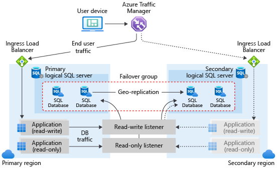

# Auto-failover groups overview & best practices (Azure SQL Database)
[!INCLUDE[appliesto-sqldb](../includes/appliesto-sqldb.md)]

> [!div class="op_single_selector"]
> * [Azure SQL Database](auto-failover-group-sql-db.md)
> * [Azure SQL Managed Instance](../managed-instance/auto-failover-group-sql-mi.md)

The auto-failover groups feature allows you to manage the replication and failover of some or all databases on a [logical server](logical-servers.md) to another region. This article focuses on using the Auto-failover group feature with Azure SQL Database and some best practices.  

To get started, review [Configure auto-failover group](auto-failover-group-configure-sql-db.md). For an end-to-end experience, see the [Auto-failover group tutorial](failover-group-add-single-database-tutorial.md).

> [!NOTE]
> - This article covers auto-failover groups for Azure SQL Database. For Azure SQL Managed Instance, see [Auto-failover groups in Azure SQL Managed Instance](../managed-instance/auto-failover-group-sql-mi.md). 
> - Auto-failover groups support geo-replication of all databases in the group to only one secondary server in a different region. If you need to create multiple Azure SQL Database geo-secondary replicas (in the same or different regions) for the same primary replica, use [active geo-replication](active-geo-replication-overview.md).
> 

## Overview

[!INCLUDE [auto-failover-groups-overview](../includes/auto-failover-group-overview.md)]

##  Terminology and capabilities

<!--
There is some overlap of content in the following articles, be sure to make changes to all if necessary:
/azure-sql/database/auto-failover-group-sql-db.md
/azure-sql/managed-instance/auto-failover-group-sql-mi.md
-->

- **Failover group (FOG)**

  A failover group is a named group of databases managed by a single server that can fail over as a unit to another Azure region in case all or some primary databases become unavailable due to an outage in the primary region. 
  
  > [!IMPORTANT]
  > The name of the failover group must be globally unique within the `.database.windows.net` domain.

- **Servers**

  Some or all of the user databases on a [logical server](logical-servers.md) can be placed in a failover group. Also, a server supports multiple failover groups on a single server.

- **Primary**

  The server that hosts the primary databases in the failover group.

- **Secondary**

  The server that hosts the secondary databases in the failover group. The secondary cannot be in the same Azure region as the primary.

- **Adding single databases to failover group**

  You can put several single databases on the same server into the same failover group. If you add a single database to the failover group, it automatically creates a secondary database using the same edition and compute size on secondary server. You specified that server when the failover group was created. If you add a database that already has a secondary database in the secondary server, that geo-replication link is inherited by the group. When you add a database that already has a secondary database in a server that is not part of the failover group, a new secondary is created in the secondary server.

  > [!IMPORTANT]
  > Make sure that the secondary server doesn't have a database with the same name unless it is an existing secondary database. 

- **Adding databases in elastic pool to failover group**

  You can put all or several databases within an elastic pool into the same failover group. If the primary database is in an elastic pool, the secondary is automatically created in the elastic pool with the same name (secondary pool). You must ensure that the secondary server contains an elastic pool with the same exact name and enough free capacity to host the secondary databases that will be created by the failover group. If you add a database in the pool that already has a secondary database in the secondary pool, that geo-replication link is inherited by the group. When you add a database that already has a secondary database in a server that is not part of the failover group, a new secondary is created in the secondary pool.
  
- **Failover group read-write listener**

  A DNS CNAME record that points to the current primary. It is created automatically when the failover group is created and allows the read-write workload to transparently reconnect to the primary when the primary changes after failover. When the failover group is created on a server, the DNS CNAME record for the listener URL is formed as `<fog-name>.database.windows.net`.

- **Failover group read-only listener**

  A DNS CNAME record that points to the current secondary. It is created automatically when the failover group is created and allows the read-only SQL workload to transparently connect to the secondary when the secondary changes after failover. When the failover group is created on a server, the DNS CNAME record for the listener URL is formed as `<fog-name>.secondary.database.windows.net`. 

- **Multiple failover groups**

  You can configure multiple failover groups for the same pair of servers to control the scope of geo-failovers. Each group fails over independently. If your tenant-per-database application is deployed in multiple regions and uses elastic pools, you can use this capability to mix primary and secondary databases in each pool. This way you may be able to reduce the impact of an outage to only some tenant databases.

[!INCLUDE [auto-failover-group-terminology](../includes/auto-failover-group-terminology.md)]

## Failover group architecture

A failover group in Azure SQL Database can include one or multiple databases, typically used by the same application. When you are using auto-failover groups with automatic failover policy, an outage that impacts one or several of the databases in the group will result in an automatic geo-failover. 

The auto-failover group must be configured on the primary server and will connect it to the secondary server in a different Azure region. The groups can include all or some databases in these servers. The following diagram illustrates a typical configuration of a geo-redundant cloud application using multiple databases and auto-failover group.

When designing a service with business continuity in mind, follow the general guidelines and best practices outlined in this article.  When configuring a failover group, ensure that authentication and network access on the secondary is set up to function correctly after geo-failover, when the geo-secondary becomes the new primary. For details, see [SQL Database security after disaster recovery](active-geo-replication-security-configure.md). For more information about designing solutions for disaster recovery, see [Designing Cloud Solutions for Disaster Recovery Using active geo-replication](designing-cloud-solutions-for-disaster-recovery.md).

For information about using point-in-time restore with failover groups, see [Point in Time Recovery (PITR)](recovery-using-backups.md#point-in-time-restore).

## Initial seeding 

When adding databases or elastic pools to a failover group, there is an initial seeding phase before data replication starts. The initial seeding phase is the longest and most expensive operation. Once initial seeding completes, data is synchronized, and then only subsequent data changes are replicated. The time it takes for the initial seeding to complete depends on the size of your data, number of replicated databases, the load on primary databases, and the speed of the link between the primary and secondary. Under normal circumstances, possible seeding speed is up to 500 GB an hour for SQL Database. Seeding is performed for all databases in parallel.

##  Use multiple failover groups to failover multiple databases

One or many failover groups can be created between two servers in different regions (primary and secondary servers). Each group can include one or several databases that are recovered as a unit in case all or some primary databases become unavailable due to an outage in the primary region. Creating a failover group creates geo-secondary databases with the same service objective as the primary. If you add an existing geo-replication relationship to a failover group, make sure the geo-secondary is configured with the same service tier and compute size as the primary.
  
##  Use the read-write listener (primary)

For read-write workloads, use `<fog-name>.database.windows.net` as the server name in the connection string. Connections will be automatically directed to the primary. This name does not change after failover. Note the failover involves updating the DNS record so the client connections are redirected to the new primary only after the client DNS cache is refreshed. The time to live (TTL) of the primary and secondary listener DNS record is 30 seconds.

##  Use the read-only listener (secondary)

If you have logically isolated read-only workloads that are tolerant to data latency, you can run them on the geo-secondary. For read-only sessions, use `<fog-name>.secondary.database.windows.net` as the server name in the connection string. Connections will be automatically directed to the geo-secondary. It is also recommended that you indicate read intent in the connection string by using `ApplicationIntent=ReadOnly`.

In Premium, Business Critical, and Hyperscale service tiers, SQL Database supports the use of [read-only replicas](read-scale-out.md) to offload read-only query workloads, using the `ApplicationIntent=ReadOnly` parameter in the connection string. When you have configured a geo-secondary, you can use this capability to connect to either a read-only replica in the primary location or in the geo-replicated location: 
- To connect to a read-only replica in the secondary location, use `ApplicationIntent=ReadOnly` and `<fog-name>.secondary.database.windows.net`.

##  Potential performance degradation after failover

A typical Azure application uses multiple Azure services and consists of multiple components. The automatic geo-failover of the failover group is triggered based on the state the Azure SQL components alone. Other Azure services in the primary region may not be affected by the outage and their components may still be available in that region. Once the primary databases switch to the secondary (DR) region, the latency between the dependent components may increase. To avoid the impact of higher latency on the application's performance, ensure the redundancy of all the application's components in the DR region, follow these [network security guidelines](#failover-groups-and-network-security), and orchestrate the geo-failover of relevant application components together with the database.

##  Potential data loss after failover

If an outage occurs in the primary region, recent transactions may not be able to replicate to the geo-secondary. If the automatic failover policy is configured, the system waits for the period you specified by `GracePeriodWithDataLossHours` before initiating an automatic geo-failover. The default value is 1 hour. This favors database availability over no data loss. Setting `GracePeriodWithDataLossHours` to a larger number, such as 24 hours, or disabling automatic geo-failover lets you reduce the likelihood of data loss at the expense of database availability.

> [!IMPORTANT]
> Elastic pools with 800 or fewer DTUs or 8 or fewer vCores, and more than 250 databases may encounter issues including longer planned geo-failovers and degraded performance. These issues are more likely to occur for write intensive workloads, when geo-replicas are widely separated by geography, or when multiple secondary geo-replicas are used for each database. A symptom of these issues is an increase in geo-replication lag over time, potentially leading to a more extensive data loss in an outage. This lag can be monitored using [sys.dm_geo_replication_link_status](/sql/relational-databases/system-dynamic-management-views/sys-dm-geo-replication-link-status-azure-sql-database). If these issues occur, then mitigation includes scaling up the pool to have more DTUs or vCores, or reducing the number of geo-replicated databases in the pool.

## Failover groups and network security

For some applications the security rules require that the network access to the data tier is restricted to a specific component or components such as a VM, web service, etc. This requirement presents some challenges for business continuity design and the use of failover groups. Consider the following options when implementing such restricted access.

###  Use failover groups and virtual network service endpoints

If you are using [Virtual Network service endpoints and rules](vnet-service-endpoint-rule-overview.md) to restrict access to your database in SQL Database, be aware that each virtual network service endpoint applies to only one Azure region. The endpoint does not enable other regions to accept communication from the subnet. Therefore, only the client applications deployed in the same region can connect to the primary database. Since a geo-failover results in the SQL Database client sessions being rerouted to a server in a different (secondary) region, these sessions will fail if originated from a client outside of that region. For that reason, the automatic failover policy cannot be enabled if the participating servers or instances are included in the Virtual Network rules. To support manual failover, follow these steps:

1. Provision the redundant copies of the front-end components of your application (web service, virtual machines etc.) in the secondary region.
2. Configure the [virtual network rules](vnet-service-endpoint-rule-overview.md) individually for primary and secondary server.
3. Enable the [front-end failover using a Traffic manager configuration](designing-cloud-solutions-for-disaster-recovery.md#scenario-1-using-two-azure-regions-for-business-continuity-with-minimal-downtime).
4. Initiate manual geo-failover when the outage is detected. This option is optimized for the applications that require consistent latency between the front-end and the data tier and supports recovery when either front end, data tier or both are impacted by the outage.

> [!NOTE]
> If you are using the **read-only listener** to load-balance a read-only workload, make sure that this workload is executed in a VM or other resource in the secondary region so it can connect to the secondary database.

### Use failover groups and firewall rules

If your business continuity plan requires failover using groups with automatic failover, you can restrict access to your database in SQL Database by using public IP firewall rules. To support automatic failover, follow these steps:

1. [Create a public IP](../../virtual-network/ip-services/virtual-network-public-ip-address.md#create-a-public-ip-address).
2. [Create a public load balancer](../../load-balancer/quickstart-load-balancer-standard-public-portal.md) and assign the public IP to it.
3. [Create a virtual network and the virtual machines](../../load-balancer/quickstart-load-balancer-standard-public-portal.md) for your front-end components.
4. [Create network security group](../../virtual-network/network-security-groups-overview.md) and configure inbound connections.
5. Ensure that the outbound connections are open to Azure SQL Database in a region by using an `Sql.<Region>` [service tag](../../virtual-network/network-security-groups-overview.md#service-tags).
6. Create a [SQL Database firewall rule](firewall-configure.md) to allow inbound traffic from the public IP address you create in step 1.

For more information on how to configure outbound access and what IP to use in the firewall rules, see [Load balancer outbound connections](../../load-balancer/load-balancer-outbound-connections.md).

The above configuration will ensure that an automatic geo-failover will not block connections from the front-end components and assumes that the application can tolerate the longer latency between the front end and the data tier.

> [!IMPORTANT]
> To guarantee business continuity during regional outages you must ensure geographic redundancy for both front-end components and databases.

##  Scale primary database

You can scale up or scale down the primary database to a different compute size (within the same service tier) without disconnecting any geo-secondaries. When scaling up, we recommend that you scale up the geo-secondary first, and then scale up the primary. When scaling down, reverse the order: scale down the primary first, and then scale down the secondary. When you scale a database to a different service tier, this recommendation is enforced.

This sequence is recommended specifically to avoid the problem where the geo-secondary at a lower SKU gets overloaded and must be re-seeded during an upgrade or downgrade process. You could also avoid the problem by making the primary read-only, at the expense of impacting all read-write workloads against the primary.

> [!NOTE]
> If you created a geo-secondary as part of the failover group configuration it is not recommended to scale down the geo-secondary. This is to ensure your data tier has sufficient capacity to process your regular workload after a geo-failover.

##  Prevent loss of critical data

<!--
There is some overlap in the following content, be sure to update all that's necessary: 
/azure-sql/database/auto-failover-group-sql-db.md
/azure-sql/managed-instance/auto-failover-group-sql-mi.md
-->

Due to the high latency of wide area networks, geo-replication uses an asynchronous replication mechanism. Asynchronous replication makes the possibility of data loss unavoidable if the primary fails. To protect critical transactions from data loss, an application developer can call the [sp_wait_for_database_copy_sync](/sql/relational-databases/system-stored-procedures/active-geo-replication-sp-wait-for-database-copy-sync) stored procedure immediately after committing the transaction. Calling `sp_wait_for_database_copy_sync` blocks the calling thread until the last committed transaction has been transmitted and hardened in the transaction log of the secondary database. However, it does not wait for the transmitted transactions to be replayed (redone) on the secondary. `sp_wait_for_database_copy_sync` is scoped to a specific geo-replication link. Any user with the connection rights to the primary database can call this procedure.

> [!NOTE]
> `sp_wait_for_database_copy_sync` prevents data loss after geo-failover for specific transactions, but does not guarantee full synchronization for read access. The delay caused by a `sp_wait_for_database_copy_sync` procedure call can be significant and depends on the size of the not yet transmitted transaction log on the primary at the time of the call.

## Permissions

<!--
There is some overlap of content in the following three articles, be sure to make changes in all three places if necessary
/azure-sql/database/auto-failover-group-sql-db.md
/azure-sql/database/auto-failover-group-configure-sql-db.md
/azure-sql/managed-instance/auto-failover-group-sql-mi.md
/azure-sql/managed-instance/auto-failover-group-configure-sql-mi.md
-->

Permissions for a failover group are managed via [Azure role-based access control (Azure RBAC)](../../role-based-access-control/overview.md). 

Azure RBAC write access is necessary to create and manage failover groups. The [SQL Server Contributor role](../../role-based-access-control/built-in-roles.md#sql-server-contributor) has all the necessary permissions to manage failover groups.

For specific permission scopes, review how to [configure auto-failover groups in Azure SQL Database](auto-failover-group-sql-db.md#permissions). 

## Limitations

Be aware of the following limitations:

- Failover groups cannot be created between two servers in the same Azure region.
- Failover groups cannot be renamed. You will need to delete the group and re-create it with a different name.
- Database rename is not supported for databases in failover group. You will need to temporarily delete failover group to be able to rename a database, or remove the database from the failover group.

##  Programmatically manage failover groups

As discussed previously, auto-failover groups can also be managed programmatically using Azure PowerShell, Azure CLI, and REST API. The following tables describe the set of commands available. Active geo-replication includes a set of Azure Resource Manager APIs for management, including the [Azure SQL Database REST API](/rest/api/sql/) and [Azure PowerShell cmdlets](/powershell/azure/). These APIs require the use of resource groups and support Azure role-based access control (Azure RBAC). For more information on how to implement access roles, see [Azure role-based access control (Azure RBAC)](../../role-based-access-control/overview.md).

# [PowerShell](#tab/azure-powershell)

| Cmdlet | Description |
| --- | --- |
| [New-AzSqlDatabaseFailoverGroup](/powershell/module/az.sql/new-azsqldatabasefailovergroup) |This command creates a failover group and registers it on both primary and secondary servers|
| [Remove-AzSqlDatabaseFailoverGroup](/powershell/module/az.sql/remove-azsqldatabasefailovergroup) | Removes a failover group from the server |
| [Get-AzSqlDatabaseFailoverGroup](/powershell/module/az.sql/get-azsqldatabasefailovergroup) | Retrieves a failover group's configuration |
| [Set-AzSqlDatabaseFailoverGroup](/powershell/module/az.sql/set-azsqldatabasefailovergroup) |Modifies configuration of a failover group |
| [Switch-AzSqlDatabaseFailoverGroup](/powershell/module/az.sql/switch-azsqldatabasefailovergroup) | Triggers failover of a failover group to the secondary server |
| [Add-AzSqlDatabaseToFailoverGroup](/powershell/module/az.sql/add-azsqldatabasetofailovergroup)|Adds one or more databases to a failover group|

# [Azure CLI](#tab/azure-cli)

| Command | Description |
| --- | --- |
| [az sql failover-group create](/cli/azure/sql/failover-group#az-sql-failover-group-create) |This command creates a failover group and registers it on both primary and secondary servers|
| [az sql failover-group delete](/cli/azure/sql/failover-group#az-sql-failover-group-delete) | Removes a failover group from the server |
| [az sql failover-group show](/cli/azure/sql/failover-group#az-sql-failover-group-show) | Retrieves a failover group configuration |
| [az sql failover-group update](/cli/azure/sql/failover-group#az-sql-failover-group-update) |Modifies a failover group's configuration  and/or adds one or more databases to a failover group|
| [az sql failover-group set-primary](/cli/azure/sql/failover-group#az-sql-failover-group-set-primary) | Triggers failover of a failover group to the secondary server |

# [REST API](#tab/rest-api)

| API | Description |
| --- | --- |
| [Create or Update Failover Group](/rest/api/sql/failovergroups/createorupdate) | Creates or updates a failover group |
| [Delete Failover Group](/rest/api/sql/failovergroups/delete) | Removes a failover group from the server |
| [Failover (Planned)](/rest/api/sql/failovergroups/failover) | Triggers failover from the current primary server to the secondary server with full data synchronization.|
| [Force Failover Allow Data Loss](/rest/api/sql/failovergroups/forcefailoverallowdataloss) | Triggers failover from the current primary server to the secondary server without synchronizing data. This operation may result in data loss. |
| [Get Failover Group](/rest/api/sql/failovergroups/get) | Retrieves a failover group's configuration. |
| [List Failover Groups By Server](/rest/api/sql/failovergroups/listbyserver) | Lists the failover groups on a server. |
| [Update Failover Group](/rest/api/sql/failovergroups/update) | Updates a failover group's configuration. |

---

## Next steps

- For detailed tutorials, see
  - [Add SQL Database to a failover group](failover-group-add-single-database-tutorial.md)
  - [Add an elastic pool to a failover group](failover-group-add-elastic-pool-tutorial.md)
- For sample scripts, see:
  - [Use PowerShell to configure active geo-replication for Azure SQL Database](scripts/setup-geodr-and-failover-database-powershell.md)
  - [Use PowerShell to configure active geo-replication for a pooled database in Azure SQL Database](scripts/setup-geodr-and-failover-elastic-pool-powershell.md)
  - [Use PowerShell to add an Azure SQL Database to a failover group](scripts/add-database-to-failover-group-powershell.md)
- For a business continuity overview and scenarios, see [Business continuity overview](business-continuity-high-availability-disaster-recover-hadr-overview.md)
- To learn about Azure SQL Database automated backups, see [SQL Database automated backups](automated-backups-overview.md).
- To learn about using automated backups for recovery, see [Restore a database from the service-initiated backups](recovery-using-backups.md).
- To learn about authentication requirements for a new primary server and database, see [SQL Database security after disaster recovery](active-geo-replication-security-configure.md).
