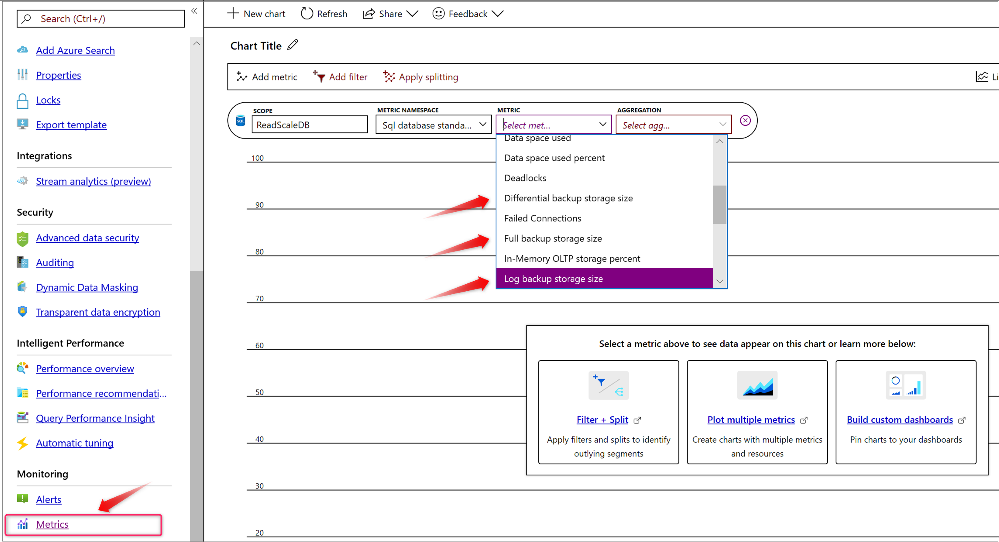
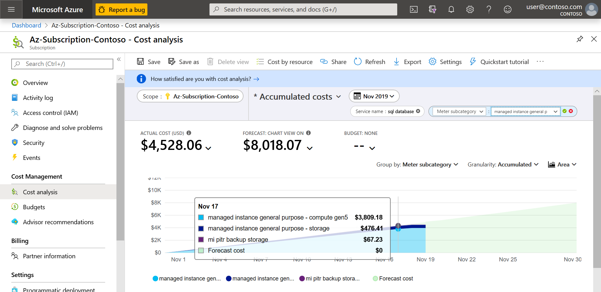
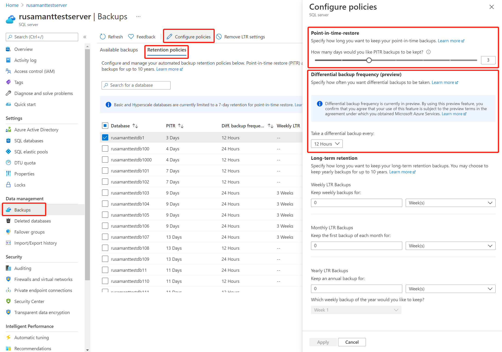
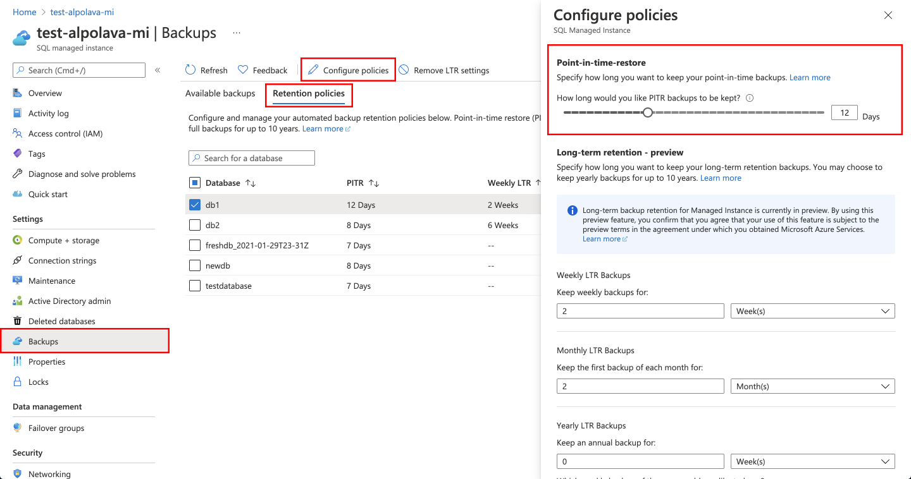

# Automated backups - Azure SQL Database & SQL Managed Instance

[!INCLUDE[appliesto-sqldb-sqlmi](../includes/appliesto-sqldb-sqlmi.md)]

[!INCLUDE [GDPR-related guidance](../../../includes/gdpr-intro-sentence.md)]

## What is a database backup?

Database backups are an essential part of any business continuity and disaster recovery strategy, because they protect your data from corruption or deletion.

Both SQL Database and SQL Managed Instance use SQL Server technology to create [full backups](https://docs.microsoft.com/sql/relational-databases/backup-restore/full-database-backups-sql-server) every week, [differential backups](https://docs.microsoft.com/sql/relational-databases/backup-restore/differential-backups-sql-server) every 12-24 hours, and [transaction log backups](https://docs.microsoft.com/sql/relational-databases/backup-restore/transaction-log-backups-sql-server) every 5 to 10 minutes. The frequency of transaction log backups is based on the compute size and the amount of database activity.

When you restore a database, the service determines which full, differential, and transaction log backups need to be restored.

These backups enable database restore to a point in time within the configured retention period. The backups are stored as [RA-GRS storage blobs](../../storage/common/storage-redundancy.md) that are replicated to a [paired region](../../best-practices-availability-paired-regions.md) for protection against outages impacting backup storage in the primary region. 

If your data protection rules require that your backups are available for an extended time (up to 10 years), you can configure [long-term retention](long-term-retention-overview.md) for both single and pooled databases.

You can use these backups to:

- [Restore an existing database to a point in time in the past](recovery-using-backups.md#point-in-time-restore) within the retention period by using Azure portal, Azure PowerShell, Azure CLI, or REST API. For single and pooled databases, this operation will create a new database on the same server as the original database, but under a different name to avoid overwriting the original database. Once restore completes, you can delete or [rename](https://docs.microsoft.com/sql/relational-databases/databases/rename-a-database) the original database, and rename the restored database to have the original database name. On a managed instance, this operation can similarly create a copy of the database on the same or a different managed instance under the same subscription and in the same region.
- [Restore a deleted database to the time of deletion](recovery-using-backups.md#deleted-database-restore) or to any point in time within the retention period. The deleted database can be restored only on the same server or managed instance where the original database was created. When deleting a database, the service takes a final transaction log backup before deletion, to prevent any data loss.
- [Restore a database to another geographic region](recovery-using-backups.md#geo-restore). Geo-restore allows you to recover from a geographic disaster when you cannot access your database or backups in the primary region. It creates a new database on any existing server or managed instance, in any Azure region.
- [Restore a database from a specific long-term backup](long-term-retention-overview.md) of a single database or pooled database, if the database has been configured with a long-term retention policy (LTR). LTR allows you to restore an old version of the database by using [the Azure portal](long-term-backup-retention-configure.md#using-the-azure-portal) or [Azure PowerShell](long-term-backup-retention-configure.md#using-powershell) to satisfy a compliance request or to run an old version of the application. For more information, see [Long-term retention](long-term-retention-overview.md).

To perform a restore, see [Restore database from backups](recovery-using-backups.md).

> [!NOTE]
> In Azure Storage, the term *replication* refers to copying blobs from one location to another. In SQL, *database replication* refers to various technologies used to keep multiple secondary databases synchronized with a primary database.

You can try backup configuration and restore operations using the following examples:

| | Azure portal | Azure PowerShell |
|---|---|---|
| Change backup retention | [Single database](automated-backups-overview.md?tabs=managed-instance#change-the-pitr-backup-retention-period-by-using-the-azure-portal) <br/> [Managed instance](automated-backups-overview.md?tabs=managed-instance#change-the-pitr-backup-retention-period-by-using-the-azure-portal) | [Single database](automated-backups-overview.md#change-the-pitr-backup-retention-period-by-using-powershell) <br/>[Managed instance](https://docs.microsoft.com/powershell/module/az.sql/set-azsqlinstancedatabasebackupshorttermretentionpolicy) |
| Change long-term backup retention | [Single database](long-term-backup-retention-configure.md#configure-long-term-retention-policies)<br/>Managed instance - N/A  | [Single database](long-term-backup-retention-configure.md)<br/>Managed instance - N/A  |
| Restore a database from a point in time | [Single database](recovery-using-backups.md#point-in-time-restore) | [Single database](https://docs.microsoft.com/powershell/module/az.sql/restore-azsqldatabase) <br/> [Managed instance](https://docs.microsoft.com/powershell/module/az.sql/restore-azsqlinstancedatabase) |
| Restore a deleted database | [Single database](recovery-using-backups.md) | [Single database](https://docs.microsoft.com/powershell/module/az.sql/get-azsqldeleteddatabasebackup) <br/> [Managed instance](https://docs.microsoft.com/powershell/module/az.sql/get-azsqldeletedinstancedatabasebackup)|
| Restore a database from Azure Blob storage | Single database - N/A <br/>Managed instance - N/A  | Single database - N/A <br/>[Managed instance](https://docs.microsoft.com/azure/sql-database/sql-database-managed-instance-get-started-restore) |

## Backup scheduling

The first full backup is scheduled immediately after a new database is created or restored. This backup usually completes within 30 minutes, but it can take longer when the database is large. For example, the initial backup can take longer on a restored database or a database copy, which would typically be larger than a new database. After the first full backup, all further backups are scheduled and managed  automatically. The exact timing of all database backups is determined by the SQL Database or SQL Managed Instance service as it balances the overall system workload. You cannot change the schedule of backup jobs or disable them.

> [!IMPORTANT]
> For a new, restored, or copied database, point-in-time restore capability becomes available from the time when the initial transaction log backup that follows the initial full backup is created.

## Backup storage consumption

With SQL Server backup and restore technology, restoring a database to a point in time requires an uninterrupted backup chain consisting of one full backup, optionally one differential backup, and one or more transaction log backups. SQL Database and SQL Managed Instance backup schedule includes one full backup every week. Therefore, to enable PITR within the entire retention period, the system must store additional full, differential, and transaction log backups for up to a week longer than the configured retention period. 

In other words, for any point in time during the retention period, there must be a full backup that is older than the oldest time of the retention period, as well as an uninterrupted chain of differential and transaction log backups from that full backup until the next full backup.

> [!NOTE]
> To enable PITR, additional backups are stored for up to a week longer than the configured retention period. Backup storage is charged at the same rate for all backups. 

Backups that are no longer needed to provide PITR functionality are automatically deleted. Because differential backups and log backups require an earlier full backup to be restorable, all three backup types are purged together in weekly sets.

For all databases including [TDE encrypted](transparent-data-encryption-tde-overview.md) databases, backups are compressed to reduce backup storage compression and costs. Average backup compression ratio is 3-4 times, however it can be significantly lower or higher depending on the nature of the data and whether data compression is used in the database.

SQL Database and SQL Managed Instance compute your total used backup storage as a cumulative value. Every hour, this value is reported to the Azure billing pipeline, which is responsible for aggregating this hourly usage to calculate your consumption at the end of each month. After the database is deleted, consumption decreases as backups age out and are deleted. Once all backups are deleted and PITR is no longer possible, billing stops.
   
> [!IMPORTANT]
> Backups of a database are retained to enable PITR even if the database has been deleted. While deleting and re-creating a database may save storage and compute costs, it may increase backup storage costs, because the service retains backups for each deleted database, every time it is deleted. 

### Monitor consumption

For vCore databases, the storage consumed by each type of backup (full, differential, and log) is reported on the database monitoring blade as a separate metric. The following diagram shows how to monitor the backup storage consumption for a single database. This feature is currently not available for managed instances.



### Fine-tune backup storage consumption

Backup storage consumption up to the maximum data size for a database is not charged. Excess backup storage consumption will depend on the workload and maximum size of the individual databases. Consider some of the following tuning techniques to reduce your backup storage consumption:

- Reduce the [backup retention period](#change-the-pitr-backup-retention-period-by-using-the-azure-portal) to the minimum possible for your needs.
- Avoid doing large write operations, like index rebuilds, more frequently than you need to.
- For large data load operations, consider using [clustered columnstore indexes](https://docs.microsoft.com/sql/database-engine/using-clustered-columnstore-indexes) and following related [best practices](https://docs.microsoft.com/sql/relational-databases/indexes/columnstore-indexes-data-loading-guidance), and/or reduce the number of non-clustered indexes.
- In the General Purpose service tier, the provisioned data storage is less expensive than the price of the backup storage. If you have continually high excess backup storage costs, you might consider increasing data storage to save on the backup storage.
- Use TempDB instead of permanent tables in your application logic for storing temporary results and/or transient data.

## Backup retention

For all new, restored, and copied databases, Azure SQL Database and Azure SQL Managed Instance retain sufficient backups to allow PITR within the last 7 days by default. With the exception of Hyperscale databases, you can [change backup retention period](#change-the-pitr-backup-retention-period) per database in the 1-35 day range. As described in [Backup storage consumption](#backup-storage-consumption), backups stored to enable PITR may be older than the retention period.

If you delete a database, the system keeps backups in the same way it would for an online database with its specific retention period. You cannot change backup retention period for a deleted database.

> [!IMPORTANT]
> If you delete a server or a managed instance, all databases on that server or managed instance are also deleted and cannot be recovered. You cannot restore a deleted server or managed instance. But if you had configured long-term retention (LTR) for a database or managed instance, long-term retention backups are not deleted, and can be used to restore databases on a different server or managed instance in the same subscription, to a point in time when a long-term retention backup was taken.

Backup retention for purposes of PITR within the last 1-35 days is sometimes called short-term backup retention. If you need to keep backups for longer than the maximum short-term retention period of 35 days, you can enable [Long-term retention](long-term-retention-overview.md).

### Long-term retention

For single and pooled databases and managed instances, you can configure long-term retention (LTR) of full backups for up to 10 years in Azure Blob storage. If you enable an LTR policy, the weekly full backups are automatically copied to a different RA-GRS storage container. To meet various compliance requirements, you can select different retention periods for weekly, monthly, and/or yearly full backups. The storage consumption depends on the selected frequency of LTR backups, and the retention period or periods. You can use the [LTR pricing calculator](https://azure.microsoft.com/pricing/calculator/?service=sql-database) to estimate the cost of LTR storage.

Like PITR backups, LTR backups are protected with geo-redundant storage. For more information, see [Azure Storage redundancy](../../storage/common/storage-redundancy.md).

For more information about LTR, see [Long-term backup retention](long-term-retention-overview.md).

## Storage costs

The price for storage varies depending on whether you're using the DTU model or the vCore model.

### DTU model

In the DTU model, there's no additional charge for backup storage for databases and elastic pools. The price of backup storage is a part of database or pool price.

### vCore model

For single databases in SQL Database, a backup storage amount equal to 100 percent of the maximum data storage size for the database is provided at no extra charge. For elastic pools and managed instances, a backup storage amount equal to 100 percent of the maximum data storage for the pool or the maximum instance storage size, respectively, is provided at no extra charge. 

For single databases, this equation is used to calculate the total billable backup storage usage:

`Total billable backup storage size = (size of full backups + size of differential backups + size of log backups) – maximum data storage`

For pooled databases, the total billable backup storage size is aggregated at the pool level and is calculated as follows:

`Total billable backup storage size = (total size of all full backups + total size of all differential backups + total size of all log backups) - maximum pool data storage`

For managed instances, the total billable backup storage size is aggregated at the instance level and is calculated as follows:

`Total billable backup storage size = (total size of full backups + total size of differential backups + total size of log backups) – maximum instance data storage`

Total billable backup storage, if any, will be charged in GB/month. This backup storage consumption will depend on the workload and size of individual databases, elastic pools, and managed instances. Heavily modified databases have larger differential and log backups, because the size of these backups is proportional to the amount of data changes. Therefore, such databases will have higher backup charges.

SQL Database and SQL Managed Instance computes your total billable backup storage as a cumulative value across all backup files. Every hour, this value is reported to the Azure billing pipeline, which aggregates this hourly usage to get your backup storage consumption at the end of each month. If a database is deleted, backup storage consumption will gradually decrease as older backups age out and are deleted. Because differential backups and log backups require an earlier full backup to be restorable, all three backup types are purged together in weekly sets. Once all backups are deleted, billing stops. 

As a simplified example, assume a database has accumulated 744 GB of backup storage and that this amount stays constant throughout an entire month because the database is completely idle. To convert this cumulative storage consumption to hourly usage, divide it by 744.0 (31 days per month * 24 hours per day). SQL Database will report to Azure billing pipeline that the database consumed 1 GB of PITR backup each hour, at a constant rate. Azure billing will aggregate this consumption and show a usage of 744 GB for the entire month. The cost will be based on the amount/GB/month rate in your region.

Now, a more complex example. Suppose the same idle database has its retention increased from 7 days to 14 days in the middle of the month. This increase results in the total backup storage doubling to 1,488 GB. SQL Database would report 1 GB of usage for hours 1 through 372 (the first half of the month). It would report the usage as 2 GB for hours 373 through 744 (the second half of the month). This usage would be aggregated to a final bill of 1,116 GB/month.

Actual backup billing scenarios are more complex. Because the rate of changes in the database depends on the workload and is variable over time, the size of each differential and log backup will vary as well, causing the hourly backup storage consumption to fluctuate accordingly. Furthermore, each differential backup contains all changes made in the database since the last full backup, thus the total size of all differential backups gradually increases over the course of a week, and then drops sharply once an older set of full, differential, and log backups ages out. For example, if a heavy write activity such as index rebuild has been run just after a full backup completed, then the modifications made by the index rebuild will be included in the transaction log backups taken over the duration of rebuild, in the next differential backup, and in every differential backup taken until the next full backup occurs. For the latter scenario in larger databases, an optimization in the service creates a full backup instead of a differential backup if a differential backup would be excessively large otherwise. This reduces the size of all differential backups until the following full backup.

You can monitor total backup storage consumption for each backup type (full, differential, transaction log) over time as described in [Monitor consumption](#monitor-consumption).

### Monitor costs

To understand backup storage costs, go to **Cost Management + Billing** in the Azure portal, select **Cost Management**, and then select **Cost analysis**. Select the desired subscription as the **Scope**, and then filter for the time period and service that you're interested in.

Add a filter for **Service name**, and then select **sql database** in the drop-down list. Use the **meter subcategory** filter to choose the billing counter for your service. For a single database or an elastic database pool, select **single/elastic pool pitr backup storage**. For a managed instance, select **mi pitr backup storage**. The **Storage** and **compute** subcategories might interest you as well, but they're not associated with backup storage costs.



## Encrypted backups

If your database is encrypted with TDE, backups are automatically encrypted at rest, including LTR backups. All new databases in Azure SQL are configured with TDE enabled by default. For more information on TDE, see  [Transparent Data Encryption with SQL Database & SQL Managed Instance](/sql/relational-databases/security/encryption/transparent-data-encryption-azure-sql).

## Backup integrity

On an ongoing basis, the Azure SQL engineering team automatically tests the restore of automated database backups. (This testing is not currently available in SQL Managed Instance.) Upon point-in-time restore, databases also receive DBCC CHECKDB integrity checks.

Any issues found during the integrity check will result in an alert to the engineering team. For more information, see [Data Integrity in SQL Database](https://azure.microsoft.com/blog/data-integrity-in-azure-sql-database/).

All database backups are taken with the CHECKSUM option to provide additional backup integrity.

## Compliance

When you migrate your database from a DTU-based service tier to a vCore-based service tier, the PITR retention is preserved to ensure that your application's data recovery policy isn't compromised. If the default retention doesn't meet your compliance requirements, you can change the PITR retention period. For more information, see [Change the PITR backup retention period](#change-the-pitr-backup-retention-period).

[!INCLUDE [GDPR-related guidance](../../../includes/gdpr-intro-sentence.md)]

## Change the PITR backup retention period

You can change the default PITR backup retention period by using the Azure portal, PowerShell, or the REST API. The following examples illustrate how to change the PITR retention to 28 days.

> [!WARNING]
> If you reduce the current retention period, you lose the ability to restore to points in time older than the new retention period. Backups that are no longer needed to provide PITR within the new retention period are deleted. If you increase the current retention period, you do not immediately gain the ability to restore to older points in time within the new retention period. You gain that ability over time, as the system starts to retain backups for longer.

> [!NOTE]
> These APIs will affect only the PITR retention period. If you configured LTR for your database, it won't be affected. For information about how to change LTR retention periods, see [Long-term retention](long-term-retention-overview.md).

### Change the PITR backup retention period by using the Azure portal

To change the PITR backup retention period by using the Azure portal, go to the server or managed instance with the databases whose retention period you want to change. 

#### [SQL Database](#tab/single-database)

Changes to PITR backup retention for SQL Database are done on the server page in the portal. To change PITR retention for databases on a server, go to the server overview blade. Select **Manage Backups** in the left pane, select the databases in scope of your change, and then select **Configure retention** at the top of the screen:



#### [SQL Managed Instance](#tab/managed-instance)

Changes to PITR backup retention for SQL Managed Instance are done at an individual database level. To change PITR backup retention for an instance database from the Azure portal, go to the individual database overview blade. Then select **Configure backup retention** at the top of the screen:



---

### Change the PITR backup retention period by using PowerShell

[!INCLUDE [updated-for-az](../../../includes/updated-for-az.md)]
> [!IMPORTANT]
> The PowerShell AzureRM module is still supported by SQL Database and SQL Managed Instance, but all future development is for the Az.Sql module. For more information, see [AzureRM.Sql](https://docs.microsoft.com/powershell/module/AzureRM.Sql/). The arguments for the commands in the Az module are substantially identical to those in the AzureRm modules.

```powershell
Set-AzSqlDatabaseBackupShortTermRetentionPolicy -ResourceGroupName resourceGroup -ServerName testserver -DatabaseName testDatabase -RetentionDays 28
```

### Change the PITR backup retention period by using the REST API

#### Sample request

```http
PUT https://management.azure.com/subscriptions/00000000-1111-2222-3333-444444444444/resourceGroups/resourceGroup/providers/Microsoft.Sql/servers/testserver/databases/testDatabase/backupShortTermRetentionPolicies/default?api-version=2017-10-01-preview
```

#### Request body

```json
{
  "properties":{
    "retentionDays":28
  }
}
```

#### Sample response

Status code: 200

```json
{
  "id": "/subscriptions/00000000-1111-2222-3333-444444444444/providers/Microsoft.Sql/resourceGroups/resourceGroup/servers/testserver/databases/testDatabase/backupShortTermRetentionPolicies/default",
  "name": "default",
  "type": "Microsoft.Sql/resourceGroups/servers/databases/backupShortTermRetentionPolicies",
  "properties": {
    "retentionDays": 28
  }
}
```

For more information, see [Backup Retention REST API](https://docs.microsoft.com/rest/api/sql/backupshorttermretentionpolicies).

## Next steps

- Database backups are an essential part of any business continuity and disaster recovery strategy because they protect your data from accidental corruption or deletion. To learn about the other SQL Database business continuity solutions, see [Business continuity overview](business-continuity-high-availability-disaster-recover-hadr-overview.md).
- Get more information about how to [restore a database to a point in time by using the Azure portal](recovery-using-backups.md).
- Get more information about how to [restore a database to a point in time by using PowerShell](scripts/restore-database-powershell.md).
- For information about how to configure, manage, and restore from long-term retention of automated backups in Azure Blob storage by using the Azure portal, see [Manage long-term backup retention by using the Azure portal](long-term-backup-retention-configure.md).
- For information about how to configure, manage, and restore from long-term retention of automated backups in Azure Blob storage by using PowerShell, see [Manage long-term backup retention by using PowerShell](long-term-backup-retention-configure.md).
