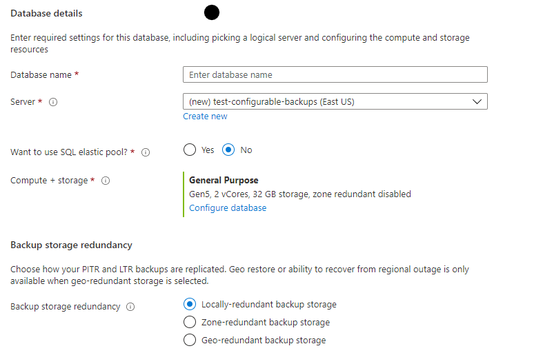

# Automated backups - Azure SQL Database & Azure SQL Managed Instance

[!INCLUDE[appliesto-sqldb-sqlmi](../includes/appliesto-sqldb-sqlmi.md)]

[!INCLUDE [GDPR-related guidance](../../../includes/gdpr-intro-sentence.md)]

## What is a database backup?

Database backups are an essential part of any business continuity and disaster recovery strategy, because they protect your data from corruption or deletion. These backups enable database restore to a point in time within the configured retention period. If your data protection rules require that your backups are available for an extended time (up to 10 years), you can configure [long-term retention](long-term-retention-overview.md) for both single and pooled databases.

### Backup frequency

Both SQL Database and SQL Managed Instance use SQL Server technology to create [full backups](/sql/relational-databases/backup-restore/full-database-backups-sql-server) every week, [differential backups](/sql/relational-databases/backup-restore/differential-backups-sql-server) every 12-24 hours, and [transaction log backups](/sql/relational-databases/backup-restore/transaction-log-backups-sql-server) every 5 to 10 minutes. The frequency of transaction log backups is based on the compute size and the amount of database activity.

When you restore a database, the service determines which full, differential, and transaction log backups need to be restored.

### Backup storage redundancy

By default, SQL Database and SQL Managed Instance store data in geo-redundant [storage blobs](../../storage/common/storage-redundancy.md) that are replicated to a [paired region](../../best-practices-availability-paired-regions.md). Geo-redundancy helps to protect against outages impacting backup storage in the primary region and allows you to restore your server to a different region in the event of a disaster. 

The option to configure backup storage redundancy provides the flexibility to choose between locally redundant, zone-redundant, or geo-redundant storage blobs. To ensure that your data stays within the same region where your managed instance or SQL database is deployed, you can change the default geo-redundant backup storage redundancy and configure either locally redundant or zone-redundant storage blobs for backups. Storage redundancy mechanisms store multiple copies of your data so that it is protected from planned and unplanned events, including transient hardware failure, network or power outages, or massive natural disasters. The configured backup storage redundancy is applied to both short-term backup retention settings that are used for point in time restore (PITR) and long-term retention backups used for long-term backups (LTR). 

For SQL Database, the backup storage redundancy can be configured at the time of database creation or can be updated for an existing database; the changes made to an existing database apply to future backups only. After the backup storage redundancy of an existing database is updated, it may take up to 48 hours for the changes to be applied. Geo-restore is disabled as soon as a database is updated to use local or zone redundant storage. 


> [!IMPORTANT]
> Backup storage redundancy for Hyperscale and SQL Managed Instance can only be set during database creation. This setting cannot be modified once the resource is provisioned. [Database copy](database-copy.md) process can be used to update the backup storage redundancy settings for an existing Hyperscale database. 

> [!IMPORTANT]
> Zone-redundant storage is currently only available in [certain regions](../../storage/common/storage-redundancy.md#zone-redundant-storage). 

> [!NOTE]
> Configurable Backup Storage Redundancy for Azure SQL Database is currently available in public preview in all Azure regions and generally available in Southeast Asia Azure region  only. 

### Backup usage

You can use these backups to:

- **Point-in-time restore of existing database** - [Restore an existing database to a point in time in the past](recovery-using-backups.md#point-in-time-restore) within the retention period by using Azure portal, Azure PowerShell, Azure CLI, or REST API. For SQL Database, this operation creates a new database on the same server as the original database, but uses a different name to avoid overwriting the original database. After restore completes, you can delete the original database. Alternatively, you can [rename](/sql/relational-databases/databases/rename-a-database) both the original database, and then rename the restored database to the original database name. Similarly, for SQL Managed Instance, this operation creates a copy of the database on the same or different managed instance in the same subscription and same region.
- **Point-in-time restore of deleted database** - [Restore a deleted database to the time of deletion](recovery-using-backups.md#deleted-database-restore) or to any point in time within the retention period. The deleted database can be restored only on the same server or managed instance where the original database was created. When deleting a database, the service takes a final transaction log backup before deletion, to prevent any data loss.
- **Geo-restore** - [Restore a database to another geographic region](recovery-using-backups.md#geo-restore). Geo-restore allows you to recover from a geographic disaster when you cannot access your database or backups in the primary region. It creates a new database on any existing server or managed instance, in any Azure region.
   > [!IMPORTANT]
   > Geo-restore is available only for SQL databases or managed instances configured with geo-redundant backup storage.
- **Restore from long-term backup** - [Restore a database from a specific long-term backup](long-term-retention-overview.md) of a single database or pooled database, if the database has been configured with a long-term retention policy (LTR). LTR allows you to restore an old version of the database by using [the Azure portal](long-term-backup-retention-configure.md#using-the-azure-portal) or [Azure PowerShell](long-term-backup-retention-configure.md#using-powershell) to satisfy a compliance request or to run an old version of the application. For more information, see [Long-term retention](long-term-retention-overview.md).

> [!NOTE]
> In Azure Storage, the term *replication* refers to copying blobs from one location to another. In SQL, *database replication* refers to various technologies used to keep multiple secondary databases synchronized with a primary database.

### <a id="restore-capabilities"></a>Restore capabilities and features of Azure SQL Database and Azure SQL Managed Instance

This table summarizes the capabilities and features of [point in time restore (PITR)](recovery-using-backups.md#point-in-time-restore), [geo-restore](recovery-using-backups.md#geo-restore), and [long-term retention backups](long-term-retention-overview.md).

| **Backup Properties** | Point in time recovery (PITR) | Geo-restore | Long-term backup restore |           
|----|--|--|--|
| **Types of SQL backup** | Full, Differential, Log | Replicated copies of PITR backups | Only the full backups | 
| **Recovery Point Objective (RPO)** |  5-10 minutes, based on compute size and amount of database activity. | Up to 1 hour, based on geo-replication.\*  |  One week (or user's policy).|
| **Recovery Time Objective (RTO)** | Restore usually takes <12 hours, but could take longer dependent on size and activity. See [Recovery](recovery-using-backups.md#recovery-time). | Restore usually takes <12 hours, but could take longer dependent on size and activity. See [Recovery](recovery-using-backups.md#recovery-time). | Restore usually takes <12 hours, but could take longer dependent on size and activity. See [Recovery](recovery-using-backups.md#recovery-time). | 
| **Retention** | 7 days by default, Up to 35 days |  Enabled by default, same as source.\*\* | Not enabled by default, Retention Up to 10 years. |     
| **Azure storage**  | Geo-redundant by default. Can optionally configure zone or locally redundant storage. | Available when PITR backup storage redundancy is set to Geo-redundant. Not available when PITR backup store is zone or locally redundant storage. | Geo-redundant by default. Can configure zone or locally redundant storage. | 
| **Use to create new database in same region** | Supported | Supported | Supported |
| **Use to create new database in another region** | Not Supported | Supported in any Azure region | Supported in any Azure region |
| **Use to create new database in another Subscription** |  Not Supported  |  Not Supported\*\*\* | Not Supported\*\*\*  | 
| **Restore via Azure portal**|Yes|Yes|Yes|
| **Restore via PowerShell** |Yes|Yes|Yes| 
| **Restore via Azure CLI** |Yes|Yes|Yes| 
| | | | |

\* For business-critical applications that require large databases and must ensure business continuity, use [Auto-failover groups](auto-failover-group-overview.md). 

\*\* All PITR backups are stored on geo-redundant storage by default. Hence, geo-restore is enabled by default. 

\*\*\* Workaround is to restore to a new server and use Resource Move to move the server to another Subscription.

### Restoring a database from backups 

To perform a restore, see [Restore database from backups](recovery-using-backups.md). You can try backup configuration and restore operations using the following examples:

| Operation | Azure portal | Azure PowerShell |
|---|---|---|
| **Change backup retention** | [SQL Database](automated-backups-overview.md?tabs=single-database#change-the-pitr-backup-retention-period-by-using-the-azure-portal) <br/> [SQL Managed Instance](automated-backups-overview.md?tabs=managed-instance#change-the-pitr-backup-retention-period-by-using-the-azure-portal) | [SQL Database](automated-backups-overview.md#change-the-pitr-backup-retention-period-by-using-powershell) <br/>[SQL Managed Instance](/powershell/module/az.sql/set-azsqlinstancedatabasebackupshorttermretentionpolicy) |
| **Change long-term backup retention** | [SQL Database](long-term-backup-retention-configure.md#configure-long-term-retention-policies)<br/> [SQL Managed Instance](../managed-instance/long-term-backup-retention-configure.md#using-the-azure-portal) | [SQL Database](long-term-backup-retention-configure.md)<br/>[SQL Managed Instance](../managed-instance/long-term-backup-retention-configure.md#using-powershell)  |
| **Restore a database from a point in time** | [SQL Database](recovery-using-backups.md#point-in-time-restore)<br>[SQL Managed Instance](../managed-instance/point-in-time-restore.md) | [SQL Database](/powershell/module/az.sql/restore-azsqldatabase) <br/> [SQL Managed Instance](/powershell/module/az.sql/restore-azsqlinstancedatabase) |
| **Restore a deleted database** | [SQL Database](recovery-using-backups.md)<br>[SQL Managed Instance](../managed-instance/point-in-time-restore.md#restore-a-deleted-database) | [SQL Database](/powershell/module/az.sql/get-azsqldeleteddatabasebackup) <br/> [SQL Managed Instance](/powershell/module/az.sql/get-azsqldeletedinstancedatabasebackup)|
| **Restore a database from Azure Blob storage** | SQL Database - N/A <br/>SQL Managed Instance - N/A  | SQL Database - N/A <br/>[SQL Managed Instance](../managed-instance/restore-sample-database-quickstart.md) |

## Backup scheduling

The first full backup is scheduled immediately after a new database is created or restored. This backup usually completes within 30 minutes, but it can take longer when the database is large. For example, the initial backup can take longer on a restored database or a database copy, which would typically be larger than a new database. After the first full backup, all further backups are scheduled and managed  automatically. The exact timing of all database backups is determined by the SQL Database or SQL Managed Instance service as it balances the overall system workload. You cannot change the schedule of backup jobs or disable them.

> [!IMPORTANT]
> For a new, restored, or copied database, point-in-time restore capability becomes available from the time when the initial transaction log backup that follows the initial full backup is created.

## Backup storage consumption

With SQL Server backup and restore technology, restoring a database to a point in time requires an uninterrupted backup chain consisting of one full backup, optionally one differential backup, and one or more transaction log backups. SQL Database and SQL Managed Instance backup schedule includes one full backup every week. Therefore, to provide PITR within the entire retention period, the system must store additional full, differential, and transaction log backups for up to a week longer than the configured retention period. 

In other words, for any point in time during the retention period, there must be a full backup that is older than the oldest time of the retention period, as well as an uninterrupted chain of differential and transaction log backups from that full backup until the next full backup.

> [!NOTE]
> To provide PITR, additional backups are stored for up to a week longer than the configured retention period. Backup storage is charged at the same rate for all backups. 

Backups that are no longer needed to provide PITR functionality are automatically deleted. Because differential backups and log backups require an earlier full backup to be restorable, all three backup types are purged together in weekly sets.

For all databases including [TDE encrypted](transparent-data-encryption-tde-overview.md) databases, backups are compressed to reduce backup storage compression and costs. Average backup compression ratio is 3-4 times, however it can be significantly lower or higher depending on the nature of the data and whether data compression is used in the database.

SQL Database and SQL Managed Instance compute your total used backup storage as a cumulative value. Every hour, this value is reported to the Azure billing pipeline, which is responsible for aggregating this hourly usage to calculate your consumption at the end of each month. After the database is deleted, consumption decreases as backups age out and are deleted. Once all backups are deleted and PITR is no longer possible, billing stops.
   
> [!IMPORTANT]
> Backups of a database are retained to provide PITR even if the database has been deleted. While deleting and re-creating a database may save storage and compute costs, it may increase backup storage costs, because the service retains backups for each deleted database, every time it is deleted. 

### Monitor consumption

For vCore databases, the storage consumed by each type of backup (full, differential, and log) is reported on the database monitoring pane as a separate metric. The following diagram shows how to monitor the backup storage consumption for a single database. This feature is currently not available for managed instances.


### Fine-tune backup storage consumption

Backup storage consumption up to the maximum data size for a database is not charged. Excess backup storage consumption will depend on the workload and maximum size of the individual databases. Consider some of the following tuning techniques to reduce your backup storage consumption:

- Reduce the [backup retention period](#change-the-pitr-backup-retention-period-by-using-the-azure-portal) to the minimum possible for your needs.
- Avoid doing large write operations, like index rebuilds, more frequently than you need to.
- For large data load operations, consider using [clustered columnstore indexes](/sql/relational-databases/indexes/columnstore-indexes-overview) and following related [best practices](/sql/relational-databases/indexes/columnstore-indexes-data-loading-guidance), and/or reduce the number of non-clustered indexes.
- In the General Purpose service tier, the provisioned data storage is less expensive than the price of the backup storage. If you have continually high excess backup storage costs, you might consider increasing data storage to save on the backup storage.
- Use TempDB instead of permanent tables in your application logic for storing temporary results and/or transient data.
- Use locally redundant backup storage whenever possible (for example dev/test environments)

## Backup retention

For all new, restored, and copied databases, Azure SQL Database and Azure SQL Managed Instance retain sufficient backups to allow PITR within the last seven days by default. With the exception of Hyperscale and Basic tier databases, you can [change backup retention period](#change-the-pitr-backup-retention-period) per each active database in the 1-35 day range. As described in [Backup storage consumption](#backup-storage-consumption), backups stored to enable PITR may be older than the retention period. For Azure SQL Managed Instance only, it is possible to set the PITR backup retention rate once a database has been deleted in the 0-35 days range. 

If you delete a database, the system keeps backups in the same way it would for an online database with its specific retention period. You cannot change backup retention period for a deleted database.

> [!IMPORTANT]
> If you delete a server or a managed instance, all databases on that server or managed instance are also deleted and cannot be recovered. You cannot restore a deleted server or managed instance. But if you had configured long-term retention (LTR) for a database or managed instance, long-term retention backups are not deleted, and can be used to restore databases on a different server or managed instance in the same subscription, to a point in time when a long-term retention backup was taken.

Backup retention for purposes of PITR within the last 1-35 days is sometimes called short-term backup retention. If you need to keep backups for longer than the maximum short-term retention period of 35 days, you can enable [Long-term retention](long-term-retention-overview.md).

### Long-term retention

For both SQL Database and SQL Managed Instance, you can configure full backup long-term retention (LTR) for up to 10 years in Azure Blob storage. After the LTR policy is configured, full backups are automatically copied to a different storage container weekly. To meet various compliance requirements, you can select different retention periods for weekly, monthly, and/or yearly full backups. Storage consumption depends on the selected frequency and retention periods of LTR backups. You can use the [LTR pricing calculator](https://azure.microsoft.com/pricing/calculator/?service=sql-database) to estimate the cost of LTR storage.

> [!IMPORTANT]
> Updating the backup storage redundancy for an existing Azure SQL Database, only applies to the future backups taken for the database. All existing LTR backups for the database will continue to reside in the existing storage blob and new backups will be stored on the requested storage blob type. 

For more information about LTR, see [Long-term backup retention](long-term-retention-overview.md).

## Backup storage costs

The price for backup storage varies and depends on your purchasing model (DTU or vCore), chosen backup storage redundancy option, and also on your region. The backup storage is charged per GB/month consumed, for pricing see [Azure SQL Database pricing](https://azure.microsoft.com/pricing/details/sql-database/single/) page and [Azure SQL Managed Instance pricing](https://azure.microsoft.com/pricing/details/azure-sql/sql-managed-instance/single/) page. 

For more on purchasing models, see [Choose between the vCore and DTU purchasing models](purchasing-models.md).

> [!NOTE]
> Azure invoice will show only the excess backup storage consumed, not the entire backup storage consumption. For example, in a hypothetical scenario, if you have provisioned 4TB of data storage, you will get 4TB of free backup storage space. In case that you have used the total of 5.8TB of backup storage space, Azure invoice will show only 1.8TB, as only excess backup storage used is charged.

### DTU model

In the DTU model, there's no additional charge for backup storage for databases and elastic pools. The price of backup storage is a part of database or pool price.

### vCore model

For single databases in SQL Database, a backup storage amount equal to 100 percent of the maximum data storage size for the database is provided at no extra charge. For elastic pools and managed instances, a backup storage amount equal to 100 percent of the maximum data storage for the pool or the maximum instance storage size, respectively, is provided at no extra charge. 

For single databases, this equation is used to calculate the total billable backup storage usage:

`Total billable backup storage size = (size of full backups + size of differential backups + size of log backups) – maximum data storage`

For pooled databases, the total billable backup storage size is aggregated at the pool level and is calculated as follows:

`Total billable backup storage size = (total size of all full backups + total size of all differential backups + total size of all log backups) - maximum pool data storage`

For managed instances, the total billable backup storage size is aggregated at the instance level and is calculated as follows:

`Total billable backup storage size = (total size of full backups + total size of differential backups + total size of log backups) – maximum instance data storage`

Total billable backup storage, if any, will be charged in GB/month as per the rate of the backup storage redundancy used. This backup storage consumption will depend on the workload and size of individual databases, elastic pools, and managed instances. Heavily modified databases have larger differential and log backups, because the size of these backups is proportional to the amount of changed data. Therefore, such databases will have higher backup charges.

SQL Database and SQL Managed Instance computes your total billable backup storage as a cumulative value across all backup files. Every hour, this value is reported to the Azure billing pipeline, which aggregates this hourly usage to get your backup storage consumption at the end of each month. If a database is deleted, backup storage consumption will gradually decrease as older backups age out and are deleted. Because differential backups and log backups require an earlier full backup to be restorable, all three backup types are purged together in weekly sets. Once all backups are deleted, billing stops. 

As a simplified example, assume a database has accumulated 744 GB of backup storage and that this amount stays constant throughout an entire month because the database is completely idle. To convert this cumulative storage consumption to hourly usage, divide it by 744.0 (31 days per month * 24 hours per day). SQL Database will report to Azure billing pipeline that the database consumed 1 GB of PITR backup each hour, at a constant rate. Azure billing will aggregate this consumption and show a usage of 744 GB for the entire month. The cost will be based on the amount/GB/month rate in your region.

Now, a more complex example. Suppose the same idle database has its retention increased from seven days to 14 days in the middle of the month. This increase results in the total backup storage doubling to 1,488 GB. SQL Database would report 1 GB of usage for hours 1 through 372 (the first half of the month). It would report the usage as 2 GB for hours 373 through 744 (the second half of the month). This usage would be aggregated to a final bill of 1,116 GB/month.

Actual backup billing scenarios are more complex. Because the rate of changes in the database depends on the workload and is variable over time, the size of each differential and log backup will vary as well, causing the hourly backup storage consumption to fluctuate accordingly. Furthermore, each differential backup contains all changes made in the database since the last full backup, thus the total size of all differential backups gradually increases over the course of a week, and then drops sharply once an older set of full, differential, and log backups ages out. For example, if a heavy write activity such as index rebuild has been run just after a full backup completed, then the modifications made by the index rebuild will be included in the transaction log backups taken over the duration of rebuild, in the next differential backup, and in every differential backup taken until the next full backup occurs. For the latter scenario in larger databases, an optimization in the service creates a full backup instead of a differential backup if a differential backup would be excessively large otherwise. This reduces the size of all differential backups until the following full backup.

You can monitor total backup storage consumption for each backup type (full, differential, transaction log) over time as described in [Monitor consumption](#monitor-consumption).

### Backup storage redundancy

Backup storage redundancy impacts backup costs in the following way:
- locally redundant price = x
- zone-redundant price = 1.25x
- geo-redundant price = 2x

For more details about backup storage pricing visit [Azure SQL Database pricing page](https://azure.microsoft.com/pricing/details/sql-database/single/) and [Azure SQL Managed Instance pricing page](https://azure.microsoft.com/pricing/details/azure-sql/sql-managed-instance/single/).

> [!IMPORTANT]
> Configurable backup storage redundancy for SQL Managed instance is available in all Azure regions and currently available in Southeast Asia Azure region only for SQL Database. For Managed Instance it can only be specified during the create managed instance process. Once the resource is provisioned, you cannot change the backup storage redundancy option.

### Monitor costs

To understand backup storage costs, go to **Cost Management + Billing** in the Azure portal, select **Cost Management**, and then select **Cost analysis**. Select the desired subscription as the **Scope**, and then filter for the time period and service that you're interested in.

Add a filter for **Service name**, and then select **sql database** in the drop-down list. Use the **meter subcategory** filter to choose the billing counter for your service. For a single database or an elastic database pool, select **single/elastic pool PITR backup storage**. For a managed instance, select **mi PITR backup storage**. The **Storage** and **compute** subcategories might interest you as well, but they're not associated with backup storage costs.


  >[!NOTE]
  > Meters are only visible for counters that are currently in use. If a counter is not available, it is likely that the category is not currently being used. For example, managed instance counters will not be present for customers who do not have a managed instance deployed. Likewise, storage counters will not be visible for resources that are not consuming storage. 

For more information, see [Azure SQL Database cost management](cost-management.md).

## Encrypted backups

If your database is encrypted with TDE, backups are automatically encrypted at rest, including LTR backups. All new databases in Azure SQL are configured with TDE enabled by default. For more information on TDE, see  [Transparent Data Encryption with SQL Database & SQL Managed Instance](/sql/relational-databases/security/encryption/transparent-data-encryption-azure-sql).

## Backup integrity

On an ongoing basis, the Azure SQL engineering team automatically tests the restore of automated database backups. (This testing is not currently available in SQL Managed Instance. You should schedule DBCC CHECKDB on your databases in SQL Managed Instance, scheduled around on your workload.)

Upon point-in-time restore, databases also receive DBCC CHECKDB integrity checks.

Any issues found during the integrity check will result in an alert to the engineering team. For more information, see [Data Integrity in SQL Database](https://azure.microsoft.com/blog/data-integrity-in-azure-sql-database/).

All database backups are taken with the CHECKSUM option to provide additional backup integrity.

## Compliance

When you migrate your database from a DTU-based service tier to a vCore-based service tier, the PITR retention is preserved to ensure that your application's data recovery policy isn't compromised. If the default retention doesn't meet your compliance requirements, you can change the PITR retention period. For more information, see [Change the PITR backup retention period](#change-the-pitr-backup-retention-period).

[!INCLUDE [GDPR-related guidance](../../../includes/gdpr-intro-sentence.md)]

## Change the PITR backup retention period

You can change the default PITR backup retention period by using the Azure portal, PowerShell, or the REST API. The following examples illustrate how to change the PITR retention to 28 days.

> [!WARNING]
> If you reduce the current retention period, you lose the ability to restore to points in time older than the new retention period. Backups that are no longer needed to provide PITR within the new retention period are deleted. If you increase the current retention period, you do not immediately gain the ability to restore to older points in time within the new retention period. You gain that ability over time, as the system starts to retain backups for longer.

> [!NOTE]
> These APIs will affect only the PITR retention period. If you configured LTR for your database, it won't be affected. For information about how to change LTR retention periods, see [Long-term retention](long-term-retention-overview.md).

### Change the PITR backup retention period by using the Azure portal

To change the PITR backup retention period for active databases by using the Azure portal, go to the server or managed instance with the databases whose retention period you want to change. Select **Backups** in the left pane, then select the **Retention policies** tab. Select the database(s) for which you want to change the PITR backup retention. Then select **Configure retention** from the action bar.

#### [SQL Database](#tab/single-database)


#### [SQL Managed Instance](#tab/managed-instance)


---

### Change the PITR backup retention period by using PowerShell

[!INCLUDE [updated-for-az](../../../includes/updated-for-az.md)]
> [!IMPORTANT]
> The PowerShell AzureRM module is still supported by SQL Database and SQL Managed Instance, but all future development is for the Az.Sql module. For more information, see [AzureRM.Sql](/powershell/module/AzureRM.Sql/). The arguments for the commands in the Az module are substantially identical to those in the AzureRm modules.

#### [SQL Database](#tab/single-database)

To change the PITR backup retention for active Azure SQL Databases, use the following PowerShell example.

```powershell
# SET new PITR backup retention period on an active individual database
# Valid backup retention must be between 1 and 35 days
Set-AzSqlDatabaseBackupShortTermRetentionPolicy -ResourceGroupName resourceGroup -ServerName testserver -DatabaseName testDatabase -RetentionDays 28
```

#### [SQL Managed Instance](#tab/managed-instance)

To change the PITR backup retention for an **single active** database in a SQL Managed Instance, use the following PowerShell example.

```powershell
# SET new PITR backup retention period on an active individual database
# Valid backup retention must be between 1 and 35 days
Set-AzSqlInstanceDatabaseBackupShortTermRetentionPolicy -ResourceGroupName resourceGroup -InstanceName testserver -DatabaseName testDatabase -RetentionDays 1
```

To change the PITR backup retention for **all active** databases in a SQL Managed Instance, use the following PowerShell example.

```powershell
# SET new PITR backup retention period for ALL active databases
# Valid backup retention must be between 1 and 35 days
Get-AzSqlInstanceDatabase -ResourceGroupName resourceGroup -InstanceName testserver | Set-AzSqlInstanceDatabaseBackupShortTermRetentionPolicy -RetentionDays 1
```

To change the PITR backup retention for an **single deleted** database in a SQL Managed Instance, use the following PowerShell example.
 
```powershell
# SET new PITR backup retention on an individual deleted database
# Valid backup retention must be between 0 (no retention) and 35 days. Valid retention rate can only be lower than the period of the retention period when database was active, or remaining backup days of a deleted database.
Get-AzSqlDeletedInstanceDatabaseBackup -ResourceGroupName resourceGroup -InstanceName testserver -DatabaseName testDatabase | Set-AzSqlInstanceDatabaseBackupShortTermRetentionPolicy -RetentionDays 0
```

To change the PITR backup retention for **all deleted** databases in a SQL Managed Instance, use the following PowerShell example.

```powershell
# SET new PITR backup retention for ALL deleted databases
# Valid backup retention must be between 0 (no retention) and 35 days. Valid retention rate can only be lower than the period of the retention period when database was active, or remaining backup days of a deleted database
Get-AzSqlDeletedInstanceDatabaseBackup -ResourceGroupName resourceGroup -InstanceName testserver | Set-AzSqlInstanceDatabaseBackupShortTermRetentionPolicy -RetentionDays 0
```

Zero (0) days retention would denote that backup is immediately deleted and no longer kept for a deleted database.
Once PITR backup retention has been reduced for a deleted database, it no longer can be increased.

---

### Change the PITR backup retention period by using the REST API

#### Sample request

```http
PUT https://management.azure.com/subscriptions/00000000-1111-2222-3333-444444444444/resourceGroups/resourceGroup/providers/Microsoft.Sql/servers/testserver/databases/testDatabase/backupShortTermRetentionPolicies/default?api-version=2017-10-01-preview
```

#### Request body

```json
{
  "properties":{
    "retentionDays":28
  }
}
```

#### Sample response

Status code: 200

```json
{
  "id": "/subscriptions/00000000-1111-2222-3333-444444444444/providers/Microsoft.Sql/resourceGroups/resourceGroup/servers/testserver/databases/testDatabase/backupShortTermRetentionPolicies/default",
  "name": "default",
  "type": "Microsoft.Sql/resourceGroups/servers/databases/backupShortTermRetentionPolicies",
  "properties": {
    "retentionDays": 28
  }
}
```

For more information, see [Backup Retention REST API](/rest/api/sql/backupshorttermretentionpolicies).

#### Sample request

```http
PUT https://management.azure.com/subscriptions/00000000-1111-2222-3333-444444444444/resourceGroups/resourceGroup/providers/Microsoft.Sql/servers/testserver/databases/testDatabase/backupShortTermRetentionPolicies/default?api-version=2017-10-01-preview
```

#### Request body

```json
{
  "properties":{
    "retentionDays":28
  }
}
```

#### Sample response

Status code: 200

```json
{
  "id": "/subscriptions/00000000-1111-2222-3333-444444444444/providers/Microsoft.Sql/resourceGroups/resourceGroup/servers/testserver/databases/testDatabase/backupShortTermRetentionPolicies/default",
  "name": "default",
  "type": "Microsoft.Sql/resourceGroups/servers/databases/backupShortTermRetentionPolicies",
  "properties": {
    "retentionDays": 28
  }
}
```

For more information, see [Backup Retention REST API](/rest/api/sql/backupshorttermretentionpolicies).

## Configure backup storage redundancy

> [!NOTE]
> Configurable storage redundancy for backups for SQL Managed Instance can only be specified during the create managed instance process. Once the resource is provisioned, you can't change the backup storage redundancy option. For SQL Database, public preview of this feature is currently available in all Azure regions and it is generally available in Southeast Asia Azure region. 

A backup storage redundancy of a managed instance can be set during instance creation only. For a SQL Database it can be set when creating the database or can be updated for an existing database. The default value is geo-redundant storage. For differences in pricing between locally redundant, zone-redundant and geo-redundant backup storage visit [managed instance pricing page](https://azure.microsoft.com/pricing/details/azure-sql/sql-managed-instance/single/).

### Configure backup storage redundancy by using the Azure portal

#### [SQL Database](#tab/single-database)

In Azure portal, you can configure the backup storage redundancy on the **Create SQL Database** pane. The option is available under the Backup Storage Redundancy section. 


#### [SQL Managed Instance](#tab/managed-instance)

In the Azure portal, the option to change backup storage redundancy is located on the **Compute + storage** pane accessible from the **Configure Managed Instance** option on the **Basics** tab when you are creating your SQL Managed Instance.


Find the option to select backup storage redundancy on the **Compute + storage** pane.


---

### Configure backup storage redundancy by using PowerShell

#### [SQL Database](#tab/single-database)

To configure backup storage redundancy when creating a new database, you can specify the -BackupStorageRedundancy parameter. Possible values are Geo, Zone, and Local. By default, all SQL Databases use geo-redundant storage for backups. Geo-restore is disabled if a database is created with local or zone redundant backup storage. 

```powershell
# Create a new database with geo-redundant backup storage.  
New-AzSqlDatabase -ResourceGroupName "ResourceGroup01" -ServerName "Server01" -DatabaseName "Database03" -Edition "GeneralPurpose" -Vcore 2 -ComputeGeneration "Gen5" -BackupStorageRedundancy Geo
```

For details visit [New-AzSqlDatabase](/powershell/module/az.sql/new-azsqldatabase).

To update backup storage redundancy of an existing database, you can use the -BackupStorageRedundancy parameter. Possible values are Geo, Zone, and Local.
It may take up to 48 hours for the changes to be applied on the database. Switching from geo-redundant backup storage to local or zone redundant storage disables geo-restore. 

```powershell
# Change the backup storage redundancy for Database01 to zone-redundant. 
Set-AzSqlDatabase -ResourceGroupName "ResourceGroup01" -DatabaseName "Database01" -ServerName "Server01" -BackupStorageRedundancy Zone
```

For details visit [Set-AzSqlDatabase](/powershell/module/az.sql/set-azsqldatabase)

> [!NOTE]
> To use -BackupStorageRedundancy parameter with database restore, database copy or create secondary operations, use Azure PowerShell version Az.Sql 2.11.0. 


#### [SQL Managed Instance](#tab/managed-instance)

For configuring backup storage redundancy during managed instance creation, you can specify -BackupStorageRedundancy parameter. Possible values are Geo, Zone, and Local.

```powershell
New-AzSqlInstance -Name managedInstance2 -ResourceGroupName ResourceGroup01 -Location westcentralus -AdministratorCredential (Get-Credential) -SubnetId "/subscriptions/xxxxxxxx-xxxx-xxxx-xxxx-xxxxxxxxxxxx/resourceGroups/resourcegroup01/providers/Microsoft.Network/virtualNetworks/vnet_name/subnets/subnet_name" -LicenseType LicenseIncluded -StorageSizeInGB 1024 -VCore 16 -Edition "GeneralPurpose" -ComputeGeneration Gen4 -BackupStorageRedundancy Geo
```

For more information, see [New-AzSqlInstance](/powershell/module/az.sql/new-azsqlinstance).

---

## Use Azure Policy to enforce backup storage redundancy

If you have data residency requirements that require you to keep all your data in a single Azure region, you may want to enforce zone-redundant or locally redundant backups for your SQL Database or Managed Instance using Azure Policy. 
Azure Policy is a service that you can use to create, assign, and manage policies that apply rules to Azure resources. Azure Policy helps you to keep these resources compliant with your corporate standards and service level agreements. For more information, see [Overview of Azure Policy](../../governance/policy/overview.md). 

### Built-in backup storage redundancy policies 

Following new built-in policies are added, which can be assigned at the subscription or resource group level to block creation of new database(s) or instance(s) with geo-redundant backup storage. 

[SQL Database should avoid using GRS backup redundancy](https://portal.azure.com/#blade/Microsoft_Azure_Policy/PolicyDetailBlade/definitionId/%2Fproviders%2FMicrosoft.Authorization%2FpolicyDefinitions%2Fb219b9cf-f672-4f96-9ab0-f5a3ac5e1c13)


[SQL Managed Instances should avoid using GRS backup redundancy](https://portal.azure.com/#blade/Microsoft_Azure_Policy/PolicyDetailBlade/definitionId/%2Fproviders%2FMicrosoft.Authorization%2FpolicyDefinitions%2Fa9934fd7-29f2-4e6d-ab3d-607ea38e9079)

A full list of built-in policy definitions for SQL Database and Managed Instance can be found [here](./policy-reference.md).

To enforce data residency requirements at an organizational level, these policies can be assigned to a subscription. After these policies are assigned at a subscription level, users in the given subscription will not be able to create a database or a managed instance with geo-redundant backup storage via Azure portal or Azure PowerShell. 

> [!IMPORTANT]
> Azure policies are not enforced when creating a database via T-SQL. To enforce data residency when creating a database using T-SQL, [use 'LOCAL' or 'ZONE' as input to BACKUP_STORAGE_REDUNDANCY paramater in CREATE DATABASE statement](/sql/t-sql/statements/create-database-transact-sql#create-database-using-zone-redundancy-for-backups).

Learn how to assign policies using the [Azure portal](../../governance/policy/assign-policy-portal.md) or [Azure PowerShell](../../governance/policy/assign-policy-powershell.md)

## Next steps

- Database backups are an essential part of any business continuity and disaster recovery strategy because they protect your data from accidental corruption or deletion. To learn about the other SQL Database business continuity solutions, see [Business continuity overview](business-continuity-high-availability-disaster-recover-hadr-overview.md).
- For information about how to configure, manage, and restore from long-term retention of automated backups in Azure Blob storage by using the Azure portal, see [Manage long-term backup retention by using the Azure portal](long-term-backup-retention-configure.md).
- For information about how to configure, manage, and restore from long-term retention of automated backups in Azure Blob storage by using PowerShell, see [Manage long-term backup retention by using PowerShell](long-term-backup-retention-configure.md#using-powershell). 
- Get more information about how to [restore a database to a point in time by using the Azure portal](recovery-using-backups.md).
- Get more information about how to [restore a database to a point in time by using PowerShell](scripts/restore-database-powershell.md).
- To learn all about backup storage consumption on Azure SQL Managed Instance, see [Backup storage consumption on Managed Instance explained](https://aka.ms/mi-backup-explained).
- To learn how to fine-tune backup storage retention and costs for Azure SQL Managed Instance, see [Fine tuning backup storage costs on Managed Instance](https://aka.ms/mi-backup-tuning).
