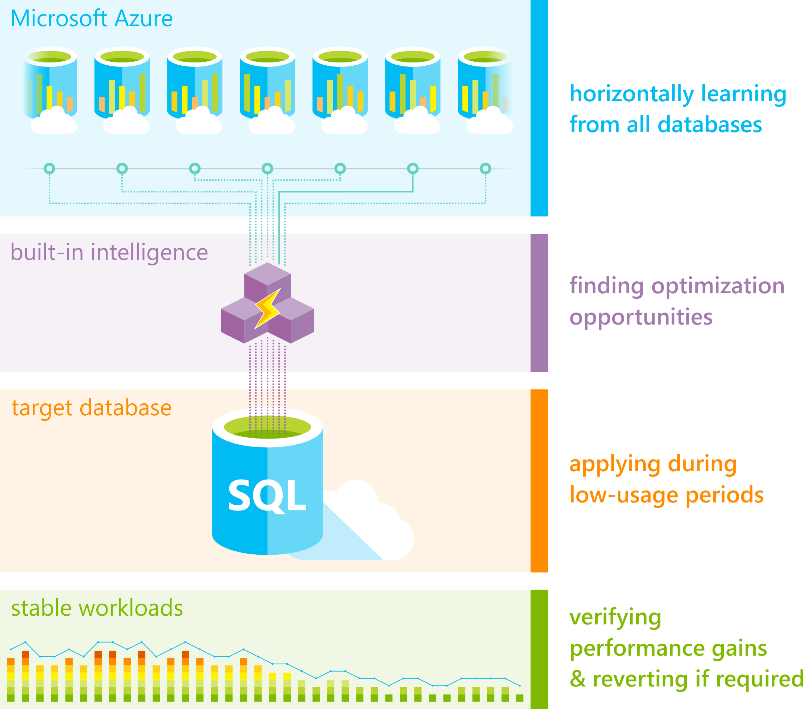

# Automatic tuning in Azure SQL Database and Azure SQL Managed Instance
[!INCLUDE[appliesto-sqldb-sqlmi](../includes/appliesto-sqldb-sqlmi.md)]

Azure SQL Database and Azure SQL Managed Instance automatic tuning provides peak performance and stable workloads through continuous performance tuning based on AI and machine learning.

Automatic tuning is a fully managed intelligent performance service that uses built-in intelligence to continuously monitor queries executed on a database, and it automatically improves their performance. This is achieved through dynamically adapting database to the changing workloads and applying tuning recommendations. Automatic tuning learns horizontally from all databases on Azure through AI and it dynamically improves its tuning actions. The longer a database runs with automatic tuning on, the better it performs.

Azure SQL Database and Azure SQL Managed Instance automatic tuning might be one of the most important features that you can enable to provide stable and peak performing database workloads.

## What can automatic tuning do for you

- Automated performance tuning of databases
- Automated verification of performance gains
- Automated rollback and self-correction
- Tuning history
- Tuning action Transact-SQL (T-SQL) scripts for manual deployments
- Proactive workload performance monitoring
- Scale out capability on hundreds of thousands of databases
- Positive impact to DevOps resources and the total cost of ownership

## Safe, Reliable, and Proven

Tuning operations applied to databases in Azure SQL Database are fully safe for the performance of your most intense workloads. The system has been designed with care not to interfere with the user workloads. Automated tuning recommendations are applied only at the times of a low utilization. The system can also temporarily disable automatic tuning operations to protect the workload performance. In such case, "Disabled by the system" message will be shown in Azure portal. Automatic tuning regards workloads with the highest resource priority.

Automatic tuning mechanisms are mature and have been perfected on several million databases running on Azure. Automated tuning operations applied are verified automatically to ensure there is a positive improvement to the workload performance. Regressed performance recommendations are dynamically detected and promptly reverted. Through the tuning history recorded, there exists a clear trace of tuning improvements made to each database in Azure SQL Database and Azure SQL Managed Instance.

Azure SQL Database automatic tuning is sharing its core logic with the SQL Server automatic tuning feature in the database engine. For additional technical information on the built-in intelligence mechanism, see [SQL Server automatic tuning](https://docs.microsoft.com/sql/relational-databases/automatic-tuning/automatic-tuning).

For an overview of how automatic tuning works and for typical usage scenarios, see the embedded video:

> [!VIDEO https://channel9.msdn.com/Shows/Azure-Friday/Improve-Azure-SQL-Database-Performance-with-automatic-tuning/player]

## Enable automatic tuning

- You [enable automatic tuning for Azure SQL Database in the Azure portal](automatic-tuning-enable.md) or by using the [ALTER DATABASE](https://docs.microsoft.com/sql/t-sql/statements/alter-database-transact-sql-set-options?view=azuresqldb-current) T-SQL statement.
- You enable automatic tuning for Azure SQL Managed Instance by using the [ALTER DATABASE](https://docs.microsoft.com/sql/t-sql/statements/alter-database-transact-sql-set-options?view=azuresqldb-mi-current) T-SQL statement.

## Automatic tuning options

The automatic tuning options available in Azure SQL Database and Azure SQL Managed Instance  are:

| Automatic tuning option | Single database and pooled database support | Instance database support |
| :----------------------------- | ----- | ----- |
| **CREATE INDEX** - Identifies indexes that may improve performance of your workload, creates indexes, and automatically verifies that performance of queries has improved. | Yes | No |
| **DROP INDEX** - Identifies redundant and duplicate indexes daily, except for unique indexes, and indexes that were not used for a long time (>90 days). Please note that this option is not compatible with applications using partition switching and index hints. Dropping unused indexes is not supported for Premium and Business Critical service tiers. | Yes | No |
| **FORCE LAST GOOD PLAN** (automatic plan correction) - Identifies Azure SQL queries using an execution plan that is slower than the previous good plan, and queries using the last known good plan instead of the regressed plan. | Yes | Yes |

### Automatic tuning for SQL Database

Automatic tuning for Azure SQL Database uses the **CREATE INDEX**, **DROP INDEX**, and **FORCE LAST GOOD PLAN** database advisor recommendations to optimize your database performance. For more information, see [Database advisor recommendations in the Azure portal](database-advisor-find-recommendations-portal.md), in [PowerShell](https://docs.microsoft.com/powershell/module/az.sql/get-azsqldatabaserecommendedaction), and in the [REST API](https://docs.microsoft.com/rest/api/sql/serverautomatictuning).

You can either manually apply tuning recommendations using the Azure portal or you can let automatic tuning autonomously apply tuning recommendations for you. The benefits of letting the system autonomously apply tuning recommendations for you is that it automatically validates there exists a positive gain to the workload performance, and if there is no significant performance improvement detected, it will automatically revert the tuning recommendation. Please note that in case of queries affected by tuning recommendations that are not executed frequently, the validation phase can take up to 72 hrs by design.

In case you are applying tuning recommendations through T-SQL, the automatic performance validation, and reversal mechanisms are not available. Recommendations applied in such way will remain active and shown in the list of tuning recommendations for 24-48 hrs. before the system automatically withdraws them. If you would like to remove a recommendation sooner, you can discard it from Azure portal.

Automatic tuning options can be independently enabled or disabled per database, or they can be configured at the server-level and applied on every database that inherits settings from the server. Servers can inherit Azure defaults for automatic tuning settings. Azure defaults at this time are set to FORCE_LAST_GOOD_PLAN is enabled, CREATE_INDEX is enabled, and DROP_INDEX is disabled.

> [!IMPORTANT]
> As of March, 2020 changes to Azure defaults for automatic tuning will take effect as follows:
>
> - New Azure defaults will be FORCE_LAST_GOOD_PLAN = enabled, CREATE_INDEX = disabled, and DROP_INDEX = disabled.
> - Existing servers with no automatic tuning preferences configured will be automatically configured to INHERIT the new Azure defaults. This applies to all customers currently having server settings for automatic tuning in an undefined state.
> - New servers created will automatically be configured to INHERIT the new Azure defaults (unlike earlier when automatic tuning configuration was in an undefined state upon new server creation).

Configuring automatic tuning options on a server and inheriting settings for databases belonging to the parent server is a recommended method for configuring automatic tuning as it simplifies management of automatic tuning options for a large number of databases.

To learn about building email notifications for automatic tuning recommendations, see [Email notifications for automatic tuning](automatic-tuning-email-notifications-configure.md).

### Automatic tuning for Azure SQL Managed Instance

Automatic tuning for SQL Managed Instance only supports **FORCE LAST GOOD PLAN**. For more information about configuring automatic tuning options through T-SQL, see [Automatic tuning introduces automatic plan correction](https://azure.microsoft.com/blog/automatic-tuning-introduces-automatic-plan-correction-and-t-sql-management/) and [Automatic plan correction](https://docs.microsoft.com/sql/relational-databases/automatic-tuning/automatic-tuning?view=sql-server-ver15#automatic-plan-correction).

## Next steps

- To learn about built-in intelligence used in automatic tuning, see [Artificial Intelligence tunes Azure SQL Database](https://azure.microsoft.com/blog/artificial-intelligence-tunes-azure-sql-databases/).
- To learn how automatic tuning works under the hood, see [Automatically indexing millions of databases in Microsoft Azure SQL Database](https://www.microsoft.com/research/uploads/prod/2019/02/autoindexing_azuredb.pdf).
