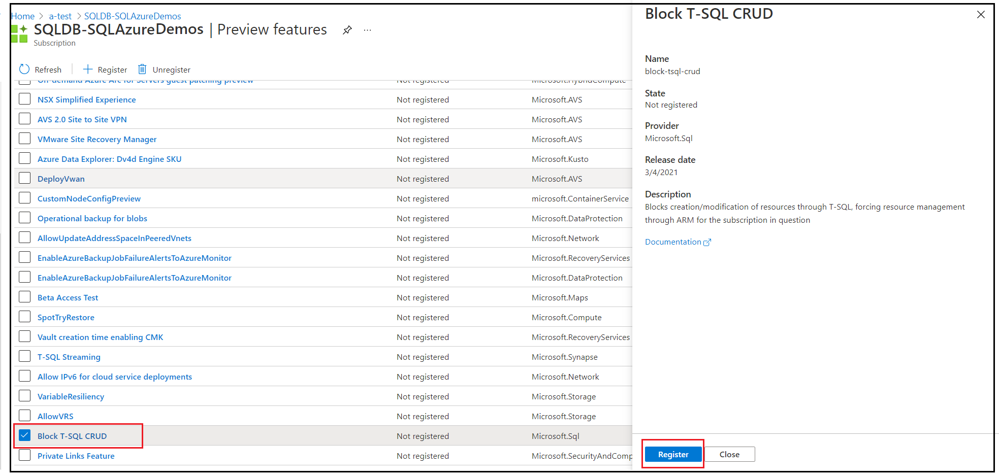
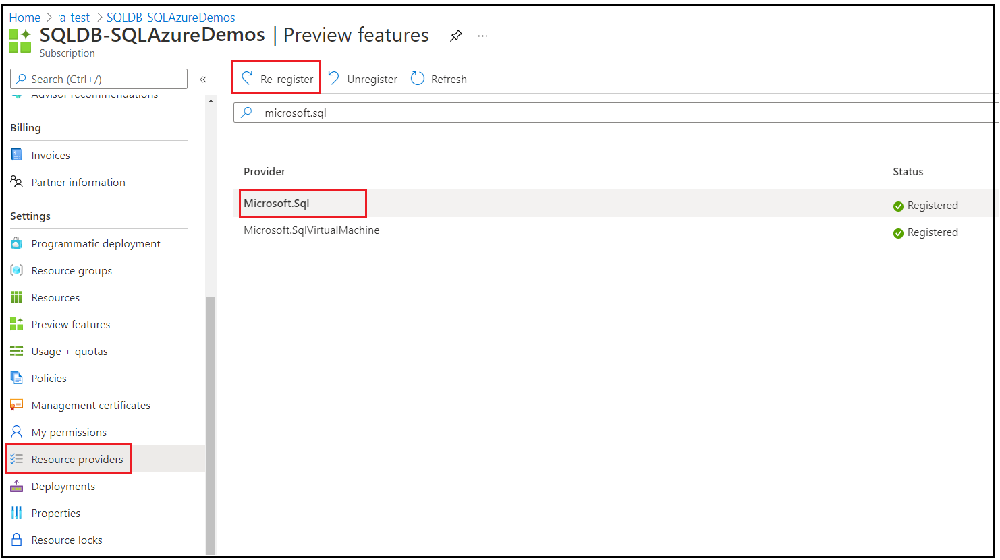

# What is Block T-SQL CRUD feature?
[!INCLUDE[appliesto-sqldb](../includes/appliesto-sqldb-sqlmi.md)]

This feature allows Azure administrators to block the creation or modification of Azure SQL resources through T-SQL. This is enforced at the subscription level to block T-SQL commands from affecting SQL resources in any Azure SQL database or managed instance.

## Overview

To block creation or modification of resources through T-SQL and enforce resource management through an Azure Resource Manager template (ARM template) for a given subscription, the subscription level preview features in Azure portal can be used. This is particularly useful when you are using [Azure Policies](../../governance/policy/overview.md) to enforce organizational standards through ARM templates. Since T-SQL does not adhere to the Azure Policies, a block on T-SQL create or modify operations can be applied. The syntax blocked includes CRUD (create, update, delete) statements for databases in Azure SQL, specifically `CREATE DATABASE`, `ALTER DATABASE`, and `DROP DATABASE` statements. 

T-SQL CRUD operations can be blocked via Azure portal, [PowerShell](/powershell/module/az.resources/register-azproviderfeature), or [Azure CLI](/cli/azure/feature#az_feature_register).

## Permissions

In order to register or remove this feature, the Azure user must be a member of the Owner or Contributor role of the subscription.

## Examples

The following section describes how you can register or unregister a preview feature with Microsoft.Sql resource provider in Azure portal: 

### Register Block T-SQL CRUD

1. Go to your subscription on Azure portal.
2. Select on **Preview Features** tab. 
3. Select **Block T-SQL CRUD**.
4. After you select on **Block T-SQL CRUD**, a new window will open, select **Register**, to register this block with Microsoft.Sql resource provider.

  
### Re-register Microsoft.sql resource provider 
After you register the block of T-SQL CRUD with Microsoft.Sql resource provider, you must re-register the Microsoft.Sql resource provider for the changes to take effect. To re-register the Microsoft.Sql resource provider:

1. Go to your subscription on Azure portal.
2. Select on **Resource Providers** tab.
3. Search and select **Microsoft.Sql** resource provider.
4. Select **Re-register**. 

> [!NOTE]
> The re-registration step is mandatory for the T-SQL block to be applied to your subscription. 

### Removing Block T-SQL CRUD
To remove the block on T-SQL create or modify operations from your subscription, first unregister the previously registered T-SQL block. Then, re-register the Microsoft.Sql resource provider as shown above for the removal of T-SQL block to take effect. 

## Next steps

- [An overview of Azure SQL Database security capabilities](security-overview.md)
- [Azure SQL Database security best practices](security-best-practice.md)