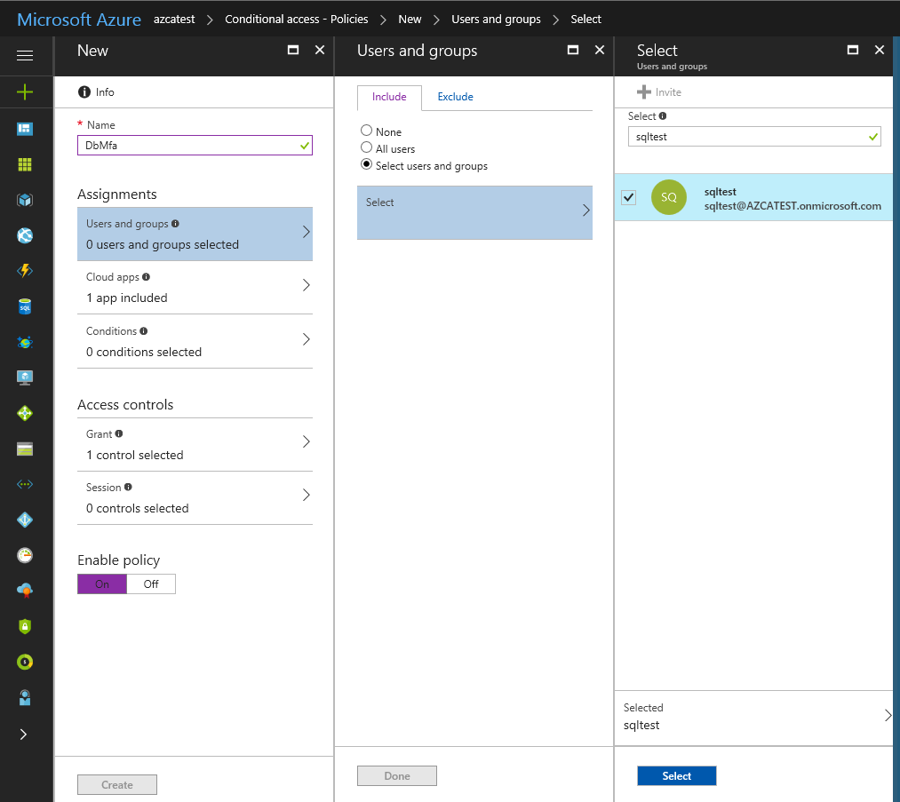

# Conditional Access with Azure SQL Database and Azure Synapse Analytics

[!INCLUDE[appliesto-sqldb-sqlmi-asa](../includes/appliesto-sqldb-sqlmi-asa.md)]

[Azure SQL Database](sql-database-paas-overview.md), [Azure SQL Managed Instance](../managed-instance/sql-managed-instance-paas-overview.md), and [Azure Synapse Analytics](../../synapse-analytics/sql-data-warehouse/sql-data-warehouse-overview-what-is.md) support Microsoft Conditional Access.

The following steps show how to configure Azure SQL Database, SQL Managed Instance, or Azure Synapse to enforce a Conditional Access (CA) policy.  

## Prerequisites

- You must configure Azure SQL Database, Azure SQL Managed Instance, or Azure SQL pool in Azure Synapse to support Azure Active Directory (Azure AD) authentication. For specific steps, see [Configure and manage Azure Active Directory authentication with SQL Database or Azure Synapse](authentication-aad-configure.md).  
- When Multi-Factor Authentication is enabled, you must connect with a supported tool, such as the latest SQL Server Management Studio (SSMS). For more information, see [Configure Azure SQL Database multi-factor authentication for SQL Server Management Studio](authentication-mfa-ssms-configure.md).  

## Configure conditional access

> [!NOTE]
> The below example uses Azure SQL Database, but you should select the appropriate product that you want to configure conditional access.

1. Sign in to the Azure portal, select **Azure Active Directory**, and then select **Conditional Access**. For more information, see [Azure Active Directory Conditional Access technical reference](https://docs.microsoft.com/azure/active-directory/active-directory-conditional-access-technical-reference).  
   

2. In the **Conditional Access-Policies** blade, click **New policy**, provide a name, and then click **Configure rules**.  
3. Under **Assignments**, select **Users and groups**, check **Select users and groups**, and then select the user or group for Conditional Access. Click **Select**, and then click **Done** to accept your selection.  
     

4. Select **Cloud apps**, click **Select apps**. You see all apps available for Conditional Access. Select **Azure SQL Database**, at the bottom click **Select**, and then click **Done**.  
     
   If you can't find **Azure SQL Database** listed in the following third screenshot, complete the following steps:
   - Connect to your database in Azure SQL Database by using SSMS with an Azure AD admin account.  
   - Execute `CREATE USER [user@yourtenant.com] FROM EXTERNAL PROVIDER`.  
   - Sign into Azure AD and verify that Azure SQL Database, SQL Managed Instance, or Azure Synapse are listed in the applications in your Azure AD instance.  

5. Select **Access controls**, select **Grant**, and then check the policy you want to apply. For this example, we select **Require multi-factor authentication**.  
     

## Summary

The selected application (Azure SQL Database) using Azure AD Premium, now enforces the selected Conditional Access policy, **Required multi-factor authentication.**

For questions about Azure SQL Database and Azure Synapse regarding multi-factor authentication, contact <MFAforSQLDB@microsoft.com>.  

## Next steps  

For a tutorial, see [Secure your database in SQL Database](secure-database-tutorial.md).
