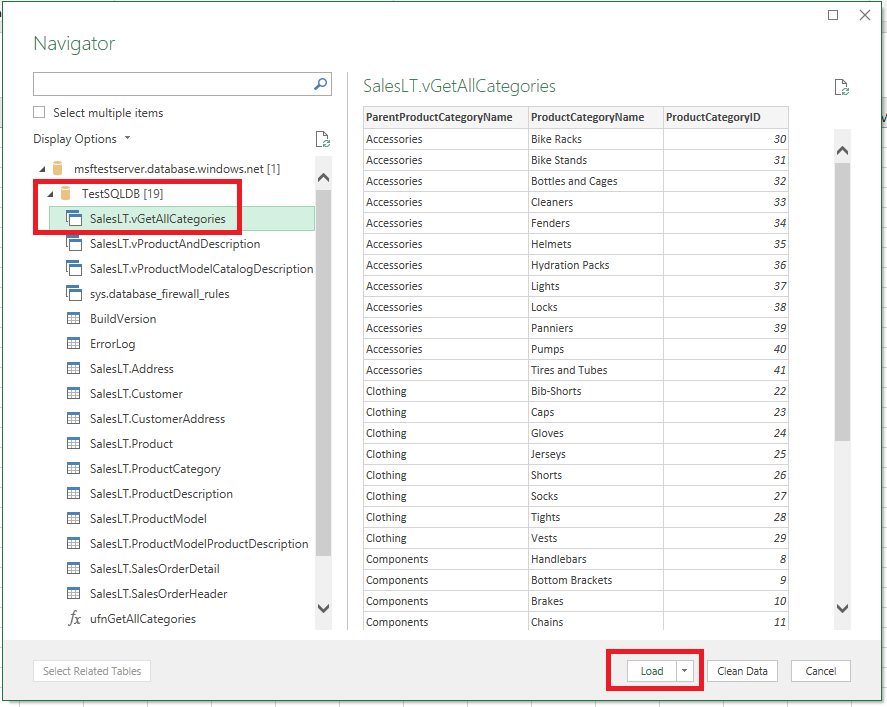
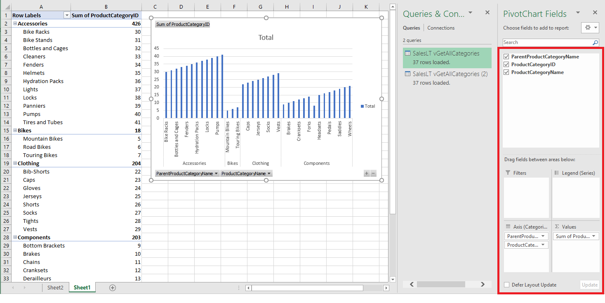
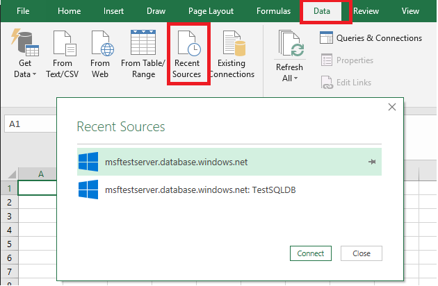
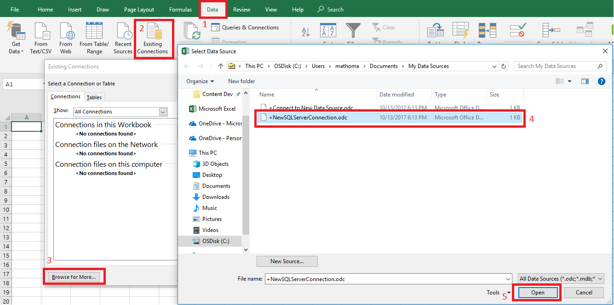
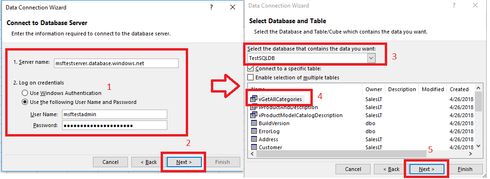

# Connect Excel to a database in Azure SQL Database or Azure SQL Managed Instance, and create a report
[!INCLUDE[appliesto-sqldb-sqlmi](../includes/appliesto-sqldb-sqlmi.md)]

You can connect Excel to a database and then import data and create tables and charts based on values in the database. In this tutorial you will set up the connection between Excel and a database table, save the file that stores data and the connection information for Excel, and then create a pivot chart from the database values.

You'll need to create a database before you get started. If you don't have one, see [Create a database in Azure SQL Database](single-database-create-quickstart.md) and [Create server-level IP firewall](firewall-create-server-level-portal-quickstart.md) to get a database with sample data up and running in a few minutes.

In this article, you'll import sample data into Excel from that article, but you can follow similar steps with your own data.

You'll also need a copy of Excel. This article uses [Microsoft Excel 2016](https://products.office.com/).

## Connect Excel and load data

1. To connect Excel to a database in SQL Database, open Excel and then create a new workbook or open an existing Excel workbook.
2. In the menu bar at the top of the page, select the **Data** tab, select **Get Data**, select From Azure, and then select **From Azure SQL Database**.

   

3. In the **SQL Server database** dialog box, type the **Server name** you want to connect to in the form <*servername*>**.database.windows.net**. For example, **msftestserver.database.windows.net**. Optionally, enter in the name of your database. Select **OK** to open the credentials window.

   

4. In the **SQL Server database** dialog box, select **Database** on the left side, and then enter in your **User Name** and **Password** for the server you want to connect to. Select **Connect** to open the **Navigator**.

   

   > [!TIP]
   > Depending on your network environment, you may not be able to connect or you may lose the connection if the server doesn't allow traffic from your client IP address. Go to the [Azure portal](https://portal.azure.com/), click SQL servers, click your server, click firewall under settings and add your client IP address. See [How to configure firewall settings](firewall-configure.md) for details.

5. In the **Navigator**, select the database you want to work with from the list, select the tables or views you want to work with (we chose **vGetAllCategories**), and then select **Load** to move the data from your database to your Excel spreadsheet.

    

## Import the data into Excel and create a pivot chart

Now that you've established the connection, you have several different options with how to load the data. For example, the following steps create a pivot chart based on the data found in your database in SQL Database.

1. Follow the steps in the previous section, but this time, instead of selecting **Load**, select **Load to** from the **Load** drop-down.
2. Next, select how you want to view this data in your workbook. We chose **PivotChart**. You can also choose to create a **New worksheet** or to **Add this data to a Data Model**. For more information on Data Models, see [Create a data model in Excel](https://support.office.com/article/Create-a-Data-Model-in-Excel-87E7A54C-87DC-488E-9410-5C75DBCB0F7B).

    

    The worksheet now has an empty pivot table and chart.
3. Under **PivotTable Fields**, select all the check-boxes for the fields you want to view.

    

> [!TIP]
> If you want to connect other Excel workbooks and worksheets to the database, select the **Data** tab, and select **Recent Sources** to launch the **Recent Sources** dialog box. From there, choose the connection you created from the list, and then click **Open**.
> 

## Create a permanent connection using .odc file

To save the connection details permanently, you can create an .odc file and make this connection a selectable option within the **Existing Connections** dialog box.

1. In the menu bar at the top of the page, select the **Data** tab, and then select **Existing Connections** to launch the **Existing Connections** dialog box.
   1. Select **Browse for more** to open the **Select Data Source** dialog box.
   2. Select the **+NewSqlServerConnection.odc** file and then select **Open** to open the **Data Connection Wizard**.

      

2. In the **Data Connection Wizard**, type in your server name and your SQL Database credentials. Select **Next**.
   1. Select the database that contains your data from the drop-down.
   2. Select the table or view you're interested in. We chose vGetAllCategories.
   3. Select **Next**.

      

3. Select the location of your file, the **File Name**, and the **Friendly Name** in the next screen of the Data Connection Wizard. You can also choose to save the password in the file, though this can potentially expose  your data to unwanted access. Select **Finish** when ready.

    

4. Select how you want to import your data. We chose to do a PivotTable. You can also modify the properties of the connection by select **Properties**. Select **OK** when ready. If you did not choose to save the password with the file, then you will be prompted to enter your credentials.

    

5. Verify that your new connection has been saved by expanding the **Data** tab, and selecting **Existing Connections**.

    

## Next steps

* Learn how to [Connect and query with SQL Server Management Studio](connect-query-ssms.md) for advanced querying and analysis.
* Learn about the benefits of [elastic pools](elastic-pool-overview.md).
* Learn how to [create a web application that connects to Azure SQL Database on the back-end](../../app-service/app-service-web-tutorial-dotnet-sqldatabase.md).
