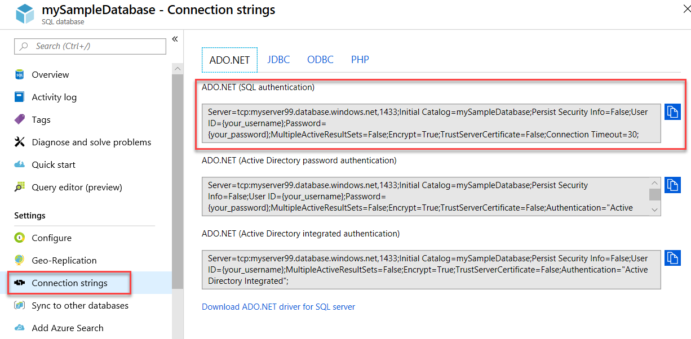

# Azure SQL Database and Azure SQL Managed Instance connect and query articles
[!INCLUDE[appliesto-sqldb-sqlmi](../includes/appliesto-sqldb-sqlmi.md)]

The following document includes links to Azure examples showing how to connect and query Azure SQL Database and Azure SQL Managed Instance. For some related recommendations for Transport Level Security, see [TLS considerations for database connectivity](#tls-considerations-for-database-connectivity).

## Quickstarts

| Quickstart | Description |
|---|---|
|[SQL Server Management Studio](connect-query-ssms.md)|This quickstart demonstrates how to use SSMS to connect to a database, and then use Transact-SQL statements to query, insert, update, and delete data in the database.|
|[Azure Data Studio](/sql/azure-data-studio/quickstart-sql-database?toc=%2fazure%2fsql-database%2ftoc.json)|This quickstart demonstrates how to use Azure Data Studio to connect to a database, and then use Transact-SQL (T-SQL) statements to create the TutorialDB used in Azure Data Studio tutorials.|
|[Azure portal](connect-query-portal.md)|This quickstart demonstrates how to use the Query editor to connect to a database (Azure SQL Database only), and then use Transact-SQL statements to query, insert, update, and delete data in the database.|
|[Visual Studio Code](connect-query-vscode.md)|This quickstart demonstrates how to use Visual Studio Code to connect to a database, and then use Transact-SQL statements to query, insert, update, and delete data in the database.|
|[.NET with Visual Studio](connect-query-dotnet-visual-studio.md)|This quickstart demonstrates how to use the .NET framework to create a C# program with Visual Studio to connect to a database and use Transact-SQL statements to query data.|
|[.NET core](connect-query-dotnet-core.md)|This quickstart demonstrates how to use .NET Core on Windows/Linux/macOS to create a C# program to connect to a database and use Transact-SQL statements to query data.|
|[Go](connect-query-go.md)|This quickstart demonstrates how to use Go to connect to a database. Transact-SQL statements to query and modify data are also demonstrated.|
|[Java](connect-query-java.md)|This quickstart demonstrates how to use Java to connect to a database and then use Transact-SQL statements to query data.|
|[Node.js](connect-query-nodejs.md)|This quickstart demonstrates how to use Node.js to create a program to connect to a database and use Transact-SQL statements to query data.|
|[PHP](connect-query-php.md)|This quickstart demonstrates how to use PHP to create a program to connect to a database and use Transact-SQL statements to query data.|
|[Python](connect-query-python.md)|This quickstart demonstrates how to use Python to connect to a database and use Transact-SQL statements to query data. |
|[Ruby](connect-query-ruby.md)|This quickstart demonstrates how to use Ruby to create a program to connect to a database and use Transact-SQL statements to query data.|
|||

## Get server connection information

Get the connection information you need to connect to the database in Azure SQL Database. You'll need the fully qualified server name or host name, database name, and login information for the upcoming procedures.

1. Sign in to the [Azure portal](https://portal.azure.com/).

2. Navigate to the **SQL Databases**  or **SQL Managed Instances** page.

3. On the **Overview** page, review the fully qualified server name next to **Server name** for the database in Azure SQL Database or the fully qualified server name (or IP address) next to **Host** for an Azure SQL Managed Instance or SQL Server on Azure VM. To copy the server name or host name, hover over it and select the **Copy** icon.

> [!NOTE]
> For connection information for SQL Server on Azure VM, see [Connect to a SQL Server instance](../virtual-machines/windows/sql-vm-create-portal-quickstart.md#connect-to-sql-server).

## Get ADO.NET connection information (optional - SQL Database only)

1. Navigate to the database blade in the Azure portal and, under **Settings**, select **Connection strings**.

2. Review the complete **ADO.NET** connection string.

    

3. Copy the **ADO.NET** connection string if you intend to use it.

## TLS considerations for database connectivity

Transport Layer Security (TLS) is used by all drivers that Microsoft supplies or supports for connecting to databases in Azure SQL Database or Azure SQL Managed Instance. No special configuration is necessary. For all connections to a SQL Server instance, a database in Azure SQL Database, or an instance of Azure SQL Managed Instance, we recommend that all applications set
the following configurations, or their equivalents:

- **Encrypt = On**
- **TrustServerCertificate = Off**

Some systems use different yet equivalent keywords for those configuration keywords. These configurations ensure that the client driver
verifies the identity of the TLS certificate received from the server.

We also recommend that you disable TLS 1.1 and 1.0 on the client if you need to comply with Payment Card Industry - Data Security
Standard (PCI-DSS).

Non-Microsoft drivers might not use TLS by default. This can be a factor when connecting to Azure SQL Database or Azure SQL Managed Instance. Applications with embedded drivers might not allow you to control these connection settings. We recommend that you examine the security of such drivers and applications before using them on systems that interact with sensitive data.

## Libraries

You can use various libraries and frameworks to connect to Azure SQL Database or Azure SQL Managed Instance. Check out our [Get started tutorials](https://aka.ms/sqldev) to quickly get started with programming languages such as C#, Java, Node.js, PHP, and Python. Then build an app by using SQL Server on Linux or Windows or Docker on macOS.

The following table lists connectivity libraries or *drivers* that client applications can use from a variety of languages to connect to and use SQL Server running on-premises or in the cloud. You can use them on Linux, Windows, or Docker and use them to connect to Azure SQL Database, Azure SQL Managed Instance, and Azure Synapse Analytics.

| Language | Platform | Additional resources | Download | Get started |
| :-- | :-- | :-- | :-- | :-- |
| C# | Windows, Linux, macOS | [Microsoft ADO.NET for SQL Server](/sql/connect/ado-net/microsoft-ado-net-sql-server) | [Download](https://dotnet.microsoft.com/download) | [Get started](https://www.microsoft.com/sql-server/developer-get-started/csharp/ubuntu)
| Java | Windows, Linux, macOS | [Microsoft JDBC driver for SQL Server](/sql/connect/jdbc/microsoft-jdbc-driver-for-sql-server/) | [Download](/sql/connect/jdbc/download-microsoft-jdbc-driver-for-sql-server) |  [Get started](https://www.microsoft.com/sql-server/developer-get-started/java/ubuntu)
| PHP | Windows, Linux, macOS| [PHP SQL driver for SQL Server](/sql/connect/php/microsoft-php-driver-for-sql-server) | [Download](/sql/connect/php/download-drivers-php-sql-server) | [Get started](https://www.microsoft.com/sql-server/developer-get-started/php/ubuntu/)
| Node.js | Windows, Linux, macOS | [Node.js driver for SQL Server](/sql/connect/node-js/node-js-driver-for-sql-server/) | [Install](/sql/connect/node-js/step-1-configure-development-environment-for-node-js-development/) |  [Get started](https://www.microsoft.com/sql-server/developer-get-started/node/ubuntu)
| Python | Windows, Linux, macOS | [Python SQL driver](/sql/connect/python/python-driver-for-sql-server/) | Install choices:   \* [pymssql](/sql/connect/python/pymssql/step-1-configure-development-environment-for-pymssql-python-development/)   \* [pyodbc](/sql/connect/python/pyodbc/step-1-configure-development-environment-for-pyodbc-python-development/) |  [Get started](https://www.microsoft.com/sql-server/developer-get-started/python/ubuntu)
| Ruby | Windows, Linux, macOS | [Ruby driver for SQL Server](/sql/connect/ruby/ruby-driver-for-sql-server/) | [Install](/sql/connect/ruby/step-1-configure-development-environment-for-ruby-development/) | [Get started](https://www.microsoft.com/sql-server/developer-get-started/ruby/ubuntu)
| C++ | Windows, Linux, macOS | [Microsoft ODBC driver for SQL Server](/sql/connect/odbc/microsoft-odbc-driver-for-sql-server/) | [Download](/sql/connect/odbc/microsoft-odbc-driver-for-sql-server/) |  

The following table lists examples of object-relational mapping (ORM) frameworks and web frameworks that client applications can use with SQL Server, Azure SQL Database, Azure SQL Managed Instance, or Azure Synapse Analytics. You can use the frameworks on Linux, Windows, or Docker.

| Language | Platform | ORM(s) |
| :-- | :-- | :-- |
| C# | Windows, Linux, macOS | [Entity Framework](/ef) [Entity Framework Core](/ef/core/index) |
| Java | Windows, Linux, macOS |[Hibernate ORM](https://hibernate.org/orm)|
| PHP | Windows, Linux, macOS | [Laravel (Eloquent)](https://laravel.com/docs/eloquent) [Doctrine](https://www.doctrine-project.org/projects/orm.html) |
| Node.js | Windows, Linux, macOS | [Sequelize ORM](https://sequelize.org/) |
| Python | Windows, Linux, macOS |[Django](https://www.djangoproject.com/) |
| Ruby | Windows, Linux, macOS | [Ruby on Rails](https://rubyonrails.org/) |
||||

## Next steps

- For connectivity architecture information, see [Azure SQL Database Connectivity Architecture](connectivity-architecture.md).
- Find [SQL Server drivers](/sql/connect/sql-connection-libraries/) that are used to connect from client applications.
- Connect to Azure SQL Database or Azure SQL Managed Instance:
  - [Connect and query using .NET (C#)](connect-query-dotnet-core.md)
  - [Connect and query using PHP](connect-query-php.md)
  - [Connect and query using Node.js](connect-query-nodejs.md)
  - [Connect and query using Java](connect-query-java.md)
  - [Connect and query using Python](connect-query-python.md)
  - [Connect and query using Ruby](connect-query-ruby.md)
  - [Install sqlcmd and bcp the SQL Server command-line tools on Linux](/sql/linux/sql-server-linux-setup-tools) - For Linux users, try connecting to Azure SQL Database or Azure SQL Managed Instance using [sqlcmd](/sql/ssms/scripting/sqlcmd-use-the-utility).
- Retry logic code examples:
  - [Connect resiliently with ADO.NET][step-4-connect-resiliently-to-sql-with-ado-net-a78n]
  - [Connect resiliently with PHP][step-4-connect-resiliently-to-sql-with-php-p42h]

<!-- Link references. -->

[step-4-connect-resiliently-to-sql-with-ado-net-a78n]: /sql/connect/ado-net/step-4-connect-resiliently-sql-ado-net

[step-4-connect-resiliently-to-sql-with-php-p42h]: /sql/connect/php/step-4-connect-resiliently-to-sql-with-php
