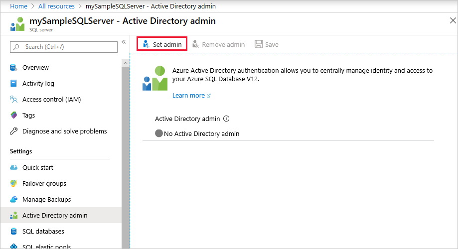
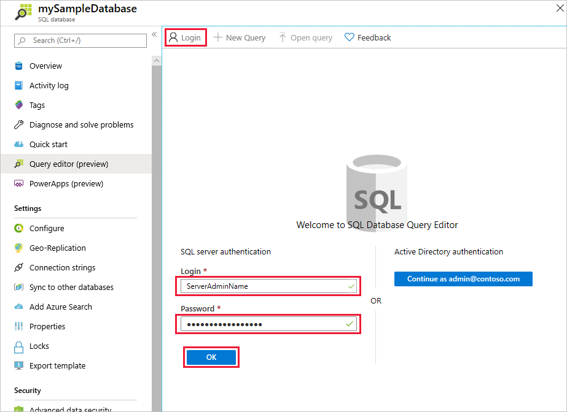
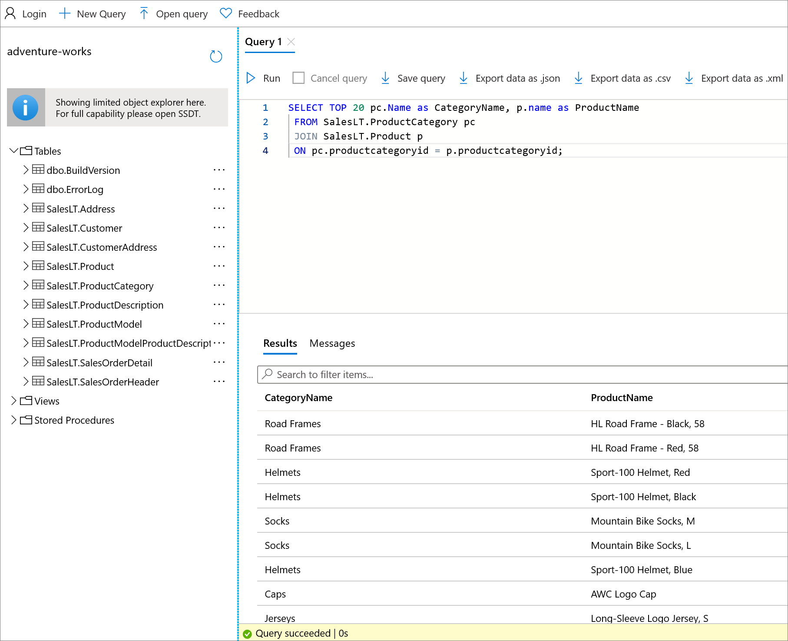

# Quickstart: Use the Azure portal's query editor (preview) to query an Azure SQL Database
[!INCLUDE[appliesto-sqldb](../includes/appliesto-sqldb.md)]

The query editor is a tool in the Azure portal for running SQL queries against your database in Azure SQL Database or data warehouse in Azure Synapse Analytics.

In this quickstart, you'll use the query editor to run Transact-SQL (T-SQL) queries against a database.

## Prerequisites

### Create a database with sample data

Completing this quickstart requires the AdventureWorksLT sample database. If you don't have a working copy of the AdventureWorksLT sample database in SQL Database, the following quickstart helps you quickly create one:

[Quickstart: Create a database in Azure SQL Database using the Azure portal, PowerShell, or Azure CLI](single-database-create-quickstart.md)

### Set an Azure Active Directory admin for the server (optional)

Configuring an Azure Active Directory (Azure AD) administrator enables you to use a single identity to sign in to the Azure portal and your database. If you would like to use Azure AD to connect to query editor, follow the below steps.

This process is optional, you can instead use SQL authentication to connect to the query editor.

> [!NOTE]
> * Email accounts (for example, outlook.com, gmail.com, yahoo.com, and so on) aren't yet supported as Azure AD admins. Make sure to choose a user created either natively in the Azure AD or federated into the Azure AD.
> * Azure AD admin sign in works with accounts that have 2-factor authentication enabled, but the query editor does not support 2-factor authentication.

1. In the Azure portal, navigate to your SQL database server.

2. On the **SQL server** menu, select **Active Directory admin**.

3. On the SQL Server **Active Directory admin** page toolbar, select **Set admin**.

    

4. On the **Add admin** page, in the search box, enter a user or group to find, select it as an admin, and then choose the **Select** button.

5. Back in the SQL Server **Active Directory admin** page toolbar, select **Save**.

## Using SQL Query Editor

1. Sign in to the [Azure portal](https://portal.azure.com/) and select the database you want to query.

2. In the **SQL database** menu, select **Query editor (preview)**.

    

### Establish a connection to the database

Even though you're signed into the portal, you still need to provide credentials to access the database. You can connect using SQL authentication or Azure Active Directory to connect to your database.

#### Connect using SQL Authentication

1. In the **Login** page, under **SQL server authentication**, enter a **Login** and **Password** for a user that has access to the database. If you're not sure, use the login and password for the Server admin of the database's server.

    

2. Select **OK**.

#### Connect using Azure Active Directory

In the **Query editor (preview)**, look at the **Login** page at the **Active Directory authentication** section. Authentication will happen automatically, so if you are an Azure AD admin to the database you will see a message appear saying you have been signed in. Then select the **Continue as** *\<your user or group ID>* button. If the page indicates that you have not successfully logged in, you may need to refresh the page.

### Query a database in SQL Database

The following example queries should run successfully against the AdventureWorksLT sample database.

#### Run a SELECT query

1. Paste the following query into the query editor:

   ```sql
    SELECT TOP 20 pc.Name as CategoryName, p.name as ProductName
    FROM SalesLT.ProductCategory pc
    JOIN SalesLT.Product p
    ON pc.productcategoryid = p.productcategoryid;
   ```

2. Select **Run** and then review the output in the **Results** pane.

   

3. Optionally, you can save the query as a .sql file, or export the returned data as a .json, .csv, or .xml file.

#### Run an INSERT query

Run the following [INSERT](/sql/t-sql/statements/insert-transact-sql/) T-SQL statement to add a new product in the `SalesLT.Product` table.

1. Replace the previous query with this one.

    ```sql
    INSERT INTO [SalesLT].[Product]
           ( [Name]
           , [ProductNumber]
           , [Color]
           , [ProductCategoryID]
           , [StandardCost]
           , [ListPrice]
           , [SellStartDate]
           )
    VALUES
           ('myNewProduct'
           ,123456789
           ,'NewColor'
           ,1
           ,100
           ,100
           ,GETDATE() );
   ```


2. Select **Run**  to insert a new row in the `Product` table. The **Messages** pane displays **Query succeeded: Affected rows: 1**.


#### Run an UPDATE query

Run the following [UPDATE](/sql/t-sql/queries/update-transact-sql/) T-SQL statement to modify your new product.

1. Replace the previous query with this one.

   ```sql
   UPDATE [SalesLT].[Product]
   SET [ListPrice] = 125
   WHERE Name = 'myNewProduct';
   ```

2. Select **Run** to update the specified row in the `Product` table. The **Messages** pane displays **Query succeeded: Affected rows: 1**.

#### Run a DELETE query

Run the following [DELETE](/sql/t-sql/statements/delete-transact-sql/) T-SQL statement to remove your new product.

1. Replace the previous query with this one:

   ```sql
   DELETE FROM [SalesLT].[Product]
   WHERE Name = 'myNewProduct';
   ```

2. Select **Run** to delete the specified row in the `Product` table. The **Messages** pane displays **Query succeeded: Affected rows: 1**.


## Troubleshooting and considerations

There are a few things to know when working with the query editor.

### Configure local network settings

If you get one of the following errors in the query editor:
 - *Your local network settings might be preventing the Query Editor from issuing queries. Please click here for instructions on how to configure your network settings*
 - *A connection to the server could not be established. This might indicate an issue with your local firewall configuration or your network proxy settings*

This is because the query editor uses port 443 and 1443 to communicate. You will need to ensure you have enabled outbound HTTPS traffic on these ports. The instructions below will walk you through how to do this, depending on your Operating System. You might need to work with your corporate IT to grant approval to open this connection on your local network.

#### Steps for Windows

1. Open **Windows Defender Firewall**
2. On the left-side menu, select **Advanced settings**
3. In **Windows Defender Firewall with Advanced Security**, select **Outbound rules** on the left-side menu.
4. Select **New Rule...** on the right-side menu

In the **New outbound rule wizard** follow these steps:

1. Select **port** as the type of rule you want to create. Select **Next**
2. Select **TCP**
3. Select **Specific remote ports** and enter "443, 1443". Then select **Next**
4. Select "Allow the connection if it is secure"
5. Select **Next** then select **Next** again
5. Keep "Domain", "Private", and "Public" all selected
6. Give the rule a name, for example "Access Azure SQL query editor" and optionally a description. Then select **Finish**

#### Steps for Mac
1. Open **System Preferences** (Apple menu > System Preferences).
2. Click **Security & Privacy**.
3. Click **Firewall**.
4. If Firewall is off, select **Click the lock to make changes** at the bottom and select **Turn on Firewall**
4. Click **Firewall Options**.
5. In the **Security & Privacy** window select this option: "Automatically allow signed software to receive incoming connections."

#### Steps for Linux
Run these commands to update iptables
  ```
  sudo iptables -A OUTPUT -p tcp --dport 443 -j ACCEPT
  sudo iptables -A OUTPUT -p tcp --dport 1443 -j ACCEPT
  ```

### Connection considerations

* For public connections to query editor, you  need to [add your outbound IP address to the server's allowed firewall rules](firewall-create-server-level-portal-quickstart.md) to access your databases and data warehouses.

* If  you have a Private Link connection set up on the server and you are connecting to query editor from an IP in the private Virtual Network, the Query Editor works without needing to add the Client IP address into the SQL database server firewall rules.

* The most basic RBAC permissions needed to use query editor are Read access to the server and database. Anyone with this level of access can access the query editor feature. To limit access to particular users, you must prevent them from being able to sign in to the query editor with Azure Active Directory or SQL authentication credentials. If they cannot assign themselves as the AAD admin for the server or access/add a SQL administrator account, they should not be able to use query editor.

* Query editor doesn't support connecting to the `master` database.

* Query editor cannot connect to a replica database with `ApplicationIntent=ReadOnly`

* If you saw this error message "The X-CSRF-Signature header could not be validated", take the following action to resolve the issue:

    * Make sure your computer's clock is set to the right time and time zone. You can also try to match your computer's time zone with Azure by searching for the time zone for the location of your instance, such as East US, Pacific, and so on.
    * If you are on a proxy network, make sure that the request header “X-CSRF-Signature” is not being modified or dropped.

### Other considerations

* Pressing **F5** refreshes the query editor page and any query being worked on is lost.

* There's a 5-minute timeout for query execution.

* The query editor only supports cylindrical projection for geography data types.

* There's no support for IntelliSense for database tables and views, but the editor does support autocomplete on names that have already been typed.

## Next steps

To learn more about the Transact-SQL (T-SQL) supported in Azure SQL Database, see [Resolving Transact-SQL differences during migration to SQL Database](transact-sql-tsql-differences-sql-server.md).
