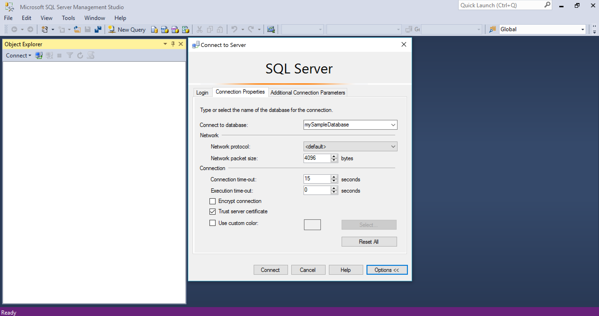
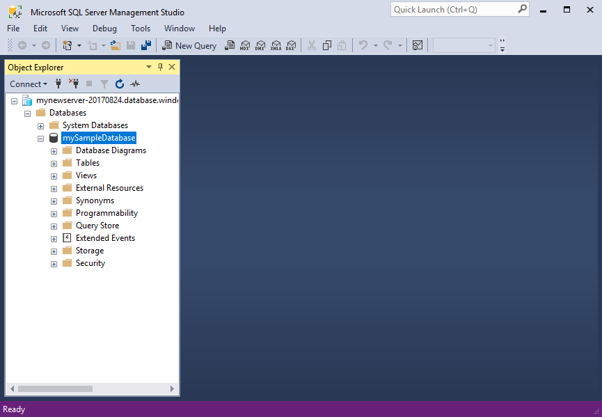
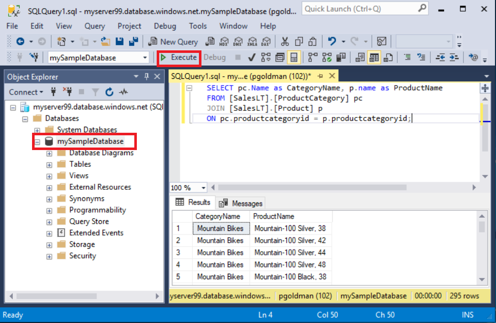
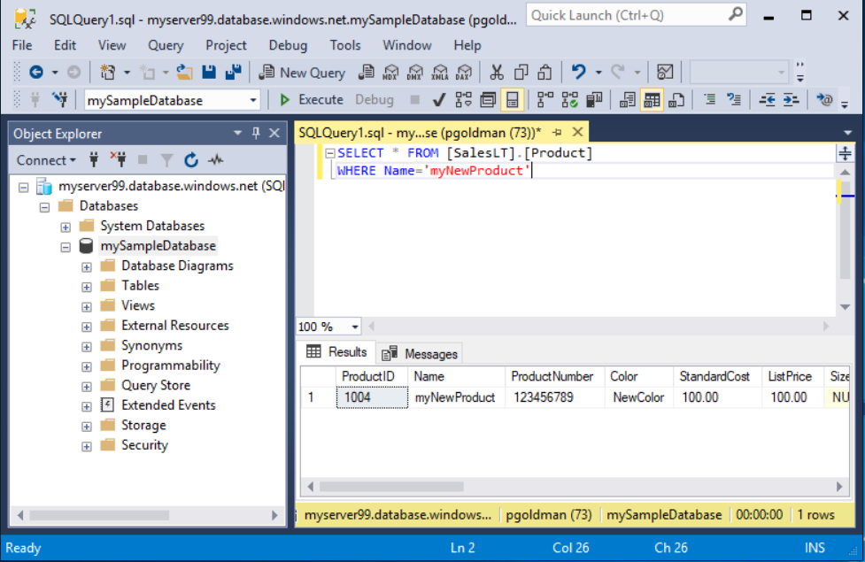

# Quickstart: Use SSMS to connect to and query Azure SQL Database or Azure SQL Managed Instance
[!INCLUDE[appliesto-sqldb-sqlmi](../includes/appliesto-sqldb-sqlmi.md)]

In this quickstart, you'll learn how to use SQL Server Management Studio (SSMS) to connect to Azure SQL Database or Azure SQL Managed Instance and run some queries.

## Prerequisites

Completing this quickstart requires the following items:

- [SQL Server Management Studio (SSMS)](/sql/ssms/download-sql-server-management-studio-ssms/).

- A database in Azure SQL Database. You can use one of these quickstarts to create and then configure a database in Azure SQL Database:

  || SQL Database | SQL Managed Instance | SQL Server on Azure VM |
  |:--- |:--- |:---|:---|
  | Create| [Portal](single-database-create-quickstart.md) | [Portal](../managed-instance/instance-create-quickstart.md) | [Portal](../virtual-machines/windows/sql-vm-create-portal-quickstart.md)
  || [CLI](scripts/create-and-configure-database-cli.md) | [CLI](https://medium.com/azure-sqldb-managed-instance/working-with-sql-managed-instance-using-azure-cli-611795fe0b44) |
  || [PowerShell](scripts/create-and-configure-database-powershell.md) | [PowerShell](../managed-instance/scripts/create-configure-managed-instance-powershell.md) | [PowerShell](../virtual-machines/windows/sql-vm-create-powershell-quickstart.md)
  | Configure | [Server-level IP firewall rule](firewall-create-server-level-portal-quickstart.md)| [Connectivity from a VM](../managed-instance/connect-vm-instance-configure.md)|
  |||[Connectivity from on-site](../managed-instance/point-to-site-p2s-configure.md) | [Connect to SQL Server](../virtual-machines/windows/sql-vm-create-portal-quickstart.md)
  |Load data|Adventure Works loaded per quickstart|[Restore Wide World Importers](../managed-instance/restore-sample-database-quickstart.md) | [Restore Wide World Importers](../managed-instance/restore-sample-database-quickstart.md) |
  |||Restore or import Adventure Works from [BACPAC](database-import.md) file from [GitHub](https://github.com/Microsoft/sql-server-samples/tree/master/samples/databases/adventure-works)| Restore or import Adventure Works from [BACPAC](database-import.md) file from [GitHub](https://github.com/Microsoft/sql-server-samples/tree/master/samples/databases/adventure-works)|
  |||

  > [!IMPORTANT]
  > The scripts in this article are written to use the Adventure Works database. With a managed instance, you must either import the Adventure Works database into an instance database or modify the scripts in this article to use the Wide World Importers database.

If you simply want to run some ad-hoc queries without installing SSMS, see [Quickstart: Use the Azure portal's query editor to query a database in Azure SQL Database](connect-query-portal.md).

## Get server connection information

Get the connection information you need to connect to your database. You'll need the fully qualified [server](logical-servers.md) name or host name, database name, and login information to complete this quickstart.

1. Sign in to the [Azure portal](https://portal.azure.com/).

2. Navigate to the **database** or **managed instance** you want to query.

3. On the **Overview** page, review the fully qualified server name next to **Server name** for your database in SQL Database or the fully qualified server name (or IP address) next to **Host** for your managed instance in SQL Managed Instance or your SQL Server instance on your VM. To copy the server name or host name, hover over it and select the **Copy** icon.

> [!NOTE]
> For connection information for SQL Server on Azure VM, see [Connect to SQL Server](../virtual-machines/windows/sql-vm-create-portal-quickstart.md#connect-to-sql-server)

## Connect to your database

In SSMS, connect to your server.

> [!IMPORTANT]
> A server listens on port 1433. To connect to a server from behind a corporate firewall, the firewall must have this port open.

1. Open SSMS.

2. The **Connect to Server** dialog box appears. Enter the following information:

   | Setting      | Suggested value    | Description |
   | ------------ | ------------------ | ----------- |
   | **Server type** | Database engine | Required value. |
   | **Server name** | The fully qualified server name | Something like: **servername.database.windows.net**. |
   | **Authentication** | SQL Server Authentication | This tutorial uses SQL Authentication. |
   | **Login** | Server admin account user ID | The user ID from the server admin account used to create the server. |
   | **Password** | Server admin account password | The password from the server admin account used to create the server. |
   ||||

     

3. Select **Options** in the **Connect to Server** dialog box. In the **Connect to database** drop-down menu, select **mySampleDatabase**. Completing the quickstart in the [Prerequisites section](#prerequisites) creates an AdventureWorksLT database named mySampleDatabase. If your working copy of the AdventureWorks database has a different name than mySampleDatabase, then select it instead.

     

4. Select **Connect**. The Object Explorer window opens.

5. To view the database's objects, expand **Databases** and then expand your database node.

     

## Query data

Run this [SELECT](/sql/t-sql/queries/select-transact-sql/) Transact-SQL code to query for the top 20 products by category.

1. In Object Explorer, right-click **mySampleDatabase** and select **New Query**. A new query window connected to your database opens.

2. In the query window, paste the following SQL query:

   ```sql
   SELECT pc.Name as CategoryName, p.name as ProductName
   FROM [SalesLT].[ProductCategory] pc
   JOIN [SalesLT].[Product] p
   ON pc.productcategoryid = p.productcategoryid;
   ```

3. On the toolbar, select **Execute** to run the query and retrieve data from the `Product` and `ProductCategory` tables.

    

### Insert data

Run this [INSERT](/sql/t-sql/statements/insert-transact-sql/) Transact-SQL code to create a new product in the `SalesLT.Product` table.

1. Replace the previous query with this one.

   ```sql
   INSERT INTO [SalesLT].[Product]
           ( [Name]
           , [ProductNumber]
           , [Color]
           , [ProductCategoryID]
           , [StandardCost]
           , [ListPrice]
           , [SellStartDate] )
     VALUES
           ('myNewProduct'
           ,123456789
           ,'NewColor'
           ,1
           ,100
           ,100
           ,GETDATE() );
   ```

2. Select **Execute**  to insert a new row in the `Product` table. The **Messages** pane displays **(1 row affected)**.

#### View the result

1. Replace the previous query with this one.

   ```sql
   SELECT * FROM [SalesLT].[Product]
   WHERE Name='myNewProduct'
   ```

2. Select **Execute**. The following result appears.

   

### Update data

Run this [UPDATE](/sql/t-sql/queries/update-transact-sql?view=sql-server-ver15) Transact-SQL code to modify your new product.

1. Replace the previous query with this one that returns the new record created previously:

   ```sql
   UPDATE [SalesLT].[Product]
   SET [ListPrice] = 125
   WHERE Name = 'myNewProduct';
   ```

2. Select **Execute** to update the specified row in the `Product` table. The **Messages** pane displays **(1 row affected)**.

### Delete data

Run this [DELETE](/sql/t-sql/statements/delete-transact-sql/) Transact-SQL code to remove your new product.

1. Replace the previous query with this one.

   ```sql
   DELETE FROM [SalesLT].[Product]
   WHERE Name = 'myNewProduct';
   ```

2. Select **Execute** to delete the specified row in the `Product` table. The **Messages** pane displays **(1 row affected)**.

## Next steps

- For information about SSMS, see [SQL Server Management Studio](/sql/ssms/sql-server-management-studio-ssms/).
- To connect and query using the Azure portal, see [Connect and query with the Azure portal SQL Query editor](connect-query-portal.md).
- To connect and query using Visual Studio Code, see [Connect and query with Visual Studio Code](connect-query-vscode.md).
- To connect and query using .NET, see [Connect and query with .NET](connect-query-dotnet-visual-studio.md).
- To connect and query using PHP, see [Connect and query with PHP](connect-query-php.md).
- To connect and query using Node.js, see [Connect and query with Node.js](connect-query-nodejs.md).
- To connect and query using Java, see [Connect and query with Java](connect-query-java.md).
- To connect and query using Python, see [Connect and query with Python](connect-query-python.md).
- To connect and query using Ruby, see [Connect and query with Ruby](connect-query-ruby.md).
