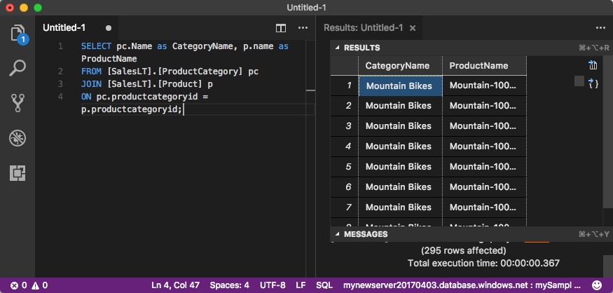

# Quickstart: Use Visual Studio Code to connect and query 
[!INCLUDE[appliesto-sqldb-sqlmi](../includes/appliesto-sqldb-sqlmi.md)]

[Visual Studio Code](https://code.visualstudio.com/docs) is a graphical code editor for Linux, macOS, and Windows. It supports extensions, including the [mssql extension](https://aka.ms/mssql-marketplace) for querying a SQL Server instance, Azure SQL Database, an Azure SQL Managed Instance, and a database in Azure Synapse Analytics. In this quickstart, you'll use Visual Studio Code to connect to Azure SQL Database or Azure SQL Managed Instance and then run Transact-SQL statements to query, insert, update, and delete data.

## Prerequisites

- A database in Azure SQL Database or Azure SQL Managed Instance. You can use one of these quickstarts to create and then configure a database in Azure SQL Database:

  || Azure SQL Database | Azure SQL Managed Instance |
  |:--- |:--- |:---|
  | Create| [Portal](single-database-create-quickstart.md) | [Portal](../managed-instance/instance-create-quickstart.md) |
  || [CLI](scripts/create-and-configure-database-cli.md) | [CLI](https://medium.com/azure-sqldb-managed-instance/working-with-sql-managed-instance-using-azure-cli-611795fe0b44) |
  || [PowerShell](scripts/create-and-configure-database-powershell.md) | [PowerShell](../managed-instance/scripts/create-configure-managed-instance-powershell.md) |
  | Configure | [Server-level IP firewall rule](firewall-create-server-level-portal-quickstart.md))| [Connectivity from a virtual machine (VM)](../managed-instance/connect-vm-instance-configure.md)|
  |||[Connectivity from on-premises](../managed-instance/point-to-site-p2s-configure.md)
  |Load data|Adventure Works loaded per quickstart|[Restore Wide World Importers](../managed-instance/restore-sample-database-quickstart.md)
  |||Restore or import Adventure Works from a [BACPAC](database-import.md) file from [GitHub](https://github.com/Microsoft/sql-server-samples/tree/master/samples/databases/adventure-works)|
  |||

  > [!IMPORTANT]
  > The scripts in this article are written to use the Adventure Works database. With a SQL Managed Instance, you must either import the Adventure Works database into an instance database or modify the scripts in this article to use the Wide World Importers database.

## Install Visual Studio Code

Make sure you have installed the latest [Visual Studio Code](https://code.visualstudio.com/Download) and loaded the [mssql extension](https://aka.ms/mssql-marketplace). For guidance on installing the mssql extension, see [Install Visual Studio Code](https://docs.microsoft.com/sql/linux/sql-server-linux-develop-use-vscode#install-and-start-visual-studio-code) and [mssql for Visual Studio Code
](https://marketplace.visualstudio.com/items?itemName=ms-mssql.mssql).

## Configure Visual Studio Code

### **macOS**

For macOS, you need to install OpenSSL, which is a prerequisite for .NET Core that mssql extension uses. Open your terminal and enter the following commands to install **brew** and **OpenSSL**.

```bash
ruby -e "$(curl -fsSL https://raw.githubusercontent.com/Homebrew/install/master/install)"
brew update
brew install openssl
mkdir -p /usr/local/lib
ln -s /usr/local/opt/openssl/lib/libcrypto.1.0.0.dylib /usr/local/lib/
ln -s /usr/local/opt/openssl/lib/libssl.1.0.0.dylib /usr/local/lib/
```

### **Linux (Ubuntu)**

No special configuration needed.

### **Windows**

No special configuration needed.

## Get server connection information

Get the connection information you need to connect to Azure SQL Database. You'll need the fully qualified server name or host name, database name, and login information for the upcoming procedures.

1. Sign in to the [Azure portal](https://portal.azure.com/).

2. Navigate to the **SQL databases**  or **SQL Managed Instances** page.

3. On the **Overview** page, review the fully qualified server name next to **Server name** for SQL Database or the fully qualified server name next to **Host** for a SQL Managed Instance. To copy the server name or host name, hover over it and select the **Copy** icon.

## Set language mode to SQL

In Visual Studio Code, set the language mode to **SQL**  to enable mssql commands and T-SQL IntelliSense.

1. Open a new Visual Studio Code window.

2. Press **Ctrl**+**N**. A new plain text file opens.

3. Select **Plain Text** in the status bar's lower right-hand corner.

4. In the **Select language mode** drop-down menu that opens, select **SQL**.

## Connect to your database

Use Visual Studio Code to establish a connection to your server.

> [!IMPORTANT]
> Before continuing, make sure that you have your server and sign in information ready. Once you begin entering the connection profile information, if you change your focus from Visual Studio Code, you have to restart creating the profile.

1. In Visual Studio Code, press **Ctrl+Shift+P** (or **F1**) to open the Command Palette.

2. Select **MS SQL:Connect** and choose **Enter**.

3. Select **Create Connection Profile**.

4. Follow the prompts to specify the new profile's connection properties. After specifying each value, choose **Enter** to continue.

   | Property       | Suggested value | Description |
   | ------------ | ------------------ | ------------------------------------------------- |
   | **Server name** | The fully qualified server name | Something like: **mynewserver20170313.database.windows.net**. |
   | **Database name** | mySampleDatabase | The database to connect to. |
   | **Authentication** | SQL Login| This tutorial uses SQL Authentication. |
   | **User name** | User name | The user name of the server admin account used to create the server. |
   | **Password (SQL Login)** | Password | The password of the server admin account used to create the server. |
   | **Save Password?** | Yes or No | Select **Yes** if you do not want to enter the password each time. |
   | **Enter a name for this profile** | A profile name, such as **mySampleProfile** | A saved profile speeds your connection on subsequent logins. |

   If successful, a notification appears saying your profile is created and connected.

## Query data

Run the following [SELECT](https://msdn.microsoft.com/library/ms189499.aspx) Transact-SQL statement to query for the top 20 products by category.

1. In the editor window, paste the following SQL query.

   ```sql
   SELECT pc.Name as CategoryName, p.name as ProductName
   FROM [SalesLT].[ProductCategory] pc
   JOIN [SalesLT].[Product] p
   ON pc.productcategoryid = p.productcategoryid;
   ```

2. Press **Ctrl**+**Shift**+**E** to run the query and display results from the `Product` and `ProductCategory` tables.

    

## Insert data

Run the following [INSERT](https://msdn.microsoft.com/library/ms174335.aspx) Transact-SQL statement to add a new product into the `SalesLT.Product` table.

1. Replace the previous query with this one.

   ```sql
   INSERT INTO [SalesLT].[Product]
        ( [Name]
        , [ProductNumber]
        , [Color]
        , [ProductCategoryID]
        , [StandardCost]
        , [ListPrice]
        , [SellStartDate]
        )
     VALUES
        ('myNewProduct'
        ,123456789
        ,'NewColor'
        ,1
         ,100
         ,100
         ,GETDATE() );
   ```

2. Press **Ctrl**+**Shift**+**E** to insert a new row in the `Product` table.

## Update data

Run the following [UPDATE](https://msdn.microsoft.com/library/ms177523.aspx) Transact-SQL statement to update the added product.

1. Replace the previous query with this one:

   ```sql
   UPDATE [SalesLT].[Product]
   SET [ListPrice] = 125
   WHERE Name = 'myNewProduct';
   ```

2. Press **Ctrl**+**Shift**+**E** to update the specified row in the `Product` table.

## Delete data

Run the following [DELETE](https://docs.microsoft.com/sql/t-sql/statements/delete-transact-sql) Transact-SQL statement to remove the new product.

1. Replace the previous query with this one:

   ```sql
   DELETE FROM [SalesLT].[Product]
   WHERE Name = 'myNewProduct';
   ```

2. Press **Ctrl**+**Shift**+**E** to delete the specified row in the `Product` table.

## Next steps

- To connect and query using SQL Server Management Studio, see [Quickstart: Use SQL Server Management Studio to connect to a database in Azure SQL Database and query data](connect-query-ssms.md).
- To connect and query using the Azure portal, see [Quickstart: Use the SQL Query editor in the Azure portal to connect and query data](connect-query-portal.md).
- For an MSDN magazine article on using Visual Studio Code, see [Create a database IDE with MSSQL extension blog post](https://msdn.microsoft.com/magazine/mt809115).
