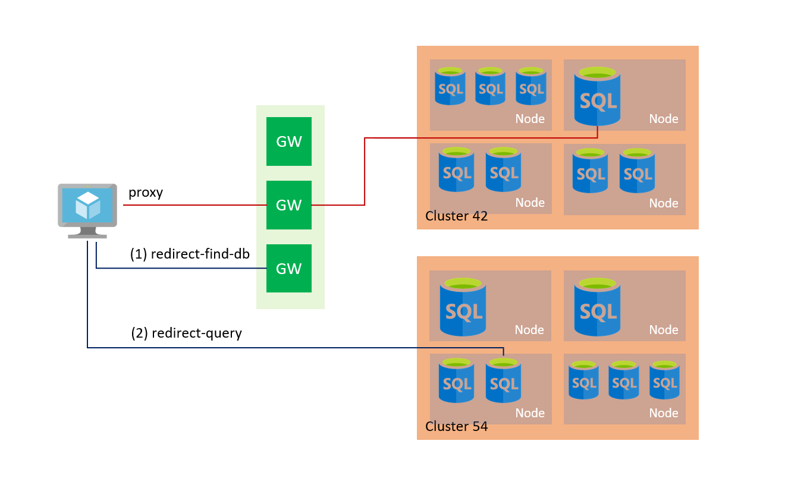
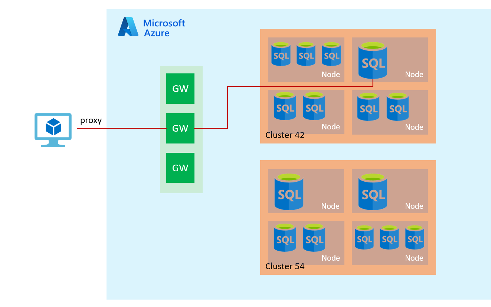

# Azure SQL Database and Azure Synapse Analytics connectivity architecture
[!INCLUDE[appliesto-sqldb-asa](../includes/appliesto-sqldb-asa.md)]

This article explains architecture of various components that direct network traffic to a server in Azure SQL Database or Azure Synapse Analytics. It also explains different connection policies and how it impacts clients connecting from within Azure and clients connecting from outside of Azure.

> [!IMPORTANT]
> This article does *not* apply to **Azure SQL Managed Instance**. Refer to [Connectivity architecture for a managed instance](../managed-instance/connectivity-architecture-overview.md).

## Connectivity architecture

The following diagram provides a high-level overview of the connectivity architecture.

The following steps describe how a connection is established to Azure SQL Database:

- Clients connect to the gateway, that has a public IP address and listens on port 1433.
- The gateway, depending on the effective connection policy, redirects or proxies the traffic to the right database cluster.
- Inside the database cluster traffic is forwarded to the appropriate database.

## Connection policy

Servers in SQL Database and Azure Synapse support the following three options for the server's connection policy setting:

- **Redirect (recommended):** Clients establish connections directly to the node hosting the database, leading to reduced latency and improved throughput. For connections to use this mode, clients need to:
  - Allow outbound communication from the client to all Azure SQL IP addresses in the region on ports in the range of 11000 11999. Use the Service Tags for SQL to make this easier to manage.  
  - Allow outbound communication from the client to Azure SQL Database gateway IP addresses on port 1433.

- **Proxy:** In this mode, all connections are proxied via the Azure SQL Database gateways, leading to increased latency and reduced throughput. For connections to use this mode, clients need to allow outbound communication from the client to Azure SQL Database gateway IP addresses on port 1433.

- **Default:** This is the connection policy in effect on all servers after creation unless you explicitly alter the connection policy to either `Proxy` or `Redirect`. The default policy is`Redirect` for all client connections originating inside of Azure (for example, from an Azure Virtual Machine) and `Proxy`for all client connections originating outside (for example, connections from your local workstation).

We highly recommend the `Redirect` connection policy over the `Proxy` connection policy for the lowest latency and highest throughput. However, you will need to meet the additional requirements for allowing network traffic as outlined above. If the client is an Azure Virtual Machine you can accomplish this using Network Security Groups (NSG) with [service tags](../../virtual-network/security-overview.md#service-tags). If the client is connecting from a workstation on-premises then you may need to work with your network admin to allow network traffic through your corporate firewall.

## Connectivity from within Azure

If you are connecting from within Azure your connections have a connection policy of `Redirect` by default. A policy of `Redirect` means that after the TCP session is established to Azure SQL Database, the client session is then redirected to the right database cluster with a change to the destination virtual IP from that of the Azure SQL Database gateway to that of the cluster. Thereafter, all subsequent packets flow directly to the cluster, bypassing the Azure SQL Database gateway. The following diagram illustrates this traffic flow.

## Connectivity from outside of Azure

If you are connecting from outside Azure, your connections have a connection policy of `Proxy` by default. A policy of `Proxy` means that the TCP session is established via the Azure SQL Database gateway and all subsequent packets flow via the gateway. The following diagram illustrates this traffic flow.

> [!IMPORTANT]
> Additionally open TCP ports 1434 and 14000-14999 to enable [Connecting with DAC](https://docs.microsoft.com/sql/database-engine/configure-windows/diagnostic-connection-for-database-administrators?view=sql-server-2017#connecting-with-dac)

## Gateway IP addresses

The table below lists the IP Addresses of Gateways by region. To connect to SQL Database or Azure Synapse, you need to allow network traffic to and from **all** Gateways for the region.

Details of how traffic shall be migrated to new Gateways in specific regions are in the following article: [Azure SQL Database traffic migration to newer Gateways](gateway-migration.md)

| Region name          | Gateway IP addresses |
| --- | --- |
| Australia Central    | 20.36.105.0 |
| Australia Central2   | 20.36.113.0 |
| Australia East       | 13.75.149.87, 40.79.161.1, 13.70.112.9 |
| Australia South East | 191.239.192.109, 13.73.109.251 |
| Brazil South         | 104.41.11.5, 191.233.200.14 |
| Canada Central       | 40.85.224.249, 52.246.152.0, 20.38.144.1 |
| Canada East          | 40.86.226.166      |
| Central US           | 13.67.215.62, 52.182.137.15, 23.99.160.139, 104.208.16.96, 104.208.21.1 |
| China East           | 139.219.130.35     |
| China East 2         | 40.73.82.1         |
| China North          | 139.219.15.17      |
| China North 2        | 40.73.50.0         |
| East Asia            | 191.234.2.139, 52.175.33.150, 13.75.32.4 |
| East US              | 40.121.158.30, 40.79.153.12, 191.238.6.43, 40.78.225.32 |
| East US 2            | 40.79.84.180, 52.177.185.181, 52.167.104.0,  191.239.224.107, 104.208.150.3 |
| France Central       | 40.79.137.0, 40.79.129.1 |
| Germany Central      | 51.4.144.100       |
| Germany North East   | 51.5.144.179       |
| India Central        | 104.211.96.159     |
| India South          | 104.211.224.146    |
| India West           | 104.211.160.80     |
| Japan East           | 13.78.61.196, 40.79.184.8, 13.78.106.224, 191.237.240.43, 40.79.192.5 |
| Japan West           | 104.214.148.156, 40.74.100.192, 191.238.68.11, 40.74.97.10 |
| Korea Central        | 52.231.32.42       |
| Korea South          | 52.231.200.86      |
| North Central US     | 23.96.178.199, 23.98.55.75, 52.162.104.33 |
| North Europe         | 40.113.93.91, 191.235.193.75, 52.138.224.1, 13.74.104.113 |
| Norway East          | 51.120.96.0        |
| Norway West          | 51.120.216.0       |
| South Africa North   | 102.133.152.0      |
| South Africa West    | 102.133.24.0       |
| South Central US     | 13.66.62.124, 23.98.162.75, 104.214.16.32   |
| South East Asia      | 104.43.15.0, 23.100.117.95, 40.78.232.3   |
| Switzerland North    | 51.107.56.0, 51.107.57.0 |
| Switzerland West     | 51.107.152.0, 51.107.153.0 |
| UAE Central          | 20.37.72.64        |
| UAE North            | 65.52.248.0        |
| UK South             | 51.140.184.11      |
| UK West              | 51.141.8.11        |
| West Central US      | 13.78.145.25       |
| West Europe          | 40.68.37.158, 191.237.232.75, 104.40.168.105  |
| West US              | 104.42.238.205, 23.99.34.75, 13.86.216.196   |
| West US 2            | 13.66.226.202, 40.78.240.8  |
|                      |                    |

## Next steps

- For information on how to change the Azure SQL Database connection policy for a server, see [conn-policy](https://docs.microsoft.com/cli/azure/sql/server/conn-policy).
- For information about Azure SQL Database connection behavior for clients that use ADO.NET 4.5 or a later version, see [Ports beyond 1433 for ADO.NET 4.5](adonet-v12-develop-direct-route-ports.md).
- For general application development overview information, see [SQL Database Application Development Overview](develop-overview.md).
