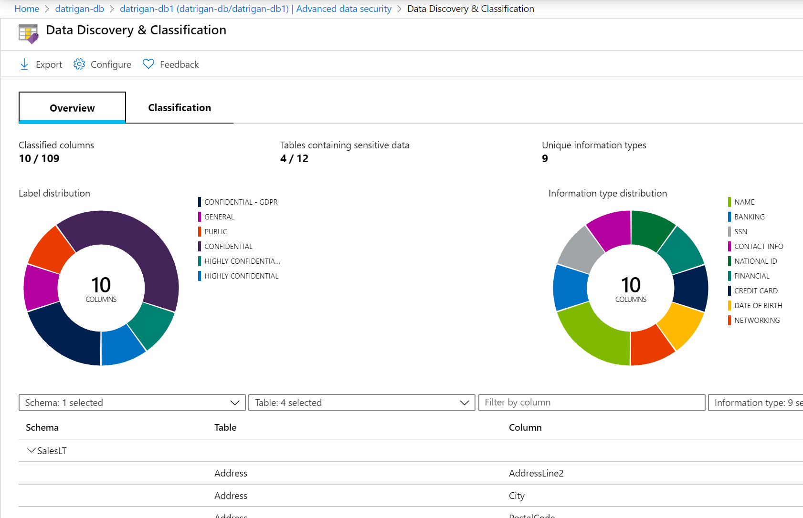
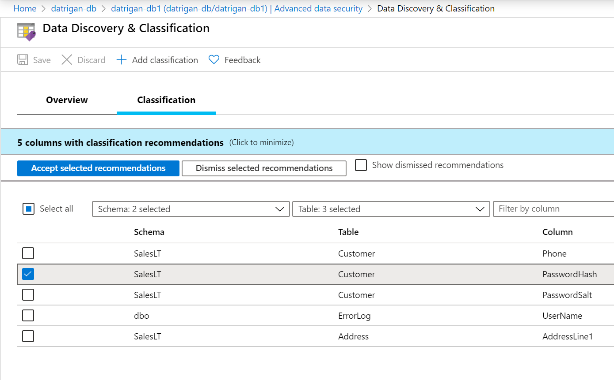
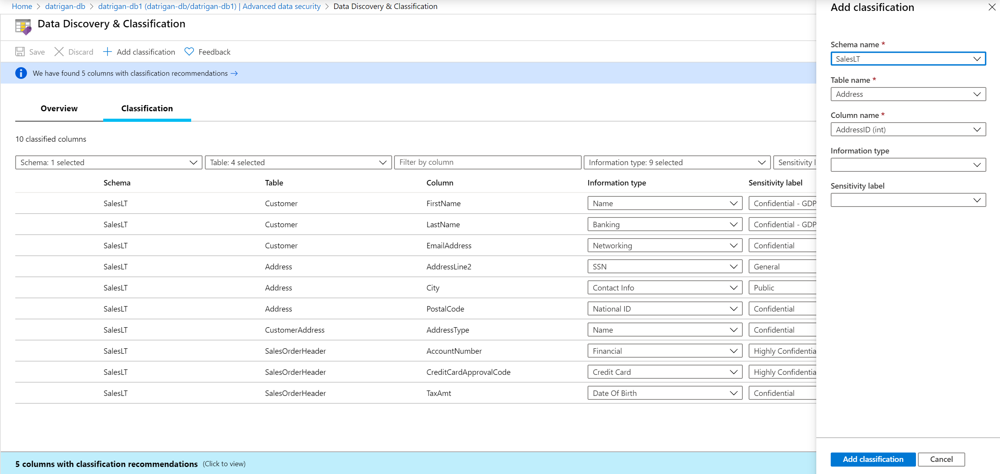
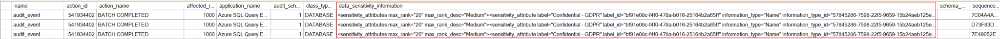

# Data Discovery & Classification
[!INCLUDE[appliesto-sqldb-sqlmi-asa](../includes/appliesto-sqldb-sqlmi-asa.md)]

Data Discovery & Classification is built into Azure SQL Database, Azure SQL Managed Instance, and Azure Synapse Analytics. It provides advanced capabilities for discovering, classifying, labeling, and reporting the sensitive data in your databases.

Your most sensitive data might include business, financial, healthcare, or personal information. Discovering and classifying this data can play a pivotal role in your organization's information-protection approach. It can serve as infrastructure for:

- Helping to meet standards for data privacy and requirements for regulatory compliance.
- Various security scenarios, such as monitoring (auditing) and alerting on anomalous access to sensitive data.
- Controlling access to and hardening the security of databases that contain highly sensitive data.

Data Discovery & Classification is part of the [Advanced Data Security](advanced-data-security.md) offering, which is a unified package for advanced Azure SQL security capabilities. You can access and manage Data Discovery & Classification via the central **SQL Advanced Data Security** section of the Azure portal.

> [!NOTE]
> For information about SQL Server on-premises, see [SQL Data Discovery & Classification](https://go.microsoft.com/fwlink/?linkid=866999).

## What is Data Discovery & Classification?

Data Discovery & Classification introduces a set of advanced services and new capabilities in Azure. It forms a new information-protection paradigm for SQL Database, SQL Managed Instance, and Azure Synapse, aimed at protecting the data and not just the database. The paradigm includes:

- **Discovery and recommendations:** The classification engine scans your database and identifies columns that contain potentially sensitive data. It then provides you with an easy way to review and apply recommended classification via the Azure portal.

- **Labeling:** You can apply sensitivity-classification labels persistently to columns by using new metadata attributes that have been added to the SQL Server database engine. This metadata can then be used for advanced, sensitivity-based auditing and protection scenarios.

- **Query result-set sensitivity:** The sensitivity of a query result set is calculated in real time for auditing purposes.

- **Visibility:** You can view the database-classification state in a detailed dashboard in the Azure portal. Also, you can download a report in Excel format to use for compliance and auditing purposes and other needs.

## Discover, classify, and label sensitive columns

This section describes the steps for:

- Discovering, classifying, and labeling columns that contain sensitive data in your database.
- Viewing the current classification state of your database and exporting reports.

The classification includes two metadata attributes:

- **Labels**: The main classification attributes, used to define the sensitivity level of the data stored in the column.  
- **Information types**: Attributes that provide more granular information about the type of data stored in the column.

### Define and customize your classification taxonomy

Data Discovery & Classification comes with a built-in set of sensitivity labels and a built-in set of information types and discovery logic. You can now customize this taxonomy and define a set and ranking of classification constructs specifically for your environment.

You define and customize of your classification taxonomy in one central place for your entire Azure organization. That location is in [Azure Security Center](https://docs.microsoft.com/azure/security-center/security-center-intro), as part of your security policy. Only someone with administrative rights on the organization's root management group can do this task.

As part of policy management for information protection, you can define custom labels, rank them, and associate them with a selected set of information types. You can also add your own custom information types and configure them with string patterns. The patterns are added to the discovery logic for identifying this type of data in your databases.

For more information, see [Customize the SQL information protection policy in Azure Security Center (Preview)](https://go.microsoft.com/fwlink/?linkid=2009845&clcid=0x409).

After the organization-wide policy has been defined, you can continue classifying individual databases by using your customized policy.

### Classify your database

> [!NOTE]
> The below example uses Azure SQL Database, but you should select the appropriate product that you want to configure Data Discovery & Classification.

1. Go to the [Azure portal](https://portal.azure.com).

2. Go to **Advanced Data Security** under the **Security** heading in your Azure SQL Database pane. Select **Advanced data security**, and then select the **Data Discovery & Classification** card.

   

3. On the **Data Discovery & Classification** page, the **Overview** tab includes a summary of the current classification state of the database. The summary includes a detailed list of all classified columns, which you can also filter to show only specific schema parts, information types, and labels. If you haven’t classified any columns yet, [skip to step 5](#step-5).

   

4. To download a report in Excel format, select **Export** in the top menu of the pane.

5. To begin classifying your data, select the **Classification** tab on the **Data Discovery & Classification** page.

    The classification engine scans your database for columns containing potentially sensitive data and provides a list of recommended column classifications.

6. View and apply classification recommendations:

   - To view the list of recommended column classifications, select the recommendations panel at the bottom of the pane.

   - To accept a recommendation for a specific column, select the check box in the left column of the relevant row. To mark all recommendations as accepted, select the leftmost check box in the recommendations table header.

       

   - To apply the selected recommendations, select **Accept selected recommendations**.

7. You can also classify columns manually, as an alternative or in addition to the recommendation-based classification:

   1. Select **Add classification** in the top menu of the pane.

   1. In the context window that opens, select the schema, table, and column that you want to classify, and the information type and sensitivity label.

   1. Select **Add classification** at the bottom of the context window.

      

8. To complete your classification and persistently label (tag) the database columns with the new classification metadata, select **Save** in the top menu of the window.

## Audit access to sensitive data

An important aspect of the information-protection paradigm is the ability to monitor access to sensitive data. [Azure SQL Auditing](../../azure-sql/database/auditing-overview.md) has been enhanced to include a new field in the audit log called `data_sensitivity_information`. This field logs the sensitivity classifications (labels) of the data that was returned by a query. Here's an example:

## Permissions

These built-in roles can read the data classification of a database:

- Owner
- Reader
- Contributor
- SQL Security Manager
- User Access Administrator

These built-in roles can modify the data classification of a database:

- Owner
- Contributor
- SQL Security Manager

Learn more about role-based permissions in [RBAC for Azure resources](https://docs.microsoft.com/azure/role-based-access-control/overview).

## Manage classifications

You can use T-SQL, a REST API, or PowerShell to manage classifications.

### Use T-SQL

You can use T-SQL to add or remove column classifications, and to retrieve all classifications for the entire database.

> [!NOTE]
> When you use T-SQL to manage labels, there's no validation that labels that you add to a column exist in the organization's information-protection policy (the set of labels that appear in the portal recommendations). So, it's up to you to validate this.

For information about using T-SQL for classifications, see the following references:

- To add or update the classification of one or more columns: [ADD SENSITIVITY CLASSIFICATION](https://docs.microsoft.com/sql/t-sql/statements/add-sensitivity-classification-transact-sql)
- To remove the classification from one or more columns: [DROP SENSITIVITY CLASSIFICATION](https://docs.microsoft.com/sql/t-sql/statements/drop-sensitivity-classification-transact-sql)
- To view all classifications on the database: [sys.sensitivity_classifications](https://docs.microsoft.com/sql/relational-databases/system-catalog-views/sys-sensitivity-classifications-transact-sql)

### Use PowerShell cmdlets
Manage classifications and recommendations for Azure SQL Database and Azure SQL Managed Instance using PowerShell.

#### PowerShell cmdlets for Azure SQL Database

- [Get-AzSqlDatabaseSensitivityClassification](https://docs.microsoft.com/powershell/module/az.sql/get-azsqldatabasesensitivityclassification)
- [Set-AzSqlDatabaseSensitivityClassification](https://docs.microsoft.com/powershell/module/az.sql/set-azsqldatabasesensitivityclassification)
- [Remove-AzSqlDatabaseSensitivityClassification](https://docs.microsoft.com/powershell/module/az.sql/remove-azsqldatabasesensitivityclassification)
- [Get-AzSqlDatabaseSensitivityRecommendation](https://docs.microsoft.com/powershell/module/az.sql/get-azsqldatabasesensitivityrecommendation)
- [Enable-AzSqlDatabaSesensitivityRecommendation](https://docs.microsoft.com/powershell/module/az.sql/enable-azsqldatabasesensitivityrecommendation)
- [Disable-AzSqlDatabaseSensitivityRecommendation](https://docs.microsoft.com/powershell/module/az.sql/disable-azsqldatabasesensitivityrecommendation)

#### PowerShell cmdlets for Azure SQL Managed Instance

- [Get-AzSqlInstanceDatabaseSensitivityClassification](https://docs.microsoft.com/powershell/module/az.sql/get-azsqlinstancedatabasesensitivityclassification)
- [Set-AzSqlInstanceDatabaseSensitivityClassification](https://docs.microsoft.com/powershell/module/az.sql/set-azsqlinstancedatabasesensitivityclassification)
- [Remove-AzSqlInstanceDatabaseSensitivityClassification](https://docs.microsoft.com/powershell/module/az.sql/remove-azsqlinstancedatabasesensitivityclassification)
- [Get-AzSqlInstanceDatabaseSensitivityRecommendation](https://docs.microsoft.com/powershell/module/az.sql/get-azsqlinstancedatabasesensitivityrecommendation)
- [Enable-AzSqlInstanceDatabaseSensitivityRecommendation](https://docs.microsoft.com/powershell/module/az.sql/enable-azsqlinstancedatabasesensitivityrecommendation)
- [Disable-AzSqlInstanceDatabaseSensitivityRecommendation](https://docs.microsoft.com/powershell/module/az.sql/disable-azsqlinstancedatabasesensitivityrecommendation)

### Use the Rest API

You can use the REST API to programmatically manage classifications and recommendations. The published REST API supports the following operations:

- [Create Or Update](https://docs.microsoft.com/rest/api/sql/sensitivitylabels/createorupdate): Creates or updates the sensitivity label of the specified column.
- [Delete](https://docs.microsoft.com/rest/api/sql/sensitivitylabels/delete): Deletes the sensitivity label of the specified column.
- [Disable Recommendation](https://docs.microsoft.com/rest/api/sql/sensitivitylabels/disablerecommendation): Disables sensitivity recommendations on the specified column.
- [Enable Recommendation](https://docs.microsoft.com/rest/api/sql/sensitivitylabels/enablerecommendation): Enables sensitivity recommendations on the specified column. (Recommendations are enabled by default on all columns.)
- [Get](https://docs.microsoft.com/rest/api/sql/sensitivitylabels/get): Gets the sensitivity label of the specified column.
- [List Current By Database](https://docs.microsoft.com/rest/api/sql/sensitivitylabels/listcurrentbydatabase): Gets the current sensitivity labels of the specified database.
- [List Recommended By Database](https://docs.microsoft.com/rest/api/sql/sensitivitylabels/listrecommendedbydatabase): Gets the recommended sensitivity labels of the specified database.

## Next steps

- Learn more about [Advanced Data Security](advanced-data-security.md).
- Consider configuring [Azure SQL Auditing](../../azure-sql/database/auditing-overview.md) for monitoring and auditing access to your classified sensitive data.
- For a presentation that includes data Discovery & Classification, see [Discovering, classifying, labeling & protecting SQL data | Data Exposed](https://www.youtube.com/watch?v=itVi9bkJUNc).
