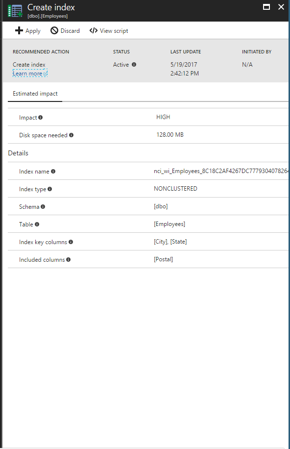
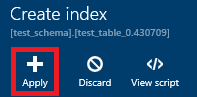
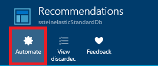
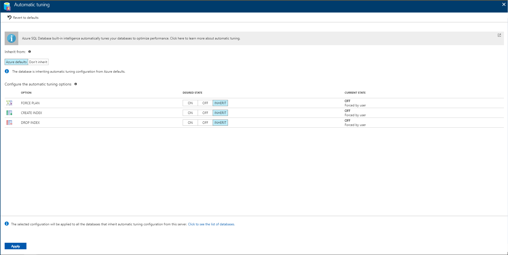
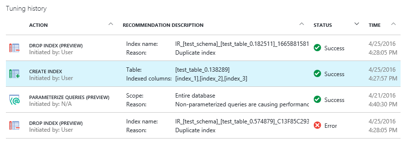
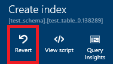
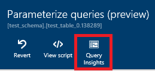

# Find and apply performance recommendations
[!INCLUDE[appliesto-sqldb](../includes/appliesto-sqldb.md)]

You can use the Azure portal to find performance recommendations that can optimize performance of your database in Azure SQL Database or to correct some issue identified in your workload. The **Performance recommendation** page in the Azure portal enables you to find the top recommendations based on their potential impact.

## Viewing recommendations

To view and apply performance recommendations, you need the correct [role-based access control](../../role-based-access-control/overview.md) permissions in Azure. **Reader**, **SQL DB Contributor** permissions are required to view recommendations, and **Owner**, **SQL DB Contributor** permissions are required to execute any actions; create or drop indexes and cancel index creation.

Use the following steps to find performance recommendations on the Azure portal:

1. Sign in to the [Azure portal](https://portal.azure.com/).
2. Go to **All services** > **SQL databases**, and select your database.
3. Navigate to **Performance recommendation** to view available recommendations for the selected database.

Performance recommendations are shown in the table similar to the one shown on the following figure:

Recommendations are sorted by their potential impact on performance into the following categories:

| Impact | Description |
|:--- |:--- |
| High |High impact recommendations should provide the most significant performance impact. |
| Medium |Medium impact recommendations should improve performance, but not substantially. |
| Low |Low impact recommendations should provide better performance than without, but improvements might not be significant. |

> [!NOTE]
> Azure SQL Database needs to monitor activities at least for a day in order to identify some recommendations. The Azure SQL Database can more easily optimize for consistent query patterns than it can for random spotty bursts of activity. If recommendations are not currently available, the **Performance recommendation** page provides a message explaining why.

You can also view the status of the historical operations. Select a recommendation or status to see more information.

Here is an example of the "Create index" recommendation in the Azure portal.

## Applying recommendations

Azure SQL Database gives you full control over how recommendations are enabled using any of the following three options:

* Apply individual recommendations one at a time.
* Enable the Automatic tuning to automatically apply recommendations.
* To implement a recommendation manually, run the recommended T-SQL script against your database.

Select any recommendation to view its details and then click **View script** to review the exact details of how the recommendation is created.

The database remains online while the recommendation is applied -- using performance recommendation or automatic tuning never takes a database offline.

### Apply an individual recommendation

You can review and accept recommendations one at a time.

1. On the **Recommendations** page, select a recommendation.
2. On the **Details** page, click the **Apply** button.

   

Selected recommendations are applied on the database.

### Removing recommendations from the list

If your list of recommendations contains items that you want to remove from the list, you can discard the recommendation:

1. Select a recommendation in the list of **Recommendations** to open the details.
2. Click **Discard** on the **Details** page.

If desired, you can add discarded items back to the **Recommendations** list:

1. On the **Recommendations** page, click **View discarded**.
2. Select a discarded item from the list to view its details.
3. Optionally, click **Undo Discard** to add the index back to the main list of **Recommendations**.

> [!NOTE]
> Please note that if SQL Database [Automatic tuning](automatic-tuning-overview.md) is enabled, and if you have manually discarded a recommendation from the list, such recommendation will never be applied automatically. Discarding a recommendation is a handy way for users to have Automatic tuning enabled in cases when requiring that a specific recommendation shouldn’t be applied.
> You can revert this behavior by adding discarded recommendations back to the Recommendations list by selecting the Undo Discard option.

### Enable automatic tuning

You can set your database to implement recommendations automatically. As recommendations become available, they are automatically applied. As with all recommendations managed by the service, if the performance impact is negative, the recommendation is reverted.

1. On the **Recommendations** page, click **Automate**:

   
2. Select actions to automate:

   

> [!NOTE]
> Please note that **DROP_INDEX** option is currently not compatible with applications using partition switching and index hints.

Once you have selected your desired configuration, click Apply.

### Manually apply recommendations through T-SQL

Select any recommendation and then click **View script**. Run this script against your database to manually apply the recommendation.

*Indexes that are manually executed are not monitored and validated for performance impact by the service* so it is suggested that you monitor these indexes after creation to verify they provide performance gains and adjust or delete them if necessary. For details about creating indexes, see [CREATE INDEX (Transact-SQL)](https://docs.microsoft.com/sql/t-sql/statements/create-index-transact-sql). In addition, manually applied recommendations will remain active and shown in the list of recommendations for 24-48 hrs. before the system automatically withdraws them. If you would like to remove a recommendation sooner, you can manually discard it.

### Canceling recommendations

Recommendations that are in a **Pending**, **Validating**, or **Success** status can be canceled. Recommendations with a status of **Executing** cannot be canceled.

1. Select a recommendation in the **Tuning History** area to open the **recommendations details** page.
2. Click **Cancel** to abort the process of applying the recommendation.

## Monitoring operations

Applying a recommendation might not happen instantaneously. The portal provides details regarding the status of recommendation. The following are possible states that an index can be in:

| Status | Description |
|:--- |:--- |
| Pending |Apply recommendation command has been received and is scheduled for execution. |
| Executing |The recommendation is being applied. |
| Validating |Recommendation was successfully applied and the service is measuring the benefits. |
| Success |Recommendation was successfully applied and benefits have been measured. |
| Error |An error occurred during the process of applying the recommendation. This can be a transient issue, or possibly a schema change to the table and the script is no longer valid. |
| Reverting |The recommendation was applied, but has been deemed non-performant and is being automatically reverted. |
| Reverted |The recommendation was reverted. |

Click an in-process recommendation from the list to see more information:

### Reverting a recommendation

If you used the performance recommendations to apply the recommendation (meaning you did not manually run the T-SQL script), it automatically reverts the change if it finds the performance impact to be negative. If for any reason you simply want to revert a recommendation, you can do the following:

1. Select a successfully applied recommendation in the **Tuning history** area.
2. Click **Revert** on the **recommendation details** page.

## Monitoring performance impact of index recommendations

After recommendations are successfully implemented (currently, index operations and parameterize queries recommendations only), you can click **Query Insights** on the recommendation details page to open [Query Performance Insights](query-performance-insight-use.md) and see the performance impact of your top queries.

## Summary

Azure SQL Database provides recommendations for improving database performance. By providing T-SQL scripts, you get assistance in optimizing your database and ultimately improving query performance.

## Next steps

Monitor your recommendations and continue to apply them to refine performance. Database workloads are dynamic and change continuously. Azure SQL Database continues to monitor and provide recommendations that can potentially improve your database's performance.

* See [Automatic tuning](automatic-tuning-overview.md) to learn more about the automatic tuning in Azure SQL Database.
* See [Performance recommendations](database-advisor-implement-performance-recommendations.md) for an overview of Azure SQL Database performance recommendations.
* See [Query Performance Insights](query-performance-insight-use.md) to learn about viewing the performance impact of your top queries.

## Additional resources

* [Query Store](https://msdn.microsoft.com/library/dn817826.aspx)
* [CREATE INDEX](https://msdn.microsoft.com/library/ms188783.aspx)
* [Role-based access control](../../role-based-access-control/overview.md)
