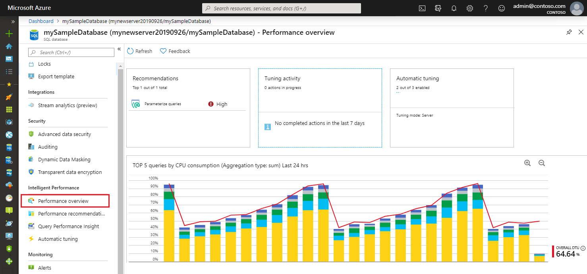
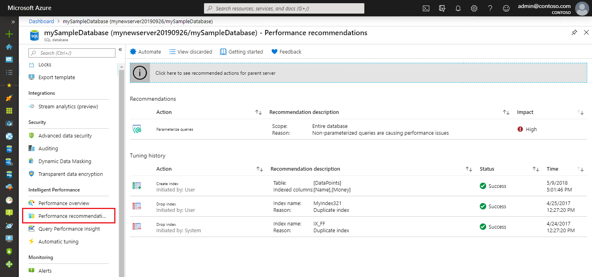

# Database Advisor performance recommendations for Azure SQL Database
[!INCLUDE[appliesto-sqldb](../includes/appliesto-sqldb.md)]

Azure SQL Database learns and adapts with your application. Azure SQL Database has a number of database advisors that provide customized recommendations that enable you to maximize performance. These database advisors continuously assess and analyze the usage history and provide recommendations based on workload patterns that help improve performance.

## Performance overview

Performance overview provides a summary of your database performance, and helps you with performance tuning and troubleshooting.

- The **Recommendations** tile provides a breakdown of tuning recommendations for your database (top three recommendations are shown if there are more). Clicking this tile takes you to **[Performance recommendation options](database-advisor-find-recommendations-portal.md#viewing-recommendations)**.
- The **Tuning activity** tile provides a summary of the ongoing and completed tuning actions for your database, giving you a quick view into the history of tuning activity. Clicking this tile takes you to the full tuning history view for your database.
- The **Auto-tuning** tile shows the **[auto-tuning configuration](automatic-tuning-enable.md)** for your database (tuning options that are automatically applied to your database). Clicking this tile opens the automation configuration dialog.
- The **Database queries** tile shows the summary of the query performance for your database (overall DTU usage and top resource consuming queries). Clicking this tile takes you to **[Query Performance Insight](query-performance-insight-use.md)**.

## Performance recommendation options

Performance recommendation options available in Azure SQL Database are:

| Performance recommendation | Single database and pooled database support | Instance database support |
| :----------------------------- | ----- | ----- |
| **Create index recommendations** - Recommends creation of indexes that may improve performance of your workload. | Yes | No |
| **Drop index recommendations** - Recommends removal of redundant and duplicate indexes daily, except for unique indexes, and indexes that were not used for a long time (>90 days). Please note that this option is not compatible with applications using partition switching and index hints. Dropping unused indexes is not supported for Premium and Business Critical service tiers. | Yes | No |
| **Parameterize queries recommendations (preview)** - Recommends forced parameterization in cases when you have one or more queries that are constantly being recompiled but end up with the same query execution plan. | Yes | No |
| **Fix schema issues recommendations (preview)** - Recommendations for schema correction appear when Azure SQL Database notices an anomaly in the number of schema-related SQL errors that are happening on your SQL database. Microsoft is currently deprecating "Fix schema issue" recommendations. | Yes | No |

To apply performance recommendations, see [applying recommendations](database-advisor-find-recommendations-portal.md#applying-recommendations). To view the status of recommendations, see [Monitoring operations](database-advisor-find-recommendations-portal.md#monitoring-operations).

You can also find complete history of tuning actions that were applied in the past.

## Create index recommendations

Azure SQL Database continuously monitors the queries that are running and identifies the indexes that could improve performance. After there's enough confidence that a certain index is missing, a new **Create index** recommendation is created.

Azure SQL Database builds confidence by estimating the performance gain the index would bring through time. Depending on the estimated performance gain, recommendations are categorized as high, medium, or low.

Indexes that are created by using recommendations are always flagged as auto-created indexes. You can see which indexes are auto-created by looking at the [sys.indexes view](https://docs.microsoft.com/sql/relational-databases/system-catalog-views/sys-indexes-transact-sql). Auto-created indexes don't block ALTER/RENAME commands.

If you try to drop the column that has an auto-created index over it, the command passes. The auto-created index is dropped with the command as well. Regular indexes block the ALTER/RENAME command on columns that are indexed.

After the create index recommendation is applied, Azure SQL Database compares the performance of the queries with the baseline performance. If the new index improved performance, the recommendation is flagged as successful and the impact report is available. If the index didn't improve performance, it's automatically reverted. Azure SQL Database uses this process to ensure that recommendations improve database performance.

Any **create index** recommendation has a back-off policy that doesn't allow applying the recommendation if the resource usage of a database or pool is high. The back-off policy takes into account CPU, Data IO, Log IO, and available storage.

If CPU, data IO, or log IO is higher than 80% in the previous 30 minutes, the create index recommendation is postponed. If the available storage will be below 10% after the index is created, the recommendation goes into an error state. If, after a couple of days, automatic tuning still believes that the index would be beneficial, the process starts again.

This process repeats until there's enough available storage to create an index, or until the index isn't seen as beneficial anymore.

## Drop index recommendations

Besides detecting missing indexes, Azure SQL Database continuously analyzes the performance of existing indexes. If an index is not used, Azure SQL Database recommends dropping it. Dropping an index is recommended in two cases:

- The index is a duplicate of another index (same indexed and included column, partition schema, and filters).
- The index hasn't been used for a prolonged period (93 days).

Drop index recommendations also go through the verification after implementation. If the performance improves, the impact report is available. If performance degrades, the recommendation is reverted.

## Parameterize queries recommendations (preview)

*Parameterize queries* recommendations appear when you have one or more queries that are constantly being recompiled but end up with the same query execution plan. This condition creates an opportunity to apply forced parameterization. Forced parameterization, in turn, allows query plans to be cached and reused in the future, which improves performance and reduces resource usage.

Every query initially needs to be compiled to generate an execution plan. Each generated plan is added to the plan cache. Subsequent executions of the same query can reuse this plan from the cache, which eliminates the need for additional compilation.

Queries with non-parameterized values can lead to performance overhead because the execution plan is recompiled each time the non-parameterized values are different. In many cases, the same queries with different parameter values generate the same execution plans. These plans, however, are still separately added to the plan cache.

The process of recompiling execution plans uses database resources, increases the query duration time, and overflows the plan cache. These events, in turn, cause plans to be evicted from the cache. This behavior can be altered by setting the forced parameterization option on the database.

To help you estimate the impact of this recommendation, you are provided with a comparison between the actual CPU usage and the projected CPU usage (as if the recommendation were applied). This recommendation can help you gain CPU savings. It can also help you decrease query duration and overhead for the plan cache, which means that more of the plans can stay in the cache and be reused. You can apply this recommendation quickly by selecting the **Apply** command.

After you apply this recommendation, it enables forced parameterization within minutes on your database. It starts the monitoring process, which lasts for approximately 24 hours. After this period, you can see the validation report. This report shows the CPU usage of your database 24 hours before and after the recommendation has been applied. Azure SQL Database Advisor has a safety mechanism that automatically reverts the applied recommendation if performance regression has been detected.

## Fix schema issues recommendations (preview)

> [!IMPORTANT]
> Microsoft is currently deprecating "Fix schema issue" recommendations. We recommend that you use [Intelligent Insights](intelligent-insights-overview.md) to monitor  your database performance issues, including schema issues that the "Fix schema issue" recommendations previously covered.

**Fix schema issues** recommendations appear when Azure SQL Database notices an anomaly in the number of schema-related SQL errors that are happening on your SQL database. This recommendation typically appears when your database encounters multiple schema-related errors (invalid column name, invalid object name, and so on) within an hour.

"Schema issues" are a class of syntax errors. They occur when the definition of the SQL query and the definition of the database schema aren't aligned. For example, one of the columns that's expected by the query might be missing in the target table or vice-versa.

The "Fix schema issue" recommendation appears when Azure SQL Database notices an anomaly in the number of schema-related SQL errors that are happening on your SQL database. The following table shows the errors that are related to schema issues:

| SQL error code | Message |
| --- | --- |
| 201 |Procedure or function '*' expects parameter '*', which was not supplied. |
| 207 |Invalid column name '*'. |
| 208 |Invalid object name '*'. |
| 213 |Column name or number of supplied values does not match table definition. |
| 2812 |Could not find stored procedure '*'. |
| 8144 |Procedure or function * has too many arguments specified. |

## Custom applications

Developers might consider developing custom applications using performance recommendations for Azure SQL Database. All recommendations listed in the portal for a database can be accessed through [Get-AzSqlDatabaseRecommendedAction](https://docs.microsoft.com/powershell/module/az.sql/get-azsqldatabaserecommendedaction) API.

## Next steps

- For more information about automatic tuning of database indexes and query execution plans, see [Azure SQL Database automatic tuning](automatic-tuning-overview.md).
- For more information about automatically monitoring database performance with automated diagnostics and root cause analysis of performance issues, see [Azure SQL Intelligent Insights](intelligent-insights-overview.md).
- See [Query Performance Insights](query-performance-insight-use.md) to learn about and view the performance impact of your top queries.
