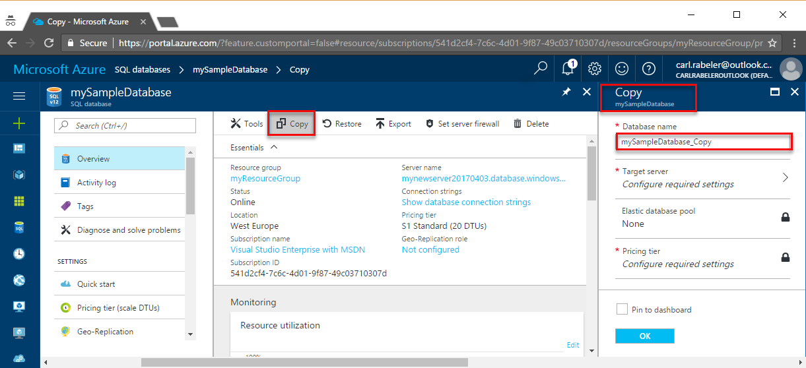

# Copy a transactionally consistent copy of a database in Azure SQL Database

[!INCLUDE[appliesto-sqldb](../includes/appliesto-sqldb.md)]

Azure SQL Database provides several methods for creating a copy of an existing [database](single-database-overview.md) on either the same server or a different server. You can copy a database by using Azure portal, PowerShell, Azure CLI, or T-SQL.

## Overview

A database copy is a transactionally consistent snapshot of the source database as of a point in time after the copy request is initiated. You can select the same server or a different server for the copy. Also you can choose to keep the backup redundancy, service tier and compute size of the source database, or use a different backup storage redundancy and/or compute size within the same or a different service tier. After the copy is complete, it becomes a fully functional, independent database. The logins, users, and permissions in the copied database are  managed independently from the source database. The copy is created using the geo-replication technology. Once replica seeding is complete, the geo-replication link is automatically terminated. All the requirements for using geo-replication apply to the database copy operation. See [Active geo-replication overview](active-geo-replication-overview.md) for details.

> [!NOTE]
> Azure SQL Database Configurable Backup Storage Redundancy is currently available in public preview in Brazil South and generally available in Southeast Asia Azure region only. In the preview, if the source database is created with locally-redundant or zone-redundant backup storage redundancy, database copy to a server in a different Azure region is not supported. 

## Logins in the database copy

When you copy a database to the same server, the same logins can be used on both databases. The security principal you use to copy the database becomes the database owner on the new database.

When you copy a database to a different server, the security principal that initiated the copy operation on the target server becomes the owner of the new database.

Regardless of the target server, all database users, their permissions, and their security identifiers (SIDs) are copied to the database copy. Using [contained database users](logins-create-manage.md) for data access ensures that the copied database has the same user credentials, so that after the copy is complete you can immediately access it with the same credentials.

If you use server level logins for data access and copy the database to a different server, the login-based access might not work. This can happen because the logins do not exist on the target server, or because their passwords and security identifiers (SIDs) are different. To learn about managing logins when you copy a database to a different server, see [How to manage Azure SQL Database security after disaster recovery](active-geo-replication-security-configure.md). After the copy operation to a different server succeeds, and before other users are remapped, only the login associated with the database owner, or the server administrator can log in to the copied database. To resolve logins and establish data access after the copying operation is complete, see [Resolve logins](#resolve-logins).

## Copy using the Azure portal

To copy a database by using the Azure portal, open the page for your database, and then click **Copy**.

   

## Copy using PowerShell or the Azure CLI

To copy a database, use the following examples.

# [PowerShell](#tab/azure-powershell)

For PowerShell, use the [New-AzSqlDatabaseCopy](/powershell/module/az.sql/new-azsqldatabasecopy) cmdlet.

> [!IMPORTANT]
> The PowerShell Azure Resource Manager (RM) module is still supported by Azure SQL Database, but all future development is for the Az.Sql module. The AzureRM module will continue to receive bug fixes until at least December 2020.  The arguments for the commands in the Az module and in the AzureRm modules are substantially identical. For more about their compatibility, see [Introducing the new Azure PowerShell Az module](/powershell/azure/new-azureps-module-az).

```powershell
New-AzSqlDatabaseCopy -ResourceGroupName "<resourceGroup>" -ServerName $sourceserver -DatabaseName "<databaseName>" `
    -CopyResourceGroupName "myResourceGroup" -CopyServerName $targetserver -CopyDatabaseName "CopyOfMySampleDatabase"
```

The database copy is an asynchronous operation but the target database is created immediately after the request is accepted. If you need to cancel the copy operation while still in progress, drop the the target database using the [Remove-AzSqlDatabase](/powershell/module/az.sql/new-azsqldatabase) cmdlet.

For a complete sample PowerShell script, see [Copy a database to a new server](scripts/copy-database-to-new-server-powershell.md).

# [Azure CLI](#tab/azure-cli)

```azurecli
az sql db copy --dest-name "CopyOfMySampleDatabase" --dest-resource-group "myResourceGroup" --dest-server $targetserver `
    --name "<databaseName>" --resource-group "<resourceGroup>" --server $sourceserver
```

The database copy is an asynchronous operation but the target database is created immediately after the request is accepted. If you need to cancel the copy operation while still in progress, drop the the target database using the [az sql db delete](/cli/azure/sql/db#az_sql_db_delete) command.

* * *

## Copy using Transact-SQL

Log in to the master database with the server administrator login or the login that created the database you want to copy. For database copy to succeed, logins that are not the server administrator must be members of the `dbmanager` role. For more information about logins and connecting to the server, see [Manage logins](logins-create-manage.md).

Start copying the source database with the [CREATE DATABASE ... AS COPY OF](/sql/t-sql/statements/create-database-transact-sql?view=azuresqldb-current&preserve-view=true#copy-a-database) statement. The T-SQL statement continues running until the database copy operation is complete.

> [!NOTE]
> Terminating the T-SQL statement does not terminate the database copy operation. To terminate the operation, drop the target database.
>

> [!IMPORTANT]
> Selecting backup storage redundancy when using T-SQL CREATE DATABASE ... AS COPY OF command is not supported yet. 

### Copy to the same server

Log in to the master database with the server administrator login or the login that created the database you want to copy. For database copying to succeed, logins that are not the server administrator must be members of the `dbmanager` role.

This command copies Database1 to a new database named Database2 on the same server. Depending on the size of your database, the copying operation might take some time to complete.

   ```sql
   -- Execute on the master database to start copying
   CREATE DATABASE Database2 AS COPY OF Database1;
   ```

### Copy to an elastic pool

Log in to the master database with the server administrator login or the login that created the database you want to copy. For database copying to succeed, logins that are not the server administrator must be members of the `dbmanager` role.

This command copies Database1 to a new database named Database2 in an elastic pool named pool1. Depending on the size of your database, the copying operation might take some time to complete.

Database1 can be a single or pooled database. Copying between different tier pools is supported, but some cross-tier copies will not succeed. For example, you can copy a single or elastic standard db into a general purpose pool, but you can't copy a standard elastic db into a premium pool. 

   ```sql
   -- Execute on the master database to start copying
   CREATE DATABASE "Database2"
   AS COPY OF "Database1"
   (SERVICE_OBJECTIVE = ELASTIC_POOL( name = "pool1" ) );
   ```

### Copy to a different server

Log in to the master database of the target server where the new database is to be created. Use a login that has the same name and password as the database owner of the source database on the source server. The login on the target server must also be a member of the `dbmanager` role, or be the server administrator login.

This command copies Database1 on server1 to a new database named Database2 on server2. Depending on the size of your database, the copying operation might take some time to complete.

```sql
-- Execute on the master database of the target server (server2) to start copying from Server1 to Server2
CREATE DATABASE Database2 AS COPY OF server1.Database1;
```

> [!IMPORTANT]
> Both servers' firewalls must be configured to allow inbound connection from the IP of the client issuing the T-SQL CREATE DATABASE ... AS COPY OF command.

### Copy to a different subscription

You can use the steps in the [Copy a SQL Database to a different server](#copy-to-a-different-server) section to copy your database to a server in a different subscription using T-SQL. Make sure you use a login that has the same name and password as the database owner of the source database. Additionally, the login must be a member of the `dbmanager` role or a server administrator, on both source and target servers.

```sql
--Step# 1
--Create login and user in the master database of the source server.

CREATE LOGIN loginname WITH PASSWORD = 'xxxxxxxxx'
GO
CREATE USER [loginname] FOR LOGIN [loginname] WITH DEFAULT_SCHEMA=[dbo];
GO
ALTER ROLE dbmanager ADD MEMBER loginname;
GO

--Step# 2
--Create the user in the source database and grant dbowner permission to the database.

CREATE USER [loginname] FOR LOGIN [loginname] WITH DEFAULT_SCHEMA=[dbo];
GO
ALTER ROLE db_owner ADD MEMBER loginname;
GO

--Step# 3
--Capture the SID of the user "loginname" from master database

SELECT [sid] FROM sysusers WHERE [name] = 'loginname';

--Step# 4
--Connect to Destination server.
--Create login and user in the master database, same as of the source server.

CREATE LOGIN loginname WITH PASSWORD = 'xxxxxxxxx', SID = [SID of loginname login on source server];
GO
CREATE USER [loginname] FOR LOGIN [loginname] WITH DEFAULT_SCHEMA=[dbo];
GO
ALTER ROLE dbmanager ADD MEMBER loginname;
GO

--Step# 5
--Execute the copy of database script from the destination server using the credentials created

CREATE DATABASE new_database_name
AS COPY OF source_server_name.source_database_name;
```

> [!NOTE]
> The [Azure portal](https://portal.azure.com), PowerShell, and the Azure CLI do not support database copy to a different subscription.

> [!TIP]
> Database copy using T-SQL supports copying a database from a subscription in a different Azure tenant. This is only supported when using a SQL authentication login to log in to the target server.

## Monitor the progress of the copying operation

Monitor the copying process by querying the [sys.databases](/sql/relational-databases/system-catalog-views/sys-databases-transact-sql), [sys.dm_database_copies](/sql/relational-databases/system-dynamic-management-views/sys-dm-database-copies-azure-sql-database), and [sys.dm_operation_status](/sql/relational-databases/system-dynamic-management-views/sys-dm-operation-status-azure-sql-database) views. While the copying is in progress, the **state_desc** column of the sys.databases view for the new database is set to **COPYING**.

* If the copying fails, the **state_desc** column of the sys.databases view for the new database is set to **SUSPECT**. Execute the DROP statement on the new database, and try again later.
* If the copying succeeds, the **state_desc** column of the sys.databases view for the new database is set to **ONLINE**. The copying is complete, and the new database is a regular database that can be changed independent of the source database.

> [!NOTE]
> If you decide to cancel the copying while it is in progress, execute the [DROP DATABASE](/sql/t-sql/statements/drop-database-transact-sql) statement on the new database.

> [!IMPORTANT]
> If you need to create a copy with a substantially smaller service objective than the source, the target database may not have sufficient resources to complete the seeding process and it can cause the copy operation to fail. In this scenario use a geo-restore request to create a copy in a different server and/or a different region. See [Recover an Azure SQL Database using database backups](recovery-using-backups.md#geo-restore) for more information.

## Azure RBAC roles and permissions to manage database copy

To create a database copy, you will need to be in the following roles

* Subscription Owner or
* SQL Server Contributor role or
* Custom role on the source and target databases with following permission:

   Microsoft.Sql/servers/databases/read
   Microsoft.Sql/servers/databases/write

To cancel a database copy, you will need to be in the following roles

* Subscription Owner or
* SQL Server Contributor role or
* Custom role on the source and target databases with following permission:

   Microsoft.Sql/servers/databases/read
   Microsoft.Sql/servers/databases/write

To manage database copy using the Azure portal, you will also need the following permissions:

   Microsoft.Resources/subscriptions/resources/read
   Microsoft.Resources/subscriptions/resources/write
   Microsoft.Resources/deployments/read
   Microsoft.Resources/deployments/write
   Microsoft.Resources/deployments/operationstatuses/read

If you want to see the operations under deployments in the resource group on the portal, operations across multiple resource providers including SQL operations, you will need these additional permissions:

   Microsoft.Resources/subscriptions/resourcegroups/deployments/operations/read
   Microsoft.Resources/subscriptions/resourcegroups/deployments/operationstatuses/read

## Resolve logins

After the new database is online on the target server, use the [ALTER USER](/sql/t-sql/statements/alter-user-transact-sql?view=azuresqldb-current&preserve-view=true) statement to remap the users from the new database to logins on the target server. To resolve orphaned users, see [Troubleshoot Orphaned Users](/sql/sql-server/failover-clusters/troubleshoot-orphaned-users-sql-server). See also [How to manage Azure SQL Database security after disaster recovery](active-geo-replication-security-configure.md).

All users in the new database retain the permissions that they had in the source database. The user who initiated the database copy becomes the database owner of the new database. After the copying succeeds and before other users are remapped, only the database owner can log in to the new database.

To learn about managing users and logins when you copy a database to a different server, see [How to manage Azure SQL Database security after disaster recovery](active-geo-replication-security-configure.md).

## Database copy errors

The following errors can be encountered while copying a database in Azure SQL Database. For more information, see [Copy an Azure SQL Database](database-copy.md).

| Error code | Severity | Description |
| ---:| ---:|:--- |
| 40635 |16 |Client with IP address '%.&#x2a;ls' is temporarily disabled. |
| 40637 |16 |Create database copy is currently disabled. |
| 40561 |16 |Database copy failed. Either the source or target database does not exist. |
| 40562 |16 |Database copy failed. The source database has been dropped. |
| 40563 |16 |Database copy failed. The target database has been dropped. |
| 40564 |16 |Database copy failed due to an internal error. Please drop target database and try again. |
| 40565 |16 |Database copy failed. No more than 1 concurrent database copy from the same source is allowed. Please drop target database and try again later. |
| 40566 |16 |Database copy failed due to an internal error. Please drop target database and try again. |
| 40567 |16 |Database copy failed due to an internal error. Please drop target database and try again. |
| 40568 |16 |Database copy failed. Source database has become unavailable. Please drop target database and try again. |
| 40569 |16 |Database copy failed. Target database has become unavailable. Please drop target database and try again. |
| 40570 |16 |Database copy failed due to an internal error. Please drop target database and try again later. |
| 40571 |16 |Database copy failed due to an internal error. Please drop target database and try again later. |

## Next steps

* For information about logins, see [Manage logins](logins-create-manage.md) and [How to manage Azure SQL Database security after disaster recovery](active-geo-replication-security-configure.md).
* To export a database, see [Export the database to a BACPAC](database-export.md).
