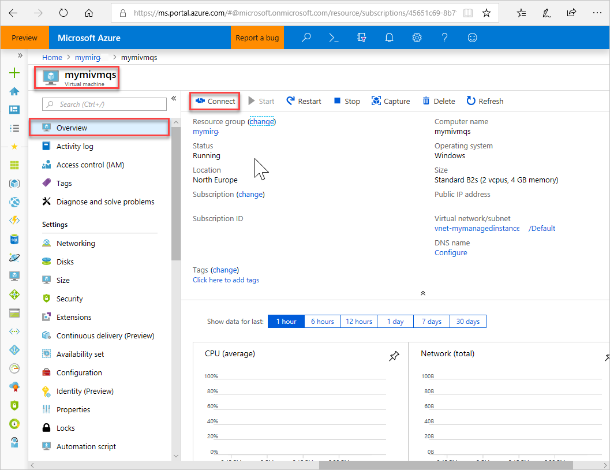
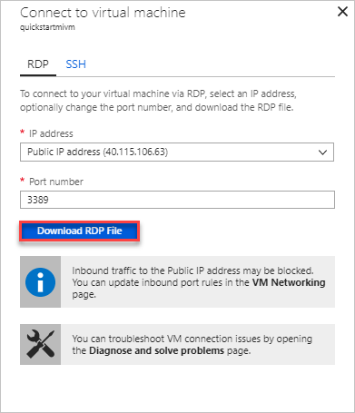
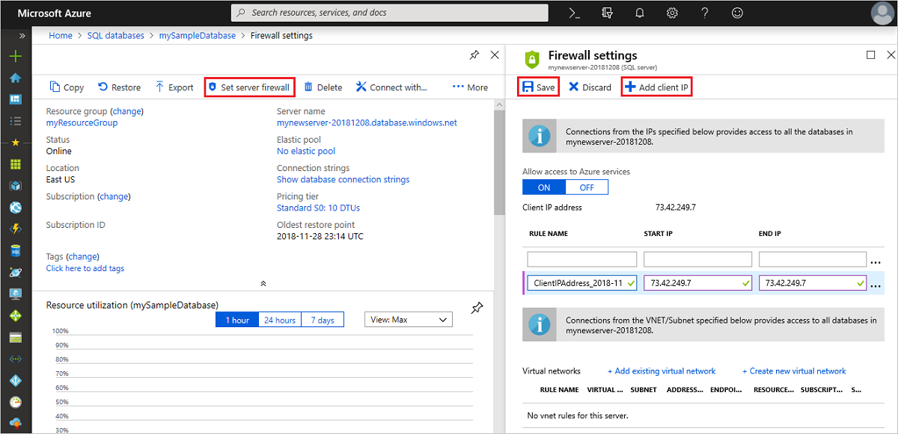

# Import or export an Azure SQL Database without allowing Azure services to access the server
[!INCLUDE[appliesto-sqldb](../includes/appliesto-sqldb.md)]

This article shows you how to import or export an Azure SQL Database when *Allow Azure Services* is set to *OFF* on the server. The workflow uses an Azure virtual machine to run SqlPackage to perform the import or export operation.

## Sign in to the Azure portal

Sign in to the [Azure portal](https://portal.azure.com/).

## Create the Azure virtual machine

Create an Azure virtual machine by selecting the **Deploy to Azure** button.

This template allows you to deploy a simple Windows virtual machine using a few different options for the Windows version, using the latest patched version. This will deploy a A2 size VM in the resource group location and return the fully qualified domain name of the VM.
<br><br>

<a href="https://portal.azure.com/#create/Microsoft.Template/uri/https%3A%2F%2Fraw.githubusercontent.com%2FAzure%2Fazure-quickstart-templates%2Fmaster%2F101-vm-simple-windows%2Fazuredeploy.json" target="_blank">
    
</a>

For more information, see [Very simple deployment of a Windows VM](https://github.com/Azure/azure-quickstart-templates/tree/master/101-vm-simple-windows).

## Connect to the virtual machine

The following steps show you how to connect to your virtual machine using a remote desktop connection.

1. After deployment completes, go to the virtual machine resource.

     

2. Select **Connect**.

   A Remote Desktop Protocol file (.rdp file) form appears with the public IP address and port number for the virtual machine.

     

3. Select **Download RDP File**.

   > [!NOTE]
   > You can also use SSH to connect to your VM.

4. Close the **Connect to virtual machine** form.
5. To connect to your VM, open the downloaded RDP file.
6. When prompted, select **Connect**. On a Mac, you need an RDP client such as this [Remote Desktop Client](https://apps.apple.com/app/microsoft-remote-desktop-10/id1295203466?mt=12) from the Mac App Store.

7. Enter the username and password you specified when creating the virtual machine, then choose **OK**.

8. You might receive a certificate warning during the sign-in process. Choose **Yes** or **Continue** to proceed with the connection.

## Install SqlPackage

[Download and install the latest version of SqlPackage](https://docs.microsoft.com/sql/tools/sqlpackage-download).

For additional information, see [SqlPackage.exe](https://docs.microsoft.com/sql/tools/sqlpackage).

## Create a firewall rule to allow the VM access to the database

Add the virtual machine's public IP address to the server's firewall.

The following steps create a server-level IP firewall rule for your virtual machine's public IP address and enables connectivity from the virtual machine.

1. Select **SQL databases** from the left-hand menu and then select your database on the **SQL databases** page. The overview page for your database opens, showing you the fully qualified server name (such as **servername.database.windows.net**) and provides options for further configuration.

2. Copy this fully qualified server name to use when connecting to your server and its databases.

   

3. Select **Set server firewall** on the toolbar. The **Firewall settings** page for the server opens.

   

4. Choose **Add client IP** on the toolbar to add your virtual machine's public IP address to a new server-level IP firewall rule. A server-level IP firewall rule can open port 1433 for a single IP address or a range of IP addresses.

5. Select **Save**. A server-level IP firewall rule is created for your virtual machine's public IP address opening port 1433 on the server.

6. Close the **Firewall settings** page.

## Export a database using SqlPackage

To export an Azure SQL Database using the [SqlPackage](https://docs.microsoft.com/sql/tools/sqlpackage) command-line utility, see [Export parameters and properties](https://docs.microsoft.com/sql/tools/sqlpackage#export-parameters-and-properties). The SqlPackage utility ships with the latest versions of [SQL Server Management Studio](https://docs.microsoft.com/sql/ssms/download-sql-server-management-studio-ssms) and [SQL Server Data Tools](https://docs.microsoft.com/sql/ssdt/download-sql-server-data-tools-ssdt), or you can download the latest version of [SqlPackage](https://docs.microsoft.com/sql/tools/sqlpackage-download).

We recommend the use of the SqlPackage utility for scale and performance in most production environments. For a SQL Server Customer Advisory Team blog about migrating using BACPAC files, see [Migrating from SQL Server to Azure SQL Database using BACPAC Files](https://blogs.msdn.microsoft.com/sqlcat/20../../migrating-from-sql-server-to-azure-sql-database-using-bacpac-files/).

This example shows how to export a database using SqlPackage.exe with Active Directory Universal Authentication. Replace with values that are specific to your environment.

```cmd
SqlPackage.exe /a:Export /tf:testExport.bacpac /scs:"Data Source=<servername>.database.windows.net;Initial Catalog=MyDB;" /ua:True /tid:"apptest.onmicrosoft.com"
```

## Import a database using SqlPackage

To import a SQL Server database using the [SqlPackage](https://docs.microsoft.com/sql/tools/sqlpackage) command-line utility, see [import parameters and properties](https://docs.microsoft.com/sql/tools/sqlpackage#import-parameters-and-properties). SqlPackage has the latest [SQL Server Management Studio](https://docs.microsoft.com/sql/ssms/download-sql-server-management-studio-ssms) and [SQL Server Data Tools](https://docs.microsoft.com/sql/ssdt/download-sql-server-data-tools-ssdt). You can also download the latest version of [SqlPackage](https://docs.microsoft.com/sql/tools/sqlpackage-download).

For scale and performance, we recommend using SqlPackage in most production environments rather than using the Azure portal. For a SQL Server Customer Advisory Team blog about migrating using `BACPAC` files, see [migrating from SQL Server to Azure SQL Database using BACPAC Files](https://blogs.msdn.microsoft.com/sqlcat/2016/10/20/migrating-from-sql-server-to-azure-sql-database-using-bacpac-files/).

The following SqlPackage command imports the **AdventureWorks2017** database from local storage to an Azure SQL Database. It creates a new database called **myMigratedDatabase** with a **Premium** service tier and a **P6** Service Objective. Change these values as appropriate for your environment.

```cmd
sqlpackage.exe /a:import /tcs:"Data Source=<serverName>.database.windows.net;Initial Catalog=myMigratedDatabase>;User Id=<userId>;Password=<password>" /sf:AdventureWorks2017.bacpac /p:DatabaseEdition=Premium /p:DatabaseServiceObjective=P6
```

> [!IMPORTANT]
> To connect to tAzure SQL Database from behind a corporate firewall, the firewall must have port 1433 open.

This example shows how to import a database using SqlPackage with Active Directory Universal Authentication.

```cmd
sqlpackage.exe /a:Import /sf:testExport.bacpac /tdn:NewDacFX /tsn:apptestserver.database.windows.net /ua:True /tid:"apptest.onmicrosoft.com"
```

## Performance considerations

Export speeds vary due to many factors (for example, data shape) so it's impossible to predict what speed should be expected. SqlPackage may take considerable time, particularly for large databases.

To get the best performance you can try the following strategies:

1. Make sure no other workload is running on the database. Create a copy before export may be the best solution to ensure no other workloads are running.
2. Increase database service level objective (SLO) to better handle the export workload (primarily read I/O). If the database is currently GP_Gen5_4, perhaps a Business Critical tier would help with read workload.
3. Make sure there are clustered indexes particularly for large tables.
4. Virtual machines (VMs) should be in the same region as the database to help avoid network constraints.
5. VMs should have SSD with adequate size for generating temp artifacts before uploading to blob storage.
6. VMs should have adequate core and memory configuration for the specific database.

## Store the imported or exported .BACPAC file

The .BACPAC file can be stored in [Azure Blobs](https://docs.microsoft.com/azure/storage/blobs/storage-blobs-overview), or [Azure Files](https://docs.microsoft.com/azure/storage/files/storage-files-introduction).

To achieve the best performance, use Azure Files. SqlPackage operates with the filesystem so it can access Azure Files directly.

To reduce cost, use Azure Blobs, which cost less than a premium Azure file share. However, it will require you to copy the [.BACPAC file](https://docs.microsoft.com/sql/relational-databases/data-tier-applications/data-tier-applications#bacpac) between the the blob and the local file system before the import or export operation. As a result the process will take longer.

To upload or download .BACPAC files, see [Transfer data with AzCopy and Blob storage](../../storage/common/storage-use-azcopy-blobs.md), and [Transfer data with AzCopy and file storage](../../storage/common/storage-use-azcopy-files.md).

Depending on your environment, you might need to [Configure Azure Storage firewalls and virtual networks](../../storage/common/storage-network-security.md).

## Next steps

- To learn how to connect to and query an imported SQL Database, see [Quickstart: Azure SQL Database: Use SQL Server Management Studio to connect and query data](connect-query-ssms.md).
- For a SQL Server Customer Advisory Team blog about migrating using BACPAC files, see [Migrating from SQL Server to Azure SQL Database using BACPAC Files](https://techcommunity.microsoft.com/t5/DataCAT/Migrating-from-SQL-Server-to-Azure-SQL-Database-using-Bacpac/ba-p/305407).
- For a discussion of the entire SQL Server database migration process, including performance recommendations, see [SQL Server database migration to Azure SQL Database](migrate-to-database-from-sql-server.md).
- To learn how to manage and share storage keys and shared access signatures securely, see [Azure Storage Security Guide](https://docs.microsoft.com/azure/storage/common/storage-security-guide).
