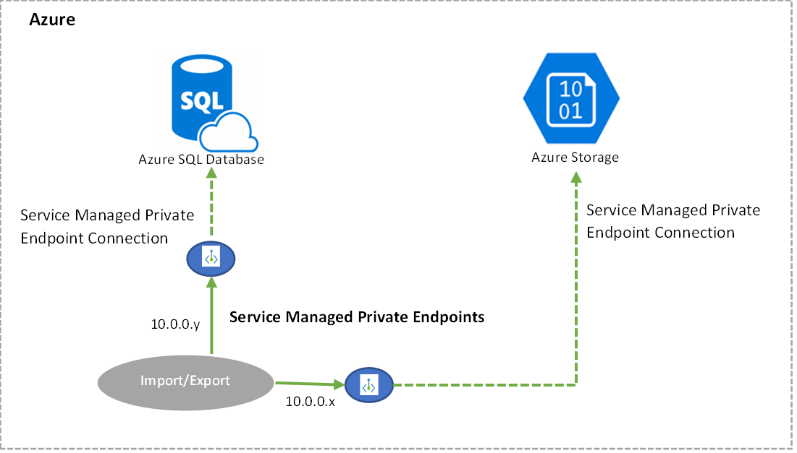
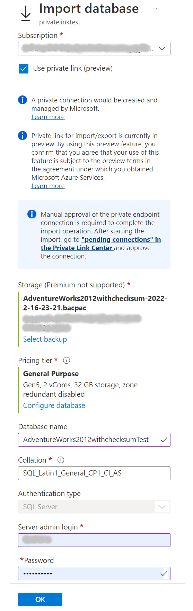
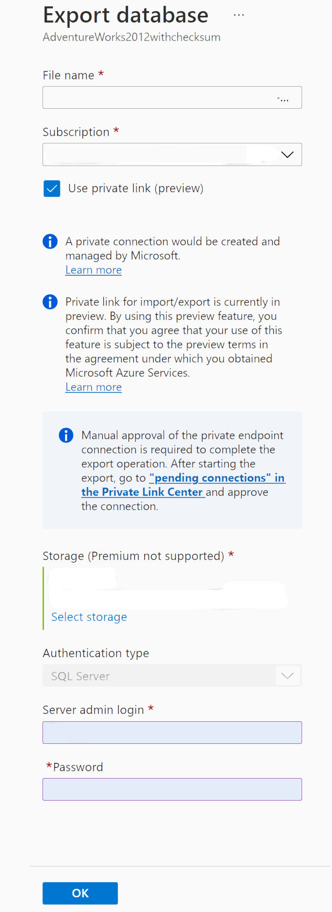
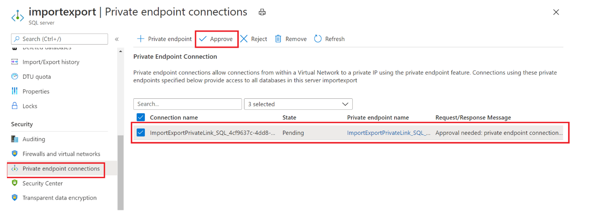
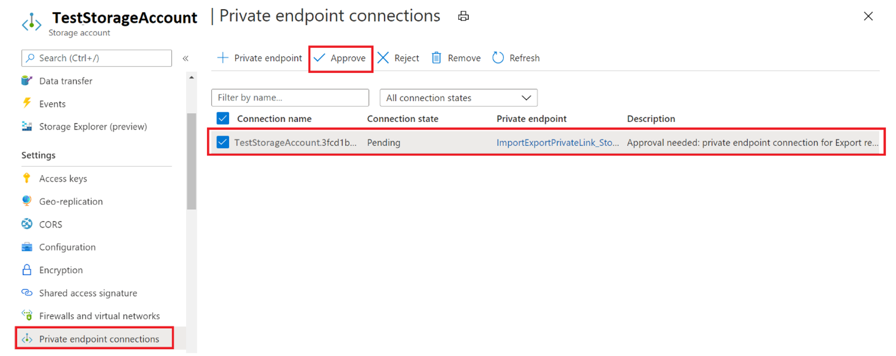
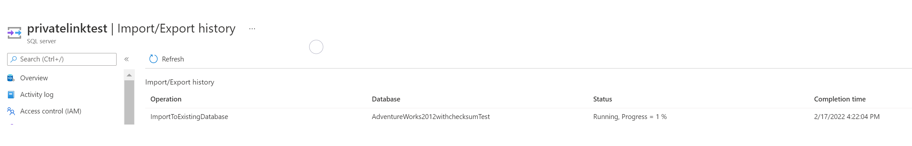

# Import or export an Azure SQL Database using Private Link without allowing Azure services to access the server

[!INCLUDE[appliesto-sqldb](../includes/appliesto-sqldb.md)]

## What is Import-Export Private Link?
Running Import or Export via Azure Powershell or Azure Portal requires you to set [Allow Access to Azure Services](network-access-controls-overview.md) to ON, otherwise Import/Export operation fails with an error. Often, users would want to perform Import or Export using a private end point without allowing access to all Azure services. 

Import Export Private Link is a Service Managed Private Endpoint created by Microsoft and is exclusively used by the Import-Export, database and Azure Storage(which contains BACPAC) for all communications. The private end point has to be manually approved by user in the Azure Portal for both server and storage. 



To use Private Link with Import-Export, user database and Azure Storage blob container must be hosted on the same type of Azure Cloud. For example, either both in Azure Commercial or both on Azure Gov. Hosting across cloud types is not supported.

This article explains how to import or export an Azure SQL Database using [Private Link](private-endpoint-overview.md) with *Allow Azure Services* is set to *OFF* on the Azure SQL server.  

> [!NOTE]
> Import Export using Private Link for Azure SQL Database is currently in preview

---

## Configure Import-Export Private Link
Import-Export Private Link can be configured via Azure Portal, PowerShell or using REST API. 

### Configure Import-Export Private link using Azure Portal

#### Create Import Private Link
1.  Go to server into which you would like to import database. select Import database from toolbar in Overview blade.
2.  In Import Database page select Use Private Link option

3.  Enter the storage account, server login credentials, Database details and click on Ok

#### Create Export Private Link 
1. Go to the database which you would like to export. Select Export database from toolbar in Overview blade
2. In Export Database page select Use Private Link option

3. Enter the storage account, server login credentials, Database details and click on Ok 

#### Approve Private End Points

##### Approve Private End Point connection on Azure SQL Database
1.	Go to the server which hosts the database.
2.	Open the ‘Private endpoint connections’ blade.
3.	Select the private endpoint you want to approve.
4.	Click Approve to approve the connection. 

      

##### Approve Private End Point connection on Azure Storage
1.  Go to the storage account that hosts the blob container that holds BACPAC file. 
2.	Open the ‘Private endpoint connections’ blade.
3.	Select the Import-Export private endpoints you want to approve.
4.	Click Approve to approve the connection. 



Once the Private End points are approved both in Azure SQL Server and Storage account Import or Export jobs will be kicked off. Till then the jobs will be on hold.

You can check the status of Import or Export jobs in Import/Export History blade under Data Management section in Azure SQL Server page.


---

### Configure Import-Export Private Link using Powershell

#### Import a Database using Private link in Powershell
Use the [New-AzSqlDatabaseImport](/powershell/module/az.sql/new-azsqldatabaseimport) cmdlet to submit an import database request to Azure. Depending on database size, the import may take some time to complete. The DTU based provisioning model supports select database max size values for each tier. When importing a database [use one of these supported values](/sql/t-sql/statements/create-database-transact-sql). 

```powershell
$importRequest = New-AzSqlDatabaseImport -ResourceGroupName "<resourceGroupName>" `
        -ServerName "<serverName>" -DatabaseName "<databaseName>" `
        -DatabaseMaxSizeBytes "<databaseSizeInBytes>" -StorageKeyType "StorageAccessKey" ` 
        -StorageKey $(Get-AzStorageAccountKey -ResourceGroupName $resourceGroupName `
                        -StorageAccountName "<storageAccountName>").Value[0] 
        -StorageUri "https://myStorageAccount.blob.core.windows.net/importsample/sample.bacpac" `
        -Edition "Standard" -ServiceObjectiveName "P6" ` -UseNetworkIsolation $true `
        -StorageAccountResourceIdForPrivateLink "/subscriptions/<subscriptionId>/resourcegroups/<resource_group_name>/providers/Microsoft.Storage/storageAccounts/<storage_account_name>" `
 	    -SqlServerResourceIdForPrivateLink "/subscriptions/<subscriptionId>/resourceGroups/<resource_group_name>/providers/Microsoft.Sql/servers/<server_name>" `
        -AdministratorLogin "<userID>" `
        -AdministratorLoginPassword $(ConvertTo-SecureString -String "<password>" -AsPlainText -Force)

```

#### Export a Database using Private Link in Powershell
Export of a database using Private Link from [Azure SQL Managed Instance](../managed-instance/sql-managed-instance-paas-overview.md) or from a database in the [Hyperscale service tier](service-tier-hyperscale.md) using PowerShell is not currently supported.

Use the [New-AzSqlDatabaseExport](/powershell/module/az.sql/new-azsqldatabaseexport) cmdlet to submit an export database request to the Azure SQL Database service. Depending on the size of your database, the export operation may take some time to complete.

```powershell
$importRequest = New-AzSqlDatabaseExport -ResourceGroupName "<resourceGroupName>" `
        -ServerName "<serverName>" -DatabaseName "<databaseName>" `
        -DatabaseMaxSizeBytes "<databaseSizeInBytes>" -StorageKeyType "StorageAccessKey" ` 
        -StorageKey $(Get-AzStorageAccountKey -ResourceGroupName $resourceGroupName `
                        -StorageAccountName "<storageAccountName>").Value[0] 
        -StorageUri "https://myStorageAccount.blob.core.windows.net/importsample/sample.bacpac" `
        -Edition "Standard" -ServiceObjectiveName "P6" ` -UseNetworkIsolation $true `
        -StorageAccountResourceIdForPrivateLink "/subscriptions/<subscriptionId>/resourcegroups/<resource_group_name>/providers/Microsoft.Storage/storageAccounts/<storage_account_name>" `
 	    -SqlServerResourceIdForPrivateLink "/subscriptions/<subscriptionId>/resourceGroups/<resource_group_name>/providers/Microsoft.Sql/servers/<server_name>" `
        -AdministratorLogin "<userID>" `
        -AdministratorLoginPassword $(ConvertTo-SecureString -String "<password>" -AsPlainText -Force)
```

---

### Create Import-Export Private link using REST API
Existing APIs to perform Import and Export jobs have been enhanced to support Private Link. Please refer to [Import Database API](/rest/api/sql/2021-08-01-preview/servers/import-database.md)
