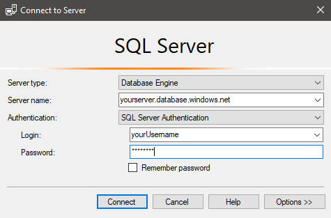
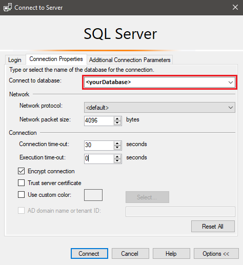
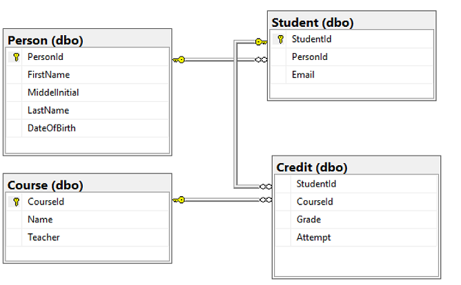
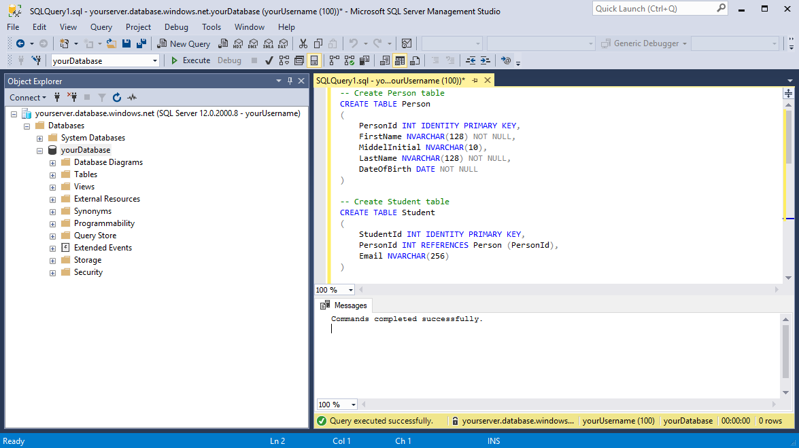

# Tutorial: Design a relational database in Azure SQL Database using SSMS
[!INCLUDE[appliesto-sqldb](../includes/appliesto-sqldb.md)]


Azure SQL Database is a relational database-as-a-service (DBaaS) in the Microsoft Cloud (Azure). In this tutorial, you learn how to use the Azure portal and [SQL Server Management Studio](https://docs.microsoft.com/sql/ssms/sql-server-management-studio-ssms) (SSMS) to:

> [!div class="checklist"]
>
> - Create a database using the Azure portal*
> - Set up a server-level IP firewall rule using the Azure portal
> - Connect to the database with SSMS
> - Create tables with SSMS
> - Bulk load data with BCP
> - Query data with SSMS

*If you don't have an Azure subscription, [create a free account](https://azure.microsoft.com/free/) before you begin.

> [!TIP]
> The following Microsoft Learn module helps you learn for free how to [Develop and configure an ASP.NET application that queries an Azure SQL Database](https://docs.microsoft.com/learn/modules/develop-app-that-queries-azure-sql/), including the creation of a simple database.
> [!NOTE]
> For the purpose of this tutorial, we are using Azure SQL Database. You could also use a pooled database in an elastic pool or a SQL Managed Instance. For connectivity to a SQL Managed Instance, see these SQL Managed Instance quickstarts: [Quickstart: Configure Azure VM to connect to an Azure SQL Managed Instance](../managed-instance/connect-vm-instance-configure.md) and [Quickstart: Configure a point-to-site connection to an Azure SQL Managed Instance from on-premises](../managed-instance/point-to-site-p2s-configure.md).

## Prerequisites

To complete this tutorial, make sure you've installed:

- [SQL Server Management Studio](https://msdn.microsoft.com/library/ms174173.aspx) (latest version)
- [BCP and SQLCMD](https://www.microsoft.com/download/details.aspx?id=36433) (latest version)

## Sign in to the Azure portal

Sign in to the [Azure portal](https://portal.azure.com/).

## Create a blank database in Azure SQL Database

A database in Azure SQL Database is created with a defined set of compute and storage resources. The database is created within an [Azure resource group](../../active-directory-b2c/overview.md) and is managed using an [logical SQL server](logical-servers.md).

Follow these steps to create a blank database.

1. On the Azure portal menu or from the **Home** page, select **Create a resource**.
2. On the **New** page, select **Databases** in the Azure Marketplace section, and then click **SQL Database** in the **Featured** section.

   

3. Fill out the **SQL Database** form with the following information, as shown on the preceding image:

    | Setting       | Suggested value | Description |
    | ------------ | ------------------ | ------------------------------------------------- |
    | **Database name** | *yourDatabase* | For valid database names, see [Database identifiers](/sql/relational-databases/databases/database-identifiers). |
    | **Subscription** | *yourSubscription*  | For details about your subscriptions, see [Subscriptions](https://account.windowsazure.com/Subscriptions). |
    | **Resource group** | *yourResourceGroup* | For valid resource group names, see [Naming rules and restrictions](/azure/architecture/best-practices/resource-naming). |
    | **Select source** | Blank database | Specifies that a blank database should be created. |

4. Click **Server** to use an existing server or create and configure a new server. Either select an existing server or click **Create a new server** and fill out the **New server** form with the following information:

    | Setting       | Suggested value | Description |
    | ------------ | ------------------ | ------------------------------------------------- |
    | **Server name** | Any globally unique name | For valid server names, see [Naming rules and restrictions](/azure/architecture/best-practices/resource-naming). |
    | **Server admin login** | Any valid name | For valid login names, see [Database identifiers](/sql/relational-databases/databases/database-identifiers). |
    | **Password** | Any valid password | Your password must have at least eight characters and must use characters from three of the following categories: upper case characters, lower case characters, numbers, and non-alphanumeric characters. |
    | **Location** | Any valid location | For information about regions, see [Azure Regions](https://azure.microsoft.com/regions/). |

    

5. Click **Select**.
6. Click **Pricing tier** to specify the service tier, the number of DTUs or vCores, and the amount of storage. You may explore the options for the number of DTUs/vCores and storage that is available to you for each service tier.

    After selecting the service tier, the number of DTUs or vCores, and the amount of storage, click **Apply**.

7. Enter a **Collation** for the blank database (for this tutorial, use the default value). For more information about collations, see [Collations](/sql/t-sql/statements/collations)

8. Now that you've completed the **SQL Database** form, click **Create** to provision the database. This step may take a few minutes.

9. On the toolbar, click **Notifications** to monitor the deployment process.

   

## Create a server-level IP firewall rule

Azure SQL Database creates an IP firewall at the server-level. This firewall prevents external applications and tools from connecting to the server and any databases on the server unless a firewall rule allows their IP through the firewall. To enable external connectivity to your database, you must first add an IP firewall rule for your IP address (or IP address range). Follow these steps to create a [server-level IP firewall rule](firewall-configure.md).

> [!IMPORTANT]
> Azure SQL Database communicates over port 1433. If you are trying to connect to this service from within a corporate network, outbound traffic over port 1433 may not be allowed by your network's firewall. If so, you cannot connect to your database unless your administrator opens port 1433.

1. After the deployment completes, select **SQL databases** from the Azure portal menu or search for and select *SQL databases* from any page.  

1. Select *yourDatabase* on the **SQL databases** page. The overview page for your database opens, showing you the fully qualified **Server name** (such as `contosodatabaseserver01.database.windows.net`) and provides options for further configuration.

   

1. Copy this fully qualified server name for use to connect to your server and databases from SQL Server Management Studio.

1. Click **Set server firewall** on the toolbar. The **Firewall settings** page for the server opens.

   

1. Click **Add client IP** on the toolbar to add your current IP address to a new IP firewall rule. An IP firewall rule can open port 1433 for a single IP address or a range of IP addresses.

1. Click **Save**. A server-level IP firewall rule is created for your current IP address opening port 1433 on the server.

1. Click **OK** and then close the **Firewall settings** page.

Your IP address can now pass through the IP firewall. You can now connect to your database using SQL Server Management Studio or another tool of your choice. Be sure to use the server admin account you created previously.

> [!IMPORTANT]
> By default, access through the SQL Database IP firewall is enabled for all Azure services. Click **OFF** on this page to disable for all Azure services.

## Connect to the database

Use [SQL Server Management Studio](/sql/ssms/sql-server-management-studio-ssms) to establish a connection to your database.

1. Open SQL Server Management Studio.
2. In the **Connect to Server** dialog box, enter the following information:

   | Setting       | Suggested value | Description |
   | ------------ | ------------------ | ------------------------------------------------- |
   | **Server type** | Database engine | This value is required. |
   | **Server name** | The fully qualified server name | For example, *yourserver.database.windows.net*. |
   | **Authentication** | SQL Server Authentication | SQL Authentication is the only authentication type that we've configured in this tutorial. |
   | **Login** | The server admin account | The account that you specified when you created the server. |
   | **Password** | The password for your server admin account | The password that you specified when you created the server. |

   

3. Click **Options** in the **Connect to server** dialog box. In the **Connect to database** section, enter *yourDatabase* to connect to this database.

      

4. Click **Connect**. The **Object Explorer** window opens in SSMS.

5. In **Object Explorer**, expand **Databases** and then expand *yourDatabase* to view the objects in the sample database.

     

## Create tables in your database

Create a database schema with four tables that model a student management system for universities using [Transact-SQL](/sql/t-sql/language-reference):

- Person
- Course
- Student
- Credit

The following diagram shows how these tables are related to each other. Some of these tables reference columns in other tables. For example, the *Student* table references the *PersonId* column of the *Person* table. Study the diagram to understand how the tables in this tutorial are related to one another. For an in-depth look at how to create effective database tables, see [Create effective database tables](https://msdn.microsoft.com/library/cc505842.aspx). For information about choosing data types, see [Data types](/sql/t-sql/data-types/data-types-transact-sql).

> [!NOTE]
> You can also use the [table designer in SQL Server Management Studio](/sql/ssms/visual-db-tools/design-database-diagrams-visual-database-tools) to create and design your tables.



1. In **Object Explorer**, right-click *yourDatabase* and select **New Query**. A blank query window opens that is connected to your database.

2. In the query window, execute the following query to create four tables in your database:

   ```sql
   -- Create Person table
   CREATE TABLE Person
   (
       PersonId INT IDENTITY PRIMARY KEY,
       FirstName NVARCHAR(128) NOT NULL,
       MiddelInitial NVARCHAR(10),
       LastName NVARCHAR(128) NOT NULL,
       DateOfBirth DATE NOT NULL
   )

   -- Create Student table
   CREATE TABLE Student
   (
       StudentId INT IDENTITY PRIMARY KEY,
       PersonId INT REFERENCES Person (PersonId),
       Email NVARCHAR(256)
   )

   -- Create Course table
   CREATE TABLE Course
   (
       CourseId INT IDENTITY PRIMARY KEY,
       Name NVARCHAR(50) NOT NULL,
       Teacher NVARCHAR(256) NOT NULL
   )

   -- Create Credit table
   CREATE TABLE Credit
   (
       StudentId INT REFERENCES Student (StudentId),
       CourseId INT REFERENCES Course (CourseId),
       Grade DECIMAL(5,2) CHECK (Grade <= 100.00),
       Attempt TINYINT,
       CONSTRAINT [UQ_studentgrades] UNIQUE CLUSTERED
       (
           StudentId, CourseId, Grade, Attempt
       )
   )
   ```

   

3. Expand the **Tables** node under *yourDatabase* in the **Object Explorer** to see the tables you created.

   

## Load data into the tables

1. Create a folder called *sampleData* in your Downloads folder to store sample data for your database.

2. Right-click the following links and save them into the *sampleData* folder.

   - [SampleCourseData](https://sqldbtutorial.blob.core.windows.net/tutorials/SampleCourseData)
   - [SamplePersonData](https://sqldbtutorial.blob.core.windows.net/tutorials/SamplePersonData)
   - [SampleStudentData](https://sqldbtutorial.blob.core.windows.net/tutorials/SampleStudentData)
   - [SampleCreditData](https://sqldbtutorial.blob.core.windows.net/tutorials/SampleCreditData)

3. Open a command prompt window and navigate to the *sampleData* folder.

4. Execute the following commands to insert sample data into the tables replacing the values for *server*, *database*, *user*, and *password* with the values for your environment.

   ```cmd
   bcp Course in SampleCourseData -S <server>.database.windows.net -d <database> -U <user> -P <password> -q -c -t ","
   bcp Person in SamplePersonData -S <server>.database.windows.net -d <database> -U <user> -P <password> -q -c -t ","
   bcp Student in SampleStudentData -S <server>.database.windows.net -d <database> -U <user> -P <password> -q -c -t ","
   bcp Credit in SampleCreditData -S <server>.database.windows.net -d <database> -U <user> -P <password> -q -c -t ","
   ```

You have now loaded sample data into the tables you created earlier.

## Query data

Execute the following queries to retrieve information from the database tables. See [Write SQL queries](https://technet.microsoft.com/library/bb264565.aspx) to learn more about writing SQL queries. The first query joins all four tables to find the students taught by 'Dominick Pope' who have a grade higher than 75%. The second query joins all four tables and finds the courses in which 'Noe Coleman' has ever enrolled.

1. In a SQL Server Management Studio query window, execute the following query:

   ```sql
   -- Find the students taught by Dominick Pope who have a grade higher than 75%
   SELECT  person.FirstName, person.LastName, course.Name, credit.Grade
   FROM  Person AS person
       INNER JOIN Student AS student ON person.PersonId = student.PersonId
       INNER JOIN Credit AS credit ON student.StudentId = credit.StudentId
       INNER JOIN Course AS course ON credit.CourseId = course.courseId
   WHERE course.Teacher = 'Dominick Pope'
       AND Grade > 75
   ```

2. In a query window, execute the following query:

   ```sql
   -- Find all the courses in which Noe Coleman has ever enrolled
   SELECT  course.Name, course.Teacher, credit.Grade
   FROM  Course AS course
       INNER JOIN Credit AS credit ON credit.CourseId = course.CourseId
       INNER JOIN Student AS student ON student.StudentId = credit.StudentId
       INNER JOIN Person AS person ON person.PersonId = student.PersonId
   WHERE person.FirstName = 'Noe'
       AND person.LastName = 'Coleman'
   ```

## Next steps

In this tutorial, you learned many basic database tasks. You learned how to:

> [!div class="checklist"]
>
> - Create a database using the Azure portal*
> - Set up a server-level IP firewall rule using the Azure portal
> - Connect to the database with SSMS
> - Create tables with SSMS
> - Bulk load data with BCP
> - Query data with SSMS

Advance to the next tutorial to learn about designing a database using Visual Studio and C#.

> [!div class="nextstepaction"]
> [Design a relational database within Azure SQL Database C# and ADO.NET](design-first-database-csharp-tutorial.md)
