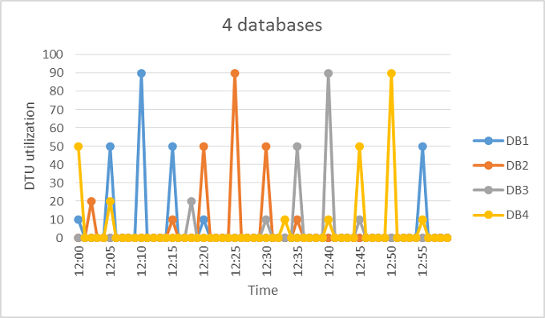
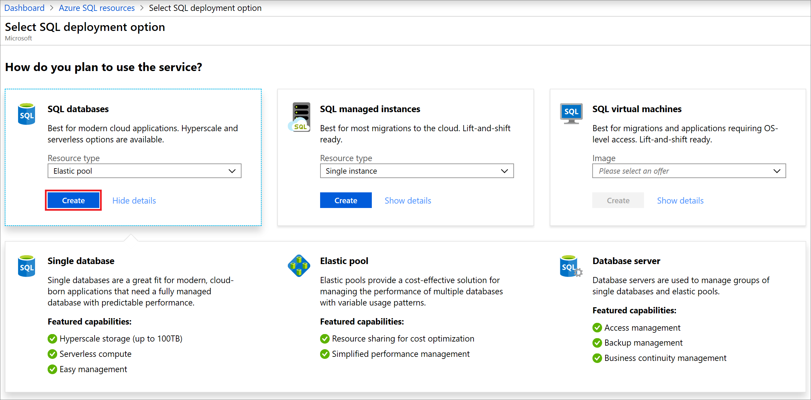

# Elastic pools help you manage and scale multiple databases in Azure SQL Database
[!INCLUDE[appliesto-sqldb](../includes/appliesto-sqldb.md)]

Azure SQL Database elastic pools are a simple, cost-effective solution for managing and scaling multiple databases that have varying and unpredictable usage demands. The databases in an elastic pool are on a single server and share a set number of resources at a set price. Elastic pools in Azure SQL Database enable SaaS developers to optimize the price performance for a group of databases within a prescribed budget while delivering performance elasticity for each database.

## What are SQL elastic pools

SaaS developers build applications on top of large scale data-tiers consisting of multiple databases. A common application pattern is to provision a single database for each customer. But different customers often have varying and unpredictable usage patterns, and it's difficult to predict the resource requirements of each individual database user. Traditionally, you had two options:

- Over-provision resources based on peak usage and over pay, or
- Under-provision to save cost, at the expense of performance and customer satisfaction during peaks.

Elastic pools solve this problem by ensuring that databases get the performance resources they need when they need it. They provide a simple resource allocation mechanism within a predictable budget. To learn more about design patterns for SaaS applications using elastic pools, see [Design Patterns for Multi-tenant SaaS Applications with Azure SQL Database](saas-tenancy-app-design-patterns.md).
>
> [!IMPORTANT]
> There is no per-database charge for elastic pools. You are billed for each hour a pool exists at the highest eDTU or vCores, regardless of usage or whether the pool was active for less than an hour.

Elastic pools enable the developer to purchase resources for a pool shared by multiple databases to accommodate unpredictable periods of usage by individual databases. You can configure resources for the pool based either on the [DTU-based purchasing model](service-tiers-dtu.md) or the [vCore-based purchasing model](service-tiers-vcore.md). The resource requirement for a pool is determined by the aggregate utilization of its databases. The amount of resources available to the pool is controlled by the developer budget. The developer simply adds databases to the pool, optionally sets the minimum and maximum resources for the databases (either minimum and maximum DTUs or minimum or maximum vCores depending on your choice of resourcing model), and then sets the resources of the pool based on their budget. A developer can use pools to seamlessly grow their service from a lean startup to a mature business at ever-increasing scale.

Within the pool, individual databases are given the flexibility to auto-scale within set parameters. Under heavy load, a database can consume more resources to meet demand. Databases under light loads consume less, and databases under no load consume no resources. Provisioning resources for the entire pool rather than for single databases simplifies your management tasks. Plus, you have a predictable budget for the pool. Additional resources can be added to an existing pool with minimum downtime. Similarly, if extra resources are no longer needed they can be removed from an existing pool at any point in time. And you can add or remove databases from the pool. If a database is predictably under-utilizing resources, move it out.

> [!NOTE]
> When moving databases into or out of an elastic pool, there is no downtime except for a brief period of time (on the order of seconds) at the end of the operation when database connections are dropped.

## When should you consider a SQL Database elastic pool

Pools are well suited for a large number of databases with specific utilization patterns. For a given database, this pattern is characterized by low average utilization with relatively infrequent utilization spikes. Conversely, multiple databases with persistent medium-high utilization should not be placed in the same elastic pool.

The more databases you can add to a pool the greater your savings become. Depending on your application utilization pattern, it's possible to see savings with as few as two S3 databases.

The following sections help you understand how to assess if your specific collection of databases can benefit from being in a pool. The examples use Standard pools but the same principles also apply to Basic and Premium pools.

### Assessing database utilization patterns

The following figure shows an example of a database that spends much time idle, but also periodically spikes with activity. This is a utilization pattern that is suited for a pool:

   

The chart illustrates DTU usage over a 1 hour time period from 12:00 to 1:00 where each data point has 1 minute granularity. At 12:10 DB1 peaks up to 90 DTUs, but its overall average usage is less than five DTUs. An S3 compute size is required to run this workload in a single database, but this leaves most of the resources unused during periods of low activity.

A pool allows these unused DTUs to be shared across multiple databases, and so reduces the DTUs needed and overall cost.

Building on the previous example, suppose there are additional databases with similar utilization patterns as DB1. In the next two figures below, the utilization of four databases and 20 databases are layered onto the same graph to illustrate the non-overlapping nature of their utilization over time using the DTU-based purchasing model:

   

   

The aggregate DTU utilization across all 20 databases is illustrated by the black line in the preceding figure. This shows that the aggregate DTU utilization never exceeds 100 DTUs, and indicates that the 20 databases can share 100 eDTUs over this time period. This results in a 20x reduction in DTUs and a 13x price reduction compared to placing each of the databases in S3 compute sizes for single databases.

This example is ideal for the following reasons:

- There are large differences between peak utilization and average utilization per database.
- The peak utilization for each database occurs at different points in time.
- eDTUs are shared between many databases.

In the DTU purchasing model, the price of a pool is a function of the pool eDTUs. While the eDTU unit price for a pool is 1.5x greater than the DTU unit price for a single database, **pool eDTUs can be shared by many databases and fewer total eDTUs are needed**. These distinctions in pricing and eDTU sharing are the basis of the price savings potential that pools can provide.

In the vCore purchasing model, the vCore unit price for elastic pools is the same as the vCore unit price for single databases.

## How do I choose the correct pool size

The best size for a pool depends on the aggregate resources needed for all databases in the pool. This involves determining the following:

- Maximum compute resources utilized by all databases in the pool.  Compute resources are indexed by either eDTUs or vCores depending on your choice of purchasing model.
- Maximum storage bytes utilized by all databases in the pool.

For service tiers and resource limits in each purchasing model, see the [DTU-based purchasing model](service-tiers-dtu.md) or the [vCore-based purchasing model](service-tiers-vcore.md).

The following steps can help you estimate whether a pool is more cost-effective than single databases:

1. Estimate the eDTUs or vCores needed for the pool as follows:
   - For the DTU-based purchasing model:
     - MAX(<*Total number of DBs* &times; *Average DTU utilization per DB*>, <*Number of concurrently peaking DBs* &times; *Peak DTU utilization per DB*>)
   - For the vCore-based purchasing model:
     - MAX(<*Total number of DBs* &times; *Average vCore utilization per DB*>, <*Number of concurrently peaking DBs* &times; *Peak vCore utilization per DB*>)
2. Estimate the total storage space needed for the pool by adding the data size needed for all the databases in the pool. For the DTU purchasing model, then determine the eDTU pool size that provides this amount of storage.
3. For the DTU-based purchasing model, take the larger of the eDTU estimates from Step 1 and Step 2. For the vCore-based purchasing model, take the vCore estimate from Step 1.
4. See the [SQL Database pricing page](https://azure.microsoft.com/pricing/details/sql-database/) and find the smallest pool size that is greater than the estimate from Step 3.
5. Compare the pool price from Step 4 to the price of using the appropriate compute sizes for single databases.

> [!IMPORTANT]
> If the number of databases in a pool approaches the maximum supported, make sure to consider [Resource management in dense elastic pools](elastic-pool-resource-management.md).

## Using other SQL Database features with elastic pools

### Elastic jobs and elastic pools

With a pool, management tasks are simplified by running scripts in **[elastic jobs](elastic-jobs-overview.md)**. An elastic job eliminates most of tedium associated with large numbers of databases.

For more information about other database tools for working with multiple databases, see [Scaling out with Azure SQL Database](elastic-scale-introduction.md).

### Business continuity options for databases in an elastic pool

Pooled databases generally support the same [business continuity features](business-continuity-high-availability-disaster-recover-hadr-overview.md) that are available to single databases.

- **Point-in-time restore**

  Point-in-time restore uses automatic database backups to recover a database in a pool to a specific point in time. See [Point-In-Time Restore](recovery-using-backups.md#point-in-time-restore)

- **Geo-restore**

  Geo-restore provides the default recovery option when a database is unavailable because of an incident in the region where the database is hosted. See [Restore an Azure SQL Database or failover to a secondary](disaster-recovery-guidance.md)

- **Active geo-replication**

  For applications that have more aggressive recovery requirements than geo-restore can offer, configure [Active geo-replication](active-geo-replication-overview.md) or an [auto-failover group](auto-failover-group-overview.md).

## Creating a new SQL Database elastic pool using the Azure portal

There are two ways you can create an elastic pool in the Azure portal.

1. Go to the [Azure portal](https://portal.azure.com) to create an elastic pool. Search for and select **Azure SQL**.
2. Select **+Add** to open the **Select SQL deployment option** page. You can view additional information about elastic pools by selecting **Show details** on the **Databases** tile.
3. On the **Databases** tile, select **Elastic pool** in the **Resource type** dropdown, then select **Create**:

   

4. Or you can create an elastic pool by navigating to an existing server and clicking **+ New pool** to create a pool directly into that server.

> [!NOTE]
> You can create multiple pools on a server, but you can't add databases from different servers into the same pool.

The pool's service tier determines the features available to the elastics in the pool, and the maximum amount of resources available to each database. For details, see Resource limits for elastic pools in the [DTU model](resource-limits-dtu-elastic-pools.md#elastic-pool-storage-sizes-and-compute-sizes). For vCore-based resource limits for elastic pools, see [vCore-based resource limits - elastic pools](resource-limits-vcore-elastic-pools.md).

To configure the resources and pricing of the pool, click **Configure pool**. Then select a service tier, add databases to the pool, and configure the resource limits for the pool and its databases.

When you have completed configuring the pool, you can click 'Apply', name the pool, and click 'OK' to create the pool.

## Monitor an elastic pool and its databases

In the Azure portal, you can monitor the utilization of an elastic pool and the databases within that pool. You can also make a set of changes to your elastic pool and submit all changes at the same time. These changes include adding or removing databases, changing your elastic pool settings, or changing your database settings.

You can use the built-in [performance monitoring](./performance-guidance.md) and [alerting tools](./alerts-insights-configure-portal.md), combined with performance ratings.  Additionally, SQL Database can [emit metrics and resource logs](./metrics-diagnostic-telemetry-logging-streaming-export-configure.md?tabs=azure-portal) for easier monitoring.

## Customer case studies

- [SnelStart](https://azure.microsoft.com/resources/videos/azure-sql-database-case-study-snelstart/)

  SnelStart used elastic pools with Azure SQL Database to rapidly expand its business services at a rate of 1,000 new Azure SQL databases per month.

- [Umbraco](https://azure.microsoft.com/resources/videos/azure-sql-database-case-study-umbraco/)

  Umbraco uses elastic pools with Azure SQL Database to quickly provision and scale services for thousands of tenants in the cloud.

- [Daxko/CSI](https://customers.microsoft.com/story/726277-csi-daxko-partner-professional-service-azure)

   Daxko/CSI uses elastic pools with Azure SQL Database to accelerate its development cycle and to enhance its customer services and performance.

## Next steps

- For pricing information, see [Elastic pool pricing](https://azure.microsoft.com/pricing/details/sql-database/elastic).
- To scale elastic pools, see [Scaling elastic pools](elastic-pool-scale.md) and [Scale an elastic pool - sample code](scripts/monitor-and-scale-pool-powershell.md)
- To learn more about design patterns for SaaS applications using elastic pools, see [Design Patterns for Multi-tenant SaaS Applications with Azure SQL Database](saas-tenancy-app-design-patterns.md).
- For a SaaS tutorial using elastic pools, see [Introduction to the Wingtip SaaS application](saas-dbpertenant-wingtip-app-overview.md).
- To learn about resource management in elastic pools with many databases, see [Resource management in dense elastic pools](elastic-pool-resource-management.md).
