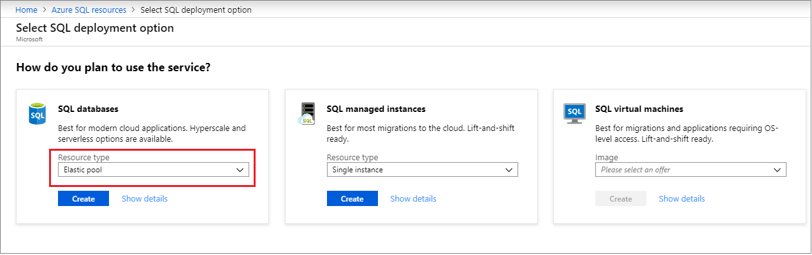
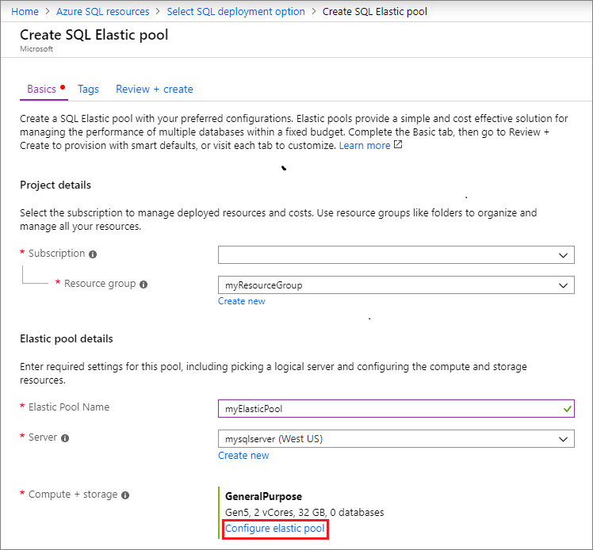
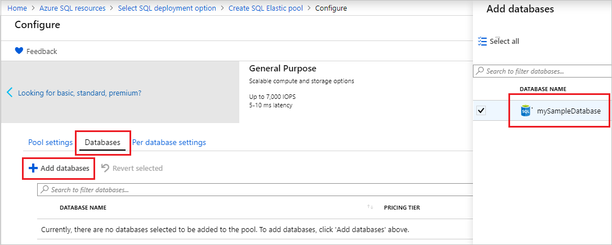
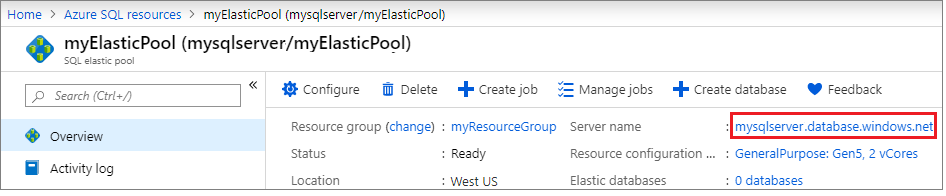
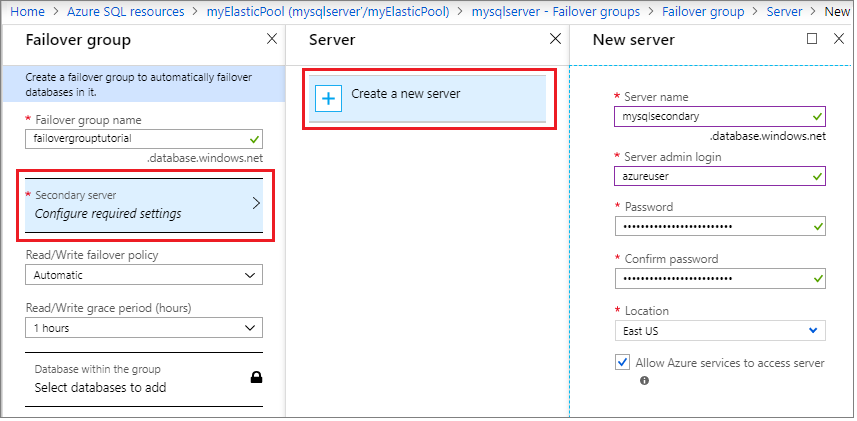
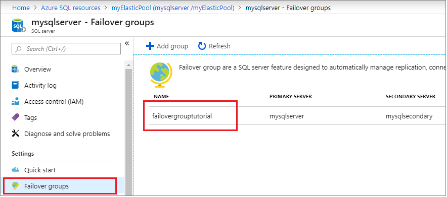
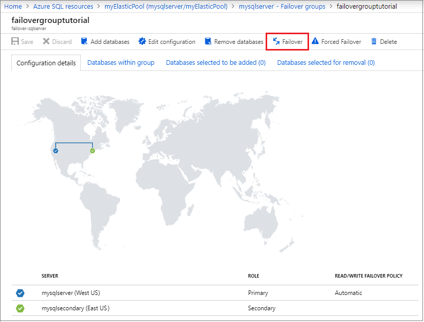

# Tutorial: Add an Azure SQL Database elastic pool to a failover group
[!INCLUDE[appliesto-sqldb](../includes/appliesto-sqldb.md)]

Configure a failover group for an Azure SQL Database elastic pool and test failover using the Azure portal.  In this tutorial, you will learn how to:

> [!div class="checklist"]
>
> - Create a single database.
> - Add the database to an elastic pool.
> - Create a [failover group](auto-failover-group-overview.md) for two elastic pools between two servers.
> - Test failover.

## Prerequisites

To complete this tutorial, make sure you have:

- An Azure subscription. [Create a free account](https://azure.microsoft.com/free/) if you don't already have one.

## 1 - Create a single database

[!INCLUDE [sql-database-create-single-database](../includes/sql-database-create-single-database.md)]

## 2 - Add the database to an elastic pool

In this step, you will create an elastic pool and add your database to it.

# [Portal](#tab/azure-portal)

Create your elastic pool using the Azure portal.

1. Select **Azure SQL** in the left-hand menu of the Azure portal. If **Azure SQL** is not in the list, select **All services**, then type "Azure SQL" in the search box. (Optional) Select the star next to **Azure SQL** to favorite it and add it as an item in the left-hand navigation.
1. Select **+ Add** to open the **Select SQL deployment option** page. You can view additional information about the different databases by selecting Show details on the Databases tile.
1. Select **Elastic pool** from the **Resource type** drop-down in the **SQL Databases** tile. Select **Create** to create your elastic pool.

    

1. Configure your elastic pool with the following values:
   - **Name**: Provide a unique name for your elastic pool, such as `myElasticPool`.
   - **Subscription**: Select your subscription from the drop-down.
   - **ResourceGroup**: Select `myResourceGroup` from the drop-down, the resource group you created in section 1.
   - **Server**: Select the server you created in section 1 from the drop-down.  

       

   - **Compute + storage**: Select **Configure elastic pool** to configure your compute, storage, and add your single database to your elastic pool. On the **Pool Settings** tab, leave the default of Gen5, with 2 vCores and 32gb.

1. On the **Configure** page, select the **Databases** tab, and then choose to **Add database**. Choose the database you created in section 1 and then select **Apply** to add it to your elastic pool. Select **Apply** again to apply your elastic pool settings and close the **Configure** page.

    

1. Select **Review + create** to review your elastic pool settings and then select **Create** to create your elastic pool.

# [PowerShell](#tab/azure-powershell)

Create your elastic pools and secondary server using PowerShell.

   ```powershell-interactive
   # Set variables for your server and database
   # $subscriptionId = '<SubscriptionID>'
   # $resourceGroupName = "myResourceGroup-$(Get-Random)"
   # $location = "East US"
   # $adminLogin = "azureuser"
   # $password = "PWD27!"+(New-Guid).Guid
   # $serverName = "mysqlserver-$(Get-Random)"
   $poolName = "myElasticPool"
   $databaseName = "mySampleDatabase"
   $drLocation = "West US"
   $drServerName = "mysqlsecondary-$(Get-Random)"
   $failoverGroupName = "failovergrouptutorial-$(Get-Random)"

   # The ip address range that you want to allow to access your server
   # Leaving at 0.0.0.0 will prevent outside-of-azure connections
   # $startIp = "0.0.0.0"
   # $endIp = "0.0.0.0"

   # Show randomized variables
   Write-host "DR Server name is" $drServerName
   Write-host "Failover group name is" $failoverGroupName

   # Create primary Gen5 elastic 2 vCore pool
   Write-host "Creating elastic pool..."
   $elasticPool = New-AzSqlElasticPool -ResourceGroupName $resourceGroupName `
       -ServerName $serverName `
       -ElasticPoolName $poolName `
       -Edition "GeneralPurpose" `
       -vCore 2 `
       -ComputeGeneration Gen5
   $elasticPool

   # Add single db into elastic pool
   Write-host "Creating elastic pool..."
   $addDatabase = Set-AzSqlDatabase -ResourceGroupName $resourceGroupName `
       -ServerName $serverName `
       -DatabaseName $databaseName `
       -ElasticPoolName $poolName
   $addDatabase
   ```

This portion of the tutorial uses the following PowerShell cmdlets:

| Command | Notes |
|---|---|
| [New-AzSqlElasticPool](/powershell/module/az.sql/new-azsqlelasticpool) | Creates an elastic database pool for an Azure SQL Database.|
| [Set-AzSqlDatabase](/powershell/module/az.sql/set-azsqldatabase) | Sets properties for a database, or moves an existing database into an elastic pool. |

---

## 3 - Create the failover group

In this step, you will create a [failover group](auto-failover-group-overview.md) between an existing server and a new server in another region. Then add the elastic pool to the failover group.

# [Portal](#tab/azure-portal)

Create your failover group using the Azure portal.

1. Select **Azure SQL** in the left-hand menu of the [Azure portal](https://portal.azure.com). If **Azure SQL** is not in the list, select **All services**, then type Azure SQL in the search box. (Optional) Select the star next to **Azure SQL** to favorite it and add it as an item in the left-hand navigation.
1. Select the elastic pool created in the previous section, such as `myElasticPool`.
1. On the **Overview** pane, select the name of the server under **Server name** to open the settings for the server.
  
    

1. Select **Failover groups** under the **Settings** pane, and then select **Add group** to create a new failover group.

    

1. On the **Failover Group** page, enter or select the following values, and then select **Create**:
    - **Failover group name**: Type in a unique failover group name, such as `failovergrouptutorial`.
    - **Secondary server**: Select the option to *configure required settings* and then choose to **Create a new server**. Alternatively, you can choose an already-existing server as the secondary server. After entering the following values for your new secondary server, select **Select**.
        - **Server name**: Type in a unique name for the secondary server, such as `mysqlsecondary`.
        - **Server admin login**: Type `azureuser`
        - **Password**: Type a complex password that meets password requirements.
        - **Location**: Choose a location from the drop-down, such as `East US`. This location cannot be the same location as your primary server.

       > [!NOTE]
       > The server login and firewall settings must match that of your primary server.

       

1. Select **Databases within the group** then select the elastic pool you created in section 2. A warning should appear, prompting you to create an elastic pool on the secondary server. Select the warning, and then select **OK** to create the elastic pool on the secondary server. 

   

1. Select **Select** to apply your elastic pool settings to the failover group, and then select **Create** to create your failover group. Adding the elastic pool to the failover group will automatically start the geo-replication process.

# [PowerShell](#tab/azure-powershell)

Create your failover group using PowerShell.

   ```powershell-interactive
   # Set variables for your server and database
   # $subscriptionId = '<SubscriptionID>'
   # $resourceGroupName = "myResourceGroup-$(Get-Random)"
   # $location = "East US"
   # $adminLogin = "azureuser"
   # $password = "PWD27!"+(New-Guid).Guid
   # $serverName = "mysqlserver-$(Get-Random)"
   # $poolName = "myElasticPool"
   # $databaseName = "mySampleDatabase"
   # $drLocation = "West US"
   # $drServerName = "mysqlsecondary-$(Get-Random)"
   $failoverGroupName = "failovergrouptutorial-$(Get-Random)"

   # Create a secondary server in the failover region
   Write-host "Creating a secondary server in the failover region..."
   New-AzSqlServer -ResourceGroupName $resourceGroupName `
      -ServerName $drServerName `
      -Location $drLocation `
      -SqlAdministratorCredentials $(New-Object -TypeName System.Management.Automation.PSCredential `
         -ArgumentList $adminlogin, $(ConvertTo-SecureString -String $password -AsPlainText -Force))
   Write-host "Secondary server =" $drServerName

   # Create a server firewall rule that allows access from the specified IP range
   Write-host "Configuring firewall for secondary server..."
   New-AzSqlServerFirewallRule -ResourceGroupName $resourceGroupName `
      -ServerName $drServerName `
      -FirewallRuleName "AllowedIPs" -StartIpAddress $startIp -EndIpAddress $endIp
   Write-host "Firewall configured"

   # Create secondary Gen5 elastic 2 vCore pool
   Write-host "Creating secondary elastic pool..."
   $elasticPool = New-AzSqlElasticPool -ResourceGroupName $resourceGroupName `
       -ServerName $drServerName `
       -ElasticPoolName $poolName `
       -Edition "GeneralPurpose" `
       -vCore 2 `
       -ComputeGeneration Gen5
   $elasticPool

   # Create a failover group between the servers
   Write-host "Creating failover group..."
   New-AzSqlDatabaseFailoverGroup `
     –ResourceGroupName $resourceGroupName `
      -ServerName $serverName `
      -PartnerServerName $drServerName  `
      –FailoverGroupName $failoverGroupName `
      –FailoverPolicy Automatic `
      -GracePeriodWithDataLossHours 2
   Write-host "Failover group created successfully."

   # Add elastic pool to the failover group
   Write-host "Enumerating databases in elastic pool...."
   $FailoverGroup = Get-AzSqlDatabaseFailoverGroup `
                    -ResourceGroupName $resourceGroupName `
                    -ServerName $serverName `
                    -FailoverGroupName $failoverGroupName
   $databases = Get-AzSqlElasticPoolDatabase `
                  -ResourceGroupName $resourceGroupName `
                  -ServerName $serverName `
                  -ElasticPoolName $poolName
   Write-host "Adding databases to failover group..."
   $failoverGroup = $failoverGroup | Add-AzSqlDatabaseToFailoverGroup `
                                     -Database $databases
   $failoverGroup
   ```

This portion of the tutorial uses the following PowerShell cmdlets:

| Command | Notes |
|---|---|
| [New-AzSqlServer](/powershell/module/az.sql/new-azsqlserver) | Creates a server that hosts databases and elastic pools. |
| [New-AzSqlServerFirewallRule](/powershell/module/az.sql/new-azsqlserverfirewallrule) | Creates a firewall rule for a server. |
| [New-AzSqlElasticPool](/powershell/module/az.sql/new-azsqlelasticpool) | Creates an elastic pool for an Azure SQL Database.|
| [New-AzSqlDatabaseFailoverGroup](/powershell/module/az.sql/new-azsqldatabasefailovergroup) | Creates a new failover group. |
| [Add-AzSqlDatabaseToFailoverGroup](/powershell/module/az.sql/add-azsqldatabasetofailovergroup) | Adds one or more Azure SQL Databases to a failover group. |
| [Get-AzSqlDatabaseFailoverGroup](/powershell/module/az.sql/get-azsqldatabasefailovergroup) | Gets or lists Azure SQL Database failover groups. |

---

## 4 - Test failover

In this step, you will fail your failover group over to the secondary server, and then fail back using the Azure portal.

# [Portal](#tab/azure-portal)

Test failover of your failover group using the Azure portal.

1. Select **Azure SQL** in the left-hand menu of the [Azure portal](https://portal.azure.com). If **Azure SQL** is not in the list, select **All services**, then type Azure SQL in the search box. (Optional) Select the star next to **Azure SQL** to favorite it and add it as an item in the left-hand navigation.
1. Select the elastic pool created in the previous section, such as `myElasticPool`.
1. Select the name of the server under **Server name** to open the settings for the server.

    

1. Select **Failover groups** under the **Settings** pane and then choose the failover group you created in section 2.
  
   

1. Review which server is primary, and which server is secondary.
1. Select **Failover** from the task pane to fail over your failover group containing your elastic pool.
1. Select **Yes** on the warning that notifies you that TDS sessions will be disconnected.

   

1. Review which server is primary, which server is secondary. If failover succeeded, the two servers should have swapped roles.
1. Select **Failover** again to fail the failover group back to the original settings.

# [PowerShell](#tab/azure-powershell)

Test failover of your failover group using PowerShell.

   ```powershell-interactive
   # Set variables for your server and database
   # $subscriptionId = '<SubscriptionID>'
   # $resourceGroupName = "myResourceGroup-$(Get-Random)"
   # $location = "East US"
   # $adminLogin = "azureuser"
   # $password = "PWD27!"+(New-Guid).Guid
   # $serverName = "mysqlserver-$(Get-Random)"
   # $poolName = "myElasticPool"
   # $databaseName = "mySampleDatabase"
   # $drLocation = "West US"
   # $drServerName = "mysqlsecondary-$(Get-Random)"
   # $failoverGroupName = "failovergrouptutorial-$(Get-Random)"

   # Check role of secondary replica
   Write-host "Confirming the secondary server is secondary...."
   (Get-AzSqlDatabaseFailoverGroup `
      -FailoverGroupName $failoverGroupName `
      -ResourceGroupName $resourceGroupName `
      -ServerName $drServerName).ReplicationRole

   # Failover to secondary server
   Write-host "Failing over failover group to the secondary..."
   Switch-AzSqlDatabaseFailoverGroup `
      -ResourceGroupName $resourceGroupName `
      -ServerName $drServerName `
      -FailoverGroupName $failoverGroupName
   Write-host "Failover group failed over to" $drServerName
   ```

Fail your failover group over to the secondary server, and then fail back using the PowerShell.

   ```powershell-interactive
   # Set variables for your server and database
   # $subscriptionId = '<SubscriptionID>'
   # $resourceGroupName = "myResourceGroup-$(Get-Random)"
   # $location = "East US"
   # $adminLogin = "azureuser"
   # $password = "PWD27!"+(New-Guid).Guid
   # $serverName = "mysqlserver-$(Get-Random)"
   # $poolName = "myElasticPool"
   # $databaseName = "mySampleDatabase"
   # $drLocation = "West US"
   # $drServerName = "mysqlsecondary-$(Get-Random)"
   # $failoverGroupName = "failovergrouptutorial-$(Get-Random)"

   # Check role of secondary replica
   Write-host "Confirming the secondary server is now primary"
   (Get-AzSqlDatabaseFailoverGroup `
      -FailoverGroupName $failoverGroupName `
      -ResourceGroupName $resourceGroupName `
      -ServerName $drServerName).ReplicationRole

   # Revert failover to primary server
   Write-host "Failing over failover group to the primary...."
   Switch-AzSqlDatabaseFailoverGroup `
      -ResourceGroupName $resourceGroupName `
      -ServerName $serverName `
      -FailoverGroupName $failoverGroupName
   Write-host "Failover group failed over to" $serverName
   ```

This portion of the tutorial uses the following PowerShell cmdlets:

| Command | Notes |
|---|---|
| [Get-AzSqlDatabaseFailoverGroup](/powershell/module/az.sql/get-azsqldatabasefailovergroup) | Gets or lists Azure SQL Database failover groups. |
| [Switch-AzSqlDatabaseFailoverGroup](/powershell/module/az.sql/switch-azsqldatabasefailovergroup)| Executes a failover of an Azure SQL Database failover group. |

---

## Clean up resources

Clean up resources by deleting the resource group.

# [Portal](#tab/azure-portal)

1. Navigate to your resource group in the [Azure portal](https://portal.azure.com).
1. Select  **Delete resource group** to delete all the resources in the group, as well as the resource group itself.
1. Type the name of the resource group, `myResourceGroup`, in the textbox, and then select **Delete** to delete the resource group.

# [PowerShell](#tab/azure-powershell)

Clean up your resources using PowerShell.

   ```powershell-interactive
   # Set variables for your server and database
   # $resourceGroupName = "myResourceGroup-$(Get-Random)"

   # Clean up resources by removing the resource group
   Write-host "Removing resource group..."
   Remove-AzResourceGroup -ResourceGroupName $resourceGroupName
   Write-host "Resource group removed =" $resourceGroupName
   ```

This portion of the tutorial uses the following PowerShell cmdlet:

| Command | Notes |
|---|---|
| [Remove-AzResourceGroup](/powershell/module/az.resources/remove-azresourcegroup) | Removes a resource group |

---

> [!IMPORTANT]
> If you want to keep the resource group but delete the secondary database, remove it from the failover group before deleting it. Deleting a secondary database before it is removed from the failover group can cause unpredictable behavior.

## Full script

# [PowerShell](#tab/azure-powershell)

[!code-powershell-interactive[main](../../../powershell_scripts/sql-database/failover-groups/add-elastic-pool-to-failover-group-az-ps.ps1 "Add elastic pool to a failover group")]

This script uses the following commands. Each command in the table links to command specific documentation.

| Command | Notes |
|---|---|
| [New-AzResourceGroup](/powershell/module/az.resources/new-azresourcegroup) | Creates a resource group in which all resources are stored. |
| [New-AzSqlServer](/powershell/module/az.sql/new-azsqlserver) | Creates a server that hosts databases and elastic pools. |
| [New-AzSqlServerFirewallRule](/powershell/module/az.sql/new-azsqlserverfirewallrule) | Creates a firewall rule for a server. |
| [New-AzSqlDatabase](/powershell/module/az.sql/new-azsqldatabase) | Creates a database. |
| [New-AzSqlElasticPool](/powershell/module/az.sql/new-azsqlelasticpool) | Creates an elastic database pool for an Azure SQL Database.|
| [Set-AzSqlDatabase](/powershell/module/az.sql/set-azsqldatabase) | Sets properties for a database, or moves an existing database into an elastic pool. |
| [New-AzSqlDatabaseFailoverGroup](/powershell/module/az.sql/new-azsqldatabasefailovergroup) | Creates a new failover group. |
| [Get-AzSqlDatabase](/powershell/module/az.sql/get-azsqldatabase) | Gets one or more databases in SQL Database. |
| [Add-AzSqlDatabaseToFailoverGroup](/powershell/module/az.sql/add-azsqldatabasetofailovergroup) | Adds one or more Azure SQL Databases to a failover group. |
| [Get-AzSqlDatabaseFailoverGroup](/powershell/module/az.sql/get-azsqldatabasefailovergroup) | Gets or lists Azure SQL Database failover groups. |
| [Switch-AzSqlDatabaseFailoverGroup](/powershell/module/az.sql/switch-azsqldatabasefailovergroup)| Executes a failover of an Azure SQL Database failover group. |
| [Remove-AzResourceGroup](/powershell/module/az.resources/remove-azresourcegroup) | Removes a resource group |

# [Portal](#tab/azure-portal)

There are no scripts available for the Azure portal.

---

## Next steps

In this tutorial, you added an Azure SQL Database elastic pool to a failover group, and tested failover. You learned how to:

> [!div class="checklist"]
>
> - Create a single database.
> - Add the database into an elastic pool.
> - Create a [failover group](auto-failover-group-overview.md) for two elastic pools between two servers.
> - Test failover.

Advance to the next tutorial on how to migrate using DMS.

> [!div class="nextstepaction"]
> [Tutorial: Migrate SQL Server to a pooled database using DMS](../../dms/tutorial-sql-server-to-azure-sql.md?toc=/azure/sql-database/toc.json)
