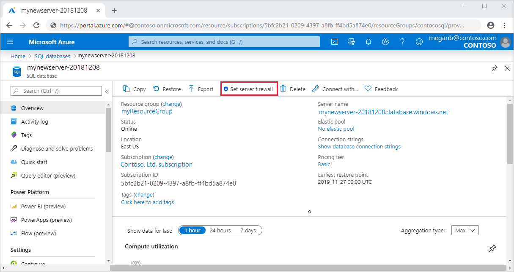
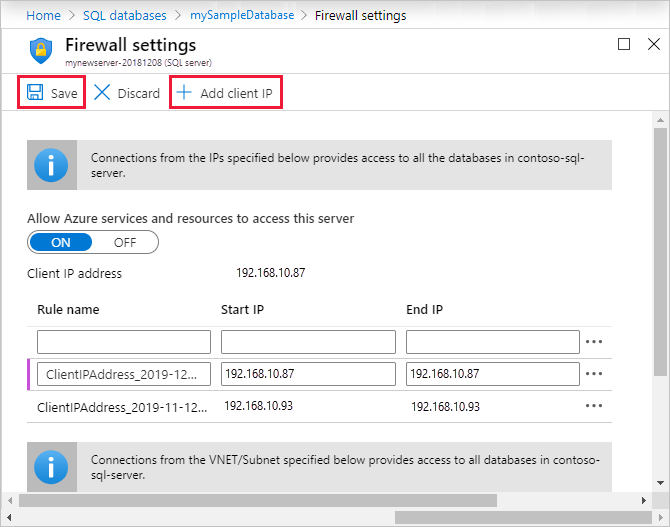

# Azure SQL Database and Azure Synapse IP firewall rules
[!INCLUDE[appliesto-sqldb-asa](../includes/appliesto-sqldb-asa.md)]

When you create a new server in Azure SQL Database or Azure Synapse Analytics named *mysqlserver*, for example, a server-level firewall blocks all access to the public endpoint for the server (which is accessible at *mysqlserver.database.windows.net*). For simplicity, *SQL Database* is used to refer to both SQL Database and Azure Synapse Analytics (formerly Azure SQL Data Warehouse).

> [!IMPORTANT]
> This article does *not* apply to *Azure SQL Managed Instance*. For information about network configuration, see [Connect your application to Azure SQL Managed Instance](../managed-instance/connect-application-instance.md).
>
> Azure Synapse only supports server-level IP firewall rules. It doesn't support database-level IP firewall rules.

## How the firewall works

Connection attempts from the internet and Azure must pass through the firewall before they reach your server or database, as the following diagram shows.

   ![Firewall configuration diagram][1]

### Server-level IP firewall rules

These rules enable clients to access your entire server, that is, all the databases managed by the server. The rules are stored in the *master* database. You can have a maximum of 128 server-level IP firewall rules for a server. If you have the **Allow Azure Services and resources to access this server** setting enabled, this counts as a single firewall rule for the server.
  
You can configure server-level IP firewall rules by using the Azure portal, PowerShell, or Transact-SQL statements.

- To use the portal or PowerShell, you must be the subscription owner or a subscription contributor.
- To use Transact-SQL, you must connect to the *master* database as the server-level principal login or as the Azure Active Directory administrator. (A server-level IP firewall rule must first be created by a user who has Azure-level permissions.)

### Database-level IP firewall rules

Database-level IP firewall rules enable clients to access certain (secure) databases. You create the rules for each database (including the *master* database), and they're stored in the individual database.
  
- You can only create and manage database-level IP firewall rules for master and user databases by using Transact-SQL statements and only after you configure the first server-level firewall.
- If you specify an IP address range in the database-level IP firewall rule that's outside the range in the server-level IP firewall rule, only those clients that have IP addresses in the database-level range can access the database.
- You can have a maximum of 128 database-level IP firewall rules for a database. For more information about configuring database-level IP firewall rules, see the example later in this article and see [sp_set_database_firewall_rule (Azure SQL Database)](https://msdn.microsoft.com/library/dn270010.aspx).

### Recommendations for how to set firewall rules

We recommend that you use database-level IP firewall rules whenever possible. This practice enhances security and makes your database more portable. Use server-level IP firewall rules for administrators. Also use them when you have many databases that have the same access requirements, and you don't want to configure each database individually.

> [!NOTE]
> For information about portable databases in the context of business continuity, see [Authentication requirements for disaster recovery](active-geo-replication-security-configure.md).

## Server-level versus database-level IP firewall rules

*Should users of one database be fully isolated from another database?*

If *yes*, use database-level IP firewall rules to grant access. This method avoids using server-level IP firewall rules, which permit access through the firewall to all databases. That would reduce the depth of your defenses.

*Do users at the IP addresses need access to all databases?*

If *yes*, use server-level IP firewall rules to reduce the number of times that you have to configure IP firewall rules.

*Does the person or team who configures the IP firewall rules only have access through the Azure portal, PowerShell, or the REST API?*

If so, you must use server-level IP firewall rules. Database-level IP firewall rules can only be configured through Transact-SQL.  

*Is the person or team who configures the IP firewall rules prohibited from having high-level permission at the database level?*

If so, use server-level IP firewall rules. You need at least *CONTROL DATABASE* permission at the database level to configure database-level IP firewall rules through Transact-SQL.  

*Does the person or team who configures or audits the IP firewall rules centrally manage IP firewall rules for many (perhaps hundreds) of databases?*

In this scenario, best practices are determined by your needs and environment. Server-level IP firewall rules might be easier to configure, but scripting can configure rules at the database-level. And even if you use server-level IP firewall rules, you might need to audit database-level IP firewall rules to see if users with *CONTROL* permission on the database  create database-level IP firewall rules.

*Can I use a mix of server-level and database-level IP firewall rules?*

Yes. Some users, such as administrators, might need server-level IP firewall rules. Other users, such as users of a database application, might need database-level IP firewall rules.

### Connections from the internet

When a computer tries to connect to your server from the internet, the firewall first checks the originating IP address of the request against the database-level IP firewall rules for the database that the connection requests.

- If the address is within a range that's specified in the database-level IP firewall rules, the connection is granted to the database that contains the rule.
- If the address isn't within a range in the database-level IP firewall rules, the firewall checks the server-level IP firewall rules. If the address is within a range that's in the server-level IP firewall rules, the connection is granted. Server-level IP firewall rules apply to all databases managed by the server.  
- If the address isn't within a range that's in any of the database-level or server-level IP firewall rules, the connection request fails.

> [!NOTE]
> To access Azure SQL Database from your local computer, ensure that the firewall on your network and local computer allow outgoing communication on TCP port 1433.

### Connections from inside Azure

To allow applications hosted inside Azure to connect to your SQL server, Azure connections must be enabled. When an application from Azure tries to connect to your server, the firewall verifies that Azure connections are allowed. This can be turned on directly from the Azure portal blade by setting Firewall rules, as well as switching the **Allow Azure Services and resources to access this server** to **ON** in the **Firewalls and virtual networks** settings. If the connection isn't allowed, the request doesn't reach the server.

> [!IMPORTANT]
> This option configures the firewall to allow all connections from Azure, including connections from the subscriptions of other customers. If you select this option, make sure that your login and user permissions limit access to authorized users only.

## Create and manage IP firewall rules

You create the first server-level firewall setting by using the [Azure portal](https://portal.azure.com/) or programmatically by using [Azure PowerShell](https://docs.microsoft.com/powershell/module/az.sql), [Azure CLI](https://docs.microsoft.com/cli/azure/sql/server/firewall-rule), or an Azure [REST API](https://docs.microsoft.com/rest/api/sql/firewallrules/createorupdate). You create and manage additional server-level IP firewall rules by using these methods or Transact-SQL.

> [!IMPORTANT]
> Database-level IP firewall rules can only be created and managed by using Transact-SQL.

To improve performance, server-level IP firewall rules are temporarily cached at the database level. To refresh the cache, see [DBCC FLUSHAUTHCACHE](https://msdn.microsoft.com/library/mt627793.aspx).

> [!TIP]
> You can use [Database Auditing](../../azure-sql/database/auditing-overview.md) to audit server-level and database-level firewall changes.

### Use the Azure portal to manage server-level IP firewall rules

To set a server-level IP firewall rule in the Azure portal, go to the overview page for your database or your server.

> [!TIP]
> For a tutorial, see [Create a database using the Azure portal](single-database-create-quickstart.md).

#### From the database overview page

1. To set a server-level IP firewall rule from the database overview page, select **Set server firewall** on the toolbar, as the following image shows.

    

    The **Firewall settings** page for the server opens.

2. Select **Add client IP** on the toolbar to add the IP address of the computer that you're using, and then select **Save**. A server-level IP firewall rule is created for your current IP address.

    

#### From the server overview page

The overview page for your server opens. It shows the fully qualified server name (such as *mynewserver20170403.database.windows.net*) and provides options for further configuration.

1. To set a server-level rule from this page, select **Firewall** from the **Settings** menu on the left side.

2. Select **Add client IP** on the toolbar to add the IP address of the computer that you're using, and then select **Save**. A server-level IP firewall rule is created for your current IP address.

### Use Transact-SQL to manage IP firewall rules

| Catalog view or stored procedure | Level | Description |
| --- | --- | --- |
| [sys.firewall_rules](/sql/relational-databases/system-catalog-views/sys-firewall-rules-azure-sql-database) |Server |Displays the current server-level IP firewall rules |
| [sp_set_firewall_rule](/sql/relational-databases/system-stored-procedures/sp-set-firewall-rule-azure-sql-database) |Server |Creates or updates server-level IP firewall rules |
| [sp_delete_firewall_rule](/sql/relational-databases/system-stored-procedures/sp-delete-firewall-rule-azure-sql-database) |Server |Removes server-level IP firewall rules |
| [sys.database_firewall_rules](/sql/relational-databases/system-catalog-views/sys-database-firewall-rules-azure-sql-database) |Database |Displays the current database-level IP firewall rules |
| [sp_set_database_firewall_rule](/sql/relational-databases/system-stored-procedures/sp-set-database-firewall-rule-azure-sql-database) |Database |Creates or updates the database-level IP firewall rules |
| [sp_delete_database_firewall_rule](/sql/relational-databases/system-stored-procedures/sp-delete-database-firewall-rule-azure-sql-database) |Databases |Removes database-level IP firewall rules |

The following example reviews the existing rules, enables a range of IP addresses on the server *Contoso*, and deletes an IP firewall rule:

```sql
SELECT * FROM sys.firewall_rules ORDER BY name;
```

Next, add a server-level IP firewall rule.

```sql
EXECUTE sp_set_firewall_rule @name = N'ContosoFirewallRule',
   @start_ip_address = '192.168.1.1', @end_ip_address = '192.168.1.10'
```

To delete a server-level IP firewall rule, execute the *sp_delete_firewall_rule* stored procedure. The following example deletes the rule *ContosoFirewallRule*:

```sql
EXECUTE sp_delete_firewall_rule @name = N'ContosoFirewallRule'
```

### Use PowerShell to manage server-level IP firewall rules

[!INCLUDE [updated-for-az](../../../includes/updated-for-az.md)]
> [!IMPORTANT]
> The PowerShell Azure Resource Manager module is still supported by Azure SQL Database, but all development is now for the Az.Sql module. For these cmdlets, see [AzureRM.Sql](/powershell/module/AzureRM.Sql/). The arguments for the commands in the Az and AzureRm modules are substantially identical.

| Cmdlet | Level | Description |
| --- | --- | --- |
| [Get-AzSqlServerFirewallRule](/powershell/module/az.sql/get-azsqlserverfirewallrule) |Server |Returns the current server-level firewall rules |
| [New-AzSqlServerFirewallRule](/powershell/module/az.sql/new-azsqlserverfirewallrule) |Server |Creates a new server-level firewall rule |
| [Set-AzSqlServerFirewallRule](/powershell/module/az.sql/set-azsqlserverfirewallrule) |Server |Updates the properties of an existing server-level firewall rule |
| [Remove-AzSqlServerFirewallRule](/powershell/module/az.sql/remove-azsqlserverfirewallrule) |Server |Removes server-level firewall rules |

The following example uses PowerShell to set a server-level IP firewall rule:

```powershell
New-AzSqlServerFirewallRule -ResourceGroupName "myResourceGroup" `
    -ServerName $servername `
    -FirewallRuleName "ContosoIPRange" -StartIpAddress "192.168.1.0" -EndIpAddress "192.168.1.255"
```

> [!TIP]
> For $servername specify the server name and not the fully qualified DNS name e.g. specify **mysqldbserver** instead of **mysqldbserver.database.windows.net**
>
> For PowerShell examples in the context of a quickstart, see [Create DB - PowerShell](powershell-script-content-guide.md) and [Create a single database and configure a server-level IP firewall rule using PowerShell](scripts/create-and-configure-database-powershell.md).

### Use CLI to manage server-level IP firewall rules

| Cmdlet | Level | Description |
| --- | --- | --- |
|[az sql server firewall-rule create](/cli/azure/sql/server/firewall-rule#az-sql-server-firewall-rule-create)|Server|Creates a server IP firewall rule|
|[az sql server firewall-rule list](/cli/azure/sql/server/firewall-rule#az-sql-server-firewall-rule-list)|Server|Lists the IP firewall rules on a server|
|[az sql server firewall-rule show](/cli/azure/sql/server/firewall-rule#az-sql-server-firewall-rule-show)|Server|Shows the detail of an IP firewall rule|
|[az sql server firewall-rule update](/cli/azure/sql/server/firewall-rule##az-sql-server-firewall-rule-update)|Server|Updates an IP firewall rule|
|[az sql server firewall-rule delete](/cli/azure/sql/server/firewall-rule#az-sql-server-firewall-rule-delete)|Server|Deletes an IP firewall rule|

The following example uses CLI to set a server-level IP firewall rule:

```azurecli-interactive
az sql server firewall-rule create --resource-group myResourceGroup --server $servername \
-n ContosoIPRange --start-ip-address 192.168.1.0 --end-ip-address 192.168.1.255
```

> [!TIP]
> For $servername specify the server name and not the fully qualified DNS name e.g. specify **mysqldbserver** instead of **mysqldbserver.database.windows.net**
>
> For a CLI example in the context of a quickstart, see [Create DB - Azure CLI](az-cli-script-samples-content-guide.md) and [Create a single database and configure a server-level IP firewall rule using the Azure CLI](scripts/create-and-configure-database-cli.md).

### Use a REST API to manage server-level IP firewall rules

| API | Level | Description |
| --- | --- | --- |
| [List firewall rules](https://docs.microsoft.com/rest/api/sql/firewallrules/listbyserver) |Server |Displays the current server-level IP firewall rules |
| [Create or update firewall rules](https://docs.microsoft.com/rest/api/sql/firewallrules/createorupdate) |Server |Creates or updates server-level IP firewall rules |
| [Delete firewall rules](https://docs.microsoft.com/rest/api/sql/firewallrules/delete) |Server |Removes server-level IP firewall rules |
| [Get firewall rules](https://docs.microsoft.com/rest/api/sql/firewallrules/get) | Server | Gets server-level IP firewall rules |

## Troubleshoot the database firewall

Consider the following points when access to Azure SQL Database doesn't behave as you expect.

- **Local firewall configuration:**

  Before your computer can access Azure SQL Database, you may need to create a firewall exception on your computer for TCP port 1433. To make connections inside the Azure cloud boundary, you may have to open additional ports. For more information, see the "SQL Database: Outside vs inside" section of [Ports beyond 1433 for ADO.NET 4.5 and Azure SQL Database](adonet-v12-develop-direct-route-ports.md).

- **Network address translation:**

  Because of network address translation (NAT), the IP address that's used by your computer to connect to Azure SQL Database may be different than the IP address in your computer's IP configuration settings. To view the IP address that your computer is using to connect to Azure:
    1. Sign in to the portal.
    1. Go to the **Configure** tab on the server that hosts your database.
    1. The **Current Client IP Address** is displayed in the **Allowed IP Addresses** section. Select **Add** for **Allowed IP Addresses** to allow this computer to access the server.

- **Changes to the allow list haven't taken effect yet:**

  There may be up to a five-minute delay for changes to the Azure SQL Database firewall configuration to take effect.

- **The login isn't authorized, or an incorrect password was used:**

  If a login doesn't have permissions on the server or the password is incorrect, the connection to the server is denied. Creating a firewall setting only gives clients an *opportunity* to try to connect to your server. The client must still provide the necessary security credentials. For more information about preparing logins, see [Controlling and granting database access](logins-create-manage.md).

- **Dynamic IP address:**

  If you have an internet connection that uses dynamic IP addressing and you have trouble getting through the firewall, try one of the following solutions:
  
  - Ask your internet service provider for the IP address range that's assigned to your client computers that access the server. Add that IP address range as an IP firewall rule.
  - Get static IP addressing instead for your client computers. Add the IP addresses as IP firewall rules.

## Next steps

- Confirm that your corporate network environment allows inbound communication from the compute IP address ranges (including SQL ranges) that are used by the Azure datacenters. You might have to add those IP addresses to the allow list. See [Microsoft Azure datacenter IP ranges](https://www.microsoft.com/download/details.aspx?id=41653).  
- For a quickstart about creating a server-level IP firewall rule, see [Create a single database in Azure SQL Database](single-database-create-quickstart.md).
- For help with connecting to a database in Azure SQL Database from open-source or third-party applications, see [Client quickstart code samples to Azure SQL Database](connect-query-content-reference-guide.md#libraries).
- For information about additional ports that you may need to open, see the "SQL Database: Outside vs inside" section of [Ports beyond 1433 for ADO.NET 4.5 and SQL Database](adonet-v12-develop-direct-route-ports.md)
- For an overview of Azure SQL Database security, see [Securing your database](security-overview.md).

<!--Image references-->
[1]: ./media/firewall-configure/sqldb-firewall-1.png
