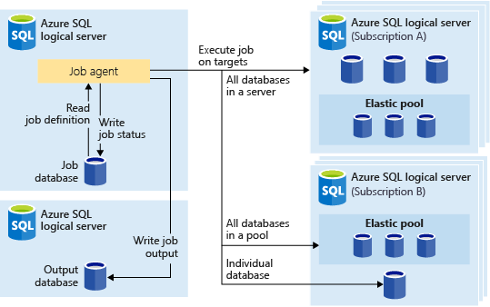
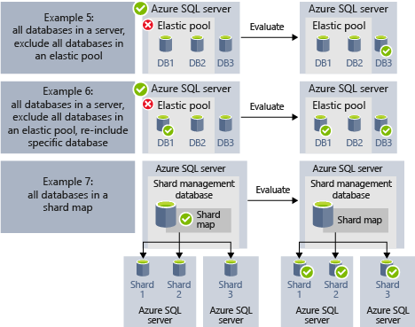

# Automate management tasks using database jobs
[!INCLUDE[appliesto-sqldb-sqlmi](../includes/appliesto-sqldb-sqlmi.md)]

You can create and schedule jobs that could be periodically executed against one or many databases to run Transact-SQL (T-SQL) queries and perform maintenance tasks.

You can define target database or groups of databases where the job will be executed, and also define schedules for running a job.
A job handles the task of logging in to the target database. You also define, maintain, and persist Transact-SQL scripts to be executed across a group of databases.

Every job logs the status of execution and also automatically retries the operations if any failure occurs.

## When to use automated jobs

There are several scenarios when you could use job automation:

- Automate management tasks and schedule them to run every weekday, after hours, etc.
  - Deploy schema changes, credentials management, performance data collection or tenant (customer) telemetry collection.
  - Update reference data (information common across all databases), load data from Azure Blob storage.
  - Rebuild indexes to improve query performance. Configure jobs to execute across a collection of databases on a recurring basis, such as during off-peak hours.
  - Collect query results from a set of databases into a central table on an on-going basis. Performance queries can be continually executed and configured to trigger additional tasks to be executed.
- Collect data for reporting
  - Aggregate data from a collection of databases into a single destination table.
  - Execute longer running data processing queries across a large set of databases, for example the collection of customer telemetry. Results are collected into a single destination table for further analysis.
- Data movements
  - Create jobs that replicate changes made in your databases to other databases or collect updates made in remote databases and apply changes in the database.
  - Create jobs that load data from or to your databases using SQL Server Integration Services (SSIS).

## Overview

The following job scheduling technologies are available:

- **SQL Agent Jobs** are classic and battle-tested SQL Server job scheduling component that is available in Azure SQL Managed Instance. SQL Agent Jobs are not available in Azure SQL Database.
- **Elastic Database Jobs (preview)** are Job Scheduling services that execute custom jobs on one or many databases in Azure SQL Database.

It is worth noting a couple of differences between SQL Agent (available on-premises and as part of SQL Managed Instance), and the Database Elastic Job agent (available for single databases in Azure SQL Database and databases in SQL Data Warehouse).

| |Elastic Jobs |SQL Agent |
|---------|---------|---------|
|Scope | Any number of databases in Azure SQL Database and/or data warehouses in the same Azure cloud as the job agent. Targets can be in different servers, subscriptions, and/or regions. <br><br>Target groups can be composed of individual databases or data warehouses, or all databases in a server, pool, or shardmap (dynamically enumerated at job runtime). | Any individual database in the same instance as the SQL agent. |
|Supported APIs and Tools | Portal, PowerShell, T-SQL, Azure Resource Manager | T-SQL, SQL Server Management Studio (SSMS) |

## SQL Agent Jobs

SQL Agent Jobs are a specified series of T-SQL scripts against your database. Use jobs to define an administrative task that can be run one or more times and monitored for success or failure.
A job can run on one local server or on multiple remote servers. SQL Agent Jobs are an internal Database Engine component that is executed within the Managed Instance service.
There are several key concepts in SQL Agent Jobs:

- **Job steps** set of one or many steps that should be executed within the job. For every job step you can define retry strategy and the action that should happen if the job step succeeds or fails.
- **Schedules** define when the job should be executed.
- **Notifications** enable you to define rules that will be used to notify operators via email once the job completes.

### Job steps

SQL Agent Job steps are sequences of actions that SQL Agent should execute. Every step has the following step that should be executed if the step succeeds or fails, number of retries in a case of failure.

SQL Agent enables you to create different types of job steps, such as Transact-SQL job steps that execute a single Transact-SQL batch against the database, or OS command/PowerShell steps that can execute custom OS script, SSIS job steps that enable you to load data using SSIS runtime, or [replication](../managed-instance/replication-transactional-overview.md) steps that can publish changes from your database to other databases.

[Transactional replication](../managed-instance/replication-transactional-overview.md) is a Database Engine feature that enables you to publish the changes made on one or multiple tables in one database and publish/distribute them to a set of subscriber databases. Publishing of the changes is implemented using the following SQL Agent job step types:

- Transaction-log reader.
- Snapshot.
- Distributor.

Other types of job steps are not currently supported, including:

- Merge replication job step is not supported.
- Queue Reader is not supported.
- Analysis Services are not supported

### Job schedules

A schedule specifies when a job runs. More than one job can run on the same schedule, and more than one schedule can apply to the same job.
A schedule can define the following conditions for the time when a job runs:

- Whenever Instance is restarted (or when SQL Server Agent starts). Job is activated after every failover.
- One time, at a specific date and time, which is useful for delayed execution of some job.
- On a recurring schedule.

> [!Note]
> SQL Managed Instance currently does not enable you to start a job when the instance is "idle".

### Job notifications

SQL Agent Jobs enable you to get notifications when the job finishes successfully or fails. You can receive notifications via email.

First, you would need to set up the email account that will be used to send the email notifications and assign the account to the email profile called `AzureManagedInstance_dbmail_profile`, as shown in the following sample:

```sql
-- Create a Database Mail account
EXECUTE msdb.dbo.sysmail_add_account_sp
    @account_name = 'SQL Agent Account',
    @description = 'Mail account for Azure SQL Managed Instance SQL Agent system.',
    @email_address = '$(loginEmail)',
    @display_name = 'SQL Agent Account',
    @mailserver_name = '$(mailserver)' ,
    @username = '$(loginEmail)' ,
    @password = '$(password)'

-- Create a Database Mail profile
EXECUTE msdb.dbo.sysmail_add_profile_sp
    @profile_name = 'AzureManagedInstance_dbmail_profile',
    @description = 'E-mail profile used for messages sent by Managed Instance SQL Agent.' ;

-- Add the account to the profile
EXECUTE msdb.dbo.sysmail_add_profileaccount_sp
    @profile_name = 'AzureManagedInstance_dbmail_profile',
    @account_name = 'SQL Agent Account',
    @sequence_number = 1;
```

You would also need to enable Database Mail on Managed Instance:

```sql
GO
EXEC sp_configure 'show advanced options', 1;
GO
RECONFIGURE;
GO
EXEC sp_configure 'Database Mail XPs', 1;
GO
RECONFIGURE
```

You can notify the operator that something happened with your SQL Agent jobs. An operator defines contact information for an individual responsible for the maintenance of one or more instances in SQL Managed Instance. Sometimes, operator responsibilities are assigned to one individual.
In systems with multiple instances in SQL Managed Instance or SQL Server, many individuals can share operator responsibilities. An operator does not contain security information, and does not define a security principal.

You can create operators using SSMS or the Transact-SQL script shown in the following example:

```sql
EXEC msdb.dbo.sp_add_operator
    @name=N'Mihajlo Pupun',
    @enabled=1,
    @email_address=N'mihajlo.pupin@contoso.com'
```

You can modify any job and assign operators that will be notified via email if the job completes, fails, or succeeds using SSMS or the following Transact-SQL script:

```sql
EXEC msdb.dbo.sp_update_job @job_name=N'Load data using SSIS',
    @notify_level_email=3, -- Options are: 1 on succeed, 2 on failure, 3 on complete
    @notify_email_operator_name=N'Mihajlo Pupun'
```

### SQL Agent Job Limitations

Some of the SQL Agent features that are available in SQL Server are not supported in Managed Instance:

- SQL Agent settings are read only. Procedure `sp_set_agent_properties` is not supported in Managed Instance.
- Enabling/disabling SQL Agent is currently not supported in Managed Instance. SQL Agent is always running.
- Notifications are partially supported
  - Pager is not supported.
  - NetSend is not supported.
  - Alerts are not supported.
- Proxies are not supported.
- Eventlog is not supported.

For information about SQL Server Agent, see [SQL Server Agent](https://docs.microsoft.com/sql/ssms/agent/sql-server-agent).

## Elastic Database Jobs (preview)

**Elastic Database Jobs** provide the ability to run one or more T-SQL scripts in parallel, across a large number of databases, on a schedule or on-demand.

**Run jobs against any combination of databases**: one or more individual databases, all databases on a server, all databases in an elastic pool, or shardmap, with the added flexibility to include or exclude any specific database. **Jobs can run across multiple servers, multiple pools, and can even run against databases in different subscriptions.** Servers and pools are dynamically enumerated at runtime, so jobs run against all databases that exist in the target group at the time of execution.

The following image shows a job agent executing jobs across the different types of target groups:



### Elastic Job components

|Component | Description (additional details are below the table) |
|---------|---------|
|[**Elastic Job agent**](#elastic-job-agent) | The Azure resource you create to run and manage Jobs. |
|[**Job database**](#job-database) | A database in Azure SQL Database that the job agent uses to store job related data, job definitions, etc. |
|[**Target group**](#target-group) | The set of servers, pools, databases, and shard maps to run a job against. |
|[**Job**](#job) | A job is a unit of work that is composed of one or more [job steps](#job-step). Job steps specify the T-SQL script to run, as well as other details required to execute the script. |

#### Elastic Job agent

An Elastic Job agent is the Azure resource for creating, running, and managing jobs. The Elastic Job agent is an Azure resource you create in the portal ([PowerShell](elastic-jobs-powershell-create.md) and REST are also supported).

Creating an **Elastic Job agent** requires an existing database in Azure SQL Database. The agent configures this existing database as the [*Job database*](#job-database).

The Elastic Job agent is free. The job database is billed at the same rate as any database in Azure SQL Database.

#### Job database

The *Job database* is used for defining jobs and tracking the status and history of job executions. The *Job database* is also used to store agent metadata, logs, results, job definitions, and also contains many useful stored procedures and other database objects for creating, running, and managing jobs using T-SQL.

For the current preview, an existing database in Azure SQL Database (S0 or higher) is required to create an Elastic Job agent.

The *Job database* doesn't literally need to be new, but should be a clean, empty, S0 or higher service objective. The recommended service objective of the *Job database* is S1 or higher, but the optimal choice depends on the performance needs of your job(s): the number of job steps, the number of job targets, and how frequently jobs are run. For example, an S0 database might be sufficient for a job agent that runs few jobs an hour targeting less than ten databases, but running a job every minute might not be fast enough with an S0 database, and a higher service tier might be better.

If operations against the job database are slower than expected, [monitor](monitor-tune-overview.md#azure-sql-database-and-azure-sql-managed-instance-resource-monitoring) database performance and the resource utilization in the job database during periods of slowness using Azure portal or the [sys.dm_db_resource_stats](https://docs.microsoft.com/sql/relational-databases/system-dynamic-management-views/sys-dm-db-resource-stats-azure-sql-database) DMV. If utilization of a resource, such as CPU, Data IO, or Log Write approaches 100% and correlates with periods of slowness, consider incrementally scaling the database to higher service objectives (either in the [DTU model](service-tiers-dtu.md) or in the [vCore model](service-tiers-vcore.md)) until job database performance is sufficiently improved.

##### Job database permissions

During job agent creation, a schema, tables, and a role called *jobs_reader* are created in the *Job database*. The role is created with the following permission and is designed to give administrators finer access control for job monitoring:

|Role name |'jobs' schema permissions |'jobs_internal' schema permissions |
|---------|---------|---------|
|**jobs_reader** | SELECT | None |

> [!IMPORTANT]
> Consider the security implications before granting access to the *Job database* as a database administrator. A malicious user with permissions to create or edit jobs could create or edit a job that uses a stored credential to connect to a database under the malicious user's control, which could allow the malicious user to determine the credential’s password.

#### Target group

A *target group* defines the set of databases a job step will execute on. A target group can contain any number and combination of the following:

- **Logical SQL server** - if a server is specified, all databases that exist in the server at the time of the job execution are part of the group. The master database credential must be provided so that the group can be enumerated and updated prior to job execution.
- **Elastic pool** - if an elastic pool is specified, all databases that are in the elastic pool at the time of the job execution are part of the group. As for a server, the master database credential must be provided so that the group can be updated prior to the job execution.
- **Single database** - specify one or more individual databases to be part of the group.
- **Shardmap** - databases of a shardmap.

> [!TIP]
> At the moment of job execution, *dynamic enumeration* re-evaluates the set of databases in target groups that include servers or pools. Dynamic enumeration ensures that **jobs run across all databases that exist in the server or pool at the time of job execution**. Re-evaluating the list of databases at runtime is specifically useful for scenarios where pool or server membership changes frequently.

Pools and single databases can be specified as included or excluded from the group. This enables creating a target group with any combination of databases. For example, you can add a server to a target group, but exclude specific databases in an elastic pool (or exclude an entire pool).

A target group can include databases in multiple subscriptions, and across multiple regions. Note that cross-region executions have higher latency than executions within the same region.

The following examples show how different target group definitions are dynamically enumerated at the moment of job execution to determine which databases the job will run:


**Example 1** shows a target group that consists of a list of individual databases. When a job step is executed using this target group, the job step's action will be executed in each of those databases.<br>
**Example 2** shows a target group that contains a server as a target. When a job step is executed using this target group, the server is dynamically enumerated to determine the list of databases that are currently in the server. The job step's action will be executed in each of those databases.<br>
**Example 3** shows a similar target group as *Example 2*, but an individual database is specifically excluded. The job step's action will *not* be executed in the excluded database.<br>
**Example 4** shows a target group that contains an elastic pool as a target. Similar to *Example 2*, the pool will be dynamically enumerated at job run time to determine the list of databases in the pool.
<br><br>



**Example 5** and **Example 6** show advanced scenarios where servers, elastic pools, and databases can be combined using include and exclude rules.<br>
**Example 7** shows that the shards in a shard map can also be evaluated at job run time.

> [!NOTE]
> The Job database itself can be the target of a job. In this scenario, the Job database is treated just like any other target database. The job user must be created and granted sufficient permissions in the Job database, and the database scoped credential for the job user must also exist in the Job database, just like it does for any other target database.
>

#### Job

A *job* is a unit of work that is executed on a schedule or as a one-time job. A job consists of one or more *job steps*.

##### Job step

Each job step specifies a T-SQL script to execute, one or more target groups to run the T-SQL script against, and the credentials the job agent needs to connect to the target database. Each job step has customizable timeout and retry policies, and can optionally specify output parameters.

#### Job output

The outcome of a job's steps on each target database are recorded in detail, and script output can be captured to a specified table. You can specify a database to save any data returned from a job.

#### Job history

Job execution history is stored in the *Job database*. A system cleanup job purges execution history that is older than 45 days. To remove history less than 45 days old, call the **sp_purge_history** stored procedure in the *Job database*.

### Agent performance, capacity, and limitations

Elastic Jobs use minimal compute resources while waiting for long-running jobs to complete.

Depending on the size of the target group of databases and the desired execution time for a job (number of concurrent workers), the agent requires different amounts of compute and performance of the *Job database* (the more targets and the higher number of jobs, the higher the amount of compute required).

Currently, the preview is limited to 100 concurrent jobs.

#### Prevent jobs from reducing target database performance

To ensure resources aren't overburdened when running jobs against databases in a SQL elastic pool, jobs can be configured to limit the number of databases a job can run against at the same time.

## Next steps

- [What is SQL Server Agent](https://docs.microsoft.com/sql/ssms/agent/sql-server-agent)
- [How to create and manage elastic jobs](elastic-jobs-overview.md)
- [Create and manage Elastic Jobs using PowerShell](elastic-jobs-powershell-create.md)
- [Create and manage Elastic Jobs using Transact-SQL (T-SQL)](elastic-jobs-tsql-create-manage.md)
