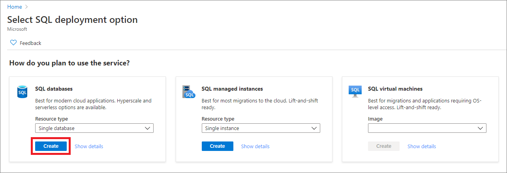
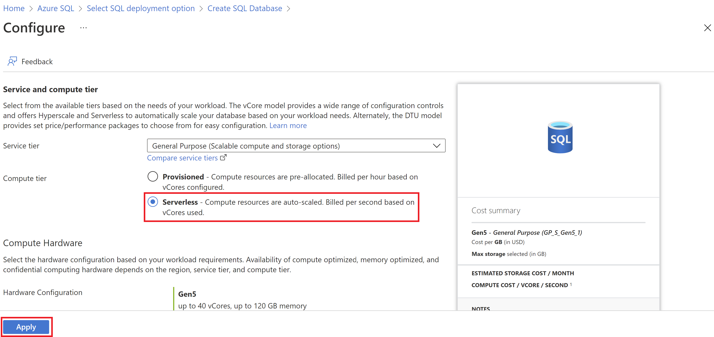

# Quickstart: Create a database in Azure SQL Database with ledger enabled

[!INCLUDE[appliesto-sqldb](../includes/appliesto-sqldb.md)]

> [!NOTE]
> Azure SQL Database ledger is currently in public preview and available in West Europe, Brazil South, and West Central US.

In this quickstart, you create a [ledger database](ledger-overview.md#ledger-database) in Azure SQL Database and configure [automatic digest storage with Azure Blob Storage](ledger-digest-management-and-database-verification.md#automatic-generation-and-storage-of-database-digests) by using the Azure portal. For more information about ledger, see [Azure SQL Database ledger](ledger-overview.md).

## Prerequisite

You need an active Azure subscription. If you don't have one, [create a free account](https://azure.microsoft.com/free/).

## Create a ledger database and configure digest storage

Create a single ledger database in the [serverless compute tier](serverless-tier-overview.md), and configure uploading ledger digests to an Azure Storage account.

### Use the Azure portal

To create a single database in the Azure portal, this quickstart starts at the Azure SQL page.

1. Browse to the [Select SQL Deployment option](https://portal.azure.com/#create/Microsoft.AzureSQL) page.

1. Under **SQL databases**, leave **Resource type** set to **Single database**, and select **Create**.

   

1. On the **Basics** tab of the **Create SQL Database** form, under **Project details**, select the Azure subscription you want to use.

1. For **Resource group**, select **Create new**, enter **myResourceGroup**, and select **OK**.

1. For **Database name**, enter **demo**.

1. For **Server**, select **Create new**. Fill out the **New server** form with the following values:
   - **Server name**: Enter **mysqlserver**, and add some characters for uniqueness. We can't provide an exact server name to use because server names must be globally unique for all servers in Azure, not just unique within a subscription. Enter something like **mysqlserver12345**, and the portal lets you know if it's available or not.
   - **Server admin login**: Enter **azureuser**.
   - **Password**: Enter a password that meets requirements. Enter it again in the **Confirm password** box.
   - **Location**: Select a location from the dropdown list.
   - **Allow Azure services to access this server**: Select this option to enable access to digest storage.
   
   Select **OK**.
   
1. Leave **Want to use SQL elastic pool** set to **No**.

1. Under **Compute + storage**, select **Configure database**.

1. This quickstart uses a serverless database, so select **Serverless**, and then select **Apply**. 

      

1. On the **Networking** tab, for **Connectivity method**, select **Public endpoint**.
1. For **Firewall rules**, set **Add current client IP address** to **Yes**. Leave **Allow Azure services and resources to access this server** set to **No**.
1. Select **Next: Security** at the bottom of the page.

   :::image type="content" source="media/ledger/ledger-create-database-networking-tab.png" alt-text="Screenshot that shows the Networking tab of the Create SQL Database screen in the Azure portal.":::

1. On the **Security** tab, in the **Ledger** section, select the **Configure ledger** option.

    :::image type="content" source="media/ledger/ledger-configure-ledger-security-tab.png" alt-text="Screenshot that shows configuring a ledger on the Security tab of the Azure portal.":::

1. On the **Configure ledger** pane, in the **Ledger** section, select the **Enable for all future tables in this database** checkbox. This setting ensures that all future tables in the database will be ledger tables. For this reason, all data in the database will show any evidence of tampering. By default, new tables will be created as updatable ledger tables, even if you don't specify `LEDGER = ON` in [CREATE TABLE](/sql/t-sql/statements/create-table-transact-sql). You can also leave this option unselected. You're then required to enable ledger functionality on a per-table basis when you create new tables by using Transact-SQL.

1. In the **Digest Storage** section, **Enable automatic digest storage** is automatically selected. Then, a new Azure Storage account and container where your digests are stored is created.

1. Select **Apply**.

    :::image type="content" source="media/ledger/ledger-configure-ledger-pane.png" alt-text="Screenshot that shows the Configure ledger (preview) pane in the Azure portal.":::

1. Select **Review + create** at the bottom of the page.

    :::image type="content" source="media/ledger/ledger-review-security-tab.png" alt-text="Screenshot that shows reviewing and creating a ledger database on the Security tab of the Azure portal.":::

1. On the **Review + create** page, after you review, select **Create**.

## Clean up resources

Keep the resource group, server, and single database for the next steps. You'll learn how to use the ledger feature of your database with different methods.

When you're finished using these resources, delete the resource group you created. This action also deletes the server and single database within it.

### Use the Azure portal

To delete **myResourceGroup** and all its resources by using the Azure portal:

1. In the portal, search for and select **Resource groups**. Then select **myResourceGroup** from the list.
1. On the resource group page, select **Delete resource group**.
1. Under **Type the resource group name**, enter **myResourceGroup**, and then select **Delete**.

## Next steps

Connect and query your database by using different tools and languages:

- [Create and use updatable ledger tables](ledger-how-to-updatable-ledger-tables.md)
- [Create and use append-only ledger tables](ledger-how-to-append-only-ledger-tables.md) 
