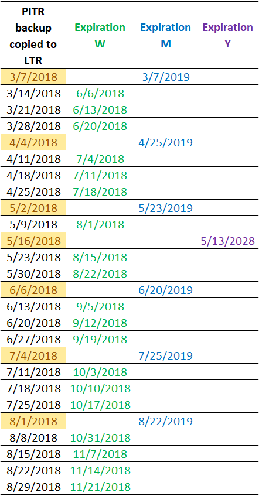

# Long-term retention - Azure SQL Database and Azure SQL Managed Instance

Many applications have regulatory, compliance, or other business purposes that require you to retain database backups beyond the 7-35 days provided by Azure SQL Database and Azure SQL Managed Instance [automatic backups](automated-backups-overview.md). By using the long-term retention (LTR) feature, you can store specified SQL Database and SQL Managed Instance full backups in Azure Blob storage with read-access geo-redundant storage for up to 10 years. You can then restore any backup as a new database. For more information about Azure Storage redundancy, see [Azure Storage redundancy](../../storage/common/storage-redundancy.md). 

Long time retention can be enabled for Azure SQL Database, and is in limited public preview for Azure SQL Managed Instance. This article provides a conceptual overview of long-term retention. To configure long-term retention, see [Configure Azure SQL Database LTR](long-term-backup-retention-configure.md) and [Configure Azure SQL Managed Instance LTR](../managed-instance/long-term-backup-retention-configure.md). 

> [!NOTE]
> You can use SQL Agent jobs to schedule [copy-only database backups](https://docs.microsoft.com/sql/relational-databases/backup-restore/copy-only-backups-sql-server) as an alternative to LTR beyond 35 days.

## How long-term retention works
     
Long-term backup retention (LTR) leverages the full database backups that are [automatically created](automated-backups-overview.md) to enable point-time restore (PITR). If an LTR policy is configured, these backups are copied to different blobs for long-term storage. The copy is a background job that has no performance impact on the database workload. The LTR policy for each database in SQL Database can also specify how frequently the LTR backups are created.

To enable LTR, you can define a policy using a combination of four parameters: weekly backup retention (W), monthly backup retention (M), yearly backup retention (Y), and week of year (WeekOfYear). If you specify W, one backup every week will be copied to the long-term storage. If you specify M, the first backup of each month will be copied to the long-term storage. If you specify Y, one backup during the week specified by WeekOfYear will be copied to the long-term storage. If the specified WeekOfYear is in the past when the policy is configured, the first LTR backup will be created in the following year. Each backup will be kept in the long-term storage according to the policy parameters that are configured when the LTR backup is created.

> [!NOTE]
> Any change to the LTR policy applies only to future backups. For example, if weekly backup retention (W), monthly backup retention (M), or yearly backup retention (Y) is modified, the new retention setting will only apply to new backups. The retention of existing backups will not be modified. If your intention is to delete old LTR backups before their retention period expires, you will need to [manually delete the backups](https://docs.microsoft.com/azure/sql-database/sql-database-long-term-backup-retention-configure#delete-ltr-backups).
> 

Examples of the LTR policy:

-  W=0, M=0, Y=5, WeekOfYear=3

   The third full backup of each year will be kept for five years.
   
- W=0, M=3, Y=0

   The first full backup of each month will be kept for three months.

- W=12, M=0, Y=0

   Each weekly full backup will be kept for 12 weeks.

- W=6, M=12, Y=10, WeekOfYear=16

   Each weekly full backup will be kept for six weeks. Except first full backup of each month, which will be kept for 12 months. Except the full backup taken on 16th week of year, which will be kept for 10 years. 

The following table illustrates the cadence and expiration of the long-term backups for the following policy:

W=12 weeks (84 days), M=12 months (365 days), Y=10 years (3650 days), WeekOfYear=15 (week after April 15)

   

If you modify the above policy and set W=0 (no weekly backups), the cadence of backup copies will change as shown in the above table by the highlighted dates. The storage amount needed to keep these backups would reduce accordingly. 

> [!IMPORTANT]
> The timing of individual LTR backups is controlled by Azure. You cannot manually create an LTR backup or control the timing of the backup creation. After configuring an LTR policy, it  may take up to 7 days before the first LTR backup will show up on the list of available backups.  

## Geo-replication and long-term backup retention

If you're using active geo-replication or failover groups as your business continuity solution, you should prepare for eventual failovers and configure the same LTR policy on the secondary database or instance. Your LTR storage cost won't increase as backups aren't generated from the secondaries. The backups are only created when the secondary becomes primary the backups will be created. It ensures non-interrupted generation of the LTR backups when the failover is triggered and the primary moves to the secondary region. 

> [!NOTE]
> When the original primary database recovers from an outage that caused the failover, it will become a new secondary. Therefore, the backup creation will not resume and the existing LTR policy will not take effect until it becomes the primary again. 

## SQL Managed Instance support

Using long-term backup retention with Azure SQL Managed Instance has the following limitations:

- **Limited public preview** - This preview is only available to EA and CSP subscriptions and is subject to limited availability.  
- [**PowerShell only**](../managed-instance/long-term-backup-retention-configure.md) - There's currently no Azure portal support. LTR must be enabled using PowerShell. 

To request enrollment, create an [Azure support ticket](https://azure.microsoft.com/support/create-ticket/). For issue type select technical issue, for service choose SQL Managed Instance, and for the problem type select **Backup, Restore, and Business continuity / Long-term backup retention**. In your request, please state you would like to be enrolled into limited public preview of LTR for SQL Managed Instance.

## Configure long-term backup retention

You can configure long-term backup retention using the Azure portal and PowerShell for Azure SQL Database, and PowerShell for Azure SQL Managed Instance. To restore a database from the LTR storage, you can select a specific backup based on its timestamp. The database can be restored to any existing server or managed instance under the same subscription as the original database.

To learn how to configure long-term retention or restore a database from backup for SQL Database using the Azure portal or PowerShell, see [Manage Azure SQL Database long-term backup retention](long-term-backup-retention-configure.md)

To learn how to configure long-term retention or restore a database from backup for SQL Managed Instance using PowerShell, see [Manage Azure SQL Managed Instance long-term backup retention](../managed-instance/long-term-backup-retention-configure.md).

To restore a database from the LTR storage, you can select a specific backup based on its timestamp. The database can be restored to any existing server under the same subscription as the original database. To learn how to restore your database from an LTR backup, using the Azure portal, or PowerShell, see [Manage Azure SQL Database long-term backup retention](long-term-backup-retention-configure.md). In your request, please state you would like to be enrolled in the limited public preview of LTR for SQL Managed Instance.

## Next steps

Because database backups protect data from accidental corruption or deletion, they're an essential part of any business continuity and disaster recovery strategy. To learn about the other SQL Database business-continuity solutions, see [Business continuity overview](business-continuity-high-availability-disaster-recover-hadr-overview.md).
 