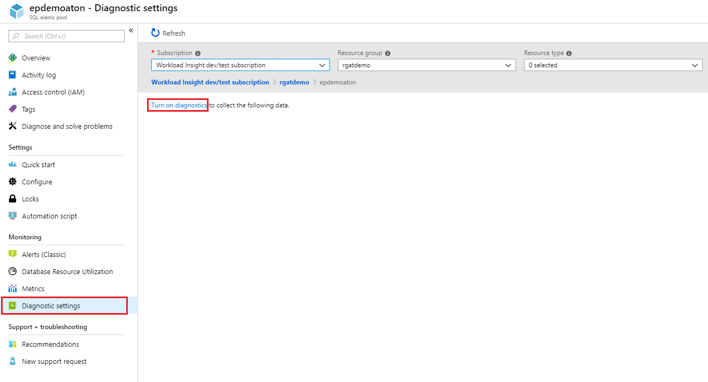
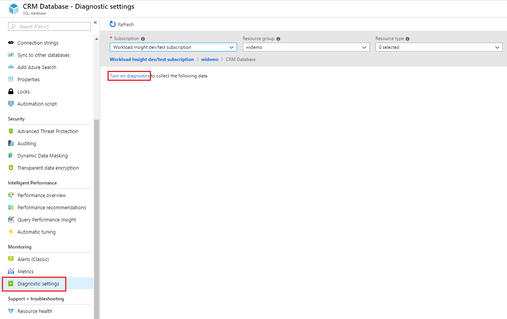
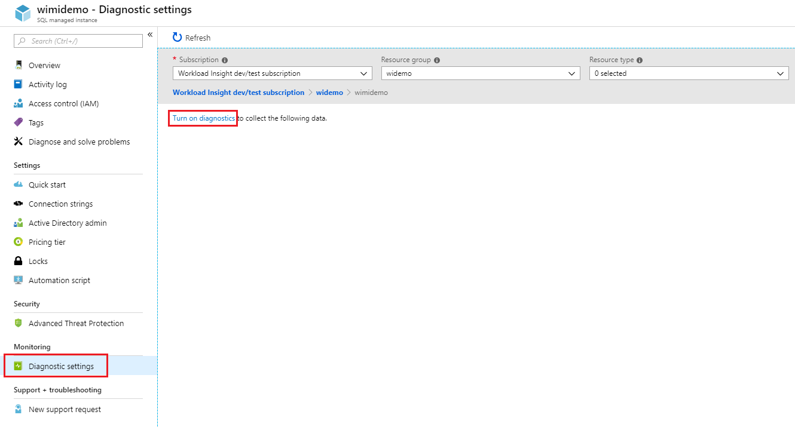
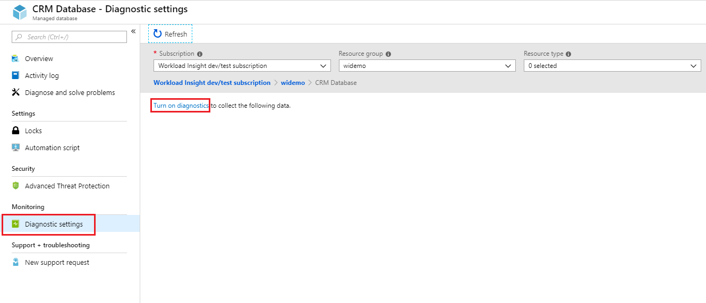
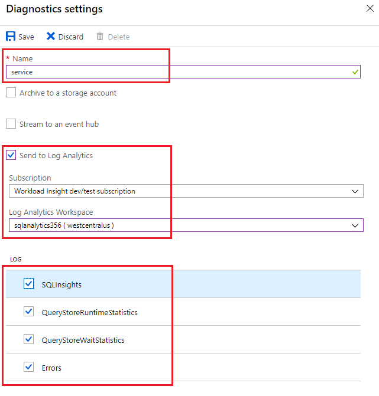
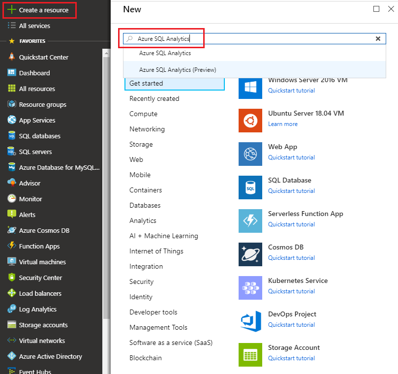

# Configure streaming export of Azure SQL Database and SQL Managed Instance diagnostic telemetry
[!INCLUDE[appliesto-sqldb-sqlmi](../includes/appliesto-sqldb-sqlmi.md)]

In this article, you will learn about the performance metrics and resource logs for Azure SQL Database that you can export to one of several destinations for analysis. You will learn how to configure the streaming export of this diagnostic telemetry through the Azure portal, PowerShell, Azure CLI, the REST API, and Azure Resource Manager templates.

You will also learn about the destinations to which you can stream this diagnostic telemetry and how to choose among these choices. Your destination options include:

- [Log Analytics and SQL Analytics](#stream-into-sql-analytics)
- [Event Hubs](#stream-into-event-hubs)
- [Azure Storage](#stream-into-azure-storage)

## Diagnostic telemetry for export

Most important among the diagnostic telemetry that you can export is the Intelligent Insights (SQLInsights) log. [Intelligent Insights](intelligent-insights-overview.md) uses built-in intelligence to continuously monitor database usage through artificial intelligence and detect disruptive events that cause poor performance. Once detected, a detailed analysis is performed that generates a Intelligent Insights log with an intelligent assessment of the issue. This assessment consists of a root cause analysis of the database performance issue and, where possible, recommendations for performance improvements. You need to configure the streaming export of this log to view its contents.

In addition to streaming the export of the Intelligent Insights log, you can also export a variety of performance metrics and additional database logs. The following table describes the performance metrics and resources logs that you can configure for streaming export to one of several destinations. This diagnostic telemetry can be configured for single databases, elastic pools and pooled databases, and managed instances and instance databases.

| Diagnostic telemetry for databases | Azure SQL Database support | Azure SQL Managed Instance support |
| :------------------- | ----- | ----- |
| [Basic metrics](#basic-metrics): Contains DTU/CPU percentage, DTU/CPU limit, physical data read percentage, log write percentage, Successful/Failed/Blocked by firewall connections, sessions percentage, workers percentage, storage, storage percentage, and XTP storage percentage. | Yes | No |
| [Instance and App Advanced](#advanced-metrics): Contains tempdb system database data and log file size and tempdb percent log file used. | Yes | No |
| [QueryStoreRuntimeStatistics](#query-store-runtime-statistics): Contains information about the query runtime statistics such as CPU usage and query duration statistics. | Yes | Yes |
| [QueryStoreWaitStatistics](#query-store-wait-statistics): Contains information about the query wait statistics (what your queries waited on) such are CPU, LOG, and LOCKING. | Yes | Yes |
| [Errors](#errors-dataset): Contains information about SQL errors on a database. | Yes | Yes |
| [DatabaseWaitStatistics](#database-wait-statistics-dataset): Contains information about how much time a database spent waiting on different wait types. | Yes | No |
| [Timeouts](#time-outs-dataset): Contains information about timeouts on a database. | Yes | No |
| [Blocks](#blockings-dataset): Contains information about blocking events on a database. | Yes | No |
| [Deadlocks](#deadlocks-dataset): Contains information about deadlock events on a database. | Yes | No |
| [AutomaticTuning](#automatic-tuning-dataset): Contains information about automatic tuning recommendations for a database. | Yes | No |
| [SQLInsights](#intelligent-insights-dataset): Contains Intelligent Insights into performance for a database. To learn more, see [Intelligent Insights](intelligent-insights-overview.md). | Yes | Yes |

> [!NOTE]
> Diagnostic settings cannot be configured for the **system databases**, such are master, msdb, model, resource and tempdb databases.

## Streaming export destinations

This diagnostic telemetry can be streamed to one of the following Azure resources for analysis.

- **[Log Analytics workspace](#stream-into-sql-analytics)**:

  Data streamed to a [Log Analytics workspace](../../azure-monitor/platform/resource-logs-collect-workspace.md) can be consumed by [SQL Analytics](../../azure-monitor/insights/azure-sql.md). SQL Analytics is a cloud only monitoring solution that provides intelligent monitoring of your databases that includes performance reports, alerts, and mitigation recommendations. Data streamed to a Log Analytics workspace can be analyzed with other monitoring data collected and also enables you to leverage other Azure Monitor features such as alerts and visualizations
- **[Azure Event Hubs](#stream-into-event-hubs)**:

  Data streamed to an [Azure Event Hub](../../azure-monitor/platform/resource-logs-stream-event-hubs.md)provides the following functionality:

  - **Stream logs to 3rd party logging and telemetry systems**: Stream all of your metrics and resource logs to a single event hub to pipe log data to a third-party SIEM or log analytics tool.
  - **Build a custom telemetry and logging platform**: The highly scalable publish-subscribe nature of event hubs allows you to flexibly ingest metrics and resource logs into a custom telemetry platform. See [Designing and Sizing a Global Scale Telemetry Platform on Azure Event Hubs](https://azure.microsoft.com/documentation/videos/build-2015-designing-and-sizing-a-global-scale-telemetry-platform-on-azure-event-Hubs/) for details.
  - **View service health by streaming data to Power BI**: Use Event Hubs, Stream Analytics, and Power BI to transform your diagnostics data into near real-time insights on your Azure services. See [Stream Analytics and Power BI: A real-time analytics dashboard for streaming data](https://docs.microsoft.com/azure/stream-analytics/stream-analytics-power-bi-dashboard) for details on this solution.
- **[Azure Storage](#stream-into-azure-storage)**:

  Data streamed to [Azure Storage](../../azure-monitor/platform/resource-logs-collect-storage.md) enables you to archive vast amounts of diagnostic telemetry for a fraction of the cost of the previous two streaming options.

This diagnostic telemetry streamed to one of these destinations can be used to gauge resource utilization and query execution statistics for easier performance monitoring.


## Enable and configure the streaming export of diagnostic telemetry

You can enable and manage metrics and diagnostic telemetry logging by using one of the following methods:

- Azure portal
- PowerShell
- Azure CLI
- Azure Monitor REST API
- Azure Resource Manager template

> [!NOTE]
> To enable audit log streaming of security telemetry, see [Set up auditing for your database](../../sql-database/sql-database-auditing.md#setup-auditing) and [auditing logs in Azure Monitor logs and Azure Event Hubs](https://techcommunity.microsoft.com/t5/Azure-SQL-Database/SQL-Audit-logs-in-Azure-Log-Analytics-and-Azure-Event-Hubs/ba-p/386242).

## Configure the streaming export of diagnostic telemetry

You can use the **Diagnostics settings** menu in the Azure portal to enable and configure streaming of diagnostic telemetry. Additionally, you can use PowerShell, the Azure CLI, the [REST API](https://docs.microsoft.com/rest/api/monitor/diagnosticsettings), and [Resource Manager templates](../../azure-monitor/platform/diagnostic-settings-template.md) to configure streaming of diagnostic telemetry. You can set the following destinations to stream the diagnostic telemetry: Azure Storage, Azure Event Hubs, and Azure Monitor logs.

> [!IMPORTANT]
> The streaming export of diagnostic telemetry is not enabled by default.

Select one of the following tabs for step-by-step guidance for configuring the streaming export of diagnostic telemetry in the Azure portal and for scripts for accomplishing the same with PowerShell and the Azure CLI.

# [Azure portal](#tab/azure-portal)

### Elastic pools in Azure SQL Database

You can set up an elastic pool resource to collect the following diagnostic telemetry:

| Resource | Monitoring telemetry |
| :------------------- | ------------------- |
| **Elastic pool** | [Basic metrics](metrics-diagnostic-telemetry-logging-streaming-export-configure.md#basic-metrics) contains eDTU/CPU percentage, eDTU/CPU limit, physical data read percentage, log write percentage, sessions percentage, workers percentage, storage, storage percentage, storage limit, and XTP storage percentage. |

To configure streaming of diagnostic telemetry for elastic pools and pooled databases, you need to separately configure each separately:

- Enable streaming of diagnostic telemetry for an elastic pool
- Enable streaming of diagnostic telemetry for each database in elastic pool

The elastic pool container has its own telemetry separate from each individual pooled database's telemetry.

To enable streaming of diagnostic telemetry for an elastic pool resource, follow these steps:

1. Go to the **elastic pool** resource in Azure portal.
2. Select **Diagnostics settings**.
3. Select **Turn on diagnostics** if no previous settings exist, or select **Edit setting** to edit a previous setting.

   

4. Enter a setting name for your own reference.
5. Select a destination resource for the streaming diagnostics data: **Archive to storage account**, **Stream to an event hub**, or **Send to Log Analytics**.
6. For log analytics, select **Configure** and create a new workspace by selecting **+Create New Workspace**, or select an existing workspace.
7. Select the check box for elastic pool diagnostic telemetry: **Basic** metrics.
   

8. Select **Save**.
9. In addition, configure streaming of diagnostic telemetry for each database within the elastic pool you want to monitor by following steps described in the next section.

> [!IMPORTANT]
> In addition to configuring diagnostic telemetry for an elastic pool, you also need to configure diagnostic telemetry for each database in the elastic pool.

### Single and pooled databases in Azure SQL Database

You can set up a single or pooled database resource to collect the following diagnostic telemetry:

| Resource | Monitoring telemetry |
| :------------------- | ------------------- |
| **Single or pooled database** | [Basic metrics](metrics-diagnostic-telemetry-logging-streaming-export-configure.md#basic-metrics) contains DTU percentage, DTU used, DTU limit, CPU percentage, physical data read percentage, log write percentage, Successful/Failed/Blocked by firewall connections, sessions percentage, workers percentage, storage, storage percentage, XTP storage percentage, and deadlocks. |

To enable streaming of diagnostic telemetry for a single or a pooled database, follow these steps:

1. Go to Azure **SQL database** resource.
2. Select **Diagnostics settings**.
3. Select **Turn on diagnostics** if no previous settings exist, or select **Edit setting** to edit a previous setting. You can create up to three parallel connections to stream diagnostic telemetry.
4. Select **Add diagnostic setting** to configure parallel streaming of diagnostics data to multiple resources.

   

5. Enter a setting name for your own reference.
6. Select a destination resource for the streaming diagnostics data: **Archive to storage account**, **Stream to an event hub**, or **Send to Log Analytics**.
7. For the standard, event-based monitoring experience, select the following check boxes for database diagnostics log telemetry: **SQLInsights**, **AutomaticTuning**, **QueryStoreRuntimeStatistics**, **QueryStoreWaitStatistics**, **Errors**, **DatabaseWaitStatistics**, **Timeouts**, **Blocks**, and **Deadlocks**.
8. For an advanced, one-minute-based monitoring experience, select the check box for **Basic** metrics.

   
9. Select **Save**.
10. Repeat these steps for each database you want to monitor.

> [!TIP]
> Repeat these steps for each single and pooled database you want to monitor.

### Instances in Azure SQL Managed Instance

You can set up a managed instance resource to collect the following diagnostic telemetry:

| Resource | Monitoring telemetry |
| :------------------- | ------------------- |
| **Managed instance** | [ResourceUsageStats](#resource-usage-stats-for-managed-instances) contains vCores count, average CPU percentage, IO requests, bytes read/written, reserved storage space, and used storage space. |

To configure streaming of diagnostic telemetry for managed instance and instance databases, you will need to separately configure each:

- Enable streaming of diagnostic telemetry for managed instance
- Enable streaming of diagnostic telemetry for each instance database

The managed instance container has its own telemetry separate from each instance database's telemetry.

To enable streaming of diagnostic telemetry for a managed instance resource, follow these steps:

1. Go to the **managed instance** resource in Azure portal.
2. Select **Diagnostics settings**.
3. Select **Turn on diagnostics** if no previous settings exist, or select **Edit setting** to edit a previous setting.

   

4. Enter a setting name for your own reference.
5. Select a destination resource for the streaming diagnostics data: **Archive to storage account**, **Stream to an event hub**, or **Send to Log Analytics**.
6. For log analytics, select **Configure** and create a new workspace by selecting **+Create New Workspace**, or use an existing workspace.
7. Select the check box for instance diagnostic telemetry: **ResourceUsageStats**.

   

8. Select **Save**.
9. In addition, configure streaming of diagnostic telemetry for each instance database within the managed instance you want to monitor by following the steps described in the next section.

> [!IMPORTANT]
> In addition to configuring diagnostic telemetry for a managed instance, you also need to configure diagnostic telemetry for each instance database.

### Databases in Azure SQL Managed Instance

You can set up an instance database resource to collect the following diagnostic telemetry:

| Resource | Monitoring telemetry |
| :------------------- | ------------------- |
| **Instance database** | [ResourceUsageStats](#resource-usage-stats-for-managed-instances) contains vCores count, average CPU percentage, IO requests, bytes read/written, reserved storage space, and used storage space. |

To enable streaming of diagnostic telemetry for an instance database, follow these steps:

1. Go to **instance database** resource within managed instance.
2. Select **Diagnostics settings**.
3. Select **Turn on diagnostics** if no previous settings exist, or select **Edit setting** to edit a previous setting.
   - You can create up to three (3) parallel connections to stream diagnostic telemetry.
   - Select **+Add diagnostic setting** to configure parallel streaming of diagnostics data to multiple resources.

   

4. Enter a setting name for your own reference.
5. Select a destination resource for the streaming diagnostics data: **Archive to storage account**, **Stream to an event hub**, or **Send to Log Analytics**.
6. Select the check boxes for database diagnostic telemetry: **SQLInsights**, **QueryStoreRuntimeStatistics**, **QueryStoreWaitStatistics**, and **Errors**.
   
7. Select **Save**.
8. Repeat these steps for each instance database you want to monitor.

> [!TIP]
> Repeat these steps for each instance database you want to monitor.

# [PowerShell](#tab/azure-powershell)

[!INCLUDE [updated-for-az](../../../includes/updated-for-az.md)]

> [!IMPORTANT]
> The PowerShell Azure Resource Manager module is still supported Azure, but all future development is for the Az.Sql module. For these cmdlets, see [AzureRM.Sql](https://docs.microsoft.com/powershell/module/AzureRM.Sql/). The arguments for the commands in the Az module and in the AzureRm modules are substantially identical.

You can enable metrics and diagnostics logging by using PowerShell.

- To enable storage of metrics and resource logs in a storage account, use this command:

  ```powershell
  Set-AzDiagnosticSetting -ResourceId [your resource id] -StorageAccountId [your storage account id] -Enabled $true
  ```

  The storage account ID is the resource ID for the destination storage account.

- To enable streaming of metrics and resource logs to an event hub, use this command:

  ```powershell
  Set-AzDiagnosticSetting -ResourceId [your resource id] -ServiceBusRuleId [your service bus rule id] -Enabled $true
  ```

  The Azure Service Bus rule ID is a string with this format:

  ```powershell
  {service bus resource ID}/authorizationrules/{key name}
  ```

- To enable sending metrics and resource logs to a Log Analytics workspace, use this command:

  ```powershell
  Set-AzDiagnosticSetting -ResourceId [your resource id] -WorkspaceId [resource id of the log analytics workspace] -Enabled $true
  ```

- You can obtain the resource ID of your Log Analytics workspace by using the following command:

  ```powershell
  (Get-AzOperationalInsightsWorkspace).ResourceId
  ```

You can combine these parameters to enable multiple output options.

**To configure multiple Azure resources**

To support multiple subscriptions, use the PowerShell script from [Enable Azure resource metrics logging using PowerShell](https://blogs.technet.microsoft.com/msoms/20../../enable-azure-resource-metrics-logging-using-powershell/).

Provide the workspace resource ID \<$WSID\> as a parameter when executing the script `Enable-AzureRMDiagnostics.ps1` to send diagnostic data from multiple resources to the workspace.

- To get the workspace ID \<$WSID\> of the destination for your diagnostic data, use the following script:

  ```powershell
  $WSID = "/subscriptions/<subID>/resourcegroups/<RG_NAME>/providers/microsoft.operationalinsights/workspaces/<WS_NAME>"
  .\Enable-AzureRMDiagnostics.ps1 -WSID $WSID
  ```

  Replace \<subID\> with the subscription ID, \<RG_NAME\> with the resource group name, and \<WS_NAME\> with the workspace name.

# [Azure CLI](#tab/azure-cli)

You can enable metrics and diagnostics logging by using the Azure CLI.

> [!IMPORTANT]
> Scripts to enable diagnostics logging are supported for Azure CLI v1.0. Azure CLI v2.0 is unsupported at this time.

- To enable the storage of metrics and resource logs in a storage account, use this command:

  ```azurecli-interactive
  azure insights diagnostic set --resourceId <resourceId> --storageId <storageAccountId> --enabled true
  ```

  The storage account ID is the resource ID for the destination storage account.

- To enable the streaming of metrics and resource logs to an event hub, use this command:

  ```azurecli-interactive
  azure insights diagnostic set --resourceId <resourceId> --serviceBusRuleId <serviceBusRuleId> --enabled true
  ```

  The Service Bus rule ID is a string with this format:

  ```azurecli-interactive
  {service bus resource ID}/authorizationrules/{key name}
  ```

- To enable the sending of metrics and resource logs to a Log Analytics workspace, use this command:

  ```azurecli-interactive
  azure insights diagnostic set --resourceId <resourceId> --workspaceId <resource id of the log analytics workspace> --enabled true
  ```

You can combine these parameters to enable multiple output options.

---

## Stream into SQL Analytics

Azure SQL Database and Azure SQL Managed Instance metrics and resource logs that are streamed into a Log Analytics workspace can be consumed by Azure SQL Analytics. Azure SQL Analytics is a cloud solution that monitors the performance of single databases, elastic pools and pooled databases, and managed instances and instance databases at scale and across multiple subscriptions. It can help you collect and visualize performance metrics, and it has built-in intelligence for performance troubleshooting.


### Installation overview

You can monitor a collection of databases and database collections with Azure SQL Analytics by performing the following steps:

1. Create an Azure SQL Analytics solution from the Azure Marketplace.
2. Create a Log Analytics workspace in the solution.
3. Configure databases to stream diagnostic telemetry into the workspace.

You can configure the streaming export of this diagnostic telemetry by using the built-in **Send to Log Analytics** option in the diagnostics settings tab in the Azure portal. You can also enable streaming into a Log Analytics workspace by using diagnostics settings via [PowerShell cmdlets](metrics-diagnostic-telemetry-logging-streaming-export-configure.md?tabs=azure-powershell#configure-the-streaming-export-of-diagnostic-telemetry), the [Azure CLI](metrics-diagnostic-telemetry-logging-streaming-export-configure.md?tabs=azure-cli#configure-the-streaming-export-of-diagnostic-telemetry), the [Azure Monitor REST API](https://docs.microsoft.com/rest/api/monitor/diagnosticsettings), or [Resource Manager templates](../../azure-monitor/platform/diagnostic-settings-template.md).

### Create an Azure SQL Analytics resource

1. Search for Azure SQL Analytics in Azure Marketplace and select it.

   

2. Select **Create** on the solution's overview screen.

3. Fill in the Azure SQL Analytics form with the additional information that is required: workspace name, subscription, resource group, location, and pricing tier.

   

4. Select **OK** to confirm, and then select **Create**.

### Configure the resource to record metrics and resource logs

You need to separately configure diagnostic telemetry streaming for single and pooled databases, elastic pools, managed instances, and instance databases. The easiest way to configure where a resource records metrics is by using the Azure portal. For detailed steps, see [Configure the streaming export of diagnostic telemetry](metrics-diagnostic-telemetry-logging-streaming-export-configure.md?tabs=azure-portal#configure-the-streaming-export-of-diagnostic-telemetry).

### Use Azure SQL Analytics for monitoring and alerting

You can use SQL Analytics as a hierarchical dashboard to view your database resources.

- To learn how to use Azure SQL Analytics, see [Monitor by using SQL Analytics](../../azure-monitor/insights/azure-sql.md).
- To learn how to set up alerts for in SQL Analytics, see [Creating alerts for database, elastic pools, and managed instances](../../azure-monitor/insights/azure-sql.md#analyze-data-and-create-alerts).

## Stream into Event Hubs

You can stream Azure SQL Database and Azure SQL Managed Instance metrics and resource logs into Event Hubs by using the built-in **Stream to an event hub** option in the Azure portal. You also can enable the Service Bus rule ID by using diagnostics settings via PowerShell cmdlets, the Azure CLI, or the Azure Monitor REST API. Be sure that the event hub is in the same region as your database and server.

### What to do with metrics and resource logs in Event Hubs

After the selected data is streamed into Event Hubs, you're one step closer to enabling advanced monitoring scenarios. Event Hubs acts as the front door for an event pipeline. After data is collected into an event hub, it can be transformed and stored by using a real-time analytics provider or a storage adapter. Event Hubs decouples the production of a stream of events from the consumption of those events. In this way, event consumers can access the events on their own schedule. For more information on Event Hubs, see:

- [What are Azure Event Hubs?](../../event-hubs/event-hubs-about.md)
- [Get started with Event Hubs](../../event-hubs/event-hubs-dotnet-standard-getstarted-send.md)

You can use streamed metrics in Event Hubs to:

- **View service health by streaming hot-path data to Power BI**

  By using Event Hubs, Stream Analytics, and Power BI, you can easily transform your metrics and diagnostics data into near real-time insights on your Azure services. For an overview of how to set up an event hub, process data with Stream Analytics, and use Power BI as an output, see [Stream Analytics and Power BI](../../stream-analytics/stream-analytics-power-bi-dashboard.md).

- **Stream logs to third-party logging and telemetry streams**

  By using Event Hubs streaming, you can get your metrics and resource logs into various third-party monitoring and log analytics solutions.

- **Build a custom telemetry and logging platform**

  Do you already have a custom-built telemetry platform or are considering building one? The highly scalable publish-subscribe nature of Event Hubs allows you to flexibly ingest metrics and resource logs. See [Dan Rosanova's guide to using Event Hubs in a global-scale telemetry platform](https://azure.microsoft.com/documentation/videos/build-2015-designing-and-sizing-a-global-scale-telemetry-platform-on-azure-event-Hubs/).

## Stream into Azure Storage

You can store metrics and resource logs in Azure Storage by using the built-in **Archive to a storage account** option in the Azure portal. You can also enable Storage by using diagnostics settings via PowerShell cmdlets, the Azure CLI, or the Azure Monitor REST API.

### Schema of metrics and resource logs in the storage account

After you set up metrics and resource logs collection, a storage container is created in the storage account you selected when the first rows of data are available. The structure of the blobs is:

```powershell
insights-{metrics|logs}-{category name}/resourceId=/SUBSCRIPTIONS/{subscription ID}/ RESOURCEGROUPS/{resource group name}/PROVIDERS/Microsoft.SQL/servers/{resource_server}/ databases/{database_name}/y={four-digit numeric year}/m={two-digit numeric month}/d={two-digit numeric day}/h={two-digit 24-hour clock hour}/m=00/PT1H.json
```

Or, more simply:

```powershell
insights-{metrics|logs}-{category name}/resourceId=/{resource Id}/y={four-digit numeric year}/m={two-digit numeric month}/d={two-digit numeric day}/h={two-digit 24-hour clock hour}/m=00/PT1H.json
```

For example, a blob name for Basic metrics might be:

```powershell
insights-metrics-minute/resourceId=/SUBSCRIPTIONS/s1id1234-5679-0123-4567-890123456789/RESOURCEGROUPS/TESTRESOURCEGROUP/PROVIDERS/MICROSOFT.SQL/ servers/Server1/databases/database1/y=2016/m=08/d=22/h=18/m=00/PT1H.json
```

A blob name for storing data from an elastic pool looks like:

```powershell
insights-{metrics|logs}-{category name}/resourceId=/SUBSCRIPTIONS/{subscription ID}/ RESOURCEGROUPS/{resource group name}/PROVIDERS/Microsoft.SQL/servers/{resource_server}/ elasticPools/{elastic_pool_name}/y={four-digit numeric year}/m={two-digit numeric month}/d={two-digit numeric day}/h={two-digit 24-hour clock hour}/m=00/PT1H.json
```

## Data retention policy and pricing

If you select Event Hubs or a Storage account, you can specify a retention policy. This policy deletes data that is older than a selected time period. If you specify Log Analytics, the retention policy depends on the selected pricing tier. In this case, the provided free units of data ingestion can enable free monitoring of several databases each month. Any consumption of diagnostic telemetry in excess of the free units might incur costs.

> [!IMPORTANT]
> Active databases with heavier workloads ingest more data than idle databases. For more information, see [Log analytics pricing](https://azure.microsoft.com/pricing/details/monitor/).

If you are using Azure SQL Analytics, you can monitor your data ingestion consumption by selecting **OMS Workspace** on the navigation menu of Azure SQL Analytics, and then selecting **Usage** and **Estimated Costs**.

## Metrics and logs available

Monitoring telemetry available for single databases, pooled databases, elastic pools, managed instance, and instance databases is documented in this section of the article. Collected monitoring telemetry inside SQL Analytics can be used for your own custom analysis and application development using [Azure Monitor log queries](https://docs.microsoft.com/azure/log-analytics/query-language/get-started-queries) language.

### Basic metrics

Refer to the following tables for details about Basic metrics by resource.

> [!NOTE]
> Basic metrics option was formerly known as All metrics. The change made was to the naming only and there was no change to the metrics monitored. This change was initiated to allow for introduction of additional metric categories in the future.

#### Basic metrics for elastic pools

|**Resource**|**Metrics**|
|---|---|
|Elastic pool|eDTU percentage, eDTU used, eDTU limit, CPU percentage, physical data read percentage, log write percentage, sessions percentage, workers percentage, storage, storage percentage, storage limit, XTP storage percentage |

#### Basic metrics for single and pooled databases

|**Resource**|**Metrics**|
|---|---|
|Single and pooled database|DTU percentage, DTU used, DTU limit, CPU percentage, physical data read percentage, log write percentage, Successful/Failed/Blocked by firewall connections, sessions percentage, workers percentage, storage, storage percentage, XTP storage percentage, and deadlocks |

### Advanced metrics

Refer to the following table for details about advanced metrics.

|**Metric**|**Metric Display Name**|**Description**|
|---|---|---|
|sqlserver_process_core_percent<sup>1</sup>|SQL process core percent|CPU usage percentage for the SQL process, as measured by the operating system.|
|sqlserver_process_memory_percent<sup>1</sup> |SQL process memory percent|Memory usage percentage for the SQL  process, as measured by the operating system.|
|tempdb_data_size<sup>2</sup>| Tempdb Data File Size Kilobytes |Tempdb Data File Size Kilobytes.|
|tempdb_log_size<sup>2</sup>| Tempdb Log File Size Kilobytes |Tempdb Log File Size Kilobytes.|
|tempdb_log_used_percent<sup>2</sup>| Tempdb Percent Log Used |Tempdb Percent Log Used.|

<sup>1</sup> This metric is available for databases using the vCore purchasing model with 2 vCores and higher, or 200 DTU and higher for DTU-based purchasing models.

<sup>2</sup> This metric is available for databases using the vCore purchasing model with 2 vCores and higher, or 200 DTU and higher for DTU-based purchasing models. This metric is not currently available for Hyperscale databases or data warehouses.

### Basic logs

Details of telemetry available for all logs are documented in the following tables. For more information, see [supported diagnostic telemetry](#diagnostic-telemetry-for-export).

#### Resource usage stats for managed instances

|Property|Description|
|---|---|
|TenantId|Your tenant ID |
|SourceSystem|Always: Azure|
|TimeGenerated [UTC]|Time stamp when the log was recorded |
|Type|Always: AzureDiagnostics |
|ResourceProvider|Name of the resource provider. Always: MICROSOFT.SQL |
|Category|Name of the category. Always: ResourceUsageStats |
|Resource|Name of the resource |
|ResourceType|Name of the resource type. Always: MANAGEDINSTANCES |
|SubscriptionId|Subscription GUID for the database |
|ResourceGroup|Name of the resource group for the database |
|LogicalServerName_s|Name of the managed instance |
|ResourceId|Resource URI |
|SKU_s|SQL Managed Instance product SKU |
|virtual_core_count_s|Number of vCores available |
|avg_cpu_percent_s|Average CPU percentage |
|reserved_storage_mb_s|Reserved storage capacity on the managed instance |
|storage_space_used_mb_s|Used storage on the managed instance |
|io_requests_s|IOPS count |
|io_bytes_read_s|IOPS bytes read |
|io_bytes_written_s|IOPS bytes written |

#### Query Store runtime statistics

|Property|Description|
|---|---|
|TenantId|Your tenant ID |
|SourceSystem|Always: Azure |
|TimeGenerated [UTC]|Time stamp when the log was recorded |
|Type|Always: AzureDiagnostics |
|ResourceProvider|Name of the resource provider. Always: MICROSOFT.SQL |
|Category|Name of the category. Always: QueryStoreRuntimeStatistics |
|OperationName|Name of the operation. Always: QueryStoreRuntimeStatisticsEvent |
|Resource|Name of the resource |
|ResourceType|Name of the resource type. Always: SERVERS/DATABASES |
|SubscriptionId|Subscription GUID for the database |
|ResourceGroup|Name of the resource group for the database |
|LogicalServerName_s|Name of the server for the database |
|ElasticPoolName_s|Name of the elastic pool for the database, if any |
|DatabaseName_s|Name of the database |
|ResourceId|Resource URI |
|query_hash_s|Query hash |
|query_plan_hash_s|Query plan hash |
|statement_sql_handle_s|Statement sql handle |
|interval_start_time_d|Start datetimeoffset of the interval in number of ticks from 1900-1-1 |
|interval_end_time_d|End datetimeoffset of the interval in number of ticks from 1900-1-1 |
|logical_io_writes_d|Total number of logical IO writes |
|max_logical_io_writes_d|Max number of logical IO writes per execution |
|physical_io_reads_d|Total number of physical IO reads |
|max_physical_io_reads_d|Max number of logical IO reads per execution |
|logical_io_reads_d|Total number of logical IO reads |
|max_logical_io_reads_d|Max number of logical IO reads per execution |
|execution_type_d|Execution type |
|count_executions_d|Number of executions of the query |
|cpu_time_d|Total CPU time consumed by the query in microseconds |
|max_cpu_time_d|Max CPU time consumer by a single execution in microseconds |
|dop_d|Sum of degrees of parallelism |
|max_dop_d|Max degree of parallelism used for single execution |
|rowcount_d|Total number of rows returned |
|max_rowcount_d|Max number of rows returned in single execution |
|query_max_used_memory_d|Total amount of memory used in KB |
|max_query_max_used_memory_d|Max amount of memory used by a single execution in KB |
|duration_d|Total execution time in microseconds |
|max_duration_d|Max execution time of a single execution |
|num_physical_io_reads_d|Total number of physical reads |
|max_num_physical_io_reads_d|Max number of physical reads per execution |
|log_bytes_used_d|Total amount of log bytes used |
|max_log_bytes_used_d|Max amount of log bytes used per execution |
|query_id_d|ID of the query in Query Store |
|plan_id_d|ID of the plan in Query Store |

Learn more about [Query Store runtime statistics data](https://docs.microsoft.com/sql/relational-databases/system-catalog-views/sys-query-store-runtime-stats-transact-sql).

#### Query Store wait statistics

|Property|Description|
|---|---|
|TenantId|Your tenant ID |
|SourceSystem|Always: Azure |
|TimeGenerated [UTC]|Time stamp when the log was recorded |
|Type|Always: AzureDiagnostics |
|ResourceProvider|Name of the resource provider. Always: MICROSOFT.SQL |
|Category|Name of the category. Always: QueryStoreWaitStatistics |
|OperationName|Name of the operation. Always: QueryStoreWaitStatisticsEvent |
|Resource|Name of the resource |
|ResourceType|Name of the resource type. Always: SERVERS/DATABASES |
|SubscriptionId|Subscription GUID for the database |
|ResourceGroup|Name of the resource group for the database |
|LogicalServerName_s|Name of the server for the database |
|ElasticPoolName_s|Name of the elastic pool for the database, if any |
|DatabaseName_s|Name of the database |
|ResourceId|Resource URI |
|wait_category_s|Category of the wait |
|is_parameterizable_s|Is the query parameterizable |
|statement_type_s|Type of the statement |
|statement_key_hash_s|Statement key hash |
|exec_type_d|Type of execution |
|total_query_wait_time_ms_d|Total wait time of the query on the specific wait category |
|max_query_wait_time_ms_d|Max wait time of the query in individual execution on the specific wait category |
|query_param_type_d|0 |
|query_hash_s|Query hash in Query Store |
|query_plan_hash_s|Query plan hash in Query Store |
|statement_sql_handle_s|Statement handle in Query Store |
|interval_start_time_d|Start datetimeoffset of the interval in number of ticks from 1900-1-1 |
|interval_end_time_d|End datetimeoffset of the interval in number of ticks from 1900-1-1 |
|count_executions_d|Count of executions of the query |
|query_id_d|ID of the query in Query Store |
|plan_id_d|ID of the plan in Query Store |

Learn more about [Query Store wait statistics data](https://docs.microsoft.com/sql/relational-databases/system-catalog-views/sys-query-store-wait-stats-transact-sql).

#### Errors dataset

|Property|Description|
|---|---|
|TenantId|Your tenant ID |
|SourceSystem|Always: Azure |
|TimeGenerated [UTC]|Time stamp when the log was recorded |
|Type|Always: AzureDiagnostics |
|ResourceProvider|Name of the resource provider. Always: MICROSOFT.SQL |
|Category|Name of the category. Always: Errors |
|OperationName|Name of the operation. Always: ErrorEvent |
|Resource|Name of the resource |
|ResourceType|Name of the resource type. Always: SERVERS/DATABASES |
|SubscriptionId|Subscription GUID for the database |
|ResourceGroup|Name of the resource group for the database |
|LogicalServerName_s|Name of the server for the database |
|ElasticPoolName_s|Name of the elastic pool for the database, if any |
|DatabaseName_s|Name of the database |
|ResourceId|Resource URI |
|Message|Error message in plain text |
|user_defined_b|Is the error user defined bit |
|error_number_d|Error code |
|Severity|Severity of the error |
|state_d|State of the error |
|query_hash_s|Query hash of the failed query, if available |
|query_plan_hash_s|Query plan hash of the failed query, if available |

Learn more about [SQL error messages](https://docs.microsoft.com/sql/relational-databases/errors-events/database-engine-events-and-errors?view=sql-server-ver15).

#### Database wait statistics dataset

|Property|Description|
|---|---|
|TenantId|Your tenant ID |
|SourceSystem|Always: Azure |
|TimeGenerated [UTC]|Time stamp when the log was recorded |
|Type|Always: AzureDiagnostics |
|ResourceProvider|Name of the resource provider. Always: MICROSOFT.SQL |
|Category|Name of the category. Always: DatabaseWaitStatistics |
|OperationName|Name of the operation. Always: DatabaseWaitStatisticsEvent |
|Resource|Name of the resource |
|ResourceType|Name of the resource type. Always: SERVERS/DATABASES |
|SubscriptionId|Subscription GUID for the database |
|ResourceGroup|Name of the resource group for the database |
|LogicalServerName_s|Name of the server for the database |
|ElasticPoolName_s|Name of the elastic pool for the database, if any |
|DatabaseName_s|Name of the database |
|ResourceId|Resource URI |
|wait_type_s|Name of the wait type |
|start_utc_date_t [UTC]|Measured period start time |
|end_utc_date_t [UTC]|Measured period end time |
|delta_max_wait_time_ms_d|Max waited time per execution |
|delta_signal_wait_time_ms_d|Total signals wait time |
|delta_wait_time_ms_d|Total wait time in the period |
|delta_waiting_tasks_count_d|Number of waiting tasks |

Learn more about [database wait statistics](https://docs.microsoft.com/sql/relational-databases/system-dynamic-management-views/sys-dm-os-wait-stats-transact-sql).

#### Time-outs dataset

|Property|Description|
|---|---|
|TenantId|Your tenant ID |
|SourceSystem|Always: Azure |
|TimeGenerated [UTC]|Time stamp when the log was recorded |
|Type|Always: AzureDiagnostics |
|ResourceProvider|Name of the resource provider. Always: MICROSOFT.SQL |
|Category|Name of the category. Always: Timeouts |
|OperationName|Name of the operation. Always: TimeoutEvent |
|Resource|Name of the resource |
|ResourceType|Name of the resource type. Always: SERVERS/DATABASES |
|SubscriptionId|Subscription GUID for the database |
|ResourceGroup|Name of the resource group for the database |
|LogicalServerName_s|Name of the server for the database |
|ElasticPoolName_s|Name of the elastic pool for the database, if any |
|DatabaseName_s|Name of the database |
|ResourceId|Resource URI |
|error_state_d|Error state code |
|query_hash_s|Query hash, if available |
|query_plan_hash_s|Query plan hash, if available |

#### Blockings dataset

|Property|Description|
|---|---|
|TenantId|Your tenant ID |
|SourceSystem|Always: Azure |
|TimeGenerated [UTC]|Time stamp when the log was recorded |
|Type|Always: AzureDiagnostics |
|ResourceProvider|Name of the resource provider. Always: MICROSOFT.SQL |
|Category|Name of the category. Always: Blocks |
|OperationName|Name of the operation. Always: BlockEvent |
|Resource|Name of the resource |
|ResourceType|Name of the resource type. Always: SERVERS/DATABASES |
|SubscriptionId|Subscription GUID for the database |
|ResourceGroup|Name of the resource group for the database |
|LogicalServerName_s|Name of the server for the database |
|ElasticPoolName_s|Name of the elastic pool for the database, if any |
|DatabaseName_s|Name of the database |
|ResourceId|Resource URI |
|lock_mode_s|Lock mode used by the query |
|resource_owner_type_s|Owner of the lock |
|blocked_process_filtered_s|Blocked process report XML |
|duration_d|Duration of the lock in microseconds |

#### Deadlocks dataset

|Property|Description|
|---|---|
|TenantId|Your tenant ID |
|SourceSystem|Always: Azure |
|TimeGenerated [UTC] |Time stamp when the log was recorded |
|Type|Always: AzureDiagnostics |
|ResourceProvider|Name of the resource provider. Always: MICROSOFT.SQL |
|Category|Name of the category. Always: Deadlocks |
|OperationName|Name of the operation. Always: DeadlockEvent |
|Resource|Name of the resource |
|ResourceType|Name of the resource type. Always: SERVERS/DATABASES |
|SubscriptionId|Subscription GUID for the database |
|ResourceGroup|Name of the resource group for the database |
|LogicalServerName_s|Name of the server for the database |
|ElasticPoolName_s|Name of the elastic pool for the database, if any |
|DatabaseName_s|Name of the database |
|ResourceId|Resource URI |
|deadlock_xml_s|Deadlock report XML |

#### Automatic tuning dataset

|Property|Description|
|---|---|
|TenantId|Your tenant ID |
|SourceSystem|Always: Azure |
|TimeGenerated [UTC]|Time stamp when the log was recorded |
|Type|Always: AzureDiagnostics |
|ResourceProvider|Name of the resource provider. Always: MICROSOFT.SQL |
|Category|Name of the category. Always: AutomaticTuning |
|Resource|Name of the resource |
|ResourceType|Name of the resource type. Always: SERVERS/DATABASES |
|SubscriptionId|Subscription GUID for the database |
|ResourceGroup|Name of the resource group for the database |
|LogicalServerName_s|Name of the server for the database |
|LogicalDatabaseName_s|Name of the database |
|ElasticPoolName_s|Name of the elastic pool for the database, if any |
|DatabaseName_s|Name of the database |
|ResourceId|Resource URI |
|RecommendationHash_s|Unique hash of Automatic tuning recommendation |
|OptionName_s|Automatic tuning operation |
|Schema_s|Database schema |
|Table_s|Table affected |
|IndexName_s|Index name |
|IndexColumns_s|Column name |
|IncludedColumns_s|Columns included |
|EstimatedImpact_s|Estimated impact of Automatic tuning recommendation JSON |
|Event_s|Type of Automatic tuning event |
|Timestamp_t|Last updated timestamp |

#### Intelligent Insights dataset

Learn more about the [Intelligent Insights log format](intelligent-insights-use-diagnostics-log.md).

## Next steps

To learn how to enable logging and to understand the metrics and log categories supported by the various Azure services, see:

- [Overview of metrics in Microsoft Azure](../../azure-monitor/platform/data-platform.md)
- [Overview of Azure platform logs](../../azure-monitor/platform/platform-logs-overview.md)

To learn about Event Hubs, read:

- [What is Azure Event Hubs?](../../event-hubs/event-hubs-about.md)
- [Get started with Event Hubs](../../event-hubs/event-hubs-dotnet-standard-getstarted-send.md)

To learn how to set up alerts based on telemetry from log analytics see:

- [Creating alerts for Azure SQL Database and Azure SQL Managed Instance](../../azure-monitor/insights/azure-sql.md#analyze-data-and-create-alerts)
