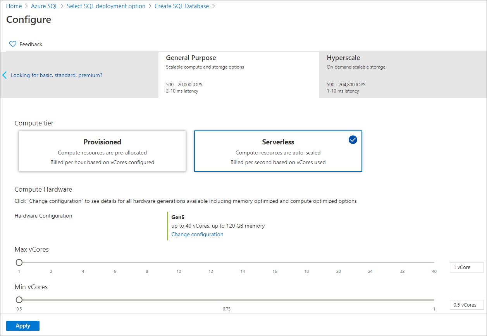
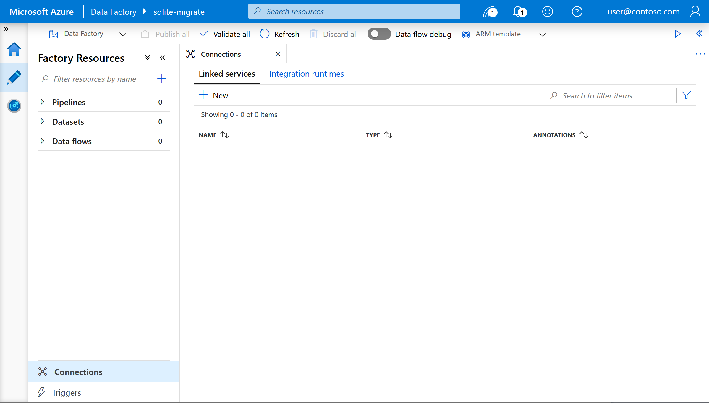
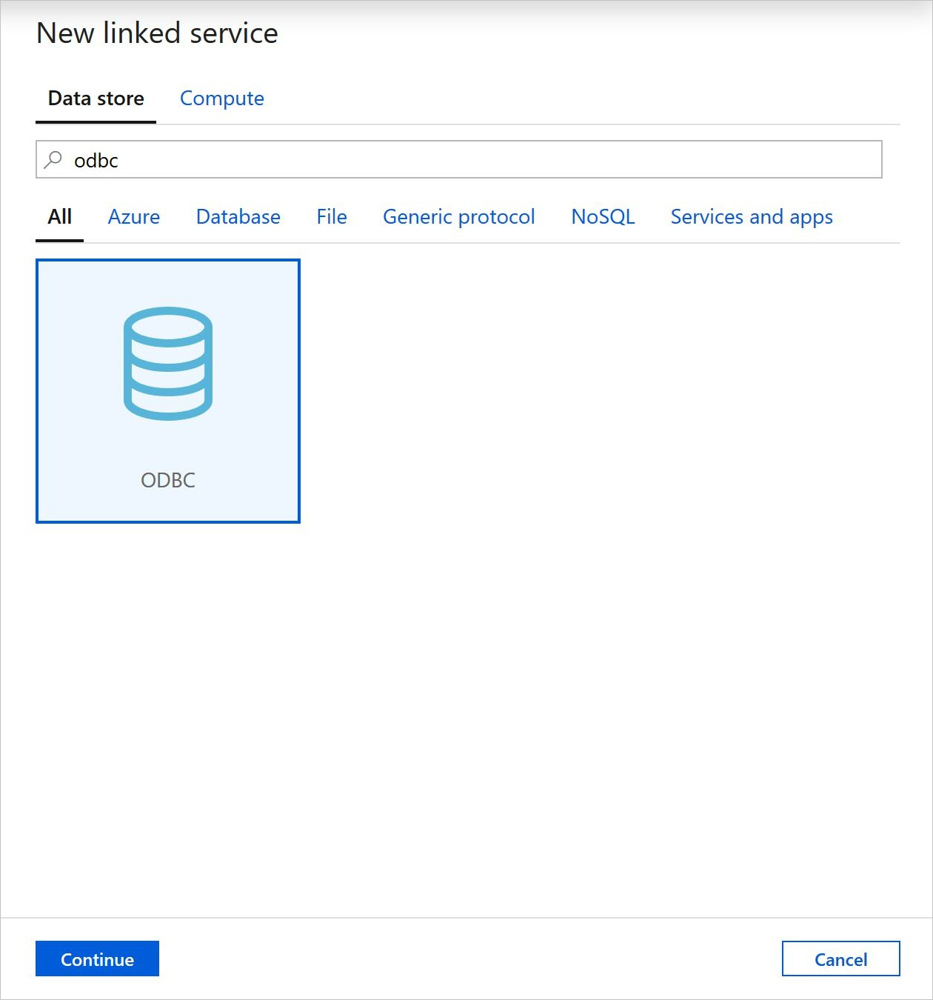
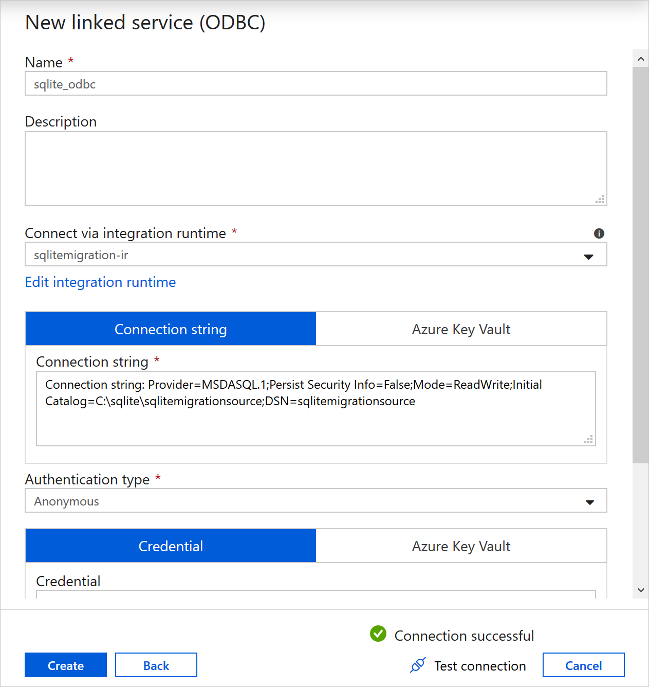
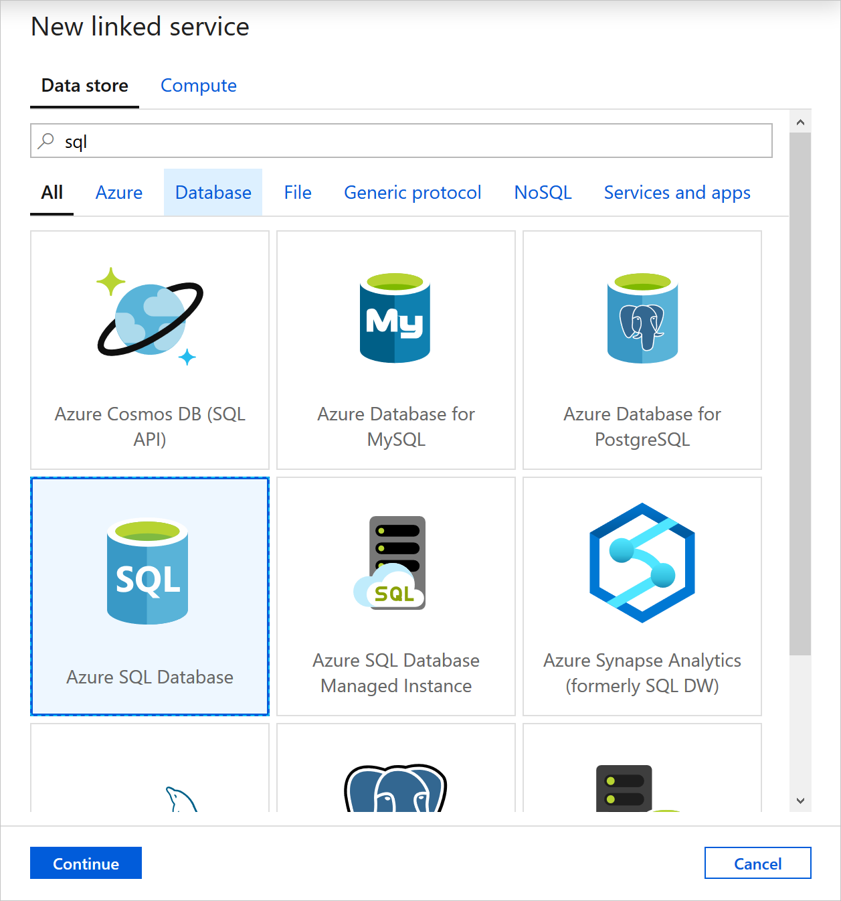
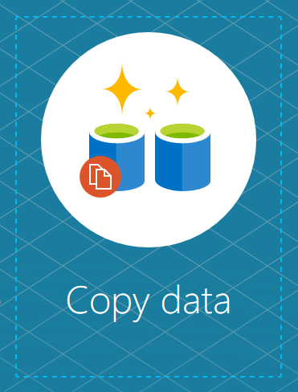

# How to migrate your SQLite database to Azure SQL Database serverless
[!INCLUDE[appliesto-sqldb](../includes/appliesto-sqldb.md)]

For many people, SQLite provides their first experience of databases and SQL programming. It's inclusion in many operating systems and popular applications makes SQLite one the most widely deployed and used database engines in the world. And because it is likely the first database engine many people use, it can often end up as a central part of projects or applications. In such cases where the project or application outgrows the initial SQLite implementation, developers may need to migrate their data to a reliable, centralized data store.

Azure SQL Database Serverless is a compute tier for single databases that automatically scales compute based on workload demand, and bills for the amount of compute used per second. The serverless compute tier also automatically pauses databases during inactive periods when only storage is billed and automatically resumes databases when activity returns.

Once you have followed the below steps, your database will be migrated into Azure SQL Database Serverless, enabling you to make your database available to other users or applications in the cloud and only pay for what you use, with minimal application code changes.

## Prerequisites

- An Azure Subscription
- SQLite2 or SQLite3 database that you wish to migrate
- A Windows environment
  - If you do not have a local Windows environment, you can use a Windows VM in Azure for the migration. Move and make your SQLite database file available on the VM using Azure Files and Storage Explorer.

## Steps

1. Provision a new Azure SQL Database in the Serverless compute tier.

    

2. Ensure you have your SQLite database file available in your Windows environment. Install a SQLite ODBC Driver if you do not already have one (there are many available in Open Source, for example, http://www.ch-werner.de/sqliteodbc/).

3. Create a System DSN for the database. Ensure you use the Data Source Administrator application that matches your system architecture (32-bit vs 64-bit). You can find which version you are running in your system settings.

    - Open ODBC Data Source Administrator in your environment.
    - Click the system DSN tab and click "Add"
    - Select the SQLite ODBC connector you installed and give the connection a meaningful name, for example, sqlitemigrationsource
    - Set the database name to the .db file
    - Save and exit

4. Download and install the self-hosted integration runtime. The easiest way to do this is the Express install option, as detailed in the documentation. If you opt for a manual install, you will need to provide the application with an authentication key, which can be located in your Data Factory instance by:

    - Starting up ADF (Author and Monitor from the service in the Azure portal)
    - Click the "Author" tab (Blue pencil) on the left
    - Click Connections (bottom left), then Integration runtimes
    - Add new Self-Hosted Integration Runtime, give it a name, select *Option 2*.

5. Create a new linked service for the source SQLite database in your Data Factory.

    

6. In **Connections**, under **Linked Service**, click **New**.

7. Search for and select the "ODBC" connector

   

8. Give the linked service a meaningful name, for example, "sqlite_odbc". Select your integration runtime from the "Connect via integration runtime" dropdown. Enter the below into the connection string, replacing the Initial Catalog variable with the filepath for the .db file, and the DSN with the name of the system DSN connection:

   ```
   Connection string: Provider=MSDASQL.1;Persist Security Info=False;Mode=ReadWrite;Initial Catalog=C:\sqlitemigrationsource.db;DSN=sqlitemigrationsource
    ```

9. Set the authentication type to Anonymous

10. Test the connection

    

11. Create another linked service for your Serverless SQL target. Select the database using the linked service wizard, and provide the SQL authentication credentials.

    

12. Extract the CREATE TABLE statements from your SQLite database. You can do this by executing the below Python script on your database file.

    ```
    #!/usr/bin/python
    import sqlite3
    conn = sqlite3.connect("sqlitemigrationsource.db")
    c = conn.cursor()

    print("Starting extract job..")
    with open('CreateTables.sql', 'w') as f:
        for tabledetails in c.execute("SELECT * FROM sqlite_master WHERE type='table'"):
            print("Extracting CREATE statement for " + (str(tabledetails[1])))
            print(tabledetails)
            f.write(str(tabledetails[4].replace('\n','') + ';\n'))
    c.close()
    ```

13. Create the landing tables in your Serverless SQL target environment by copying the CREATE table statements from the CreateTables.sql file and running the SQL statements in the Query Editor in the Azure portal.

14. Return to the home screen of your Data Factory and click "Copy Data" to run through the job creation wizard.

    

15. Select all tables from the source SQLite database using the check boxes, and map them to the target tables in Azure SQL. Once the job has run, you have successfully migrated your data from SQLite to Azure SQL!

## Next steps

- To get started, see [Quickstart: Create a single database in Azure SQL Database using the Azure portal](single-database-create-quickstart.md).
- For resource limits, see [Serverless compute tier resource limits](../../sql-database/sql-database-vcore-resource-limits-single-databases.md#general-purpose---serverless-compute---gen5).
