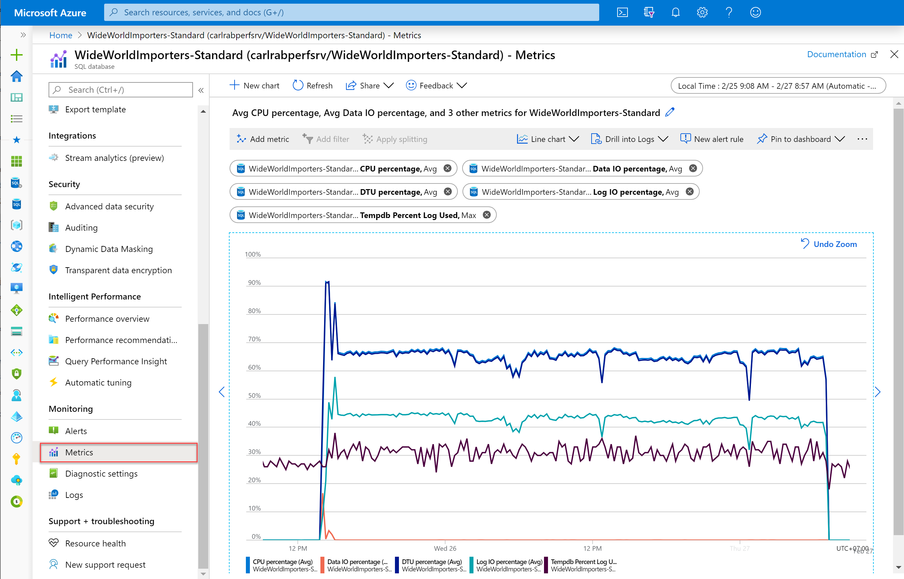

# Monitoring and performance tuning in Azure SQL Database and Azure SQL Managed Instance
[!INCLUDE[appliesto-sqldb-sqlmi](../includes/appliesto-sqldb-sqlmi.md)]

To monitor the performance of a database in Azure SQL Database and Azure SQL Managed Instance, start by monitoring the CPU and IO resources used by your workload relative to the level of database performance you chose in selecting a particular service tier and performance level. To accomplish this, Azure SQL Database and Azure SQL Managed Instance emit resource metrics that can be viewed in the Azure portal or by using one of these SQL Server management tools: [Azure Data Studio](https://docs.microsoft.com/sql/azure-data-studio/what-is) or [SQL Server Management Studio](https://docs.microsoft.com/sql/ssms/sql-server-management-studio-ssms) (SSMS).

Azure SQL Database provides a number of Database Advisors to provide intelligent performance tuning recommendations and automatic tuning options to improve performance. Additionally, Query Performance Insight shows you details about the queries responsible for the most CPU and IO usage for single and pooled databases.

Azure SQL Database and Azure SQL Managed Instance provide advanced monitoring and tuning capabilities backed by artificial intelligence to assist you in troubleshooting and maximizing the performance of your databases and solutions. You can choose to configure the [streaming export](metrics-diagnostic-telemetry-logging-streaming-export-configure.md) of these [Intelligent Insights](intelligent-insights-overview.md) and other database resource logs and metrics to one of several destinations for consumption and analysis, particularly using [SQL Analytics](../../azure-monitor/insights/azure-sql.md)). Azure SQL Analytics is an advanced cloud monitoring solution for monitoring performance of all of your databases at scale and across multiple subscriptions in a single view. For a list of the logs and metrics that you can export, see [diagnostic telemetry for export](metrics-diagnostic-telemetry-logging-streaming-export-configure.md#diagnostic-telemetry-for-export)

Finally, SQL Server has its own monitoring and diagnostic capabilities that SQL Database and SQL Managed Instance leverage, such as [query store](https://docs.microsoft.com/sql/relational-databases/performance/monitoring-performance-by-using-the-query-store) and [dynamic management views (DMVs)](https://docs.microsoft.com/sql/relational-databases/system-dynamic-management-views/system-dynamic-management-views). See [Monitoring using DMVs](monitoring-with-dmvs.md) for scripts to monitor for a variety of performance issues.

## Monitoring and tuning capabilities in the Azure portal

In the Azure portal, Azure SQL Database and Azure SQL Managed Instance provide monitoring of resource metrics. Additionally, Azure SQL Database provides database advisors and Query Performance Insight provides query tuning recommendations and query performance analysis. Finally, in the Azure portal, you can enable automatic for [logical SQL servers](logical-servers.md) and their single and pooled databases.

### Azure SQL Database and Azure SQL Managed Instance resource monitoring

You can quickly monitor a variety of resource metrics in the Azure portal in the **Metrics** view. These metrics enable you to see if a database is reaching 100% of processor, memory, or IO resources. High DTU or processor percentage, as well as high IO percentage, indicates that your workload might need more CPU or IO resources. It might also indicate queries that need to be optimized.

  

### Database advisors in Azure SQL Database

Azure SQL Database includes [database advisors](database-advisor-implement-performance-recommendations.md) that provide performance tuning recommendations for single and pooled databases. These recommendations are available in the Azure portal as well as by using [PowerShell](https://docs.microsoft.com/powershell/module/az.sql/get-azsqldatabaseadvisor). You can also enable [automatic tuning](automatic-tuning-overview.md) so that Azure SQL Database can automatically implement these tuning recommendations.

### Query Performance Insight in Azure SQL Database

[Query Performance Insight](query-performance-insight-use.md) shows the performance in the Azure portal of top consuming and longest running queries for single and pooled databases.

## Generate intelligent assessments of performance issues

[Intelligent Insights](intelligent-insights-overview.md) for Azure SQL Database and Azure SQL Managed Instance uses built-in intelligence to continuously monitor database usage through artificial intelligence and detect disruptive events that cause poor performance. Intelligent Insights automatically detects performance issues with databases based on query execution wait times, errors, or time-outs. Once detected, a detailed analysis is performed that generates a resource log (called SQLInsights) with an [intelligent assessment of the issues](intelligent-insights-troubleshoot-performance.md). This assessment consists of a root cause analysis of the database performance issue and, where possible, recommendations for performance improvements.

Intelligent Insights is a unique capability of Azure built-in intelligence that provides the following value:

- Proactive monitoring
- Tailored performance insights
- Early detection of database performance degradation
- Root cause analysis of issues detected
- Performance improvement recommendations
- Scale out capability on hundreds of thousands of databases
- Positive impact to DevOps resources and the total cost of ownership

## Enable the streaming export of metrics and resource logs

You can enable and configure the [streaming export of diagnostic telemetry](metrics-diagnostic-telemetry-logging-streaming-export-configure.md) to one of several destinations, including the Intelligent Insights resource log. Use [SQL Analytics](../../azure-monitor/insights/azure-sql.md) and other capabilities to consume this additional diagnostic telemetry to identify and resolve performance problems.

You configure diagnostic settings to stream categories of metrics and resource logs for single databases, pooled databases, elastic pools, managed instances, and instance databases to one of the following Azure resources.

### Log Analytics workspace in Azure Monitor

You can stream metrics and resource logs to a [Log Analytics workspace in Azure Monitor](../../azure-monitor/platform/resource-logs-collect-workspace.md). Data streamed here can be consumed by [SQL Analytics](../../azure-monitor/insights/azure-sql.md), which is a cloud only monitoring solution that provides intelligent monitoring of your databases that includes performance reports, alerts, and mitigation recommendations. Data streamed to a Log Analytics workspace can be analyzed with other monitoring data collected and also enables you to leverage other Azure Monitor features such as alerts and visualizations.

### Azure Event Hubs

You can stream metrics and resource logs to [Azure Event Hubs](../../azure-monitor/platform/resource-logs-stream-event-hubs.md). Streaming diagnostic telemetry to event hubs to provide the following functionality:

- **Stream logs to third-party logging and telemetry systems**

  Stream all of your metrics and resource logs to a single event hub to pipe log data to a third-party SIEM or log analytics tool.
- **Build a custom telemetry and logging platform**

  The highly scalable publish-subscribe nature of event hubs allows you to flexibly ingest metrics and resource logs into a custom telemetry platform. See [Designing and Sizing a Global Scale Telemetry Platform on Azure Event Hubs](https://azure.microsoft.com/documentation/videos/build-2015-designing-and-sizing-a-global-scale-telemetry-platform-on-azure-event-Hubs/) for details.
- **View service health by streaming data to Power BI**

  Use Event Hubs, Stream Analytics, and Power BI to transform your diagnostics data into near real-time insights on your Azure services. See [Stream Analytics and Power BI: A real-time analytics dashboard for streaming data](https://docs.microsoft.com/azure/stream-analytics/stream-analytics-power-bi-dashboard) for details on this solution.

### Azure Storage

Stream metrics and resource logs to [Azure Storage](../../azure-monitor/platform/resource-logs-collect-storage.md). Use Azure storage to archive vast amounts of diagnostic telemetry for a fraction of the cost of the previous two streaming options.

## Use extended events 

Additionally, you can use [extended events](https://docs.microsoft.com/sql/relational-databases/extended-events/extended-events) in SQL Server for advanced monitoring and troubleshooting. The extended events architecture enables users to collect as much or as little data as is necessary to troubleshoot or identify a performance problem. For information about using extended events in Azure SQL Database, see [Extended events in Azure SQL Database](xevent-db-diff-from-svr.md).

## Next steps

- For more information about intelligent performance recommendations for single and pooled databases, see [Database advisor performance recommendations](database-advisor-implement-performance-recommendations.md).
- For more information about automatically monitoring database performance with automated diagnostics and root cause analysis of performance issues, see [Azure SQL Intelligent Insights](intelligent-insights-overview.md).
