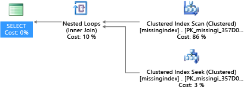
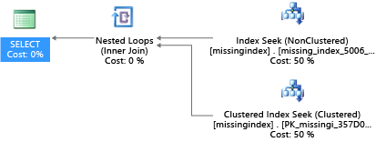
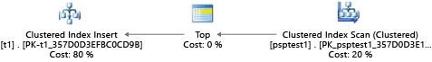
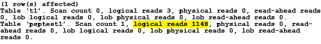
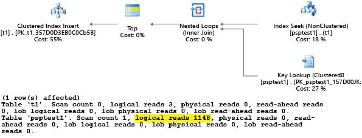
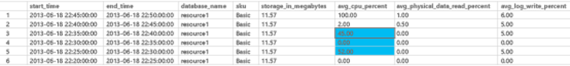

# Tune applications and databases for performance in Azure SQL Database and Azure SQL Managed Instance
[!INCLUDE[appliesto-sqldb-sqlmi](../includes/appliesto-sqldb-sqlmi.md)]

Once you have identified a performance issue that you are facing with Azure SQL Database and Azure SQL Managed Instance, this article is designed to help you:

- Tune your application and apply some best practices that can improve performance.
- Tune the database by changing indexes and queries to more efficiently work with data.

This article assumes that you have already worked through the Azure SQL Database [database advisor recommendations](database-advisor-implement-performance-recommendations.md) and the Azure SQL Database [auto-tuning recommendations](automatic-tuning-overview.md), if applicable. It also assumes that you have reviewed [An overview of monitoring and tuning](monitor-tune-overview.md) and its related articles related to troubleshooting performance issues. Additionally, this article assumes that you do not have a CPU resources, running-related performance issue that can be resolved by increasing the compute size or service tier to provide more resources to your database.

## Tune your application

In traditional on-premises SQL Server, the process of initial capacity planning often is separated from the process of running an application in production. Hardware and product licenses are purchased first, and performance tuning is done afterward. When you use Azure SQL, it's a good idea to interweave the process of running an application and tuning it. With the model of paying for capacity on demand, you can tune your application to use the minimum resources needed now, instead of over-provisioning on hardware based on guesses of future growth plans for an application, which often are incorrect. Some customers might choose not to tune an application, and instead choose to over-provision hardware resources. This approach might be a good idea if you don't want to change a key application during a busy period. But, tuning an application can minimize resource requirements and lower monthly bills when you use the service tiers in Azure SQL Database and Azure SQL Managed Instance.

### Application characteristics

Although Azure SQL Database and Azure SQL Managed Instance service tiers are designed to improve performance stability and predictability for an application, some best practices can help you tune your application to better take advantage of the resources at a compute size. Although many applications have significant performance gains simply by switching to a higher compute size or service tier, some applications need additional tuning to benefit from a higher level of service. For increased performance, consider additional application tuning for applications that have these characteristics:

- **Applications that have slow performance because of "chatty" behavior**

  Chatty applications make excessive data access operations that are sensitive to network latency. You might need to modify these kinds of applications to reduce the number of data access operations to the database. For example, you might improve application performance by using techniques like batching ad hoc queries or moving the queries to stored procedures. For more information, see [Batch queries](#batch-queries).

- **Databases with an intensive workload that can't be supported by an entire single machine**

   Databases that exceed the resources of the highest Premium compute size might benefit from scaling out the workload. For more information, see [Cross-database sharding](#cross-database-sharding) and [Functional partitioning](#functional-partitioning).

- **Applications that have sub-optimal queries**

  Applications, especially those in the data access layer, that have poorly tuned queries might not benefit from a higher compute size. This includes queries that lack a WHERE clause, have missing indexes, or have outdated statistics. These applications benefit from standard query performance-tuning techniques. For more information, see [Missing indexes](#identifying-and-adding-missing-indexes) and [Query tuning and hinting](#query-tuning-and-hinting).

- **Applications that have sub-optimal data access design**

   Applications that have inherent data access concurrency issues, for example deadlocking, might not benefit from a higher compute size. Consider reducing round trips against the database by caching data on the client side with the Azure Caching service or another caching technology. See [Application tier caching](#application-tier-caching).

## Tune your database

In this section, we look at some techniques that you can use to tune database to gain the best performance for your application and run it at the lowest possible compute size. Some of these techniques match traditional SQL Server tuning best practices, but others are specific to Azure SQL Database and Azure SQL Managed Instance. In some cases, you can examine the consumed resources for a database to find areas to further tune and extend traditional SQL Server techniques to work in Azure SQL Database and Azure SQL Managed Instance.

### Identifying and adding missing indexes

A common problem in OLTP database performance relates to the physical database design. Often, database schemas are designed and shipped without testing at scale (either in load or in data volume). Unfortunately, the performance of a query plan might be acceptable on a small scale but degrade substantially under production-level data volumes. The most common source of this issue is the lack of appropriate indexes to satisfy filters or other restrictions in a query. Often, missing indexes manifests as a table scan when an index seek could suffice.

In this example, the selected query plan uses a scan when a seek would suffice:

```sql
DROP TABLE dbo.missingindex;
CREATE TABLE dbo.missingindex (col1 INT IDENTITY PRIMARY KEY, col2 INT);
DECLARE @a int = 0;
SET NOCOUNT ON;
BEGIN TRANSACTION
    WHILE @a < 20000
    BEGIN
        INSERT INTO dbo.missingindex(col2) VALUES (@a);
        SET @a += 1;
    END
    COMMIT TRANSACTION;
    GO
SELECT m1.col1
    FROM dbo.missingindex m1 INNER JOIN dbo.missingindex m2 ON(m1.col1=m2.col1)
    WHERE m1.col2 = 4;
```



Azure SQL Database and Azure SQL Managed Instance can help you find and fix common missing index conditions. DMVs that are built into Azure SQL Database and Azure SQL Managed Instance look at query compilations in which an index would significantly reduce the estimated cost to run a query. During query execution, the database engine tracks how often each query plan is executed, and tracks the estimated gap between the executing query plan and the imagined one where that index existed. You can use these DMVs to quickly guess which changes to your physical database design might improve overall workload cost for a database and its real workload.

You can use this query to evaluate potential missing indexes:

```sql
SELECT
   CONVERT (varchar, getdate(), 126) AS runtime
   , mig.index_group_handle
   , mid.index_handle
   , CONVERT (decimal (28,1), migs.avg_total_user_cost * migs.avg_user_impact *
        (migs.user_seeks + migs.user_scans)) AS improvement_measure
   , 'CREATE INDEX missing_index_' + CONVERT (varchar, mig.index_group_handle) + '_' +
        CONVERT (varchar, mid.index_handle) + ' ON ' + mid.statement + '
        (' + ISNULL (mid.equality_columns,'')
        + CASE WHEN mid.equality_columns IS NOT NULL
        AND mid.inequality_columns IS NOT NULL
        THEN ',' ELSE '' END + ISNULL (mid.inequality_columns, '') + ')'
        + ISNULL (' INCLUDE (' + mid.included_columns + ')', '') AS create_index_statement
   , migs.*
   , mid.database_id
   , mid.[object_id]
FROM sys.dm_db_missing_index_groups AS mig
   INNER JOIN sys.dm_db_missing_index_group_stats AS migs
      ON migs.group_handle = mig.index_group_handle
   INNER JOIN sys.dm_db_missing_index_details AS mid
      ON mig.index_handle = mid.index_handle
 ORDER BY migs.avg_total_user_cost * migs.avg_user_impact * (migs.user_seeks + migs.user_scans) DESC
```

In this example, the query resulted in this suggestion:

```sql
CREATE INDEX missing_index_5006_5005 ON [dbo].[missingindex] ([col2])  
```

After it's created, that same SELECT statement picks a different plan, which uses a seek instead of a scan, and then executes the plan more efficiently:



The key insight is that the IO capacity of a shared, commodity system is more limited than that of a dedicated server machine. There's a premium on minimizing unnecessary IO to take maximum advantage of the system in the resources of each compute size of the service tiers. Appropriate physical database design choices can significantly improve the latency for individual queries, improve the throughput of concurrent requests handled per scale unit, and minimize the costs required to satisfy the query. For more information about the missing index DMVs, see [sys.dm_db_missing_index_details](https://msdn.microsoft.com/library/ms345434.aspx).

### Query tuning and hinting

The query optimizer in Azure SQL Database and Azure SQL Managed Instance is similar to the traditional SQL Server query optimizer. Most of the best practices for tuning queries and understanding the reasoning model limitations for the query optimizer also apply to Azure SQL Database and Azure SQL Managed Instance. If you tune queries in Azure SQL Database and Azure SQL Managed Instance, you might get the additional benefit of reducing aggregate resource demands. Your application might be able to run at a lower cost than an un-tuned equivalent because it can run at a lower compute size.

An example that is common in SQL Server and which also applies to Azure SQL Database and Azure SQL Managed Instance is how the query optimizer "sniffs" parameters. During compilation, the query optimizer evaluates the current value of a parameter to determine whether it can generate a more optimal query plan. Although this strategy often can lead to a query plan that is significantly faster than a plan compiled without known parameter values, currently it works imperfectly both in SQL Server, in Azure SQL Database, and Azure SQL Managed Instance. Sometimes the parameter is not sniffed, and sometimes the parameter is sniffed but the generated plan is sub-optimal for the full set of parameter values in a workload. Microsoft includes query hints (directives) so that you can specify intent more deliberately and override the default behavior of parameter sniffing. Often, if you use hints, you can fix cases in which the default SQL Server, Azure SQL Database, and Azure SQL Managed Instance behavior is imperfect for a specific customer workload.

The next example demonstrates how the query processor can generate a plan that is sub-optimal both for performance and resource requirements. This example also shows that if you use a query hint, you can reduce query run time and resource requirements for your database:

```sql
DROP TABLE psptest1;
CREATE TABLE psptest1(col1 int primary key identity, col2 int, col3 binary(200));
DECLARE @a int = 0;
SET NOCOUNT ON;
BEGIN TRANSACTION
   WHILE @a < 20000
   BEGIN
     INSERT INTO psptest1(col2) values (1);
     INSERT INTO psptest1(col2) values (@a);
     SET @a += 1;
   END
   COMMIT TRANSACTION
   CREATE INDEX i1 on psptest1(col2);
GO

CREATE PROCEDURE psp1 (@param1 int)
   AS
   BEGIN
      INSERT INTO t1 SELECT * FROM psptest1
      WHERE col2 = @param1
      ORDER BY col2;
    END
    GO

CREATE PROCEDURE psp2 (@param2 int)
   AS
   BEGIN
      INSERT INTO t1 SELECT * FROM psptest1 WHERE col2 = @param2
      ORDER BY col2
      OPTION (OPTIMIZE FOR (@param2 UNKNOWN))
   END
   GO

CREATE TABLE t1 (col1 int primary key, col2 int, col3 binary(200));
GO
```

The setup code creates a table that has skewed data distribution. The optimal query plan differs based on which parameter is selected. Unfortunately, the plan caching behavior doesn't always recompile the query based on the most common parameter value. So, it's possible for a sub-optimal plan to be cached and used for many values, even when a different plan might be a better plan choice on average. Then the query plan creates two stored procedures that are identical, except that one has a special query hint.

```sql
-- Prime Procedure Cache with scan plan
EXEC psp1 @param1=1;
TRUNCATE TABLE t1;

-- Iterate multiple times to show the performance difference
DECLARE @i int = 0;
WHILE @i < 1000
   BEGIN
      EXEC psp1 @param1=2;
      TRUNCATE TABLE t1;
      SET @i += 1;
    END
```

We recommend that you wait at least 10 minutes before you begin part 2 of the example, so that the results are distinct in the resulting telemetry data.

```sql
EXEC psp2 @param2=1;
TRUNCATE TABLE t1;

DECLARE @i int = 0;
    WHILE @i < 1000
    BEGIN
        EXEC psp2 @param2=2;
        TRUNCATE TABLE t1;
        SET @i += 1;
    END
```

Each part of this example attempts to run a parameterized insert statement 1,000 times (to generate a sufficient load to use as a test data set). When it executes stored procedures, the query processor examines the parameter value that is passed to the procedure during its first compilation (parameter "sniffing"). The processor caches the resulting plan and uses it for later invocations, even if the parameter value is different. The optimal plan might not be used in all cases. Sometimes you need to guide the optimizer to pick a plan that is better for the average case rather than the specific case from when the query was first compiled. In this example, the initial plan generates a "scan" plan that reads all rows to find each value that matches the parameter:



Because we executed the procedure by using the value 1, the resulting plan was optimal for the value 1 but was sub-optimal for all other values in the table. The result likely isn't what you would want if you were to pick each plan randomly, because the plan performs more slowly and uses more resources.

If you run the test with `SET STATISTICS IO` set to `ON`, the logical scan work in this example is done behind the scenes. You can see that there are 1,148 reads done by the plan (which is inefficient, if the average case is to return just one row):



The second part of the example uses a query hint to tell the optimizer to use a specific value during the compilation process. In this case, it forces the query processor to ignore the value that is passed as the parameter, and instead to assume `UNKNOWN`. This refers to a value that has the average frequency in the table (ignoring skew). The resulting plan is a seek-based plan that is faster and uses fewer resources, on average, than the plan in part 1 of this example:



You can see the effect in the **sys.resource_stats** table (there is a delay from the time that you execute the test and when the data populates the table). For this example, part 1 executed during the 22:25:00 time window, and part 2 executed at 22:35:00. The earlier time window used more resources in that time window than the later one (because of plan efficiency improvements).

```sql
SELECT TOP 1000 *
FROM sys.resource_stats
WHERE database_name = 'resource1'
ORDER BY start_time DESC
```



> [!NOTE]
> Although the volume in this example is intentionally small, the effect of sub-optimal parameters can be substantial, especially on larger databases. The difference, in extreme cases, can be between seconds for fast cases and hours for slow cases.

You can examine **sys.resource_stats** to determine whether the resource for a test uses more or fewer resources than another test. When you compare data, separate the timing of tests so that they are not in the same 5-minute window in the **sys.resource_stats** view. The goal of the exercise is to minimize the total amount of resources used, and not to minimize the peak resources. Generally, optimizing a piece of code for latency also reduces resource consumption. Make sure that the changes you make to an application are necessary, and that the changes don't negatively affect the customer experience for someone who might be using query hints in the application.

If a workload has a set of repeating queries, often it makes sense to capture and validate the optimality of your plan choices because it drives the minimum resource size unit required to host the database. After you validate it, occasionally reexamine the plans to help you make sure that they have not degraded. You can learn more about [query hints (Transact-SQL)](https://msdn.microsoft.com/library/ms181714.aspx).

### Very large database architectures

Before the release of [Hyperscale](service-tier-hyperscale.md) service tier for single databases in Azure SQL Database, customers used to hit capacity limits for individual databases. These capacity limits still exist for pooled databases in Azure SQL Database elastic pools and instance databases in Azure SQL Managed Instances. The following two sections discuss two options for solving problems with very large databases in Azure SQL Database and Azure SQL Managed Instance when you cannot use the Hyperscale service tier.

### Cross-database sharding

Because Azure SQL Database and Azure SQL Managed Instance runs on commodity hardware, the capacity limits for an individual database are lower than for a traditional on-premises SQL Server installation. Some customers use sharding techniques to spread database operations over multiple databases when the operations don't fit inside the limits of an individual database in Azure SQL Database and Azure SQL Managed Instance. Most customers who use sharding techniques in Azure SQL Database and Azure SQL Managed Instance split their data on a single dimension across multiple databases. For this approach, you need to understand that OLTP applications often perform transactions that apply to only one row or to a small group of rows in the schema.

> [!NOTE]
> Azure SQL Database now provides a library to assist with sharding. For more information, see [Elastic Database client library overview](elastic-database-client-library.md).

For example, if a database has customer name, order, and order details (like the traditional example Northwind database that ships with SQL Server), you could split this data into multiple databases by grouping a customer with the related order and order detail information. You can guarantee that the customer's data stays in an individual database. The application would split different customers across databases, effectively spreading the load across multiple databases. With sharding, customers not only can avoid the maximum database size limit, but Azure SQL Database and Azure SQL Managed Instance also can process workloads that are significantly larger than the limits of the different compute sizes, as long as each individual database fits into its service tier limits.

Although database sharding doesn't reduce the aggregate resource capacity for a solution, it's highly effective at supporting very large solutions that are spread over multiple databases. Each database can run at a different compute size to support very large, "effective" databases with high resource requirements.

#### Functional partitioning

Users often combine many functions in an individual database. For example, if an application has logic to manage inventory for a store, that database might have logic associated with inventory, tracking purchase orders, stored procedures, and indexed or materialized views that manage end-of-month reporting. This technique makes it easier to administer the database for operations like backup, but it also requires you to size the hardware to handle the peak load across all functions of an application.

If you use a scale-out architecture in Azure SQL Database and Azure SQL Managed Instance, it's a good idea to split different functions of an application into different databases. By using this technique, each application scales independently. As an application becomes busier (and the load on the database increases), the administrator can choose independent compute sizes for each function in the application. At the limit, with this architecture, an application can be larger than a single commodity machine can handle because the load is spread across multiple machines.

### Batch queries

For applications that access data by using high-volume, frequent, ad hoc querying, a substantial amount of response time is spent on network communication between the application tier and the database tier. Even when both the application and the database are in the same data center, the network latency between the two might be magnified by a large number of data access operations. To reduce the network round trips for the data access operations, consider using the option to either batch the ad hoc queries, or to compile them as stored procedures. If you batch the ad hoc queries, you can send multiple queries as one large batch in a single trip to the database. If you compile ad hoc queries in a stored procedure, you could achieve the same result as if you batch them. Using a stored procedure also gives you the benefit of increasing the chances of caching the query plans in the database so you can use the stored procedure again.

Some applications are write-intensive. Sometimes you can reduce the total IO load on a database by considering how to batch writes together. Often, this is as simple as using explicit transactions instead of auto-commit transactions in stored procedures and ad hoc batches. For an evaluation of different techniques you can use, see [Batching techniques for database applications in Azure](../performance-improve-use-batching.md). Experiment with your own workload to find the right model for batching. Be sure to understand that a model might have slightly different transactional consistency guarantees. Finding the right workload that minimizes resource use requires finding the right combination of consistency and performance trade-offs.

### Application-tier caching

Some database applications have read-heavy workloads. Caching layers might reduce the load on the database and might potentially reduce the compute size required to support a database by using Azure SQL Database and Azure SQL Managed Instance. With [Azure Cache for Redis](https://azure.microsoft.com/services/cache/), if you have a read-heavy workload, you can read the data once (or perhaps once per application-tier machine, depending on how it is configured), and then store that data outside of your database. This is a way to reduce database load (CPU and read IO), but there is an effect on transactional consistency because the data being read from the cache might be out of sync with the data in the database. Although in many applications some level of inconsistency is acceptable, that's not true for all workloads. You should fully understand any application requirements before you implement an application-tier caching strategy.

## Next steps

- For more information about DTU-based service tiers, see [DTU-based purchasing model](service-tiers-dtu.md).
- For more information about vCore-based service tiers, see [vCore-based purchasing model](service-tiers-vcore.md).
- For more information about elastic pools, see [What is an Azure elastic pool?](elastic-pool-overview.md)
- For information about performance and elastic pools, see [When to consider an elastic pool](elastic-pool-overview.md)
