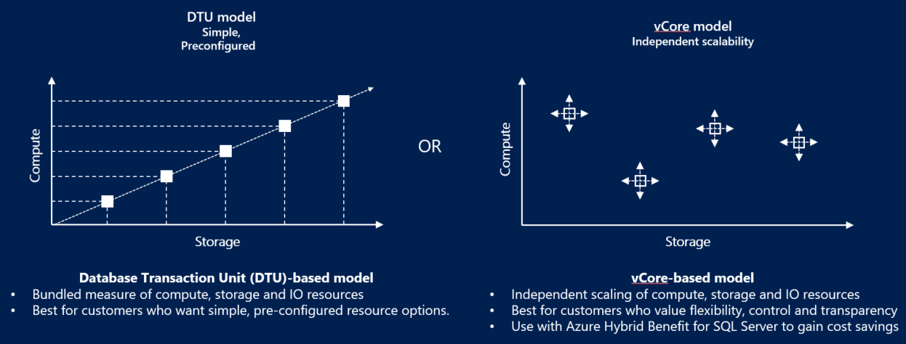

# Compare vCore and DTU purchasing models (Azure SQL Database)
[!INCLUDE[appliesto-sqldb-sqlmi](../includes/appliesto-sqldb.md)]

Azure SQL Database lets you easily purchase a fully managed platform as a service (PaaS) database engine that fits your performance and cost needs. Depending on the deployment model you've chosen for Azure SQL Database, you can select the purchasing model that works for you:

- [Virtual core (vCore)-based purchasing model](service-tiers-sql-database-vcore.md) (recommended). This purchasing model provides a choice between a provisioned compute tier and a serverless compute tier. With the provisioned compute tier, you choose the exact amount of compute resources that are always provisioned for your workload. With the serverless compute tier, you specify the autoscaling of the compute resources over a configurable compute range. With this compute tier, you can also automatically pause and resume the database based on workload activity. The vCore unit price per unit of time is lower in the provisioned compute tier than it is in the serverless compute tier. The [Hyperscale service tier](service-tier-hyperscale.md) is available for single databases that are using the [vCore-based purchasing model](service-tiers-vcore.md).
- [Database transaction unit (DTU)-based purchasing model](service-tiers-dtu.md). This purchasing model provides bundled compute and storage packages balanced for common workloads.

> [!div class="nextstepaction"]
> [Survey to improve Azure SQL!](https://aka.ms/AzureSQLSurveyNov2021) 

## vCore purchasing model

A virtual core (vCore) represents a logical CPU and offers you the option to choose between generations of hardware and the physical characteristics of the hardware (for example, the number of cores, the memory, and the storage size). The vCore-based purchasing model gives you flexibility, control, transparency of individual resource consumption, and a straightforward way to translate on-premises workload requirements to the cloud. This model allows you to choose compute, memory, and storage resources based on your workload needs.

In the vCore-based purchasing model for SQL Database, you can choose between the general purpose and business critical service tiers. Review [service-tiers-sql-database-vcore.md#service-tiers] to learn more.  For single databases, you can also choose the [Hyperscale service tier](service-tier-hyperscale.md).

The vCore-based purchasing model lets you independently choose compute and storage resources, match on-premises performance, and optimize price. In the vCore-based purchasing model, you pay for:

- Compute resources (the service tier + the number of vCores and the amount of memory + the generation of hardware).
- The type and amount of data and log storage.
- Backup storage (RA-GRS).

> [!IMPORTANT]
> Compute resources, I/O, and data and log storage are charged per database or elastic pool. Backup storage is charged per each database.
> **Region limitations:** For the current list of supported regions, see [products available by region](https://azure.microsoft.com/global-infrastructure/services/?products=sql-database&regions=all). 

## DTU purchasing model

The DTU-based purchasing model uses a database transaction unit (DTU) to calculate and bundle compute costs. A database transaction unit (DTU) represents a blended measure of CPU, memory, reads, and writes. The DTU-based purchasing model offers a set of preconfigured bundles of compute resources and included storage to drive different levels of application performance. If you prefer the simplicity of a preconfigured bundle and fixed payments each month, the DTU-based model might be more suitable for your needs.

In the DTU-based purchasing model, you can choose between the basic, standard, and premium service tiers for Azure SQL Database. Review [DTU service tiers](service-tiers-dtu.md#compare-service-tiers) to learn more. 

If your database consumes more than 300 DTUs, converting to the vCore-based purchasing model might reduce your costs. You can convert by using your API of choice or by using the Azure portal, with no downtime. However, conversion isn't required and isn't done automatically. If the DTU-based purchasing model meets your performance and business requirements, you should continue using it.

To convert from the DTU-based purchasing model to the vCore-based purchasing model, see [Migrate from DTU to vCore](migrate-dtu-to-vcore.md).

## Compare models

The following table and chart compare and contrast the vCore-based and the DTU-based purchasing models:

|**Purchasing model**|**Description**|**Best for**|
|---|---|---|
|DTU-based|This model is based on a bundled measure of compute, storage, and I/O resources. Compute sizes are expressed in DTUs for single databases and in elastic database transaction units (eDTUs) for elastic pools. For more information about DTUs and eDTUs, see [What are DTUs and eDTUs?](purchasing-models.md#dtu-based-purchasing-model).|Customers who want simple, preconfigured resource options|
|vCore-based|This model allows you to independently choose compute and storage resources. The vCore-based purchasing model also allows you to use [Azure Hybrid Benefit](https://azure.microsoft.com/pricing/hybrid-benefit/) for SQL Server to save costs.|Customers who value flexibility, control, and transparency|
||||  

Want to optimize and save on your cloud spending?

[!INCLUDE [cost-management-horizontal](../../../includes/cost-management-horizontal.md)]

## Compute costs

Compute costs are calculated differently based on each purchasing model. 

### DTU compute costs

In the DTU purchasing model, DTUs are offered in preconfigured bundles of compute resources and included storage to drive different levels of application performance. You are billed by the number of DTU units you allocate to your application. 

### vCore compute costs 

In the vCore-based purchasing model, the compute cost reflects the total compute capacity that is provisioned for the application. Choose the vCore and memory allocation that suits your business needs, and scale up and down as your workload requires. 

Since three additional replicas are automatically allocated in the business critical service tier, the price is approximately 2.7 times higher than it is in the general purpose service tier. Likewise, the higher storage price per GB in the business critical service tier reflects the higher IO limits and lower latency of the SSD storage.

The vCore purchasing model also offers a serverless option, which calculates compute costs differently. For a description of how compute capacity is defined and costs are calculated for the serverless compute tier, see [SQL Database serverless tier](serverless-tier-overview.md).

## Storage costs

Storage costs are calculated differently based on each purchasing model. 

### DTU storage costs

Since storage is included in the price of the DTU, the price of the DTU reflects the storage costs as is calculated by reads and writes. It's possible to add extra storage in the standard and premium tiers. Long-term backup retention is not included, and is billed separately. 

## vCore storage costs 

Different types of storage are billed differently. For data storage, you're charged for the provisioned storage based upon the maximum database or pool size you select. The cost doesn't change unless you reduce or increase that maximum. Backup storage is associated with automated backups of your instance and is allocated dynamically. Increasing your backup-retention period increases the backup storage that's consumed by your instance.

By default, seven days of automated backups of your databases are copied to a read-access geo-redundant storage (RA-GRS) standard Blob storage account. This storage is used by weekly full backups, daily differential backups, and transaction log backups, which are copied every five minutes. The size of the transaction logs depends on the rate of change of the database. A minimum storage amount equal to 100 percent of the database size is provided at no extra charge. Additional consumption of backup storage is charged in GB per month.

The cost of backup storage is the same for the business critical service tier and the general purpose service tier because both tiers use standard storage for backups.

For more information about storage prices, see the [pricing](https://azure.microsoft.com/pricing/details/sql-database/single/) page.

## Frequently asked questions (FAQs)

### Do I need to take my application offline to convert from a DTU-based service tier to a vCore-based service tier?

No. You don't need to take the application offline. The new service tiers offer a simple online-conversion method that's similar to the existing process of upgrading databases from the standard to the premium service tier and the other way around. You can start this conversion by using the Azure portal, PowerShell, the Azure CLI, T-SQL, or the REST API. See [Manage single databases](single-database-scale.md) and [Manage elastic pools](elastic-pool-overview.md).

### Can I convert a database from a service tier in the vCore-based purchasing model to a service tier in the DTU-based purchasing model?

Yes, you can easily convert your database to any supported performance objective by using the Azure portal, PowerShell, the Azure CLI, T-SQL, or the REST API. See [Manage single databases](single-database-scale.md) and [Manage elastic pools](elastic-pool-overview.md).

## Next steps

- For more information about the vCore-based purchasing model, see [vCore-based purchasing model](service-tiers-vcore.md).
- For more information about the DTU-based purchasing model, see [DTU-based purchasing model](service-tiers-dtu.md).