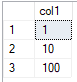

# Quickstart: Create and run simple R scripts in Azure SQL Database Machine Learning Services (preview)
[!INCLUDE[appliesto-sqldb](../includes/appliesto-sqldb.md)]

In this quickstart, you create and run a set of R scripts using Machine Learning Services (with R) in Azure SQL Database.

[!INCLUDE[ml-preview-note](../../../includes/sql-database-ml-preview-note.md)]

## Prerequisites

- An Azure account with an active subscription. [Create an account for free](https://azure.microsoft.com/free/?ref=microsoft.com&utm_source=microsoft.com&utm_medium=docs&utm_campaign=visualstudio).
- A [database in Azure SQL Database](single-database-create-quickstart.md) with a [server-level firewall rule](firewall-create-server-level-portal-quickstart.md)
- [Machine Learning Services](machine-learning-services-overview.md) with R enabled.
- [SQL Server Management Studio](/sql/ssms/sql-server-management-studio-ssms) (SSMS)

This example uses the stored procedure [sp_execute_external_script](/sql/relational-databases/system-stored-procedures/sp-execute-external-script-transact-sql) to wrap a well-formed R script.

## Run a simple script

To run an R script, you'll pass it as an argument to the system stored procedure, [sp_execute_external_script](https://docs.microsoft.com/sql/relational-databases/system-stored-procedures/sp-execute-external-script-transact-sql).

In the following steps, you'll run this example R script in your database:

```r
a <- 1
b <- 2
c <- a/b
d <- a*b
print(c(c, d))
```

1. Open **SQL Server Management Studio** and connect to your database.

   If you need help connecting, see [Quickstart: Use SQL Server Management Studio to connect and query a database in Azure SQL Database](connect-query-ssms.md).

1. Pass the complete R script to the [sp_execute_external_script](https://docs.microsoft.com/sql/relational-databases/system-stored-procedures/sp-execute-external-script-transact-sql) stored procedure.

   The script is passed through the `@script` argument. Everything inside the `@script` argument must be valid R code.

    ```sql
    EXECUTE sp_execute_external_script @language = N'R'
        , @script = N'
    a <- 1
    b <- 2
    c <- a/b
    d <- a*b
    print(c(c, d))
    '
    ```

   If you get any errors, it might be because the public preview of Machine Learning Services (with R) is not enabled for your database. See [Prerequisites](#prerequisites) above.

   > [!NOTE]
   > If you're an administrator, you can run external code automatically. You can grant permission to other users using the command:
   <br>**GRANT EXECUTE ANY EXTERNAL SCRIPT TO** *\<username\>*.

2. The correct result is calculated and the R `print` function returns the result to the **Messages** window.

   It should look something like this.

    **Results**

    ```text
    STDOUT message(s) from external script:
    0.5 2
    ```

## Run a Hello World script

A typical example script is one that just outputs the string "Hello World". Run the following command.

```sql
EXECUTE sp_execute_external_script @language = N'R'
    , @script = N'OutputDataSet<-InputDataSet'
    , @input_data_1 = N'SELECT 1 AS hello'
WITH RESULT SETS(([Hello World] INT));
GO
```

Inputs to this stored procedure include:

| | |
|-|-|
| @language | defines the language extension to call, in this case, R |
| @script | defines the commands passed to the R runtime. Your entire R script must be enclosed in this argument, as Unicode text. You could also add the text to a variable of type **nvarchar** and then call the variable |
| @input_data_1 | data returned by the query, passed to the R runtime, which returns the data as a data frame |
|WITH RESULT SETS | clause defines the schema of the returned data table, adding "Hello World" as the column name, **int** for the data type |

The command outputs the following text:

| Hello World |
|-------------|
| 1 |

## Use inputs and outputs

By default, [sp_execute_external_script](https://docs.microsoft.com/sql/relational-databases/system-stored-procedures/sp-execute-external-script-transact-sql) accepts a single dataset as input, which typically you supply in the form of a valid SQL query. It then returns a single R data frame as output.

For now, let's use the default input and output variables of [sp_execute_external_script](https://docs.microsoft.com/sql/relational-databases/system-stored-procedures/sp-execute-external-script-transact-sql): **InputDataSet** and **OutputDataSet**.

1. Create a small table of test data.

    ```sql
    CREATE TABLE RTestData (col1 INT NOT NULL)
    
    INSERT INTO RTestData
    VALUES (1);
    
    INSERT INTO RTestData
    VALUES (10);
    
    INSERT INTO RTestData
    VALUES (100);
    GO
    ```

1. Use the `SELECT` statement to query the table.
  
    ```sql
    SELECT *
    FROM RTestData
    ```

    **Results**

    

1. Run the following R script. It retrieves the data from the table using the `SELECT` statement, passes it through the R runtime, and returns the data as a data frame. The `WITH RESULT SETS` clause defines the schema of the returned data table for SQL Database, adding the column name *NewColName*.

    ```sql
    EXECUTE sp_execute_external_script @language = N'R'
        , @script = N'OutputDataSet <- InputDataSet;'
        , @input_data_1 = N'SELECT * FROM RTestData;'
    WITH RESULT SETS(([NewColName] INT NOT NULL));
    ```

    **Results**

    

1. Now let's change the names of the input and output variables. The default input and output variable names are **InputDataSet** and **OutputDataSet**, this script changes the names to **SQL_in** and **SQL_out**:

    ```sql
    EXECUTE sp_execute_external_script @language = N'R'
        , @script = N' SQL_out <- SQL_in;'
        , @input_data_1 = N' SELECT 12 as Col;'
        , @input_data_1_name = N'SQL_in'
        , @output_data_1_name = N'SQL_out'
    WITH RESULT SETS(([NewColName] INT NOT NULL));
    ```

    Note that R is case-sensitive. The input and output variables used in the R script (**SQL_out**, **SQL_in**) need to match the values defined with `@input_data_1_name` and `@output_data_1_name`, including case.

   > [!TIP]
   > Only one input dataset can be passed as a parameter, and you can return only one dataset. However, you can call other datasets from inside your R code and you can return outputs of other types in addition to the dataset. You can also add the OUTPUT keyword to any parameter to have it returned with the results.

1. You also can generate values just using the R script with no input data (`@input_data_1` is set to blank).

   The following script outputs the text "hello" and "world".

    ```sql
    EXECUTE sp_execute_external_script @language = N'R'
        , @script = N'
    mytextvariable <- c("hello", " ", "world");
    OutputDataSet <- as.data.frame(mytextvariable);
    '
        , @input_data_1 = N''
    WITH RESULT SETS(([Col1] CHAR(20) NOT NULL));
    ```

    **Results**

    

## Check R version

If you would like to see which version of R is installed in your database, run the following script.

```sql
EXECUTE sp_execute_external_script @language = N'R'
    , @script = N'print(version)';
GO
```

The R `print` function returns the version to the **Messages** window. In the example output below, you can see that SQL Database in this case has R version 3.4.4 installed.

**Results**

```text
STDOUT message(s) from external script:
                   _
platform       x86_64-w64-mingw32
arch           x86_64
os             mingw32
system         x86_64, mingw32
status
major          3
minor          4.4
year           2018
month          03
day            15
svn rev        74408
language       R
version.string R version 3.4.4 (2018-03-15)
nickname       Someone to Lean On
```

## List R packages

Microsoft provides a number of R packages pre-installed with Machine Learning Services in your database.

To see a list of which R packages are installed, including version, dependencies, license, and library path information, run the following script.

```SQL
EXEC sp_execute_external_script @language = N'R'
    , @script = N'
OutputDataSet <- data.frame(installed.packages()[,c("Package", "Version", "Depends", "License", "LibPath")]);'
WITH result sets((
            Package NVARCHAR(255)
            , Version NVARCHAR(100)
            , Depends NVARCHAR(4000)
            , License NVARCHAR(1000)
            , LibPath NVARCHAR(2000)
            ));
```

The output is from `installed.packages()` in R and is returned as a result set.

**Results**


## Next steps

To create a machine learning model using R in SQL Database, follow this quickstart:

> [!div class="nextstepaction"]
> [Create and train a predictive model in R with Azure SQL Database Machine Learning Services (preview)](r-train-score-model-create-quickstart.md)

For more information on Azure SQL Database Machine Learning Services with R (preview), see the following articles.

- [Azure SQL Database Machine Learning Services with R (preview)](machine-learning-services-overview.md)
- [Write advanced R functions in Azure SQL Database using Machine Learning Services (preview)](machine-learning-services-functions.md)
- [Work with R and SQL data in Azure SQL Database Machine Learning Services (preview)](machine-learning-services-data-issues.md)
