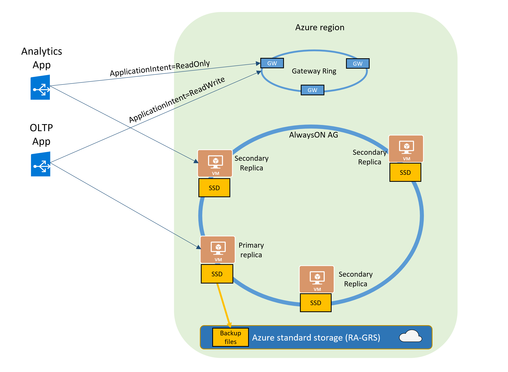

# Use read-only replicas to load-balance read-only query workloads
[!INCLUDE[appliesto-sqldb-sqlmi](../includes/appliesto-sqldb-sqlmi.md)]

[!INCLUDE [updated-for-az](../../../includes/updated-for-az.md)]

As part of the [High Availability architecture](high-availability-sla.md#premium-and-business-critical-service-tier-availability), each database in the Premium and Business Critical service tiers is automatically provisioned with a primary replica and several secondary replicas. The secondary replicas are provisioned with the same compute size as the primary replica. The *read scale-out* feature allows you to load-balance SQL Database read-only workloads using the capacity of one of the read-only replicas instead of sharing the read-write replica. This way the read-only workload will be isolated from the main read-write workload and won't affect its performance. The feature is intended for the applications that include logically separated read-only workloads, such as analytics. In the Premium and Business Critical service tiers, applications could gain performance benefits using this additional capacity at no extra cost.

The read scale-out feature is also available in the Hyperscale service tier when at least one secondary replica is created. Multiple secondary replicas can be used if read-only workloads require more resources than are available on one secondary replica. The High Availability architecture of Basic, Standard, and General Purpose service tiers doesn't include any replicas. The read scale-out feature is not available in these service tiers.

The following diagram illustrates it using a Business Critical database.



The read scale-out feature is enabled by default on new Premium,  Business Critical, and Hyperscale databases. For Hyperscale, one secondary replica is created by default for new databases. If your SQL connection string is configured with `ApplicationIntent=ReadOnly`, the application will be redirected by the gateway to a read-only replica of that database. For information about how to use the `ApplicationIntent` property, see [Specifying application intent](https://docs.microsoft.com/sql/relational-databases/native-client/features/sql-server-native-client-support-for-high-availability-disaster-recovery#specifying-application-intent).

If you wish to ensure that the application connects to the primary replica regardless of the `ApplicationIntent` setting in the SQL connection string, you must explicitly disable read scale-out when creating the database or when altering its configuration. For example, if you upgrade your database from Standard or General Purpose tier to Premium, Business Critical, or Hyperscale tier and want to make sure all your connections continue to go to the primary replica, disable read scale-out. For details about how to disable it, see [Enable and disable read scale-out](#enable-and-disable-read-scale-out).

> [!NOTE]
> Query Data Store, Extended Events, and SQL Profiler features are not supported on the read-only replicas.

## Data consistency

One of the benefits of replicas is that the replicas are always in the transactionally consistent state, but at different points in time there may be some small latency between different replicas. Read scale-out supports session-level consistency. It means, if the read-only session reconnects after a connection error caused by replica unavailability, it may be redirected to a replica that is not 100% up to date with the read-write replica. Likewise, if an application writes data using a read-write session and immediately reads it using a read-only session, it's possible that the latest updates aren't immediately visible on the replica. The latency is caused by an asynchronous transaction log redo operation.

> [!NOTE]
> Replication latencies within the region are low, and this situation is rare.

## Connect to a read-only replica

When you enable read scale-out for a database, the `ApplicationIntent` option in the connection string provided by the client dictates whether the connection is routed to the write replica or to a read-only replica. Specifically, if the `ApplicationIntent` value is `ReadWrite` (the default value), the connection will be directed to the database's read-write replica. This is identical to existing behavior. If the `ApplicationIntent` value is `ReadOnly`, the connection is routed to a read-only replica.

For example, the following connection string connects the client to a read-only replica (replacing the items in the angle brackets with the correct values for your environment and dropping the angle brackets):

```sql
Server=tcp:<server>.database.windows.net;Database=<mydatabase>;ApplicationIntent=ReadOnly;User ID=<myLogin>;Password=<myPassword>;Trusted_Connection=False; Encrypt=True;
```

Either of the following connection strings connects the client to a read-write replica (replacing the items in the angle brackets with the correct values for your environment and dropping the angle brackets):

```sql
Server=tcp:<server>.database.windows.net;Database=<mydatabase>;ApplicationIntent=ReadWrite;User ID=<myLogin>;Password=<myPassword>;Trusted_Connection=False; Encrypt=True;

Server=tcp:<server>.database.windows.net;Database=<mydatabase>;User ID=<myLogin>;Password=<myPassword>;Trusted_Connection=False; Encrypt=True;
```

## Verify that a connection is to a read-only replica

You can verify whether you are connected to a read-only replica by running the following query. It will return READ_ONLY when you're connected to a read-only replica.

```sql
SELECT DATABASEPROPERTYEX(DB_NAME(), 'Updateability')
```

> [!NOTE]
> At any given time, only one of the AlwaysON replicas is accessible by the ReadOnly sessions.

## Monitor and troubleshoot a read-only replica

When connected to a read-only replica, you can access the performance metrics using the `sys.dm_db_resource_stats` DMV. To access query plan statistics, use the `sys.dm_exec_query_stats`, `sys.dm_exec_query_plan` and `sys.dm_exec_sql_text` DMVs.

> [!NOTE]
> The DMV `sys.resource_stats` in the logical master database returns CPU usage and storage data of the primary replica.

## Enable and disable read scale-out

Read scale-out is enabled by default on Premium, Business Critical, and Hyperscale service tiers. Read scale-out cannot be enabled in Basic, Standard, or General Purpose service tiers. Read scale-out is automatically disabled on Hyperscale databases configured with zero replicas.

You can disable and re-enable read scale-out on single databases and elastic pool databases in the Premium or Business Critical service tier using the following methods.

> [!NOTE]
> The ability to disable read scale-out is provided for backward compatibility.

### Azure portal

You can manage the read scale-out setting on the **Configure** database blade.

### PowerShell

> [!IMPORTANT]
> The PowerShell Azure Resource Manager module is still supported, but all future development is for the Az.Sql module. The Azure Resource Manager module will continue to receive bug fixes until at least December 2020.  The arguments for the commands in the Az module and in the Azure Resource Manager modules are substantially identical. For more information about their compatibility, see [Introducing the new Azure PowerShell Az module](/powershell/azure/new-azureps-module-az).

Managing read scale-out in Azure PowerShell requires the December 2016 Azure PowerShell release or newer. For the newest PowerShell release, see [Azure PowerShell](https://docs.microsoft.com/powershell/azure/install-az-ps).

You can disable or re-enable read scale-out in Azure PowerShell by invoking the [Set-AzSqlDatabase](/powershell/module/az.sql/set-azsqldatabase) cmdlet and passing in the desired value  (`Enabled` or `Disabled`) for the `-ReadScale` parameter.

To disable read scale-out on an existing database (replacing the items in the angle brackets with the correct values for your environment and dropping the angle brackets):

```powershell
Set-AzSqlDatabase -ResourceGroupName <resourceGroupName> -ServerName <serverName> -DatabaseName <databaseName> -ReadScale Disabled
```

To disable read scale-out on a new database (replacing the items in the angle brackets with the correct values for your environment and dropping the angle brackets):

```powershell
New-AzSqlDatabase -ResourceGroupName <resourceGroupName> -ServerName <serverName> -DatabaseName <databaseName> -ReadScale Disabled -Edition Premium
```

To re-enable read scale-out on an existing database (replacing the items in the angle brackets with the correct values for your environment and dropping the angle brackets):

```powershell
Set-AzSqlDatabase -ResourceGroupName <resourceGroupName> -ServerName <serverName> -DatabaseName <databaseName> -ReadScale Enabled
```

### REST API

To create a database with read scale-out disabled, or to change the setting for an existing database, use the following method with the `readScale` property set to `Enabled` or `Disabled`, as in the following sample request.

```rest
Method: PUT
URL: https://management.azure.com/subscriptions/{SubscriptionId}/resourceGroups/{GroupName}/providers/Microsoft.Sql/servers/{ServerName}/databases/{DatabaseName}?api-version= 2014-04-01-preview
Body: {
   "properties": {
      "readScale":"Disabled"
   }
}
```

For more information, see [Databases - Create or update](https://docs.microsoft.com/rest/api/sql/databases/createorupdate).

## Using TempDB on a read-only replica

The TempDB database is not replicated to the read-only replicas. Each replica has its own version of TempDB database that is created when the replica is created. It ensures that TempDB can be updated and modified during your query execution. If your read-only workload depends on using TempDB objects, you should create these objects as part of your query script.

## Using read scale-out with geo-replicated databases

If you're using read scale-out to load-balance read-only workloads on a database that is geo-replicated (for example, as a member of a failover group), make sure that read scale-out is enabled on both the primary and the geo-replicated secondary databases. This configuration will ensure that the same load-balancing experience continues when your application connects to the new primary after failover. 

If you're connecting to the geo-replicated secondary database with read-scale enabled, your sessions with `ApplicationIntent=ReadOnly` will be routed to one of the  replicas the same way we route connections on the primary database.  The sessions without `ApplicationIntent=ReadOnly` will be routed to the primary replica of the geo-replicated secondary, which is also read-only. Because the geo-replicated secondary database has a different endpoint than the primary database, historically to access the secondary it wasn't required to set `ApplicationIntent=ReadOnly`. To ensure backward compatibility, `sys.geo_replication_links` DMV shows `secondary_allow_connections=2` (any client connection is allowed).

> [!NOTE]
> Round-robin or any other load-balanced routing between the local replicas of the secondary database is not supported.

## Next steps

For information about the SQL Database Hyperscale offering, see [Hyperscale service tier](service-tier-hyperscale.md).
