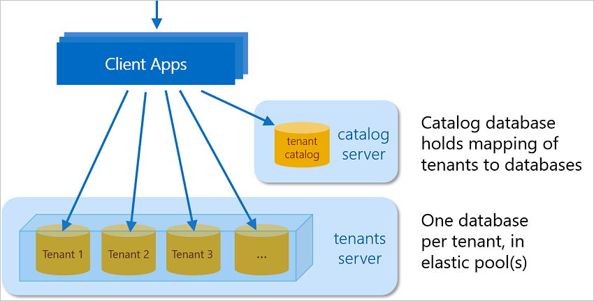

# Introduction to a multitenant SaaS app that uses the database-per-tenant pattern with Azure SQL Database
[!INCLUDE[appliesto-sqldb](../includes/appliesto-sqldb.md)]

The Wingtip SaaS application is a sample multitenant app. The app uses the database-per-tenant SaaS application pattern to service multiple tenants. The app showcases features of Azure SQL Database that enable SaaS scenarios by using several SaaS design and management patterns. To quickly get up and running, the Wingtip SaaS app deploys in less than five minutes.

Application source code and management scripts are available in the [WingtipTicketsSaaS-DbPerTenant](https://github.com/Microsoft/WingtipTicketsSaaS-DbPerTenant) GitHub repo. Before you start, see the [general guidance](saas-tenancy-wingtip-app-guidance-tips.md) for steps to download and unblock the Wingtip Tickets management scripts.

## Application architecture

The Wingtip SaaS app uses the database-per-tenant model. It uses SQL elastic pools to maximize efficiency. For provisioning and mapping tenants to their data, a catalog database is used. The core Wingtip SaaS application uses a pool with three sample tenants, plus the catalog database. The catalog and tenant servers have been provisioned with DNS aliases. These aliases are used to maintain a reference to the active resources used by the Wingtip application. These aliases are updated to point to recovery resources in the disaster recovery tutorials. Completing many of the Wingtip SaaS tutorials results in add-ons to the initial deployment. Add-ons such as analytic databases and cross-database schema management are introduced.

As you go through the tutorials and work with the app, focus on the SaaS patterns as they relate to the data tier. In other words, focus on the data tier, and don't overanalyze the app itself. Understanding the implementation of these SaaS patterns is key to implementing these patterns in your applications. Also consider any necessary modifications for your specific business requirements.

## SQL Database Wingtip SaaS tutorials

After you deploy the app, explore the following tutorials that build on the initial deployment. These tutorials explore common SaaS patterns that take advantage of built-in features of SQL Database, Azure SQL Data Warehouse, and other Azure services. Tutorials include PowerShell scripts with detailed explanations. The explanations simplify understanding and implementation of the same SaaS management patterns in your applications.

| Tutorial | Description |
|:--|:--|
| [Guidance and tips for the SQL Database multitenant SaaS app example](saas-tenancy-wingtip-app-guidance-tips.md) | Download and run PowerShell scripts to prepare parts of the application. |
|[Deploy and explore the Wingtip SaaS application](../../sql-database/saas-dbpertenant-get-started-deploy.md)|  Deploy and explore the Wingtip SaaS application with your Azure subscription. |
|[Provision and catalog tenants](../../sql-database/saas-dbpertenant-provision-and-catalog.md)| Learn how the application connects to tenants by using a catalog database, and how the catalog maps tenants to their data. |
|[Monitor and manage performance](../../sql-database/saas-dbpertenant-performance-monitoring.md)| Learn how to use monitoring features of SQL Database and set alerts when performance thresholds are exceeded. |
|[Monitor with Azure Monitor logs](../../sql-database/saas-dbpertenant-log-analytics.md) | Learn how to use [Azure Monitor logs](../../azure-monitor/log-query/log-query-overview.md) to monitor large amounts of resources across multiple pools. |
|[Restore a single tenant](../../sql-database/saas-dbpertenant-restore-single-tenant.md)| Learn how to restore a tenant database to a prior point in time. Also learn how to restore to a parallel database, which leaves the existing tenant database online. |
|[Manage tenant database schema](saas-tenancy-schema-management.md)| Learn how to update schema and update reference data across all tenant databases. |
|[Run cross-tenant distributed queries](saas-tenancy-cross-tenant-reporting.md) | Create an ad hoc analytics database, and run real-time distributed queries across all tenants.  |
|[Run analytics on extracted tenant data](saas-tenancy-tenant-analytics.md) | Extract tenant data into an analytics database or data warehouse for offline analytics queries. |

## Next steps

- [General guidance and tips when you deploy and use the Wingtip Tickets SaaS app example](saas-tenancy-wingtip-app-guidance-tips.md)
- [Deploy the Wingtip SaaS application](../../sql-database/saas-dbpertenant-get-started-deploy.md)
