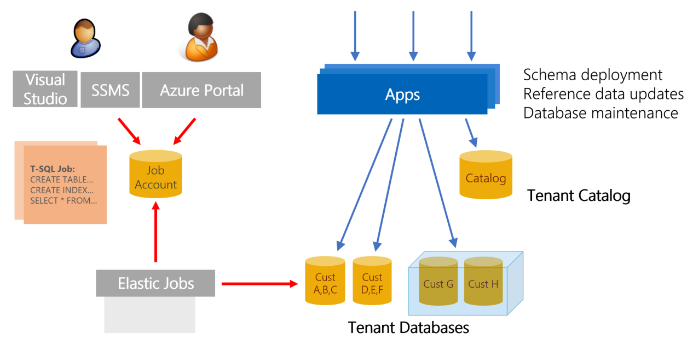

# Manage schema in a SaaS application that uses sharded multi-tenant databases
[!INCLUDE[appliesto-sqldb](../includes/appliesto-sqldb.md)]

This tutorial examines the challenges in maintaining a fleet of databases in a Software as a Service (SaaS) application. Solutions are demonstrated for fanning out schema changes across the fleet of databases.

Like any application, the Wingtip Tickets SaaS app will evolve over time, and will require changes to the database. Changes may impact schema or reference data, or apply database maintenance tasks. With a SaaS application using a database per tenant pattern, changes must be coordinated across a potentially massive fleet of tenant databases. In addition, you must incorporate these changes into the database provisioning process to ensure they are included in new databases as they are created.

#### Two scenarios

This tutorial explores the following two scenarios:
- Deploy reference data updates for all tenants.
- Rebuild an index on the table that contains the reference data.

The [Elastic Jobs](../../sql-database/elastic-jobs-overview.md) feature of Azure SQL Database is used to execute these operations across tenant databases. The jobs also operate on the 'template' tenant database. In the Wingtip Tickets sample app, this template database is copied to provision a new tenant database.

In this tutorial you learn how to:

> [!div class="checklist"]
> * Create a job agent.
> * Execute a T-SQL query on multiple tenant databases.
> * Update reference data in all tenant databases.
> * Create an index on a table in all tenant databases.

## Prerequisites

- The Wingtip Tickets multi-tenant database app must already be deployed:
    - For instructions, see the first tutorial, which introduces the Wingtip Tickets SaaS multi-tenant database app: [Deploy and explore a sharded multi-tenant application that uses Azure SQL Database](../../sql-database/saas-multitenantdb-get-started-deploy.md).
        - The deploy process runs for less than five minutes.
    - You must have the *sharded multi-tenant* version of Wingtip installed. The versions for *Standalone* and *Database per tenant* do not support this tutorial.

- The latest version of SQL Server Management Studio (SSMS) must be installed. [Download and Install SSMS](https://docs.microsoft.com/sql/ssms/download-sql-server-management-studio-ssms).

- Azure PowerShell must be installed. For details, see [Getting started with Azure PowerShell](https://docs.microsoft.com/powershell/azure/get-started-azureps).

> [!NOTE]
> This tutorial uses features of the Azure SQL Database service that are in a limited preview ([Elastic Database jobs](elastic-database-client-library.md)). If you wish to do this tutorial, provide your subscription ID to *SaaSFeedback\@microsoft.com* with subject=Elastic Jobs Preview. After you receive confirmation that your subscription has been enabled, [download and install the latest pre-release jobs cmdlets](https://github.com/jaredmoo/azure-powershell/releases). This preview is limited, so contact *SaaSFeedback\@microsoft.com* for related questions or support.

## Introduction to SaaS schema management patterns

The sharded multi-tenant database model used in this sample enables a tenants database to contain one or more tenants. This sample explores the potential to use a mix of a many-tenant and one-tenant databases, enabling a *hybrid* tenant management model. Managing changes to these databases can be complicated. [Elastic Jobs](../../sql-database/elastic-jobs-overview.md) facilitates administration and management of large numbers of database. Jobs enable you to securely and reliably run Transact-SQL scripts as tasks, against a group of tenant databases. The tasks are independent of user interaction or input. This method can be used to deploy changes to schema or to common reference data, across all tenants in an application. Elastic Jobs can also be used to maintain a golden template copy of the database. The template is used to create new tenants, always ensuring the latest schema and reference data are in use.

## Elastic Jobs limited preview

There is a new version of Elastic Jobs that is now an integrated feature of Azure SQL Database. This new version of Elastic Jobs is currently in limited preview. The limited preview currently supports using PowerShell to create a job agent, and T-SQL to create and manage jobs.
> [!NOTE]
> This tutorial uses features of the SQL Database service that are in a limited preview (Elastic Database jobs). If you wish to do this tutorial, provide your subscription ID to SaaSFeedback@microsoft.com with subject=Elastic Jobs Preview. After you receive confirmation that your subscription has been enabled, download and install the latest pre-release jobs cmdlets. This preview is limited, so contact SaaSFeedback@microsoft.com for related questions or support.

## Get the Wingtip Tickets SaaS Multi-tenant Database application source code and scripts

The Wingtip Tickets SaaS Multi-tenant Database scripts and application source code are available in the [WingtipTicketsSaaS-MultitenantDB](https://github.com/microsoft/WingtipTicketsSaaS-MultiTenantDB) repository on GitHub. See the [general guidance](saas-tenancy-wingtip-app-guidance-tips.md) for steps to download and unblock the Wingtip Tickets SaaS scripts.

## Create a job agent database and new job agent

This tutorial requires that you use PowerShell to create the job agent database and job agent. Like the MSDB database used by SQL Agent, a job agent uses a database in Azure SQL Database to store job definitions, job status, and history. After the job agent is created, you can create and monitor jobs immediately.

1. In **PowerShell ISE**, open *...\\Learning Modules\\Schema Management\\Demo-SchemaManagement.ps1*.
2. Press **F5** to run the script.

The *Demo-SchemaManagement.ps1* script calls the *Deploy-SchemaManagement.ps1* script to create a database named _jobagent_ on the catalog server. The script then creates the job agent, passing the _jobagent_ database as a parameter.

## Create a job to deploy new reference data to all tenants

#### Prepare

Each tenant's database includes a set of venue types in the **VenueTypes** table. Each venue type defines the kind of events that can be hosted at a venue. These venue types correspond to the background images you see in the tenant events app.  In this exercise, you deploy an update to all databases to add two additional venue types: *Motorcycle Racing* and *Swimming Club*.

First, review the venue types included in each tenant database. Connect to one of the tenant databases in SQL Server Management Studio (SSMS) and inspect the VenueTypes table.  You can also query this table in the Query editor in the Azure portal, accessed from the database page.

1. Open SSMS and connect to the tenant server: *tenants1-dpt-&lt;user&gt;.database.windows.net*
1. To confirm that *Motorcycle Racing* and *Swimming Club* **are not** currently included, browse to the *contosoconcerthall* database on the *tenants1-dpt-&lt;user&gt;* server and query the *VenueTypes* table.

#### Steps

Now you create a job to update the **VenueTypes** table in each tenants database, by adding the two new venue types.

To create a new job, you use the set of jobs system stored procedures that were created in the _jobagent_ database. The stored procedures were created when the job agent was created.

1. In SSMS, connect to the tenant server: tenants1-mt-&lt;user&gt;.database.windows.net

2. Browse to the *tenants1* database.

3. Query the *VenueTypes* table to confirm that *Motorcycle Racing* and *Swimming Club* are not yet in the results list.

4. Connect to the catalog server, which is *catalog-mt-&lt;user&gt;.database.windows.net*.

5. Connect to the _jobagent_ database in the catalog server.

6. In SSMS, open the file *...\\Learning Modules\\Schema Management\\DeployReferenceData.sql*.

7. Modify the statement: set @User = &lt;user&gt; and substitute the User value used when you deployed the Wingtip Tickets SaaS Multi-tenant Database application.

8. Press **F5** to run the script.

#### Observe

Observe the following items in the *DeployReferenceData.sql* script:

- **sp\_add\_target\_group** creates the target group name *DemoServerGroup*, and adds target members to the group.

- **sp\_add\_target\_group\_member** adds the following items:
    - A *server* target member type.
        - This is the *tenants1-mt-&lt;user&gt;* server that contains the tenants databases.
        - Including the server includes the tenant databases that exist at the time the job executes.
    - A *database* target member type for the template database (*basetenantdb*) that resides on *catalog-mt-&lt;user&gt;* server,
    - A *database* target member type to include the *adhocreporting* database that is used in a later tutorial.

- **sp\_add\_job** creates a job called *Reference Data Deployment*.

- **sp\_add\_jobstep** creates the job step containing T-SQL command text to update the reference table, VenueTypes.

- The remaining views in the script display the existence of the objects and monitor job execution. Use these queries to review the status value in the **lifecycle** column to determine when the job has  finished. The job updates the tenants database, and updates the two additional databases that contain the reference table.

In SSMS, browse to the tenant database on the *tenants1-mt-&lt;user&gt;* server. Query the *VenueTypes* table to confirm that *Motorcycle Racing* and *Swimming Club* are now added to the table. The total count of venue types should have increased by two.

## Create a job to manage the reference table index

This exercise creates a job to rebuild the index on the reference table primary key on all the tenant databases. An index rebuild is a typical database management operation that an administrator might run after loading a large amount of data load, to improve performance.

1. In SSMS, connect to _jobagent_ database in *catalog-mt-&lt;User&gt;.database.windows.net* server.

2. In SSMS, open *...\\Learning Modules\\Schema Management\\OnlineReindex.sql*.

3. Press **F5** to run the script.

#### Observe

Observe the following items in the *OnlineReindex.sql* script:

* **sp\_add\_job** creates a new job called *Online Reindex PK\_\_VenueTyp\_\_265E44FD7FD4C885*.

* **sp\_add\_jobstep** creates the job step containing T-SQL command text to update the index.

* The remaining views in the script monitor job execution. Use these queries to review the status value in the **lifecycle** column to determine when the job has successfully finished on all target group members.

## Additional resources

<!-- TODO: Additional tutorials that build upon the Wingtip Tickets SaaS Multi-tenant Database application deployment (*Tutorial link to come*)
(saas-multitenantdb-wingtip-app-overview.md#sql-database-wingtip-saas-tutorials)
-->
* [Managing scaled-out cloud databases](../../sql-database/elastic-jobs-overview.md)

## Next steps

In this tutorial you learned how to:

> [!div class="checklist"]
> * Create a job agent to run T-SQL jobs across multiple databases
> * Update reference data in all tenant databases
> * Create an index on a table in all tenant databases

Next, try the [Ad hoc reporting tutorial](../../sql-database/saas-multitenantdb-adhoc-reporting.md) to explore running distributed queries across tenant databases.

